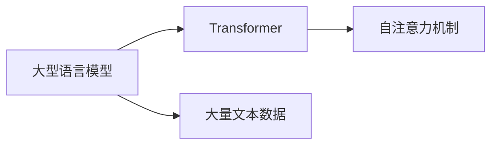

## 1.背景介绍

在过去的几年里，我们见证了深度学习在各种任务上的显著成功，尤其是在自然语言处理领域。其中，大型语言模型（Large Language Models，简称LLMs）已经成为了自然语言处理的核心技术。从BERT、GPT-3到最近的GPT-NeoX，这些模型以其卓越的性能和广泛的应用，重塑了我们对人工智能的理解。

## 2.核心概念与联系

大型语言模型是一类在大量文本数据上训练的模型，它们能够生成连贯的文本，并理解和回应用户的输入。这些模型通常基于Transformer结构，利用自注意力机制捕捉文本中的长距离依赖关系。



## 3.核心算法原理具体操作步骤

大型语言模型的训练通常包括以下步骤：

1. 数据预处理：将文本数据转换为模型可以理解的格式，例如将单词转换为词向量。
2. 模型训练：使用大量的文本数据，通过反向传播和梯度下降等方法，不断调整模型的参数，使模型的预测结果尽可能接近真实结果。
3. 模型评估：在验证集上评估模型的性能，如准确率、召回率等。
4. 模型微调：根据模型在验证集上的表现，进一步调整模型的参数。

## 4.数学模型和公式详细讲解举例说明

在大型语言模型中，我们通常使用交叉熵损失函数来衡量模型的性能。假设我们的模型预测的概率分布为$p$，真实的概率分布为$q$，那么交叉熵损失函数可以定义为：

$$H(p, q) = -\sum_{x} p(x) \log q(x)$$

在训练过程中，我们的目标是最小化这个损失函数，即使我们的模型预测的概率分布尽可能接近真实的概率分布。

## 5.项目实践：代码实例和详细解释说明

以下是一个使用PyTorch框架训练大型语言模型的简单示例：

```python
import torch
from torch import nn
from torch.optim import Adam

# 定义模型
model = nn.Transformer()

# 定义损失函数和优化器
loss_fn = nn.CrossEntropyLoss()
optimizer = Adam(model.parameters())

# 训练模型
for epoch in range(10):
    for batch in dataloader:
        # 前向传播
        output = model(batch)
        # 计算损失
        loss = loss_fn(output, batch)
        # 反向传播
        loss.backward()
        # 更新参数
        optimizer.step()
```

## 6.实际应用场景

大型语言模型已经被广泛应用在各种场景中，包括：

- 自动写作：大型语言模型可以生成连贯的文本，可以用于写作助手、新闻生成等。
- 智能对话：大型语言模型可以理解和回应用户的输入，可以用于构建聊天机器人、智能客服等。
- 信息检索：大型语言模型可以理解文本的语义，可以用于改进搜索引擎的结果。

## 7.工具和资源推荐

以下是一些训练和使用大型语言模型的工具和资源：

- PyTorch：一个强大的深度学习框架，可以方便地定义和训练模型。
- Hugging Face Transformers：一个包含了众多预训练模型的库，可以方便地使用这些模型进行微调。
- OpenAI GPT-3：目前最大的语言模型，可用于各种NLP任务。

## 8.总结：未来发展趋势与挑战

虽然大型语言模型取得了显著的成功，但也面临着一些挑战，包括：

- 计算资源：训练大型语言模型需要大量的计算资源，这对于大多数研究者来说是不可承受的。
- 数据隐私：大型语言模型在训练时可能会吸收敏感信息，如何保护数据隐私是一个重要的问题。
- 模型解释性：大型语言模型通常被视为黑箱，如何理解和解释模型的行为是一个挑战。

尽管如此，大型语言模型仍然是未来的发展趋势，它将在改进人工智能的能力和理解人类语言的深度方面发挥重要作用。

## 9.附录：常见问题与解答

1. **Q: 大型语言模型的参数数量是多少？**

   A: 大型语言模型的参数数量通常在数十亿到数万亿之间，例如GPT-3的参数数量就达到了1750亿。

2. **Q: 大型语言模型的训练需要多长时间？**

   A: 这取决于许多因素，包括模型的大小、训练数据的数量、使用的硬件等。一般来说，训练一个大型语言模型可能需要几天到几周的时间。

3. **Q: 大型语言模型可以做什么？**

   A: 大型语言模型可以用于各种NLP任务，包括文本生成、文本分类、情感分析、机器翻译等。

作者：禅与计算机程序设计艺术 / Zen and the Art of Computer Programming