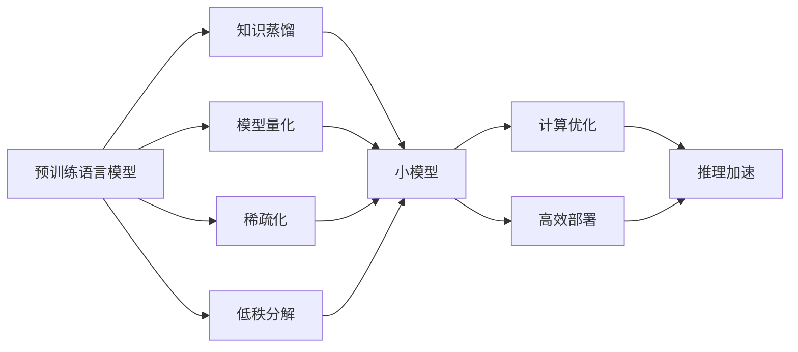

# 大语言模型原理基础与前沿 推理优化

## 1.背景介绍
### 1.1 大语言模型的兴起
近年来,随着深度学习技术的快速发展,大规模预训练语言模型(Pretrained Language Models, PLMs)引起了学术界和工业界的广泛关注。以 BERT、GPT、T5 等为代表的大语言模型在多个自然语言处理任务上取得了显著的性能提升,展现出强大的语言理解和生成能力。这些模型通过在大规模无监督语料上进行预训练,学习到丰富的语言知识和通用语义表示,可以灵活地适应下游任务。

### 1.2 推理优化的重要性
尽管大语言模型取得了瞩目的成就,但在实际应用中仍面临着推理效率低下的挑战。由于模型参数量巨大(动辄上百亿甚至上千亿),推理阶段的计算开销和响应时延难以满足实时交互的需求。因此,对大语言模型进行推理优化显得尤为重要和紧迫。通过算法创新和工程优化,提升推理性能,方能充分发挥大语言模型的价值,加速其在智能对话、语义搜索、知识问答等领域的落地应用。

### 1.3 本文的主要内容
本文将围绕大语言模型的推理优化展开深入探讨。首先,我们梳理大语言模型的核心概念和关键技术,厘清其内在联系。其次,重点阐述模型压缩、计算优化、高效部署等推理加速的核心算法原理和操作步骤。同时,给出详细的数学推导和代码实例,增强文章的理论深度和实践指导意义。此外,本文还将介绍主流的开源工具和学习资源,并展望大语言模型推理优化的发展趋势与挑战。通过本文的学习,读者将全面掌握大语言模型推理优化的前沿动态和实战技巧。

## 2.核心概念与联系
### 2.1 预训练语言模型(PLMs)
预训练语言模型是指在大规模无监督语料上进行预训练,学习通用语言表示的模型。主要分为以下三类:  
- 基于 Transformer 的双向语言模型:代表模型有 BERT、RoBERTa 等,通过 Masked Language Modeling(MLM)任务学习上下文相关的语义表示。
- 基于 Transformer 的单向语言模型:代表模型有 GPT 系列,通过 Causal Language Modeling(CLM)任务,从左到右地预测下一个单词,生成连贯自然的文本。
- 基于 Transformer 的序列到序列模型:代表模型有 T5、BART 等,将各类 NLP 任务统一为文本生成问题,在编码器-解码器框架下进行端到端学习。

### 2.2 知识蒸馏(Knowledge Distillation)
知识蒸馏是模型压缩的重要手段,旨在将大模型(Teacher)的知识迁移到小模型(Student)中。核心思想是最小化教师模型和学生模型在软目标(soft targets)上的差异,使学生模型拟合教师模型的预测分布。主要方法包括:
- Soft Target Distillation:利用 Teacher 模型输出的软目标作为额外的监督信号指导 Student 模型学习。
- Feature Map Distillation:让 Student 模型的中间层特征图与 Teacher 模型对齐,传递层次化的语义信息。
- Attention Distillation:迫使 Student 模型的注意力分布接近 Teacher 模型,模仿其关注的关键区域。

### 2.3 模型量化(Model Quantization) 
模型量化将模型参数和激活的精度从 FP32 降低到 INT8 乃至更低,在可接受的精度损失下显著减小模型存储和计算开销。主要技术路线如下:
- Post-Training Quantization(PTQ):在模型训练完成后,直接对权重进行静态量化,无需重训练,但量化误差较大。
- Quantization-Aware Training(QAT):在训练过程中引入模拟量化操作,联合优化模型参数和量化参数,精度损失更小。
- Mixed-Precision Quantization:对不同的层和张量采用不同的量化精度,在推理速度和精度间寻求最佳平衡。

### 2.4 稀疏化(Sparsification)
稀疏化通过对模型权重进行剪枝(Pruning),将大量不重要的参数置零,形成稀疏矩阵,降低计算和存储代价。常见的稀疏化技术包括:
- Magnitude-based Pruning:基于权重绝对值大小进行剪枝,认为小权重参数重要性低,可以直接移除。
- Lottery Ticket Hypothesis:认为网络中存在一组关键连接(winning tickets),单独训练这部分子网络可达到与大网络相当的性能。
- Structured Pruning:按预定义的规则对整个矩阵行/列、通道、注意力头等结构进行剪枝,便于硬件加速。

### 2.5 低秩分解(Low-Rank Decomposition)
低秩分解基于矩阵的低秩性质,将大矩阵拆解为若干个小矩阵的乘积,减少参数冗余。以矩阵 $W \in \mathbb{R}^{m \times n}$ 为例,可分解为:

$$W = U \Sigma V^T$$

其中 $U \in \mathbb{R}^{m \times r}, \Sigma \in \mathbb{R}^{r \times r}, V \in \mathbb{R}^{n \times r}$,秩 $r \ll \min(m,n)$。常用的低秩分解方法有奇异值分解(SVD)、QR分解等。

### 2.6 核心概念间的联系
上述核心概念环环相扣,共同构成了大语言模型推理优化的技术体系:
- 知识蒸馏是对大语言模型进行压缩的重要手段,通过迁移学习获得精简高效的小模型。
- 模型量化和稀疏化是两种直接对模型存储和计算进行优化的技术,可大幅降低推理开销。
- 低秩分解利用矩阵分解思想,通过参数因式分解实现模型压缩。
- 模型压缩后的小模型可进一步采用计算优化、高效部署等软硬件协同优化,最大化推理性能。

下图展示了这些概念间的关系:

## 3.核心算法原理具体操作步骤
本章我们将重点介绍几种主流的大语言模型推理优化算法的原理和操作步骤。

### 3.1 基于软目标的知识蒸馏
软目标蒸馏利用教师模型输出的软目标作为额外的监督信号,指导学生模型学习。具体步骤如下:
1. 使用训练好的教师模型(Teacher)对训练集进行推理,得到软目标(soft targets)。
2. 定义学生模型(Student),初始化其参数。
3. 使用硬目标(hard targets,即真实标签)和软目标联合训练学生模型。总损失函数为:

$$\mathcal{L} = \alpha \mathcal{L}_{CE}(\hat{y}, y) + (1-\alpha) \mathcal{L}_{KL}(\hat{y}, \hat{y}^T)$$

其中 $\hat{y}$ 为学生模型预测, $y$ 为硬目标, $\hat{y}^T$ 为教师模型预测, $\alpha$ 为平衡因子, $\mathcal{L}_{CE}$ 为交叉熵损失, $\mathcal{L}_{KL}$ 为KL散度。

4. 训练完成后,使用学生模型进行推理,达到模型压缩的效果。

### 3.2 量化感知训练(QAT)
量化感知训练在训练过程中引入模拟量化操作,联合优化模型参数和量化参数。以8-bit量化为例,步骤如下:
1. 定义量化函数 $Q$,将32-bit浮点数 $r$ 映射到8-bit整数 $q$:

$$q = \mathrm{round}(\frac{\mathrm{clip}(r, r_{\min}, r_{\max})}{S}) + Z$$

其中 $S$ 为比例因子, $Z$ 为零点, $\mathrm{clip}$ 函数将输入限制在 $[r_{\min}, r_{\max}]$ 范围内。

2. 在模型的前向传播中,对输入、权重、激活应用量化函数 $Q$,得到量化后的值。
3. 在反向传播中,对量化函数 $Q$ 求导,更新模型参数和量化参数。
4. 训练完成后,导出量化后的模型,在INT8推理引擎上部署。

### 3.3 基于幅值的剪枝
基于幅值的剪枝根据权重绝对值大小进行剪枝,步骤如下:
1. 对预训练模型的每一层权重矩阵 $W$,计算其绝对值 $|W|$。
2. 设定剪枝率 $p$,根据权重绝对值大小,将 $p$ 比例的权重置零,得到掩码矩阵 $M$。
3. 对剪枝后的模型进行微调,损失函数为:

$$\mathcal{L} = \mathcal{L}_{task} + \lambda \|W \odot (\mathbf{1}-M)\|_1$$

其中 $\mathcal{L}_{task}$ 为下游任务损失, $\odot$ 为Hadamard积, $\lambda$ 为正则化系数,惩罚被剪枝的权重。

4. 微调完成后,导出稀疏模型,利用稀疏矩阵加速库加速推理。

### 3.4 基于奇异值分解的低秩分解
基于奇异值分解(SVD)的低秩分解可将大矩阵拆解为多个小矩阵,步骤如下:
1. 对预训练模型的权重矩阵 $W \in \mathbb{R}^{m \times n}$ 进行SVD分解:

$$W = U \Sigma V^T$$

2. 取前 $r$ 个最大奇异值对应的左右奇异向量,得到截断的 $U_r, \Sigma_r, V_r$。
3. 重构低秩矩阵:

$$\hat{W} = U_r \Sigma_r V_r^T$$

4. 微调低秩分解后的模型,优化任务目标。
5. 导出压缩后的模型,在推理阶段使用低秩矩阵加速计算。

## 4.数学模型和公式详细讲解举例说明
本章我们将详细推导软目标蒸馏和低秩分解的数学模型,并给出具体的例子加以说明。

### 4.1 软目标蒸馏的数学模型
软目标蒸馏的核心是最小化学生模型和教师模型预测分布之间的差异。假设教师模型 $T$ 对输入 $x$ 的预测概率为 $p_T(y|x)$,学生模型 $S$ 的预测概率为 $p_S(y|x)$,则软目标蒸馏的优化目标可表示为最小化两个分布之间的 KL 散度:

$$\min_{\theta_S} \mathbb{E}_{x \sim \mathcal{D}} \mathrm{KL}(p_T(y|x) \| p_S(y|x))$$

其中 $\theta_S$ 为学生模型参数, $\mathcal{D}$ 为训练数据分布。展开 KL 散度可得:

$$\mathrm{KL}(p_T \| p_S) = \sum_y p_T(y|x) \log \frac{p_T(y|x)}{p_S(y|x)}$$

假设模型输出的是 logits $z$,则软化后的概率分布为:

$$p(y|x) = \frac{\exp(z_y/\tau)}{\sum_{y'} \exp(z_{y'}/\tau)}$$

其中 $\tau$ 为温度超参数,控制分布的平滑度。代入KL散度可得:

$$\mathcal{L}_{KD} = \tau^2 \mathrm{KL}(p_T \| p_S) = \tau^2 \sum_y p_T(y|x) \log p_T(y|x) - \tau^2 \sum_y p_T(y|x) \log p_S(y