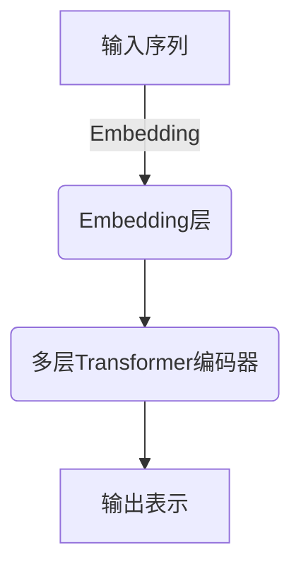
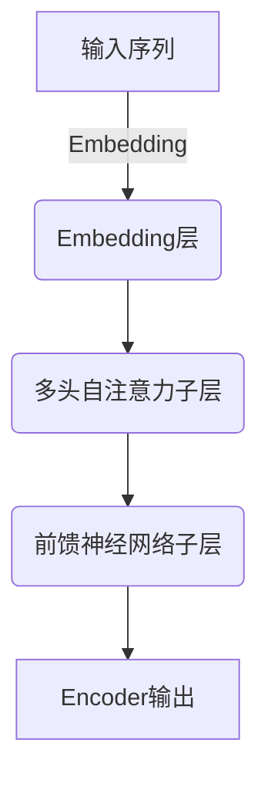
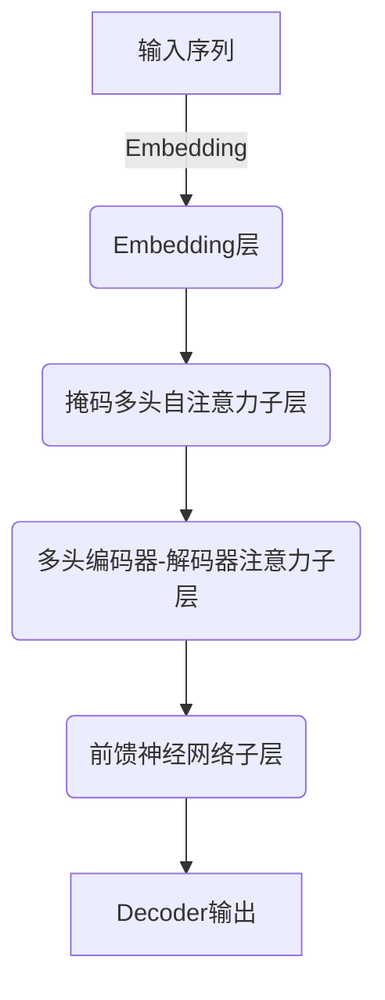

# 大语言模型原理基础与前沿 环境影响

## 1.背景介绍

### 1.1 大语言模型的兴起

近年来,大型语言模型(Large Language Models, LLMs)凭借其强大的自然语言处理能力,在多个领域取得了突破性进展,引起了广泛关注。这些模型通过在海量文本数据上进行预训练,学习了丰富的语言知识,能够生成流畅、连贯、多样的自然语言输出。

代表性的大语言模型包括GPT(Generative Pre-trained Transformer)系列、BERT(Bidirectional Encoder Representations from Transformers)、XLNet、RoBERTa等。其中,GPT-3凭借高达1750亿参数的规模,展现出令人惊叹的语言生成能力,可以执行包括问答、文本续写、代码生成等多种任务,被视为大语言模型发展的里程碑。

### 1.2 大语言模型的影响

大语言模型的出现,不仅推动了自然语言处理技术的飞速发展,也对多个领域产生了深远影响。在内容创作方面,大模型可以辅助人类进行文案撰写、文学创作等,提高效率并激发创意。在客户服务领域,智能对话系统能够提供7*24小时的在线支持,提升用户体验。在软件开发过程中,代码生成模型可以加快开发进度,降低人工编码的工作量。

然而,大语言模型也面临着一些挑战和争议。首先是模型训练所需的巨大计算资源和碳排放问题,导致了环境影响的担忧。其次,模型输出中可能存在偏见、不当内容等问题,需要进一步加强控制和审查。此外,大模型的"黑箱"特性也使其缺乏透明度和可解释性。因此,如何规范大模型的发展,平衡其效益与风险,是当前亟待解决的重要课题。

## 2.核心概念与联系

### 2.1 自然语言处理(NLP)

自然语言处理(Natural Language Processing, NLP)是人工智能的一个分支,旨在使计算机能够理解和生成人类语言。NLP技术广泛应用于机器翻译、文本分类、信息检索、问答系统等领域。

大语言模型是NLP领域的重要突破,它们通过在大规模文本数据上进行无监督预训练,学习到了丰富的语言知识和上下文信息,从而能够生成高质量的自然语言输出。

### 2.2 神经网络模型

大语言模型通常基于transformer等神经网络模型架构。Transformer是一种全新的序列到序列(Sequence-to-Sequence)模型,使用自注意力(Self-Attention)机制来捕捉输入序列中的长程依赖关系,从而更好地建模序列数据。

Transformer架构在机器翻译等任务中表现出色,并被广泛应用于大语言模型的设计中。GPT、BERT等模型均采用了Transformer编码器(Encoder)或解码器(Decoder)的变体结构。



### 2.3 迁移学习

大语言模型的训练过程采用了迁移学习(Transfer Learning)的范式。首先在大量无标注文本数据上进行自监督预训练,学习通用的语言表示;然后将预训练模型迁移到下游任务上,通过有监督的微调(Fine-tuning)来适应特定任务。

这种预训练+微调的范式,使得大模型能够在下游任务上取得优异的性能表现,同时降低了从头训练的数据需求和计算开销。

## 3.核心算法原理具体操作步骤

### 3.1 Transformer模型架构

Transformer是大语言模型的核心架构,它包括编码器(Encoder)和解码器(Decoder)两个主要组件。

#### 3.1.1 编码器(Encoder)

编码器的主要作用是将输入序列映射为序列的连续表示。它由多个相同的层组成,每一层包括两个子层:

1. **多头自注意力(Multi-Head Self-Attention)**子层,用于捕捉输入序列中的长程依赖关系。
2. **前馈神经网络(Feed-Forward Neural Network)**子层,对每个位置的表示进行非线性转换。



#### 3.1.2 解码器(Decoder)

解码器的作用是根据编码器的输出和输入序列,生成目标序列。它也由多个相同的层组成,每一层包括三个子层:

1. **掩码多头自注意力(Masked Multi-Head Self-Attention)**子层,用于捕捉已生成序列的内部依赖关系。
2. **多头编码器-解码器注意力(Multi-Head Encoder-Decoder Attention)**子层,将解码器的输出与编码器的输出进行关联。
3. **前馈神经网络(Feed-Forward Neural Network)**子层,对每个位置的表示进行非线性转换。



### 3.2 自注意力机制(Self-Attention)

自注意力机制是Transformer模型的核心创新,它能够直接建模输入序列中任意两个位置之间的依赖关系,而不需要依赖序列的顺序信息。

具体来说,自注意力机制将输入序列的每个位置的表示,与其他所有位置的表示进行注意力加权求和,得到该位置的新表示。注意力权重则通过查询(Query)、键(Key)和值(Value)的点积运算来计算。

$$
\mathrm{Attention}(Q, K, V) = \mathrm{softmax}(\frac{QK^T}{\sqrt{d_k}})V
$$

其中,$Q$为查询矩阵,$K$为键矩阵,$V$为值矩阵,$d_k$为缩放因子。

多头注意力(Multi-Head Attention)则是将多个注意力头的结果进行拼接,以捕捉不同的依赖关系模式。

### 3.3 位置编码(Positional Encoding)

由于Transformer模型没有捕捉序列顺序的内在机制,因此需要添加位置编码(Positional Encoding)来赋予每个位置的表示顺序信息。

常见的位置编码方法包括:

1. **正弦位置编码**:对序列位置使用正弦函数进行编码。
2. **学习位置嵌入**:将位置信息作为额外的嵌入向量,连同词嵌入一起输入模型。

### 3.4 预训练策略

大语言模型通常采用自监督的方式在大量文本数据上进行预训练,以学习通用的语言表示。常见的预训练任务包括:

1. **掩码语言模型(Masked Language Modeling, MLM)**: 随机掩码输入序列中的部分词,模型需要预测被掩码的词。
2. **下一句预测(Next Sentence Prediction, NSP)**: 判断两个句子是否相邻。
3. **因果语言模型(Causal Language Modeling, CLM)**: 给定前缀,模型需要预测下一个词。

### 3.5 微调(Fine-tuning)

预训练后的大语言模型可以通过在特定任务上进行微调,来适应下游任务的需求。

微调过程包括:

1. **添加任务特定的输入表示**:根据任务需求,设计合适的输入表示方式。
2. **添加任务特定的输出层**:在模型最后添加用于预测目标的输出层。
3. **在标注数据上进行有监督微调训练**:使用任务相关的标注数据,对整个模型(包括预训练参数)进行端到端的微调。

通过微调,大模型能够将通用的语言知识迁移到特定任务上,取得良好的性能表现。

## 4.数学模型和公式详细讲解举例说明

### 4.1 自注意力计算

自注意力机制是Transformer模型的核心,它能够直接建模输入序列中任意两个位置之间的依赖关系。下面我们详细解释自注意力的计算过程。

假设输入序列$X = (x_1, x_2, \dots, x_n)$,我们首先将其映射为查询(Query)、键(Key)和值(Value)矩阵:

$$
\begin{aligned}
Q &= X W^Q \\
K &= X W^K \\
V &= X W^V
\end{aligned}
$$

其中,$W^Q, W^K, W^V$分别为查询、键和值的线性投影矩阵。

接下来,我们计算查询$Q$与所有键$K$的点积,并对点积结果进行缩放和softmax操作,得到注意力权重矩阵$A$:

$$
A = \mathrm{softmax}(\frac{QK^T}{\sqrt{d_k}})
$$

其中,$d_k$为缩放因子,用于防止点积结果过大导致softmax梯度较小。

最后,我们将注意力权重$A$与值矩阵$V$相乘,得到自注意力的输出表示$Z$:

$$
Z = AV
$$

直观地说,自注意力机制将每个位置的表示,与其他所有位置的表示进行注意力加权求和,从而捕捉全局的依赖关系。

### 4.2 多头注意力

单个注意力头可能无法充分捕捉输入序列的所有依赖关系模式。因此,Transformer引入了多头注意力(Multi-Head Attention)机制,将多个注意力头的结果进行拼接,以获得更丰富的表示。

具体来说,对于单个注意力头,我们有:

$$
\mathrm{head}_i = \mathrm{Attention}(QW_i^Q, KW_i^K, VW_i^V)
$$

其中,$W_i^Q, W_i^K, W_i^V$分别为第$i$个注意力头的查询、键和值的线性投影矩阵。

然后,我们将所有注意力头的输出拼接起来:

$$
\mathrm{MultiHead}(Q, K, V) = \mathrm{Concat}(\mathrm{head}_1, \mathrm{head}_2, \dots, \mathrm{head}_h)W^O
$$

其中,$W^O$为最终的线性投影矩阵,$h$为注意力头的数量。

多头注意力机制允许模型同时关注来自不同表示子空间的信息,提高了模型的表达能力。

### 4.3 位置编码

由于Transformer模型没有捕捉序列顺序的内在机制,因此需要添加位置编码(Positional Encoding)来赋予每个位置的表示顺序信息。

一种常见的位置编码方法是正弦位置编码,它对序列位置使用正弦函数进行编码:

$$
\begin{aligned}
\mathrm{PE}_{(pos, 2i)} &= \sin\left(\frac{pos}{10000^{2i/d_\mathrm{model}}}\right) \\
\mathrm{PE}_{(pos, 2i+1)} &= \cos\left(\frac{pos}{10000^{2i/d_\mathrm{model}}}\right)
\end{aligned}
$$

其中,$pos$为位置索引,$i$为维度索引,$d_\mathrm{model}$为模型维度。

正弦位置编码的优点是,它能够为不同的位置赋予唯一的编码,且具有一定的周期性,有利于模型学习相对位置关系。

位置编码会直接加到输入序列的嵌入表示上,成为Transformer模型的输入。

## 5.项目实践:代码实例和详细解释说明

为了更好地理解Transformer模型的实现细节,我们提供了一个基于PyTorch的代码示例,实现了一个简化版的Transformer模型。

### 5.1 模型架构

我们首先定义Transformer模型的基本架构:

```python
import torch
import torch.nn as nn

class TransformerModel(nn.Module):
    def __init__(self, vocab_size, d_model, nhead, num_layers, dim_feedforward, max_seq_len, dropout=0.1):
        super(TransformerModel, self).__init__()
        self.embedding = nn.Embedding(vocab_size, d_model)
        self.pos_encoder = PositionalEncoding(d_model, max_seq_len, dropout)
        encoder_layer = nn.