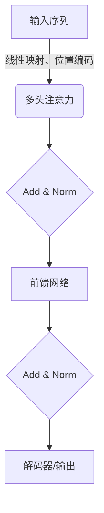

以下是对《大语言模型原理基础与前沿 评估》这一主题的完整技术博客文章。

# 大语言模型原理基础与前沿 评估

## 1.背景介绍

### 1.1 大语言模型的兴起

近年来,大型语言模型(Large Language Model,LLM)在自然语言处理(NLP)领域掀起了一场革命。LLM是一种使用大量文本数据训练的深度神经网络模型,能够学习和捕捉语言的复杂模式和语义关系。这些模型可以生成看似人类写作的连贯、流畅的文本,并在各种NLP任务中表现出色,如机器翻译、问答系统、文本摘要和内容生成等。

### 1.2 大语言模型的重要性

大语言模型的突破性进展,为人工智能系统赋予了更强大的语言理解和生成能力,这使得人机交互变得更加自然和高效。LLM在企业、科研和社会各个领域都有广泛的应用前景,如智能客服、写作辅助、知识提取等。它们还为探索人类语言的本质、发展通用人工智能奠定了基础。

### 1.3 本文概述

本文将全面探讨大语言模型的基础理论和前沿进展。我们将介绍LLM的核心概念、训练方法和关键算法,并深入分析其数学原理。此外,还将分享LLM在实际项目中的应用案例、工具资源,以及未来的发展趋势和挑战。

## 2.核心概念与联系

### 2.1 语言模型

语言模型(Language Model,LM)是一种概率分布模型,用于捕捉语序列中单词之间的统计规律。形式化地,给定单词序列$w_1, w_2, ..., w_n$,语言模型的目标是估计该序列的概率:

$$P(w_1, w_2, ..., w_n) = \prod_{i=1}^n P(w_i|w_1, ..., w_{i-1})$$

根据链式法则,语言模型可以分解为条件概率的乘积,每一项表示给定前面的词,当前词出现的概率。

传统的统计语言模型基于n-gram计数,而神经网络语言模型则使用深度学习技术直接从数据中学习单词之间的关系,表现力更强。

### 2.2 自回归语言模型

自回归语言模型(Autoregressive Language Model)是一种常见的神经网络语言模型架构。它将语言序列建模为一个令牌接一个令牌生成的过程,每一步都依赖于之前生成的内容。

对于输入序列$x_1, x_2, ..., x_n$,自回归模型学习的是条件概率分布:

$$P(x_1, x_2, ..., x_n) = \prod_{t=1}^n P(x_t|x_1, ..., x_{t-1})$$

自回归模型通常使用递归神经网络(如LSTM或Transformer)编码历史上下文,并预测下一个令牌。这种架构使模型能够捕捉长程依赖关系,并生成连贯的文本序列。

### 2.3 掩码语言模型

掩码语言模型(Masked Language Model,MLM)是BERT等预训练模型中使用的一种训练目标。与自回归模型不同,MLM对输入序列中的部分词进行掩码,模型需要基于上下文预测被掩码的词。

形式上,给定输入序列$x_1, x_2, ..., x_n$和掩码位置集合$\mathcal{M}$,MLM学习的是:

$$\prod_{i \in \mathcal{M}} P(x_i|x_1, ..., x_{i-1}, x_{i+1}, ..., x_n)$$

MLM编码了双向上下文信息,因此能够学习更丰富的语义表示,但生成时需要特殊的解码策略。

### 2.4 语言模型评估

评估语言模型质量的常用指标包括:

- 困惑度(Perplexity):模型在测试集上的交叉熵,值越小表示模型越好。
- 流利度(Fluency):生成文本的连贯性和自然程度。
- 相关性(Relevance):生成内容与输入的相关程度。

此外,还可以使用人工评估、下游任务性能等方式评测语言模型。

## 3.核心算法原理具体操作步骤 

### 3.1 Transformer模型

Transformer是大语言模型中广泛使用的核心架构,它完全基于注意力机制,避免了序列操作,允许并行计算。



1. 输入序列经过线性映射和位置编码,获得单词向量表示。
2. 多头注意力层对序列中每个单词计算其与其他单词的注意力权重,捕捉长程依赖。
3. 残差连接和层归一化整合注意力结果。
4. 前馈网络对每个单词向量进行非线性变换。
5. 再次残差连接和归一化,得到该层的输出表示。
6. 对于编码器,重复3-5步;对于解码器,还需遮掩未来信息。

### 3.2 自回归语言模型训练

自回归语言模型的训练目标是最大化训练语料的似然概率。给定单词序列$w_1, ..., w_n$,需要最小化损失:

$$\mathcal{L} = -\sum_{t=1}^n \log P(w_t|w_1, ..., w_{t-1}; \theta)$$

其中$\theta$是模型参数。训练过程如下:

1. 将单词序列输入编码器,获得每个位置的上下文表示$h_t$。
2. 将$h_t$输入解码器,计算下一词的概率分布$P(w_{t+1}|w_1, ..., w_t; \theta)$。
3. 计算该分布与真实单词的交叉熵损失。
4. 反向传播计算梯度,更新模型参数$\theta$。

通过不断迭代上述步骤,模型可以学习到生成自然语言序列的能力。

### 3.3 MLM预训练

MLM预训练的目标是最大化被掩码词的条件概率。给定输入序列$x_1, ..., x_n$和掩码位置集合$\mathcal{M}$,需要最小化损失:

$$\mathcal{L} = -\sum_{i \in \mathcal{M}} \log P(x_i|x_1, ..., x_{i-1}, x_{i+1}, ..., x_n; \theta)$$

训练过程如下:

1. 将输入序列输入编码器,获得每个位置的上下文表示$h_t$。
2. 对于掩码位置$i \in \mathcal{M}$,将$h_i$输入MLM头(分类器),计算词汇表上的概率分布。
3. 计算该分布与真实单词的交叉熵损失。  
4. 反向传播计算梯度,更新模型参数$\theta$。

MLM预训练编码了双向上下文信息,为下游任务提供了强大的语义表示。

## 4.数学模型和公式详细讲解举例说明

### 4.1 自注意力机制

自注意力是Transformer的核心组件,它捕捉输入序列中任意两个单词之间的关系。给定查询$q$、键$k$和值$v$,注意力计算如下:

$$\text{Attention}(q, k, v) = \text{softmax}(\frac{qk^T}{\sqrt{d_k}})v$$

其中,分子$qk^T$计算查询和键之间的相似性分数,$\sqrt{d_k}$是缩放因子,softmax函数将分数转换为概率。

多头注意力通过线性投影将$q$、$k$、$v$分别映射到不同的表示子空间,并并行计算多个注意力头的结果,最后拼接:

$$\text{MultiHead}(q, k, v) = \text{Concat}(o_1, ..., o_h)W^O$$
$$\text{where }o_i = \text{Attention}(qW_i^Q, kW_i^K, vW_i^V)$$

这种结构增强了模型对不同位置和子空间的关注。

### 4.2 位置编码

由于Transformer没有递归或卷积结构,需要一种方法为序列中的词赋予位置信息。位置编码是一种将位置编码到词向量的方法:

$$\text{PE}_{(pos, 2i)} = \sin(pos/10000^{2i/d_{model}})$$
$$\text{PE}_{(pos, 2i+1)} = \cos(pos/10000^{2i/d_{model}})$$

其中$pos$是位置索引,$i$是维度索引。这种基于三角函数的编码可以很好地编码绝对位置和相对位置信息。

### 4.3 生成式自回归

对于自回归语言模型,生成新序列时需要逐词预测。给定历史上下文$x_1, ..., x_t$,模型预测下一词的概率分布:

$$P(x_{t+1}|x_1, ..., x_t; \theta) = \text{模型}(x_1, ..., x_t)$$

然后从该分布中采样或选择概率最大的词作为$x_{t+1}$,重复上述过程直至结束。

这种逐词生成的方式虽然高效,但也存在累积错误的风险。因此需要特殊的技巧(如Top-K/Top-P采样、penalty等)来提高生成质量。

### 4.4 MLM解码

MLM预训练模型需要特殊的解码策略来生成序列。常见的方法有:

- 掩码填充:在输入序列中留出需要生成的位置,模型预测这些位置的词。
- 迭代解码:对每个需生成的位置,重复输入上下文并预测该位置的词,直到生成完整序列。
- 前缀约束:在输入序列前添加已生成的前缀,模型基于前缀预测下一个词。

这些策略的效率和生成质量有所差异,需要根据具体场景选择合适的方法。

## 5.项目实践:代码实例和详细解释说明

以下是使用PyTorch实现的一个简单的Transformer语言模型示例:

```python
import torch
import torch.nn as nn

# 编码器层
class TransformerEncoderLayer(nn.Module):
    def __init__(self, d_model, nhead, dim_feedforward, dropout):
        super().__init__()
        self.self_attn = nn.MultiheadAttention(d_model, nhead, dropout=dropout)
        self.linear1 = nn.Linear(d_model, dim_feedforward)
        self.dropout = nn.Dropout(dropout)
        self.linear2 = nn.Linear(dim_feedforward, d_model)
        self.norm1 = nn.LayerNorm(d_model)
        self.norm2 = nn.LayerNorm(d_model)

    def forward(self, src):
        src2 = self.self_attn(src, src, src)[0]
        src = src + self.dropout(src2)
        src = self.norm1(src)
        src2 = self.linear2(self.dropout(F.relu(self.linear1(src))))
        src = src + self.dropout(src2)
        src = self.norm2(src)
        return src

# 编码器
class TransformerEncoder(nn.Module):
    def __init__(self, num_layers, d_model, nhead, dim_feedforward, dropout):
        super().__init__()
        self.layers = nn.ModuleList([TransformerEncoderLayer(d_model, nhead, dim_feedforward, dropout) for _ in range(num_layers)])

    def forward(self, src):
        for layer in self.layers:
            src = layer(src)
        return src

# 语言模型
class TransformerLM(nn.Module):
    def __init__(self, vocab_size, d_model, nhead, num_layers, dim_feedforward, dropout):
        super().__init__()
        self.embedding = nn.Embedding(vocab_size, d_model)
        self.pos_encoder = PositionalEncoding(d_model, dropout)
        self.encoder = TransformerEncoder(num_layers, d_model, nhead, dim_feedforward, dropout)
        self.decoder = nn.Linear(d_model, vocab_size)

    def forward(self, src):
        src = self.embedding(src) * math.sqrt(self.d_model)
        src = self.pos_encoder(src)
        output = self.encoder(src)
        output = self.decoder(output)
        return output
```

这个示例实现了一个基本的Transformer编码器语言模型。其中:

1. `TransformerEncoderLayer`是单个编码器层,包含多头自注意力和前馈网络。
2. `TransformerEncoder`由多个编码器层组成,输入依次通过各层。
3. `TransformerLM`是完整的语言模型,包含词嵌入、位置编码、编码