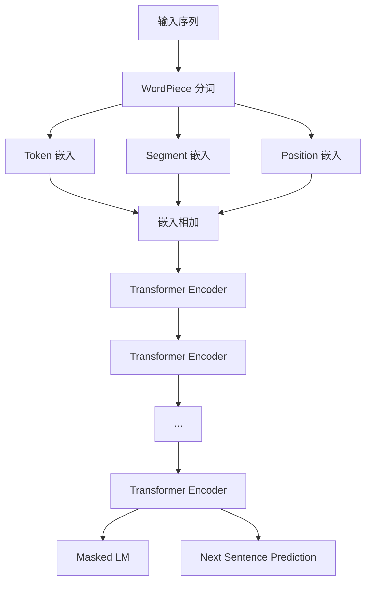

# 大语言模型原理基础与前沿 预训练Transformer扩大尺度的启示

## 1.背景介绍
### 1.1 大语言模型的发展历程
#### 1.1.1 早期的语言模型
#### 1.1.2 神经网络语言模型的崛起
#### 1.1.3 Transformer的诞生与发展

### 1.2 预训练模型的兴起
#### 1.2.1 BERT模型的突破
#### 1.2.2 GPT系列模型的进化
#### 1.2.3 预训练模型的优势

### 1.3 大语言模型的应用前景
#### 1.3.1 自然语言处理的范式转变
#### 1.3.2 多领域的应用潜力
#### 1.3.3 人工智能的新里程碑

大语言模型(Large Language Model, LLM)是近年来自然语言处理(NLP)领域最为瞩目的研究方向之一。随着深度学习技术的飞速发展,以及计算资源和训练数据规模的不断扩大,语言模型的性能得到了质的飞跃。特别是以Transformer为基础的预训练语言模型,如BERT、GPT系列等,在多项NLP任务上取得了超越人类的表现,展现出了惊人的语言理解和生成能力。

语言模型的发展可以追溯到几十年前。传统的语言模型主要基于统计学方法,如N-gram模型,通过计算词语的共现概率来预测下一个词。这类模型虽然简单高效,但难以捕捉语言中的长距离依赖关系。随着深度学习的兴起,研究者开始尝试利用神经网络来构建语言模型。早期的神经网络语言模型如NNLM、RNNLM等,通过循环神经网络(RNN)对文本序列进行建模,取得了优于传统模型的效果。

2017年,Google提出的Transformer模型掀起了NLP领域的一场革命。Transformer摒弃了RNN的序列结构,转而采用自注意力机制(Self-Attention)来捕捉词语之间的依赖关系。这种并行化的结构设计大大提升了模型的训练效率和扩展性。此后,各种基于Transformer的预训练语言模型如雨后春笋般涌现。

2018年,BERT(Bidirectional Encoder Representations from Transformers)模型横空出世,在多项NLP任务上刷新了当时的最佳记录。BERT的核心创新在于其独特的预训练方式,即利用大规模无标注语料进行自监督学习,从而学习到通用的语言表征。此后,BERT衍生出了众多变体,如RoBERTa、ALBERT等,进一步推动了预训练模型的发展。

与BERT同期,OpenAI提出了GPT(Generative Pre-trained Transformer)模型。与BERT的双向编码不同,GPT采用单向解码器结构,专注于语言生成任务。此后,GPT-2、GPT-3等后续版本相继问世,生成能力不断提升,引发了人们对通用人工智能的无限遐想。

大语言模型的出现,标志着NLP领域的一次范式转变。传统的NLP任务往往需要大量标注数据和领域知识,而预训练模型提供了一种新的思路,即首先在海量无标注语料上进行自监督预训练,再针对下游任务进行微调。这种"预训练+微调"的范式大大降低了任务适配的成本,使得NLP技术得以广泛应用于搜索、问答、对话、摘要、翻译等多个领域。

展望未来,大语言模型仍有巨大的发展潜力。一方面,随着算力和数据规模的持续增长,语言模型的性能有望进一步提升。另一方面,如何赋予语言模型以知识、逻辑推理、常识等高层次能力,实现真正的语言理解和交互,仍是亟待攻克的难题。但可以预见的是,大语言模型必将在人工智能的发展历程中留下浓墨重彩的一笔。

## 2.核心概念与联系
### 2.1 语言模型
#### 2.1.1 定义与目标
#### 2.1.2 概率语言模型
#### 2.1.3 神经网络语言模型

### 2.2 Transformer结构
#### 2.2.1 自注意力机制
#### 2.2.2 多头注意力
#### 2.2.3 位置编码
#### 2.2.4 前馈网络
#### 2.2.5 残差连接与层归一化

### 2.3 预训练范式
#### 2.3.1 自监督学习
#### 2.3.2 Masked Language Model
#### 2.3.3 Next Sentence Prediction
#### 2.3.4 Permutation Language Model
#### 2.3.5 微调与迁移学习

语言模型(Language Model)是NLP领域的一个核心概念。其目标是学习语言的统计规律,预测给定上下文下词语的概率分布。形式化地,对于一个由n个词组成的句子S=(w1,w2,...,wn),语言模型的任务是估计其概率P(S)=P(w1,w2,...,wn)。传统的语言模型基于马尔可夫假设,认为一个词的概率只与其前面的k个词相关,如N-gram模型。而神经网络语言模型则利用神经网络来拟合词语的概率分布,克服了数据稀疏等问题。

Transformer是大语言模型的核心架构。与基于RNN的序列模型不同,Transformer采用了自注意力机制(Self-Attention),允许任意两个位置的词语直接建立联系。具体而言,自注意力将每个词映射为三个向量:Query、Key和Value。对于每个词,通过其Query与所有词的Key计算注意力分数,再对Value进行加权求和,得到该词的新表征。多头注意力(Multi-Head Attention)进一步将自注意力扩展为多个子空间,增强了模型的表达能力。此外,Transformer还引入了位置编码(Positional Encoding)来刻画词语的顺序信息,以及残差连接(Residual Connection)和层归一化(Layer Normalization)来促进模型的优化。

预训练(Pre-training)是当前大语言模型的主流范式。其核心思想是在大规模无标注语料上进行自监督学习(Self-supervised Learning),从而学习到通用的语言表征。BERT采用了两种预训练任务:Masked Language Model和Next Sentence Prediction。前者通过随机遮挡部分词语,预测被遮挡词的概率分布;后者则判断两个句子在原文中是否相邻。此外,还有一些变体如Permutation Language Model,通过随机打乱词序来学习语言的内在结构。预训练得到的模型可以进一步用于下游任务的微调(Fine-tuning),或作为特征提取器进行迁移学习(Transfer Learning)。

下图展示了BERT的整体架构,体现了Transformer结构与预训练范式的结合:

## 3.核心算法原理具体操作步骤
### 3.1 预训练阶段
#### 3.1.1 语料准备与预处理
#### 3.1.2 WordPiece分词
#### 3.1.3 输入表征
#### 3.1.4 Masked Language Model
#### 3.1.5 Next Sentence Prediction
#### 3.1.6 模型优化

### 3.2 微调阶段
#### 3.2.1 任务适配
#### 3.2.2 微调策略
#### 3.2.3 过拟合问题

以BERT为例,其训练过程可分为两个阶段:预训练和微调。

在预训练阶段,首先需要准备大规模的无标注语料。BERT采用了BooksCorpus和英文维基百科作为预训练语料,经过去重、标点处理等一系列预处理步骤。接着,利用WordPiece算法对语料进行分词,将词表压缩至固定大小(如30000)。每个词都映射为一个唯一的ID,称为Token。

对于每个输入序列,BERT构建三种嵌入(Embedding)表征:Token嵌入、Segment嵌入和Position嵌入。其中,Token嵌入是词的分布式表征;Segment嵌入用于区分两个句子;Position嵌入则刻画了词在序列中的相对位置。三种嵌入相加后作为Transformer的输入。

预训练任务之一是Masked LM。具体而言,对于每个输入序列,以一定概率(如15%)随机遮挡其中的一些词。被遮挡的词有80%的概率被替换为特殊符号[MASK],10%的概率被替换为随机词,10%的概率保持不变。模型需要根据上下文预测被遮挡词的真实身份。这一任务迫使模型学习到词语的上下文表征。

另一个预训练任务是Next Sentence Prediction。给定两个句子A和B,模型需要判断B是否为A的下一句。训练数据中,50%的样本为真实的句子对(Positive),50%的样本为随机采样的非相邻句子对(Negative)。这一任务使模型学习到句子级别的连贯性表征。

预训练通常在多个GPU上进行大规模并行训练。BERT采用了Adam优化器,并引入了学习率预热(Learning Rate Warmup)和线性衰减的调度策略。为了提高训练效率,还使用了梯度累积(Gradient Accumulation)和混合精度(Mixed Precision)训练等技巧。

在微调阶段,预训练模型被应用于下游的具体任务,如文本分类、序列标注、问答等。这需要根据任务的输入输出格式,对预训练模型进行一定的修改。例如,对于句子对分类任务,可以在BERT的输出上添加一个分类器;对于序列标注任务,可以在每个位置的输出上添加一个标注层。微调通常使用较小的学习率和批大小,以避免破坏预训练得到的通用语言表征。同时,还需要采取一些措施如早停(Early Stopping)、权重衰减(Weight Decay)等来防止过拟合。

## 4.数学模型和公式详细讲解举例说明
### 4.1 Transformer的数学描述
#### 4.1.1 自注意力机制
#### 4.1.2 多头注意力
#### 4.1.3 前馈网络
#### 4.1.4 残差连接与层归一化

### 4.2 Masked Language Model的损失函数
#### 4.2.1 交叉熵损失
#### 4.2.2 Softmax函数

### 4.3 Next Sentence Prediction的损失函数
#### 4.3.1 二元交叉熵损失
#### 4.3.2 Sigmoid函数

下面我们对Transformer的核心模块进行数学描述。

自注意力机制可以表示为:

$$
\text{Attention}(Q,K,V) = \text{softmax}(\frac{QK^T}{\sqrt{d_k}})V
$$

其中,$Q$,$K$,$V$分别为Query,Key,Value矩阵,$d_k$为Key的维度。自注意力首先计算Query与Key的点积相似度,然后通过Softmax归一化得到注意力分布,最后与Value加权求和得到新的表征。

多头注意力可以看作是$h$个自注意力的并行:

$$
\text{MultiHead}(Q,K,V) = \text{Concat}(\text{head}_1,...,\text{head}_h)W^O \\
\text{head}_i = \text{Attention}(QW_i^Q,KW_i^K,VW_i^V)
$$

其中,$W_i^Q$,$W_i^K$,$W_i^V$,$W^O$为可学习的参数矩阵。多头注意力允许模型在不同的子空间里学习到不同的注意力模式,增强了表达能力。

Transformer的每一层还包括一个前馈网络(Feed-Forward Network,FFN):

$$
\text{FFN}(x) = \max(0, xW_1 + b_1)W_2 + b_2
$$

其中$W_1$,$b_1$,$W_2$,$b_2$为可学习参数。FFN可以看作是两层全连接网络,中间使用ReLU激活函数。

此外,Transformer还使用了残差连接和层归一化来促进训练:

$$
\text{LayerNorm}(x + \text{Sublayer}(x))
$$

其中Sublayer可以是