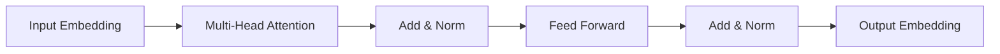

# 大语言模型原理基础与前沿 预训练Transformer扩大尺度的启示

## 1. 背景介绍

### 1.1 大语言模型的发展历程
#### 1.1.1 早期的语言模型
#### 1.1.2 神经网络语言模型的兴起
#### 1.1.3 Transformer的革命性突破

### 1.2 预训练技术的演进
#### 1.2.1 ELMO和GPT
#### 1.2.2 BERT的双向建模
#### 1.2.3 预训练范式的多样化探索

### 1.3 扩大模型尺度带来的机遇与挑战
#### 1.3.1 计算资源的增长
#### 1.3.2 模型性能的提升
#### 1.3.3 训练效率与成本的考量

大语言模型(Large Language Model, LLM)是自然语言处理(NLP)领域近年来最引人瞩目的研究方向之一。伴随着深度学习技术的发展和计算资源的增长，语言模型的规模不断扩大，性能也得到了显著提升。从早期的统计语言模型，到神经网络语言模型的兴起，再到Transformer[1]的革命性突破，NLP领域经历了多次范式转变。

预训练技术的引入进一步推动了语言模型的发展。ELMO[2]率先提出了基于双向LSTM的预训练方法，GPT[3]则采用了单向的Transformer结构。BERT[4]通过引入掩码语言建模(MLM)和句子连贯性判断(NSP)任务，实现了对语言的双向建模，在多个NLP任务上取得了state-of-the-art的表现。此后，各种预训练范式如雨后春笋般涌现，如Roberta[5]、ALBERT[6]、XLNet[7]等，都在不同的方面对BERT进行了改进和扩展。

随着计算资源的增长，研究者们开始探索扩大模型尺度对性能的影响。GPT-3[8]的参数量达到了1750亿，在零样本(zero-shot)和少样本(few-shot)设定下展现出了惊人的性能，引发了学界对大模型潜力的关注。但与此同时，训练效率和计算成本也成为了不可忽视的问题。如何在提升性能的同时兼顾效率，成为了大语言模型研究的重要课题。

本文将围绕大语言模型的原理基础与前沿进展展开讨论，重点关注预训练Transformer扩大尺度所带来的启示。我们将从核心概念出发，阐述其内在联系，介绍主要算法的原理和实现步骤，并结合数学模型和代码实例加以说明。在此基础上，我们将探讨大语言模型的实际应用场景，分享相关的工具和资源，展望其未来的发展趋势与面临的挑战。

## 2. 核心概念与联系

### 2.1 语言模型
#### 2.1.1 定义与任务
#### 2.1.2 统计语言模型
#### 2.1.3 神经网络语言模型

### 2.2 Transformer结构
#### 2.2.1 自注意力机制
#### 2.2.2 多头注意力
#### 2.2.3 前馈神经网络

### 2.3 预训练范式 
#### 2.3.1 自监督学习
#### 2.3.2 迁移学习
#### 2.3.3 零样本/少样本学习

语言模型的核心任务是估计一个句子或序列出现的概率。传统的统计语言模型通过计算n-gram的频率来估计条件概率，但面临数据稀疏和长程依赖捕捉困难等问题。神经网络语言模型使用神经网络来建模序列，可以学习到词语的分布式表示，克服了统计语言模型的局限性。

Transformer是一种基于自注意力机制的神经网络结构，摒弃了此前广泛使用的循环神经网络(RNN)和卷积神经网络(CNN)。自注意力机制可以捕捉序列中任意两个位置之间的依赖关系，计算效率高且易于并行化。多头注意力通过引入多个注意力函数，增强了模型的表达能力。前馈神经网络则用于对特征进行非线性变换。

预训练是指在大规模无标注语料上对模型进行预先训练，再在下游任务上进行微调(finetune)的范式。这种"预训练+微调"的范式可以显著提升模型在小样本场景下的性能。预训练通常采用自监督学习的方式，即利用输入数据本身来构建监督信号。迁移学习则指将预训练模型学到的知识迁移到新的任务中。零样本/少样本学习旨在通过预训练来赋予模型一定的先验知识，从而在看到极少量样本甚至零样本的情况下也能泛化良好。

下图展示了Transformer的基本结构：

## 3. 核心算法原理具体操作步骤

### 3.1 Transformer的计算过程
#### 3.1.1 输入表示
#### 3.1.2 自注意力计算
#### 3.1.3 前馈网络计算

### 3.2 预训练任务
#### 3.2.1 语言模型任务
#### 3.2.2 掩码语言模型任务
#### 3.2.3 句子连贯性判断任务

### 3.3 微调与推理
#### 3.3.1 下游任务的适配
#### 3.3.2 微调策略
#### 3.3.3 推理加速技术

Transformer的计算主要包括三个步骤：输入表示、自注意力计算和前馈网络计算。

输入表示阶段将离散的词符号映射为连续的向量表示。具体地，给定输入序列$\mathbf{x}=(x_1,\ldots,x_n)$，通过查询嵌入矩阵$\mathbf{E}\in\mathbb{R}^{d_{\text{vocab}}\times d_{\text{model}}}$得到词嵌入向量$\mathbf{E}_{x_i}\in\mathbb{R}^{d_{\text{model}}}$。此外，还需要加入位置编码$\mathbf{p}_i\in\mathbb{R}^{d_{\text{model}}}$以引入序列的位置信息。因此，第$i$个位置的输入表示为$\mathbf{z}_i^0=\mathbf{E}_{x_i}+\mathbf{p}_i$。

自注意力计算捕捉序列内部的依赖关系。首先，将输入表示$\mathbf{z}_i^{l-1}$通过三个线性变换得到查询向量$\mathbf{q}_i^l$、键向量$\mathbf{k}_i^l$和值向量$\mathbf{v}_i^l$：

$$
\mathbf{q}_i^l=\mathbf{W}_q^l\mathbf{z}_i^{l-1},\quad
\mathbf{k}_i^l=\mathbf{W}_k^l\mathbf{z}_i^{l-1},\quad
\mathbf{v}_i^l=\mathbf{W}_v^l\mathbf{z}_i^{l-1}
$$

其中$\mathbf{W}_q^l,\mathbf{W}_k^l,\mathbf{W}_v^l\in\mathbb{R}^{d_{\text{model}}\times d_k}$为可学习的参数矩阵。然后，计算查询向量和所有键向量的注意力分数，并进行归一化：

$$
\alpha_{ij}^l=\frac{\exp(\mathbf{q}_i^l\cdot\mathbf{k}_j^l/\sqrt{d_k})}{\sum_{j'=1}^n\exp(\mathbf{q}_i^l\cdot\mathbf{k}_{j'}^l/\sqrt{d_k})}
$$

最后，将注意力分数与值向量加权求和，得到第$i$个位置的输出表示$\mathbf{z}_i^l$：

$$
\mathbf{z}_i^l=\sum_{j=1}^n\alpha_{ij}^l\mathbf{v}_j^l
$$

多头注意力通过引入$h$个独立的注意力头，增强了模型的表达能力。各个头的输出拼接后通过一个线性变换得到最终的多头注意力输出。

前馈网络包含两个线性变换和一个非线性激活函数，用于对特征进行非线性变换：

$$
\operatorname{FFN}(\mathbf{z})=\max(0, \mathbf{z}\mathbf{W}_1+\mathbf{b}_1)\mathbf{W}_2+\mathbf{b}_2
$$

其中$\mathbf{W}_1\in\mathbb{R}^{d_{\text{model}}\times d_{\text{ffn}}},\mathbf{W}_2\in\mathbb{R}^{d_{\text{ffn}}\times d_{\text{model}}},\mathbf{b}_1\in\mathbb{R}^{d_{\text{ffn}}},\mathbf{b}_2\in\mathbb{R}^{d_{\text{model}}}$为可学习参数。

预训练任务旨在从无标注语料中自动构建监督信号。以BERT为例，它采用了两个预训练任务：掩码语言模型(MLM)和句子连贯性判断(NSP)。MLM任务通过随机掩盖部分词符号，让模型根据上下文预测被掩盖词的概率分布。NSP任务则通过预测两个句子是否前后相邻，来学习句子级别的表示。

在下游任务中，需要根据任务的特点对预训练模型进行适配和微调。以分类任务为例，可以在Transformer的输出之上添加一个分类器，并使用任务相关的有标注数据对整个模型进行端到端的微调。为了提高推理速度，可以采用知识蒸馏、模型剪枝、量化等加速技术。

## 4. 数学模型和公式详细讲解举例说明

### 4.1 Transformer的数学建模
#### 4.1.1 自注意力机制的数学推导
#### 4.1.2 前馈网络的数学表示
#### 4.1.3 残差连接与层归一化

### 4.2 预训练目标函数
#### 4.2.1 掩码语言模型的数学形式化
#### 4.2.2 句子连贯性判断的数学形式化
#### 4.2.3 多任务联合训练

### 4.3 微调的数学原理
#### 4.3.1 有标注数据的经验风险最小化
#### 4.3.2 参数初始化策略
#### 4.3.3 正则化技术

Transformer的核心是自注意力机制。给定查询矩阵$\mathbf{Q}\in\mathbb{R}^{n\times d_k}$、键矩阵$\mathbf{K}\in\mathbb{R}^{n\times d_k}$和值矩阵$\mathbf{V}\in\mathbb{R}^{n\times d_v}$，自注意力的计算公式为：

$$
\operatorname{Attention}(\mathbf{Q},\mathbf{K},\mathbf{V})=\operatorname{softmax}(\frac{\mathbf{Q}\mathbf{K}^T}{\sqrt{d_k}})\mathbf{V}
$$

其中，$\operatorname{softmax}(\cdot)$是指对每一行进行softmax归一化：

$$
\operatorname{softmax}(\mathbf{X})_{ij}=\frac{\exp(\mathbf{X}_{ij})}{\sum_{j'}\exp(\mathbf{X}_{ij'})}
$$

多头注意力可以表示为：

$$
\operatorname{MultiHead}(\mathbf{Q},\mathbf{K},\mathbf{V})=\operatorname{Concat}(\operatorname{head}_1,\ldots,\operatorname{head}_h)\mathbf{W}^O
$$

其中，每个头$\operatorname{head}_i$的计算公式为：

$$
\operatorname{head}_i=\operatorname{Attention}(\mathbf{Q}\mathbf{W}_i^Q,\mathbf{K}\mathbf{W}_i^K,\mathbf{V}\mathbf{W}_i^V)
$$

$\mathbf{W}_i^Q\in\mathbb{R}^{d_{\text{model}}\times d_k},\mathbf{W}_i^K\in\mathbb{R}^{d_{\text{model}}\times d_k},\mathbf{W}_i^V\in\mathbb{R}^{d_{\text{model}}\times d_v},\mathbf{W}^O\in\mathbb{R}^{hd_v\times d_{\text{model}}}$为可学习的参数矩阵。

前馈网络可以表示为两个线性变换中间夹一个ReLU激活函数：

$$