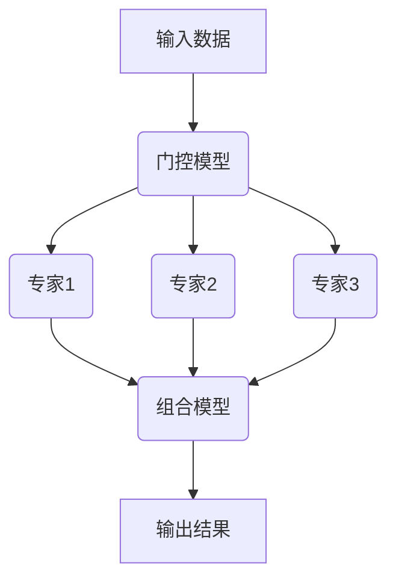

# 大语言模型原理基础与前沿 高效的MoE架构

## 1. 背景介绍

### 1.1 大语言模型的兴起

近年来,大型语言模型(Large Language Models, LLMs)在自然语言处理领域崭露头角,展现出了令人惊艳的性能表现。这些模型通过在海量文本数据上进行预训练,学习了丰富的语言知识和上下文信息,从而能够生成高质量、连贯的文本输出,并在各种自然语言任务中取得卓越成绩。

代表性的大语言模型包括 GPT (Generative Pre-trained Transformer)、BERT (Bidirectional Encoder Representations from Transformers)、XLNet、RoBERTa、ALBERT 等。其中,GPT 系列模型由 OpenAI 提出,具有强大的文本生成能力;BERT 则由谷歌推出,擅长于语义理解和表示学习。这些模型的出现,标志着自然语言处理领域进入了一个新的里程碑。

### 1.2 大模型带来的挑战

尽管大语言模型取得了令人瞩目的成就,但它们也面临着一些挑战。首先,这些模型通常包含数十亿甚至上百亿个参数,导致了巨大的计算和存储开销。训练和推理过程需要大量的计算资源,这对于普通用户和中小型企业来说是一个不小的负担。

其次,大模型的参数空间庞大,容易出现过拟合和不稳定性问题。模型在训练过程中可能会记住一些无关或者有害的内容,从而产生不当的输出。此外,大模型的黑盒特性也使得它们缺乏可解释性和可控性,难以满足一些对可靠性和安全性要求较高的应用场景。

为了解决这些挑战,研究人员提出了多种优化和改进方案,其中一种备受关注的方法就是 Mixture of Experts (MoE) 架构。

## 2. 核心概念与联系

### 2.1 Mixture of Experts 概念

Mixture of Experts (MoE) 是一种将复杂任务分解为多个专家(Expert)子模型的方法,每个专家子模型负责处理输入数据的一个子空间或子任务。在推理过程中,MoE 架构会根据输入数据的特征,动态选择合适的专家子模型进行计算,最终将各个专家的输出结合起来得到最终结果。

MoE 架构的核心思想是将一个庞大的模型分解为多个较小的专家模型,每个专家模型只需要关注特定的子空间或子任务,从而降低了每个模型的复杂度。同时,由于只有部分专家模型会被激活,MoE 架构也能够显著降低计算开销。

### 2.2 MoE 在大语言模型中的应用

在大语言模型的背景下,MoE 架构可以将庞大的模型分解为多个较小的专家子模型,每个子模型专注于处理特定的语言模式或领域知识。在推理过程中,根据输入的上下文信息,MoE 架构会动态选择相关的专家子模型进行计算,从而提高了模型的效率和性能。

通过将计算分散到多个专家子模型中,MoE 架构能够显著降低大语言模型的计算和存储开销,同时也提高了模型的可扩展性和灵活性。此外,MoE 架构还有助于提高模型的可解释性和可控性,因为每个专家子模型都负责处理特定的子任务,更容易被人类理解和解释。

总的来说,MoE 架构为大语言模型带来了诸多优势,成为了提高模型效率和可解释性的一种有前景的方案。

## 3. 核心算法原理具体操作步骤

### 3.1 MoE 架构的基本结构

MoE 架构通常由三个主要组件组成:

1. **专家子模型(Experts)**: 一组较小的子模型,每个子模型专注于处理输入数据的特定子空间或子任务。

2. **门控模型(Gating Network)**: 一个辅助模型,用于根据输入数据的特征,动态选择相关的专家子模型进行计算。

3. **组合模型(Combiner)**: 将各个专家子模型的输出结合起来,产生最终的输出结果。



### 3.2 门控模型的工作原理

门控模型是 MoE 架构中的关键组件,它负责根据输入数据的特征,动态选择相关的专家子模型进行计算。门控模型通常采用一个小型的神经网络模型,接受输入数据的嵌入向量,并输出一个概率分布,表示每个专家子模型被选中的概率。

在推理过程中,门控模型会为每个输入样本计算一个概率分布,然后根据这个分布对专家子模型进行采样。被选中的专家子模型将对输入数据进行计算,产生相应的输出。最后,组合模型将各个专家的输出结合起来,得到最终的输出结果。

### 3.3 组合模型的工作原理

组合模型的作用是将各个专家子模型的输出结合起来,产生最终的输出结果。组合模型通常采用一种加权求和的方式,将每个专家子模型的输出乘以相应的权重,然后求和得到最终输出。

权重的计算方式有多种,最常见的是根据门控模型输出的概率分布来确定每个专家的权重。具体来说,如果一个专家被选中的概率较高,那么它在最终输出中的权重就会相应地较高。

除了加权求和之外,组合模型还可以采用其他更复杂的方式来融合专家子模型的输出,例如使用另一个神经网络模型来学习如何最优地组合各个专家的输出。

### 3.4 MoE 架构的训练过程

MoE 架构的训练过程与传统的神经网络模型有所不同。由于只有部分专家子模型会被激活,因此在每个训练步骤中,只有被选中的专家子模型及其相关的门控模型和组合模型参数需要进行更新。

具体来说,在每个训练步骤中,门控模型首先根据输入数据计算概率分布,并对专家子模型进行采样。被选中的专家子模型将对输入数据进行计算,产生相应的输出。然后,组合模型将各个专家的输出结合起来,得到最终的输出结果。

接下来,根据最终输出和ground truth之间的损失函数,计算梯度,并使用反向传播算法更新被选中的专家子模型、门控模型和组合模型的参数。未被选中的专家子模型在当前训练步骤中不会被更新。

这种训练方式被称为"条件计算(Conditional Computation)"或"稀疏更新(Sparse Updates)"。它可以显著降低每个训练步骤的计算开销,从而加快训练过程并减少资源消耗。

## 4. 数学模型和公式详细讲解举例说明

### 4.1 门控模型的数学表示

门控模型的作用是根据输入数据的特征,计算每个专家子模型被选中的概率。假设我们有 $N$ 个专家子模型,门控模型的输出是一个长度为 $N$ 的向量 $\vec{p}$,其中第 $i$ 个元素 $p_i$ 表示第 $i$ 个专家子模型被选中的概率。

我们可以使用一个小型的神经网络模型来实现门控模型。假设输入数据的嵌入向量为 $\vec{x}$,门控模型的参数为 $\theta_g$,那么门控模型的输出可以表示为:

$$\vec{p} = g(\vec{x}; \theta_g)$$

其中 $g(\cdot)$ 表示门控模型的函数映射。

为了确保概率和为 1,我们通常会对门控模型的输出进行 softmax 归一化:

$$p_i = \frac{e^{z_i}}{\sum_{j=1}^N e^{z_j}}$$

其中 $z_i$ 是门控模型对于第 $i$ 个专家子模型的原始输出。

在推理过程中,我们可以根据概率分布 $\vec{p}$ 对专家子模型进行采样。一种常见的做法是使用 Gumbel-Softmax 技巧,它允许我们以一种可微的方式对离散的专家子模型进行采样。

### 4.2 组合模型的数学表示

组合模型的作用是将各个专家子模型的输出结合起来,产生最终的输出结果。假设第 $i$ 个专家子模型的输出为 $\vec{y}_i$,组合模型的参数为 $\theta_c$,那么组合模型的输出可以表示为:

$$\vec{z} = c(\{\vec{y}_i\}_{i=1}^N; \theta_c)$$

其中 $c(\cdot)$ 表示组合模型的函数映射。

一种常见的组合方式是加权求和:

$$\vec{z} = \sum_{i=1}^N w_i \vec{y}_i$$

其中 $w_i$ 是第 $i$ 个专家子模型的权重,通常与门控模型输出的概率分布 $\vec{p}$ 有关。例如,我们可以将权重设置为:

$$w_i = \frac{p_i}{\sum_{j=1}^N p_j}$$

这样,被选中概率较高的专家子模型在最终输出中的权重就会相应地较高。

除了加权求和之外,组合模型还可以采用更复杂的方式来融合专家子模型的输出,例如使用另一个神经网络模型来学习如何最优地组合各个专家的输出。

### 4.3 MoE 架构的损失函数

在训练 MoE 架构时,我们需要定义一个合适的损失函数,用于评估模型输出与ground truth之间的差异。假设模型的最终输出为 $\vec{z}$,ground truth为 $\vec{t}$,那么我们可以使用常见的损失函数,如均方误差(Mean Squared Error, MSE)或交叉熵损失(Cross Entropy Loss)等。

$$\mathcal{L}(\vec{z}, \vec{t}) = \text{MSE}(\vec{z}, \vec{t}) = \frac{1}{n}\sum_{i=1}^n (\vec{z}_i - \vec{t}_i)^2$$

$$\mathcal{L}(\vec{z}, \vec{t}) = \text{CrossEntropy}(\vec{z}, \vec{t}) = -\sum_{i=1}^n \vec{t}_i \log(\vec{z}_i)$$

在每个训练步骤中,我们需要根据损失函数计算梯度,并使用反向传播算法更新被选中的专家子模型、门控模型和组合模型的参数。由于只有部分专家子模型被激活,因此每个训练步骤的计算开销显著降低。

## 5. 项目实践:代码实例和详细解释说明

为了更好地理解 MoE 架构的工作原理,我们将通过一个简单的代码示例来演示如何使用 PyTorch 实现一个基本的 MoE 模型。

### 5.1 定义专家子模型

首先,我们定义一个简单的全连接神经网络作为专家子模型:

```python
import torch.nn as nn

class Expert(nn.Module):
    def __init__(self, input_size, output_size, hidden_size):
        super(Expert, self).__init__()
        self.fc1 = nn.Linear(input_size, hidden_size)
        self.relu = nn.ReLU()
        self.fc2 = nn.Linear(hidden_size, output_size)

    def forward(self, x):
        x = self.fc1(x)
        x = self.relu(x)
        x = self.fc2(x)
        return x
```

### 5.2 定义门控模型

接下来,我们定义门控模型,它是一个简单的全连接层,输出每个专家子模型被选中的概率:

```python
class GatingNetwork(nn.Module):
    def __init__(self, input_size, num_experts):
        super(GatingNetwork, self).__init__()
        self.fc = nn.Linear(input_size, num_experts)

    def forward(self, x):
        logits = self.fc(x)
        return F.softmax(logits, dim=-1)
```

### 5.3 定义组合模型

组合模型的作用是将各个专家子模型的输出结合起来,产生最终的输出结果