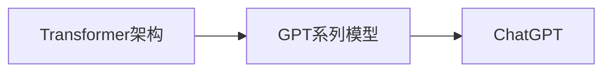

# 大语言模型应用指南：ChatGPT接口与扩展功能详解

## 1.背景介绍

### 1.1 大语言模型的兴起

近年来,自然语言处理(NLP)领域取得了长足的进步,尤其是以Transformer为代表的深度学习模型在各类NLP任务上取得了突破性的成果。在此基础上,预训练的大规模语言模型如BERT、GPT等,通过在海量无标注文本数据上进行自监督学习,学习到了强大的语言理解和生成能力,为NLP技术的发展开辟了新的道路。

### 1.2 ChatGPT的诞生与影响

2022年11月,OpenAI发布了ChatGPT,一个基于GPT-3.5架构训练的大型对话语言模型。ChatGPT以其出色的语言理解和生成能力迅速引起了业界的广泛关注。它能够进行流畅自然的对话,完成问答、写作、编程等多种任务,展现出了大语言模型在实际应用中的巨大潜力。ChatGPT的问世,标志着NLP技术进入了一个新的里程碑,为人机交互和知识服务带来了革命性的变化。

### 1.3 大语言模型应用的机遇与挑战

大语言模型为NLP应用开辟了广阔的前景,但同时也面临着诸多挑战。一方面,我们需要探索如何更好地利用大语言模型的能力,设计出更加智能、高效、人性化的应用;另一方面,我们还需要应对大语言模型在安全性、伦理性等方面可能带来的风险,确保其健康可持续发展。本文将重点探讨ChatGPT的接口和扩展功能,为大语言模型的应用实践提供指导和参考。

## 2.核心概念与联系

### 2.1 Transformer架构

Transformer是一种基于自注意力机制(Self-Attention)的神经网络架构,最早由Google在2017年提出。与传统的RNN、CNN等模型不同,Transformer完全依赖于注意力机制来建模序列数据,通过自注意力捕捉序列中不同位置之间的依赖关系。Transformer的核心组件包括:

- 多头自注意力(Multi-Head Self-Attention):将输入序列映射到多个注意力头,并行地计算不同位置之间的相关性,增强模型的表达能力。
- 前馈神经网络(Feed-Forward Network):对自注意力的输出进行非线性变换,提取高级特征。
- 残差连接(Residual Connection)和层归一化(Layer Normalization):稳定网络训练,加速收敛。

Transformer的优势在于其并行计算能力强、长程依赖建模能力强,且不受序列长度限制。它已成为大规模语言模型的主流架构。

### 2.2 GPT系列模型

GPT(Generative Pre-trained Transformer)是OpenAI开发的一系列大型语言模型,基于Transformer的解码器(Decoder)结构。与BERT等双向语言模型不同,GPT采用单向的语言建模方式,从左到右生成文本序列。GPT系列模型包括:

- GPT-1(2018):首个基于Transformer的大规模语言模型,在多个NLP任务上取得了优异表现。
- GPT-2(2019):参数量扩大到15亿,引入了零样本学习(Zero-Shot Learning)的概念。
- GPT-3(2020):拥有1750亿参数,通过少样本学习(Few-Shot Learning)即可完成各种NLP任务,展现出强大的语言理解和生成能力。

GPT系列模型的成功证明了大规模语言模型在NLP领域的巨大潜力,为后续的ChatGPT等模型奠定了基础。

### 2.3 ChatGPT的特点

ChatGPT是GPT-3.5架构的一个应用,专门针对对话任务进行了优化。相比GPT-3,ChatGPT具有以下特点:

- 对话式交互:ChatGPT以多轮对话的形式与用户交互,能够理解上下文信息,生成连贯、相关的回复。
- 知识引用:ChatGPT在对话中能够引用其知识库中的信息,提供更加准确、丰富的答复。
- 安全性控制:ChatGPT内置了一些安全性和伦理性方面的规则,能够识别和拒绝不当请求。
- 个性化定制:ChatGPT支持微调(Fine-tuning),可以针对特定领域或任务进行个性化定制。

这些特点使得ChatGPT成为一个强大、灵活的对话式AI助手,在客服、教育、娱乐等领域具有广泛的应用前景。

### 2.4 核心概念之间的联系

总结一下以上核心概念之间的联系:

Transformer架构是GPT系列模型的基础,GPT系列模型通过在海量文本数据上预训练,学习到了强大的语言理解和生成能力。ChatGPT则是在GPT-3.5的基础上,针对对话任务进行了优化和改进,成为一个功能强大的对话式AI助手。

## 3.核心算法原理具体操作步骤

下面我们将详细介绍ChatGPT的核心算法原理和具体操作步骤。ChatGPT的核心是基于Transformer的语言模型,通过自监督学习从海量文本数据中学习语言知识。其训练过程可以分为两个阶段:预训练和微调。

### 3.1 预训练阶段

预训练阶段的目标是让模型学习通用的语言知识和表示。具体步骤如下:

1. 数据准备:收集大规模的无标注文本数据,如书籍、新闻、网页等,进行清洗和预处理。
2. 构建词表:对文本数据进行分词,统计词频,构建词表(Vocabulary)。
3. 数据编码:将文本数据转换为模型可以处理的数值形式,如Token ID、位置编码等。
4. 模型构建:搭建基于Transformer解码器的语言模型,设置模型参数如层数、隐藏层维度、注意力头数等。
5. 定义损失函数:采用交叉熵损失函数,衡量模型预测结果与真实标签之间的差异。
6. 模型训练:使用优化算法如Adam,在大规模数据上训练模型,不断更新模型参数,最小化损失函数。训练过程通常需要数周甚至数月的时间。
7. 模型评估:在验证集上评估模型性能,如困惑度(Perplexity)等指标,选择最优模型。

经过预训练,模型学习到了丰富的语言知识和上下文表示能力,为下游任务奠定了基础。

### 3.2 微调阶段

微调阶段的目标是将预训练模型适配到特定的任务或领域。以ChatGPT为例,需要在对话数据上进行微调,使其能够进行流畅自然的对话。具体步骤如下:

1. 数据准备:收集领域内的对话数据,如客服对话记录、闲聊语料等,进行清洗和预处理。
2. 数据编码:将对话数据转换为模型可以处理的形式,如将多轮对话拼接成连续的文本序列。
3. 模型微调:以预训练模型为基础,在对话数据上进行微调。通常只需要训练几个Epoch,且学习率较小。
4. 模型评估:在对话验证集上评估模型性能,如BLEU、ROUGE等指标,选择最优模型。
5. 推理应用:将微调后的模型部署到实际应用中,进行实时的对话交互。

微调使得ChatGPT能够适应特定领域的对话风格和知识,生成更加自然、相关的回复。

### 3.3 推理阶段

推理阶段是将训练好的ChatGPT模型应用到实际对话中的过程。具体步骤如下:

1. 接收用户输入:用户通过界面或API接口输入对话文本。
2. 数据预处理:对用户输入进行清洗、分词、编码等预处理操作。
3. 模型推理:将编码后的用户输入送入ChatGPT模型,生成回复文本。生成过程通常采用Beam Search等策略,以提高生成质量。
4. 数据后处理:对生成的回复文本进行解码、去重、过滤等后处理操作,以提高可读性和安全性。
5. 返回结果:将处理后的回复文本返回给用户,完成一轮对话交互。

推理阶段的关键是实现低延迟、高并发的在线服务,以支撑大规模用户的实时对话需求。

## 4.数学模型和公式详细讲解举例说明

ChatGPT的核心数学模型是Transformer,下面我们将详细讲解Transformer的关键组件及其数学原理。

### 4.1 自注意力机制

自注意力机制是Transformer的核心,用于捕捉序列内部的依赖关系。对于输入序列$X \in \mathbb{R}^{n \times d}$,自注意力的计算过程如下:

1. 计算查询矩阵$Q$、键矩阵$K$和值矩阵$V$:

$$
Q = XW_Q, K = XW_K, V = XW_V
$$

其中$W_Q, W_K, W_V \in \mathbb{R}^{d \times d_k}$是可学习的参数矩阵。

2. 计算注意力权重矩阵$A$:

$$
A = \text{softmax}(\frac{QK^T}{\sqrt{d_k}})
$$

其中$\frac{1}{\sqrt{d_k}}$是缩放因子,用于控制梯度的稳定性。

3. 计算注意力输出$Z$:

$$
Z = AV
$$

直观地说,自注意力机制通过查询矩阵$Q$与键矩阵$K$的相似度计算注意力权重,然后加权聚合值矩阵$V$,得到注意力输出$Z$。这一过程能够有效捕捉序列中不同位置之间的依赖关系。

例如,考虑输入序列"I love natural language processing"。通过自注意力机制,模型能够学习到"language"与"natural"之间的依赖关系,从而更好地理解整个句子的语义。

### 4.2 多头自注意力

多头自注意力是自注意力机制的扩展,通过引入多个并行的注意力头,增强模型的表达能力。对于第$i$个注意力头,其计算过程如下:

$$
Q_i = XW_{Q_i}, K_i = XW_{K_i}, V_i = XW_{V_i}
$$
$$
Z_i = \text{Attention}(Q_i, K_i, V_i)
$$

其中$W_{Q_i}, W_{K_i}, W_{V_i} \in \mathbb{R}^{d \times d_k}$是第$i$个注意力头的参数矩阵。

最后,将所有注意力头的输出拼接起来,并经过一个线性变换:

$$
\text{MultiHead}(Q, K, V) = \text{Concat}(Z_1, \dots, Z_h)W_O
$$

其中$h$是注意力头的数量,$W_O \in \mathbb{R}^{hd_k \times d}$是可学习的参数矩阵。

多头自注意力允许模型在不同的子空间中学习不同的注意力表示,提高了模型的容量和泛化能力。

例如,对于句子"The quick brown fox jumps over the lazy dog",不同的注意力头可以关注不同的语言特征,如语法关系、语义角色等,从而更全面地理解句子结构。

### 4.3 前馈神经网络

除了自注意力机制外,Transformer还引入了前馈神经网络(FFN)来增强特征表示。FFN由两个线性变换和一个非线性激活函数组成:

$$
\text{FFN}(x) = \max(0, xW_1 + b_1)W_2 + b_2
$$

其中$W_1 \in \mathbb{R}^{d \times d_{ff}}, b_1 \in \mathbb{R}^{d_{ff}}, W_2 \in \mathbb{R}^{d_{ff} \times d}, b_2 \in \mathbb{R}^d$是可学习的参数,$d_{ff}$是FFN的隐藏层维度。

FFN可以看作是一个简单的两层感知机,用于对自注意力的输出进行非线性变换,提取高级特征。通过堆叠多个FFN和自注意力模块,Transformer能够构建出深度的网络结构,具有强大的表达和泛化能力。

### 4.4 残差连接和