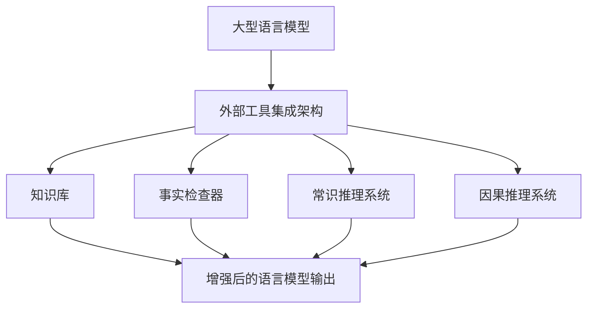

# 大语言模型应用指南：为什么需要外部工具

## 1. 背景介绍

随着人工智能技术的不断发展,大型语言模型(Large Language Models,LLMs)已经成为当前最具影响力和应用前景的技术之一。这些模型通过从海量文本数据中学习,能够生成看似人类写作的自然语言输出,在自然语言处理、内容生成、问答系统等领域展现出了令人惊叹的能力。

然而,尽管大型语言模型拥有强大的语言生成能力,但它们也存在一些固有的局限性和缺陷。其中最突出的问题是:

1. **幻觉(Hallucinations)**: 模型有时会生成看似合理但实际上是虚构或错误的事实和信息。
2. **不一致性(Inconsistency)**: 模型生成的输出可能会与之前的输出或提供的上下文信息矛盾。
3. **缺乏常识推理(Lack of Commonsense Reasoning)**: 模型难以很好地理解和推理日常生活中的常识性知识。
4. **缺乏因果推理(Lack of Causal Reasoning)**: 模型通常无法很好地捕捉和推理事物之间的因果关系。

为了解决这些问题,研究人员提出了将外部工具与大型语言模型相结合的方法,旨在提高模型的性能、可靠性和安全性。这些外部工具包括知识库、事实检查器、常识推理系统等,它们可以为语言模型提供补充信息、校正错误输出并增强推理能力。

本文将深入探讨为什么需要将外部工具与大型语言模型相结合,以及如何实现这一目标。我们将介绍不同类型的外部工具,分析它们如何帮助解决语言模型的局限性,并探讨集成外部工具的挑战和最佳实践。

## 2. 核心概念与联系

在深入探讨外部工具的应用之前,让我们先了解一些核心概念和它们之间的联系。

### 2.1 大型语言模型(LLMs)

大型语言模型是一种基于深度学习的自然语言处理模型,通过从海量文本数据中学习,能够生成看似人类写作的自然语言输出。常见的大型语言模型包括GPT-3、BERT、XLNet等。这些模型展现出了令人惊叹的语言生成能力,但也存在一些固有的局限性,如幻觉、不一致性、缺乏常识推理和因果推理等。

### 2.2 外部工具

外部工具是指与大型语言模型集成的辅助系统,旨在提高模型的性能、可靠性和安全性。常见的外部工具包括:

1. **知识库(Knowledge Bases)**: 结构化的事实性知识库,可以为语言模型提供准确的信息补充。
2. **事实检查器(Fact Checkers)**: 用于验证语言模型输出的事实准确性,并纠正错误信息。
3. **常识推理系统(Commonsense Reasoning Systems)**: 帮助语言模型更好地理解和推理日常生活中的常识性知识。
4. **因果推理系统(Causal Reasoning Systems)**: 用于捕捉和推理事物之间的因果关系。

### 2.3 集成架构

将外部工具与大型语言模型集成需要设计合适的架构,以确保两者之间的有效交互和信息流动。常见的集成架构包括:

1. **Pipeline架构**: 将外部工具作为语言模型的前置或后置处理步骤,对输入或输出进行处理和校正。
2. **反馈循环架构**: 在语言模型生成过程中,将外部工具的输出作为反馈,引导模型生成更准确、一致的输出。
3. **联合训练架构**: 在训练阶段,将外部工具的知识融入语言模型,使其能够学习和内化相关知识。

这些架构各有优缺点,需要根据具体应用场景和需求进行选择和优化。

上图展示了将外部工具与大型语言模型集成的基本架构。通过合理设计集成架构,外部工具可以为语言模型提供补充知识、校正错误输出并增强推理能力,从而产生更准确、一致和可靠的输出。

## 3. 核心算法原理具体操作步骤

在将外部工具与大型语言模型集成的过程中,需要设计和实现一些核心算法,以实现有效的信息交互和融合。本节将介绍一些常见的算法原理和具体操作步骤。

### 3.1 知识库查询与融合

#### 算法原理

知识库查询与融合算法旨在从结构化的知识库中检索相关信息,并将其融合到语言模型的输出中。常见的方法包括:

1. **实体链接(Entity Linking)**: 将语言模型输出中的实体(如人物、地点、组织等)链接到知识库中的相应条目。
2. **关系抽取(Relation Extraction)**: 从语言模型输出中抽取实体之间的关系,并与知识库中的关系进行匹配和补充。
3. **知识融合(Knowledge Fusion)**: 将从知识库检索到的相关信息融合到语言模型的输出中,以提供更准确、更丰富的信息。

#### 具体操作步骤

1. **预处理**: 对语言模型的输出进行标记化、实体识别和关系抽取,为后续的知识库查询做准备。
2. **实体链接**: 将识别出的实体与知识库中的条目进行匹配,建立链接关系。
3. **关系匹配**: 将抽取出的关系与知识库中的关系进行匹配,补充缺失的关系信息。
4. **知识融合**: 根据实体链接和关系匹配的结果,从知识库中检索相关信息,并将其融合到语言模型的输出中。
5. **后处理**: 对融合后的输出进行必要的格式化和优化,以确保其连贯性和可读性。

### 3.2 事实检查与校正

#### 算法原理

事实检查与校正算法旨在验证语言模型输出的事实准确性,并纠正错误信息。常见的方法包括:

1. **事实抽取(Fact Extraction)**: 从语言模型输出中抽取出关键事实信息。
2. **事实验证(Fact Verification)**: 将抽取出的事实与可靠的外部数据源(如维基百科、新闻报道等)进行比对,验证其准确性。
3. **错误校正(Error Correction)**: 对于被识别出的错误事实,利用外部数据源提供的正确信息进行校正。

#### 具体操作步骤

1. **预处理**: 对语言模型的输出进行标记化、命名实体识别和关系抽取,为后续的事实抽取做准备。
2. **事实抽取**: 从预处理后的输出中抽取出关键事实信息,如日期、数字、人物、地点等。
3. **事实验证**: 将抽取出的事实与外部数据源(如维基百科、新闻报道等)进行比对,验证其准确性。
4. **错误校正**: 对于被识别出的错误事实,利用外部数据源提供的正确信息进行校正,生成修正后的输出。
5. **后处理**: 对修正后的输出进行必要的格式化和优化,以确保其连贯性和可读性。

### 3.3 常识推理与增强

#### 算法原理

常识推理与增强算法旨在帮助语言模型更好地理解和推理日常生活中的常识性知识。常见的方法包括:

1. **常识知识库(Commonsense Knowledge Bases)**: 利用包含常识知识的结构化知识库,为语言模型提供常识性补充。
2. **常识推理模型(Commonsense Reasoning Models)**: 训练专门的深度学习模型,从语言模型的输出中推理出隐含的常识性知识。
3. **常识融合(Commonsense Fusion)**: 将从常识知识库或推理模型获取的常识性知识融合到语言模型的输出中,增强其对常识的理解和表达。

#### 具体操作步骤

1. **预处理**: 对语言模型的输出进行标记化、实体识别和关系抽取,为后续的常识推理做准备。
2. **常识知识库查询**: 根据预处理后的输出,从常识知识库中检索相关的常识性知识。
3. **常识推理模型推理**: 利用训练好的常识推理模型,从语言模型的输出中推理出隐含的常识性知识。
4. **常识融合**: 将从常识知识库和推理模型获取的常识性知识融合到语言模型的输出中,生成增强后的输出。
5. **后处理**: 对增强后的输出进行必要的格式化和优化,以确保其连贯性和可读性。

### 3.4 因果推理与增强

#### 算法原理

因果推理与增强算法旨在帮助语言模型更好地捕捉和推理事物之间的因果关系。常见的方法包括:

1. **因果知识库(Causal Knowledge Bases)**: 利用包含因果关系知识的结构化知识库,为语言模型提供因果性补充。
2. **因果推理模型(Causal Reasoning Models)**: 训练专门的深度学习模型,从语言模型的输出中推理出隐含的因果关系。
3. **因果融合(Causal Fusion)**: 将从因果知识库或推理模型获取的因果关系知识融合到语言模型的输出中,增强其对因果关系的理解和表达。

#### 具体操作步骤

1. **预处理**: 对语言模型的输出进行标记化、实体识别和关系抽取,为后续的因果推理做准备。
2. **因果知识库查询**: 根据预处理后的输出,从因果知识库中检索相关的因果关系知识。
3. **因果推理模型推理**: 利用训练好的因果推理模型,从语言模型的输出中推理出隐含的因果关系。
4. **因果融合**: 将从因果知识库和推理模型获取的因果关系知识融合到语言模型的输出中,生成增强后的输出。
5. **后处理**: 对增强后的输出进行必要的格式化和优化,以确保其连贯性和可读性。

通过实现上述核心算法,我们可以将外部工具与大型语言模型有效集成,提高模型的准确性、一致性和推理能力,从而产生更可靠和有价值的输出。

## 4. 数学模型和公式详细讲解举例说明

在将外部工具与大型语言模型集成的过程中,一些数学模型和公式也扮演着重要的角色。本节将详细介绍一些常见的数学模型和公式,并通过具体示例说明它们的应用。

### 4.1 实体链接

实体链接是将文本中的实体(如人物、地点、组织等)链接到知识库中相应条目的过程。常见的实体链接模型包括:

1. **基于规则的模型**: 利用一系列手工定义的规则来匹配和链接实体。
2. **基于统计的模型**: 利用统计机器学习技术(如条件随机场、隐马尔可夫模型等)来进行实体链接。
3. **基于深度学习的模型**: 利用神经网络模型(如双向LSTM、注意力机制等)来学习实体链接的模式。

其中,基于深度学习的模型通常表现更好,能够捕捉更复杂的语义和上下文信息。一种常见的基于深度学习的实体链接模型是双向LSTM-CRF模型,其数学表达式如下:

$$
P(y|x) = \frac{1}{Z_x} \prod_{t=1}^T \Psi(y_t, y_{t-1}, \mathbf{x}_t)
$$

其中:

- $x = (x_1, x_2, \ldots, x_T)$ 是输入序列
- $y = (y_1, y_2, \ldots, y_T)$ 是对应的实体标签序列
- $\Psi(y_t, y_{t-1}, \mathbf{x}_t)$ 是潜在函数,由双向LSTM和CRF层组成
- $Z_x$ 是归一化因子

通过最大化上述条件概率,模