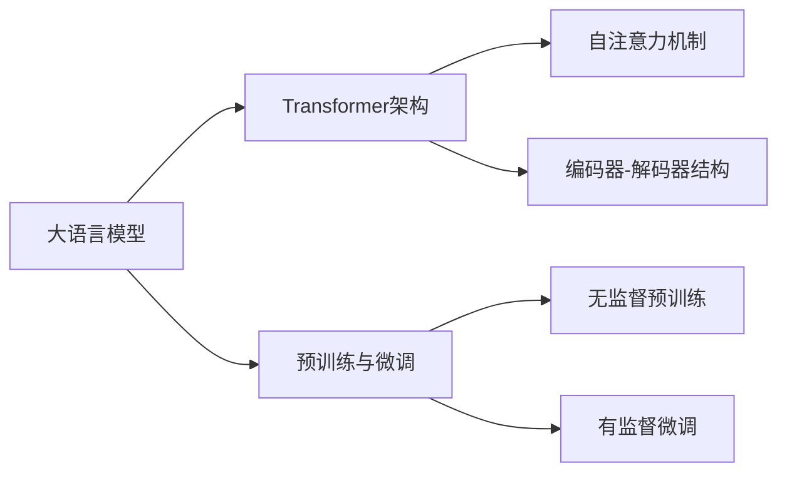

# 大语言模型应用指南：从人工智能的起源到大语言模型

## 1. 背景介绍
### 1.1 人工智能的起源与发展
#### 1.1.1 图灵测试与达特茅斯会议
#### 1.1.2 人工智能的三次浪潮
#### 1.1.3 人工智能的分类与应用领域

### 1.2 自然语言处理的兴起
#### 1.2.1 自然语言处理的定义与任务
#### 1.2.2 早期的自然语言处理技术
#### 1.2.3 深度学习时代的自然语言处理

### 1.3 语言模型的发展历程
#### 1.3.1 统计语言模型
#### 1.3.2 神经网络语言模型
#### 1.3.3 预训练语言模型的崛起

## 2. 核心概念与联系
### 2.1 大语言模型的定义与特点
#### 2.1.1 大语言模型的定义
#### 2.1.2 大语言模型的特点
#### 2.1.3 大语言模型与传统语言模型的区别

### 2.2 Transformer 架构与注意力机制
#### 2.2.1 Transformer 架构的提出
#### 2.2.2 自注意力机制的原理
#### 2.2.3 Transformer 在自然语言处理中的应用

### 2.3 预训练与微调
#### 2.3.1 预训练的概念与优势
#### 2.3.2 无监督预训练与有监督微调
#### 2.3.3 预训练任务的设计与选择

## 3. 核心算法原理具体操作步骤
### 3.1 Transformer 的编码器
#### 3.1.1 输入嵌入与位置编码
#### 3.1.2 多头自注意力机制
#### 3.1.3 前馈神经网络

### 3.2 Transformer 的解码器
#### 3.2.1 掩码自注意力机制
#### 3.2.2 编码器-解码器注意力机制
#### 3.2.3 前馈神经网络与线性层

### 3.3 预训练任务与损失函数
#### 3.3.1 语言模型任务
#### 3.3.2 去噪自编码任务
#### 3.3.3 对比学习任务

## 4. 数学模型和公式详细讲解举例说明
### 4.1 自注意力机制的数学表示
#### 4.1.1 查询、键、值的计算
$$Attention(Q,K,V) = softmax(\frac{QK^T}{\sqrt{d_k}})V$$
其中，$Q$、$K$、$V$ 分别表示查询、键、值矩阵，$d_k$ 为键向量的维度。

#### 4.1.2 多头自注意力的并行计算
$$MultiHead(Q,K,V) = Concat(head_1, ..., head_h)W^O$$
$$head_i = Attention(QW_i^Q, KW_i^K, VW_i^V)$$
其中，$W_i^Q$、$W_i^K$、$W_i^V$ 为第 $i$ 个头的权重矩阵，$W^O$ 为输出的线性变换矩阵。

### 4.2 前馈神经网络的数学表示
$$FFN(x) = max(0, xW_1 + b_1)W_2 + b_2$$
其中，$W_1$、$W_2$ 为权重矩阵，$b_1$、$b_2$ 为偏置项。

### 4.3 语言模型的损失函数
$$L(θ) = -\frac{1}{T}\sum_{t=1}^T \log P(w_t|w_{<t};θ)$$
其中，$T$ 为序列长度，$w_t$ 为第 $t$ 个词，$w_{<t}$ 为前 $t-1$ 个词，$θ$ 为模型参数。

## 5. 项目实践：代码实例和详细解释说明
### 5.1 使用 PyTorch 实现 Transformer
#### 5.1.1 定义 Transformer 编码器与解码器
#### 5.1.2 实现多头自注意力机制
#### 5.1.3 实现前馈神经网络

### 5.2 使用 Hugging Face 的 Transformers 库进行预训练与微调
#### 5.2.1 加载预训练模型
#### 5.2.2 准备数据集与数据加载器
#### 5.2.3 微调模型与评估结果

### 5.3 部署大语言模型的 Web 应用
#### 5.3.1 使用 Flask 构建 Web 服务
#### 5.3.2 前端界面设计与交互
#### 5.3.3 模型推理与结果返回

## 6. 实际应用场景
### 6.1 智能问答系统
#### 6.1.1 知识库构建与检索
#### 6.1.2 问题理解与答案生成
#### 6.1.3 多轮对话与上下文理解

### 6.2 文本摘要生成
#### 6.2.1 抽取式摘要
#### 6.2.2 生成式摘要
#### 6.2.3 摘要评估与优化

### 6.3 机器翻译
#### 6.3.1 神经机器翻译模型
#### 6.3.2 低资源语言翻译
#### 6.3.3 多语言翻译与零样本学习

## 7. 工具和资源推荐
### 7.1 开源工具包
#### 7.1.1 Hugging Face Transformers
#### 7.1.2 OpenAI GPT 系列
#### 7.1.3 Google BERT 与 T5

### 7.2 数据集资源
#### 7.2.1 通用语料库
#### 7.2.2 任务特定数据集
#### 7.2.3 多语言与多模态数据集

### 7.3 学习资源
#### 7.3.1 在线课程与教程
#### 7.3.2 学术论文与综述
#### 7.3.3 社区与论坛

## 8. 总结：未来发展趋势与挑战
### 8.1 大语言模型的发展趋势
#### 8.1.1 模型规模的持续增长
#### 8.1.2 多模态与跨语言模型
#### 8.1.3 模型压缩与加速技术

### 8.2 大语言模型面临的挑战
#### 8.2.1 数据偏差与公平性问题
#### 8.2.2 隐私与安全风险
#### 8.2.3 可解释性与可控性

### 8.3 大语言模型的未来展望
#### 8.3.1 通用人工智能的实现路径
#### 8.3.2 人机协作与增强智能
#### 8.3.3 社会与伦理影响

## 9. 附录：常见问题与解答
### 9.1 如何选择合适的预训练模型？
### 9.2 如何处理低资源语言与领域适应问题？
### 9.3 如何平衡模型性能与计算资源消耗？
### 9.4 如何应对大语言模型生成的有害内容？
### 9.5 大语言模型是否会取代人类的工作？

作者：禅与计算机程序设计艺术 / Zen and the Art of Computer Programming