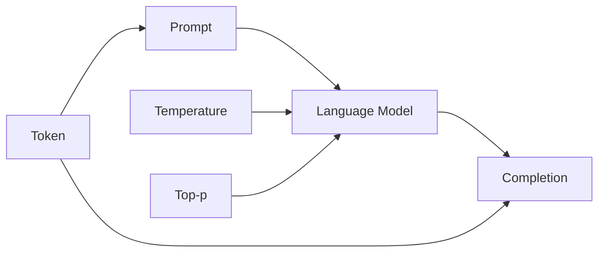

# 大语言模型应用指南：向模型发起请求的参数

## 1. 背景介绍

### 1.1 大语言模型的兴起

近年来,随着深度学习技术的飞速发展,特别是Transformer架构的提出,大语言模型(Large Language Model,LLM)取得了突破性的进展。从GPT、BERT到GPT-3,再到最新的ChatGPT、LLaMA等模型,大语言模型展现出了惊人的自然语言理解和生成能力,引发了业界的广泛关注。

### 1.2 大语言模型的应用前景

大语言模型强大的语言理解和生成能力,使其在许多领域都有广阔的应用前景,包括但不限于:

- 智能问答:利用大语言模型构建知识库问答系统,提供准确、全面的答案
- 内容创作:自动生成文章、新闻、小说等各类内容
- 语言翻译:实现高质量的机器翻译
- 代码生成:根据自然语言描述自动生成代码
- 情感分析:对文本进行情感倾向性分析
- 语音识别:将语音转换为文字
- 文本摘要:自动提取文章核心内容,生成摘要
- ......

### 1.3 大语言模型的应用挑战

尽管大语言模型展现了巨大的潜力,但要真正应用到实际场景中,还面临诸多挑战:

- 计算资源要求高:训练和推理都需要大量算力
- 模型体积庞大:动辄上百GB,不易部署
- 推理速度较慢:生成一段文本可能需要几秒到几分钟
- 数据隐私和安全问题:训练数据可能涉及敏感信息
- 生成内容的可控性较差:难以完全避免生成有害内容
- 推理结果的可解释性不足:难以解释模型给出特定输出的原因
- ......

因此,如何高效地使用和应用大语言模型,成为了业界亟待解决的问题。本文将重点介绍向大语言模型发起请求时的关键参数,以期为开发者提供参考和指南。

## 2. 核心概念与联系

在探讨如何向大语言模型发起请求之前,我们先来了解几个核心概念:

### 2.1 Prompt 提示

Prompt是指在向语言模型发起请求时,输入的文本序列。通过编写优质的Prompt,可以引导模型生成我们期望的内容。Prompt的设计是应用大语言模型的关键。

### 2.2 Completion 补全

Completion是指语言模型根据Prompt生成的文本序列。我们希望通过优化Prompt等参数,使Completion尽可能符合需求。

### 2.3 Token 令牌

Token是语言模型处理文本的基本单元。英文中,Token可以是词、标点或子词。模型以Token为单位来理解和生成文本。Prompt和Completion的长度都是以Token数量来衡量的。

### 2.4 Temperature 温度

Temperature是语言模型生成文本时的一个重要参数,控制采样的随机程度。Temperature越高,生成内容越随机;Temperature越低,生成内容越确定,更倾向于选择概率最高的Token。

### 2.5 Top-p 核采样

Top-p也称nucleus sampling,是一种替代Temperature的采样方法。Top-p的取值在0到1之间,代表基于累积概率对Token进行截断。Top-p越大,考虑的候选Token越多,生成内容越随机。

它们之间的关系如下图所示:

## 3. 核心算法原理与具体操作步骤

大语言模型的核心算法主要基于Transformer架构,特别是其中的注意力机制(Attention Mechanism)和前馈神经网络(Feed-Forward Neural Network)。下面我们简要介绍Transformer的核心原理和具体操作步骤。

### 3.1 Transformer架构简介

Transformer由编码器(Encoder)和解码器(Decoder)组成。编码器用于对输入序列进行特征提取,解码器根据编码器的输出和之前生成的Token,预测下一个Token。

编码器和解码器都由若干个相同的层(Layer)堆叠而成,主要包含两个子层:

1. 多头注意力(Multi-Head Attention)层
2. 前馈神经网络(Feed-Forward Neural Network)层

### 3.2 多头注意力的计算过程

多头注意力的作用是提取输入序列的重要特征。对于第i个头,其计算过程如下:

1. 将输入序列X分别乘以三个权重矩阵$W_q^i$、$W_k^i$、$W_v^i$,得到查询向量$Q^i$、键向量$K^i$、值向量$V^i$:

$$ Q^i = X \cdot W_q^i $$
$$ K^i = X \cdot W_k^i $$
$$ V^i = X \cdot W_v^i $$

2. 计算$Q^i$和$K^i$的点积注意力分数,并除以$\sqrt{d_k}$进行缩放:

$$ score^i = \frac{Q^i \cdot {K^i}^T}{\sqrt{d_k}} $$

3. 对注意力分数进行Softmax归一化,得到注意力权重$\alpha^i$:

$$ \alpha^i = Softmax(score^i) $$

4. 将注意力权重$\alpha^i$乘以值向量$V^i$,得到第i个头的输出$head^i$:

$$ head^i = \alpha^i \cdot V^i $$

5. 将所有头的输出拼接起来,再乘以权重矩阵$W_o$,得到多头注意力的最终输出:

$$ MultiHead(X) = Concat(head^1, head^2, ..., head^h) \cdot W_o $$

其中,$d_k$为$K^i$的维度,$h$为注意力头数。

### 3.3 前馈神经网络的计算过程 

前馈神经网络包含两个线性变换和一个ReLU激活函数,用于对多头注意力的输出进行非线性变换:

$$ FFN(x) = max(0, x \cdot W_1 + b_1) \cdot W_2 + b_2 $$

其中,$W_1$、$b_1$、$W_2$、$b_2$都是可学习的参数。

### 3.4 Transformer的训练过程

Transformer的训练过程可以分为以下几个步骤:

1. 将输入序列X通过词嵌入(Word Embedding)和位置编码(Positional Encoding)映射为向量表示。

2. 将步骤1的输出送入编码器,经过若干个编码器层的处理,得到最终的编码表示。

3. 将编码器的输出和解码器已生成的Token一起送入解码器,经过若干个解码器层的处理,预测下一个Token的概率分布。

4. 根据预测的概率分布采样或选择概率最大的Token作为新生成的内容,重复步骤3直到达到指定长度或遇到终止符。

5. 使用交叉熵损失函数计算预测Token与真实Token之间的差异,并通过反向传播更新模型参数。

6. 重复步骤1-5,直到模型收敛或达到预设的训练轮数。

## 4. 数学模型与公式详细讲解

在本节中,我们将详细讲解Transformer中涉及的几个关键数学模型和公式。

### 4.1 Scaled Dot-Product Attention

Scaled Dot-Product Attention用于计算Query和Key的相似度,并根据相似度对Value进行加权求和。其数学表达式为:

$$Attention(Q,K,V) = softmax(\frac{QK^T}{\sqrt{d_k}})V$$

其中,$Q$、$K$、$V$分别表示Query矩阵、Key矩阵和Value矩阵,$d_k$为Key的维度。

具体来说,假设$Q$、$K$、$V$的形状分别为$(m,d_q)$、$(n,d_k)$、$(n,d_v)$,则Scaled Dot-Product Attention的计算过程如下:

1. 将$Q$与$K^T$相乘,得到形状为$(m,n)$的相似度矩阵。
2. 将相似度矩阵除以$\sqrt{d_k}$,进行缩放。这样做的目的是防止内积过大,导致Softmax函数梯度消失。
3. 对缩放后的相似度矩阵应用Softmax函数,得到注意力权重矩阵,形状为$(m,n)$。
4. 将注意力权重矩阵与$V$相乘,得到最终的注意力输出,形状为$(m,d_v)$。

举个例子,假设我们有以下输入:

$$ Q=\begin{bmatrix} 1 & 2 & 3 \\ 4 & 5 & 6 \end{bmatrix},
   K=\begin{bmatrix} 7 & 8 \\ 9 & 10 \\ 11 & 12 \end{bmatrix},
   V=\begin{bmatrix} 13 & 14 \\ 15 & 16 \\ 17 & 18 \end{bmatrix} $$

其中,$m=2$,$n=3$,$d_q=d_k=2$,$d_v=2$。

首先计算$Q$与$K^T$的内积:

$$ QK^T = \begin{bmatrix} 
1\times7+2\times9+3\times11 & 1\times8+2\times10+3\times12 \\
4\times7+5\times9+6\times11 & 4\times8+5\times10+6\times12
\end{bmatrix} = \begin{bmatrix}
58 & 64 \\
139 & 154
\end{bmatrix} $$

然后将内积矩阵除以$\sqrt{d_k}=\sqrt{2}$:

$$ \frac{QK^T}{\sqrt{2}} = \begin{bmatrix}
41.01 & 45.25 \\
98.29 & 108.89
\end{bmatrix} $$

对缩放后的矩阵应用Softmax函数:

$$ Softmax(\frac{QK^T}{\sqrt{2}}) = \begin{bmatrix}
0.48 & 0.52 \\
0.47 & 0.53
\end{bmatrix} $$

最后将Softmax矩阵与$V$相乘:

$$ Attention(Q,K,V) = \begin{bmatrix}
0.48\times13+0.52\times15 & 0.48\times14+0.52\times16 \\
0.47\times13+0.53\times17 & 0.47\times14+0.53\times18
\end{bmatrix} = \begin{bmatrix}
14.04 & 15.04 \\
15.11 & 16.15
\end{bmatrix} $$

这就是Scaled Dot-Product Attention的计算过程和结果。

### 4.2 Multi-Head Attention

Multi-Head Attention通过将Scaled Dot-Product Attention计算多次,然后拼接结果并线性变换,以捕捉输入序列在不同子空间的表示。其数学表达式为:

$$MultiHead(Q,K,V) = Concat(head_1,...,head_h)W^O$$

$$head_i = Attention(QW_i^Q, KW_i^K, VW_i^V)$$

其中,$W_i^Q \in \mathbb{R}^{d_{model} \times d_q}$,$W_i^K \in \mathbb{R}^{d_{model} \times d_k}$,$W_i^V \in \mathbb{R}^{d_{model} \times d_v}$,$W^O \in \mathbb{R}^{hd_v \times d_{model}}$都是可学习的参数矩阵,$h$为注意力头数。

下面我们通过一个具体的例子来说明Multi-Head Attention的计算过程。

假设$Q$、$K$、$V$的形状均为$(3,4)$,注意力头数$h=2$,每个头的Query、Key、Value维度$d_q=d_k=d_v=2$。

首先初始化参数矩阵:

$$ W_1^Q=\begin{bmatrix} 
1 & 2 \\
3 & 4 \\
5 & 6 \\
7 & 8
\end{bmatrix},
W_1^K=\begin{bmatrix}
9 & 10 \\
11 & 12 \\
13 & 14 \\
15 & 16
\end{bmatrix},
W_1^V=\begin{bmatrix}
17 & 18 \\
19 & 20 \\
21 & 22 \\
23 & 24
\end{bmatrix} $$

$$ W_2^Q=\begin{bmatrix}
25 & 26 \\
27 & 28 \\
29 & 30 \\
31 & 32
\end{bmatrix},
W_2^K=\begin{bmatrix}
33 & 34 