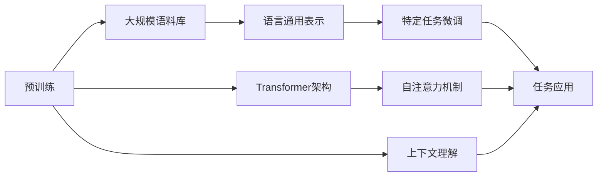

## 1. 背景介绍

随着人工智能技术的飞速发展，大语言模型（Large Language Models，LLMs）已经成为了自然语言处理（NLP）领域的一个重要分支。从早期的统计机器翻译到现在的深度学习模型，语言模型的演进不仅仅是算法和模型结构的革新，更是计算能力和数据规模的飞跃。特别是近年来，随着BERT、GPT等模型的问世，大语言模型在文本生成、语义理解、对话系统等多个方面展现出了惊人的能力。

## 2. 核心概念与联系

大语言模型通常是基于深度学习的，它们能够捕捉语言的复杂特性，并在此基础上进行预测。核心概念包括但不限于：

- **预训练与微调**：模型在大规模语料库上进行预训练，学习语言的通用表示，然后在特定任务上进行微调。
- **Transformer架构**：这是目前大语言模型的主流架构，它通过自注意力机制有效地处理序列数据。
- **上下文理解**：大语言模型能够理解和使用上下文信息，这是它们强大的语义理解能力的基础。



## 3. 核心算法原理具体操作步骤

大语言模型的核心算法原理主要基于Transformer架构，其操作步骤包括：

1. 输入序列的嵌入表示
2. 通过自注意力机制计算不同位置的词之间的关系
3. 利用多头注意力进一步提取特征
4. 通过位置编码保留序列信息
5. 通过编码器和解码器层次结构处理序列
6. 输出序列的预测结果

## 4. 数学模型和公式详细讲解举例说明

以自注意力机制为例，其数学模型可以表示为：

$$
\text{Attention}(Q, K, V) = \text{softmax}\left(\frac{QK^T}{\sqrt{d_k}}\right)V
$$

其中，$Q, K, V$ 分别代表查询（Query）、键（Key）和值（Value），$d_k$ 是键的维度。通过这个公式，模型能够计算输入序列中每个词对其他词的影响权重。

## 5. 项目实践：代码实例和详细解释说明

以TensorFlow和PyTorch为例，展示如何实现一个简单的Transformer模型。代码实例将包括数据预处理、模型构建、训练和评估等步骤。

```python
# 代码示例（伪代码）
import tensorflow as tf

# 数据预处理
# ...

# 构建Transformer模型
class Transformer(tf.keras.Model):
    # ...
    pass

# 训练模型
# ...

# 评估模型
# ...
```

## 6. 实际应用场景

大语言模型在多个领域都有广泛的应用，包括但不限于：

- 机器翻译
- 文本摘要
- 问答系统
- 情感分析
- 语音识别

## 7. 工具和资源推荐

- **TensorFlow** 和 **PyTorch**：两个主流的深度学习框架，适合构建和训练大语言模型。
- **Hugging Face Transformers**：提供了大量预训练模型和工具，方便进行NLP任务。
- **Google Colab**：提供免费的GPU资源，适合初学者和研究者进行模型训练和实验。

## 8. 总结：未来发展趋势与挑战

大语言模型的未来发展趋势包括模型的进一步优化、更高效的训练方法、更好的泛化能力等。同时，也面临着诸如计算资源消耗大、模型可解释性差、数据偏见等挑战。

## 9. 附录：常见问题与解答

- **Q1**: 大语言模型的训练成本如何？
- **A1**: 训练大型语言模型通常需要大量的计算资源和时间，成本较高。

- **Q2**: 如何处理模型的数据偏见问题？
- **A2**: 可以通过数据增强、模型审计等方法来减少数据偏见。

- **Q3**: 大语言模型的可解释性如何提高？
- **A3**: 可以采用模型可视化、注意力机制分析等方法来提高模型的可解释性。

作者：禅与计算机程序设计艺术 / Zen and the Art of Computer Programming