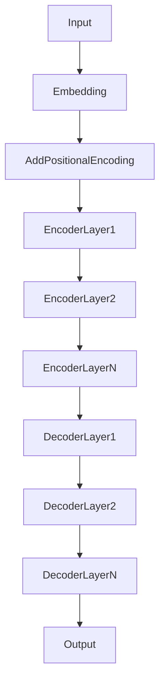

# 大语言模型应用指南：尺度定律的未来

## 1. 背景介绍
### 1.1 大语言模型的兴起
近年来,随着深度学习技术的飞速发展,大语言模型(Large Language Models, LLMs)在自然语言处理(Natural Language Processing, NLP)领域取得了突破性的进展。从GPT-3到PaLM,再到最新的GPT-4,大语言模型展现出了惊人的语言理解和生成能力,引发了学术界和工业界的广泛关注。

### 1.2 尺度定律的提出
在大语言模型的研究过程中,研究者们发现了一个有趣的现象:随着模型参数量的增加,模型性能呈现出一定的规律性。这个规律被称为"尺度定律"(Scaling Laws)。尺度定律描述了模型性能与模型规模之间的关系,为大语言模型的发展提供了重要的理论指导。

### 1.3 尺度定律的意义
尺度定律的提出对大语言模型的研究和应用具有重要意义。一方面,它为模型性能的提升指明了方向,即通过增加模型规模来获得更好的性能;另一方面,它也为模型的训练和部署提供了参考,帮助研究者和工程师们更好地权衡模型规模、计算资源和性能之间的关系。

## 2. 核心概念与联系
### 2.1 大语言模型
大语言模型是一类基于深度学习的语言模型,通过在海量文本数据上进行预训练,学习语言的统计规律和语义表示。与传统的语言模型不同,大语言模型通常具有数十亿甚至上万亿的参数,能够捕捉语言中的细微差别和复杂语义。

### 2.2 尺度定律
尺度定律描述了模型性能与模型规模之间的关系。具体而言,尺度定律表明,在数据和计算资源充足的情况下,模型性能随着模型规模的增加而提升,且提升的幅度呈现出一定的规律性。这个规律可以用数学公式来表示,我们将在后面详细讨论。

### 2.3 预训练和微调
大语言模型的训练通常分为两个阶段:预训练和微调。预训练阶段是在大规模无标注数据上进行的,目的是让模型学习语言的基本规律和语义表示。微调阶段是在特定任务的标注数据上进行的,目的是让模型适应特定任务的需求。尺度定律主要针对预训练阶段,但也对微调阶段有一定的指导意义。

### 2.4 计算资源和训练时间
大语言模型的训练需要大量的计算资源和训练时间。随着模型规模的增加,所需的计算资源和训练时间也呈指数级增长。因此,如何在有限的计算资源和时间内获得最优的模型性能,是大语言模型研究中的一个重要问题。尺度定律为这个问题提供了一定的思路。

## 3. 核心算法原理具体操作步骤
### 3.1 Transformer架构
大语言模型的核心架构是Transformer。Transformer是一种基于自注意力机制(Self-Attention)的神经网络架构,能够有效地捕捉序列数据中的长距离依赖关系。Transformer的基本结构如下:



### 3.2 预训练任务
大语言模型的预训练通常采用无监督的方式,即在无标注数据上进行训练。常见的预训练任务包括:

- 语言模型任务(Language Modeling):预测下一个单词或字符。
- 去噪自编码任务(Denoising Auto-Encoding):从被噪声破坏的输入中恢复原始输入。
- 对比学习任务(Contrastive Learning):最大化正样本对之间的相似度,最小化负样本对之间的相似度。

### 3.3 微调任务
在预训练完成后,大语言模型可以通过微调来适应特定任务。微调通常在标注数据上进行,常见的微调任务包括:

- 文本分类(Text Classification):将输入文本分类到预定义的类别中。
- 命名实体识别(Named Entity Recognition):识别输入文本中的命名实体,如人名、地名等。
- 问答(Question Answering):根据输入的问题和上下文,生成相应的答案。

### 3.4 尺度定律的应用
在大语言模型的训练过程中,可以应用尺度定律来指导模型规模的选择和训练策略的制定。具体而言:

1. 根据尺度定律,选择合适的模型规模。通常,模型规模越大,性能越好,但也需要权衡计算资源和训练时间的限制。
2. 在预训练阶段,根据尺度定律调整学习率、批量大小等超参数,以获得最优的性能。
3. 在微调阶段,根据尺度定律选择合适的微调策略,如少样本学习、提示学习等,以充分利用预训练模型的知识。

## 4. 数学模型和公式详细讲解举例说明
### 4.1 尺度定律的数学表示
尺度定律可以用以下数学公式来表示:

$$ \mathcal{L}(N) = \mathcal{L}_{\infty} + \frac{c}{N^{\alpha}} $$

其中,$\mathcal{L}(N)$表示模型在数据集上的损失函数值,$N$表示模型参数量,$\mathcal{L}_{\infty}$表示模型在无限大规模下的损失函数值,$c$和$\alpha$是与数据集和模型架构相关的常数。

这个公式表明,随着模型参数量$N$的增加,损失函数值$\mathcal{L}(N)$会逐渐收敛到$\mathcal{L}_{\infty}$,收敛速度由$\alpha$决定。通常,$\alpha$的取值在0.5到1之间。

### 4.2 尺度定律的图示
我们可以用一个简单的例子来直观地理解尺度定律。假设我们有一个二元分类任务,模型参数量$N$从1000到1000000,损失函数值$\mathcal{L}(N)$的变化如下图所示:

```latex
\begin{tikzpicture}
\begin{axis}[
    xlabel={Model Size ($N$)},
    ylabel={Loss ($\mathcal{L}(N)$)},
    xmode=log,
    ymode=log,
    xmin=1000, xmax=1000000,
    ymin=0.01, ymax=1,
    xtick={1000,10000,100000,1000000},
    ytick={0.01,0.1,1},
    legend pos=north east,
    ymajorgrids=true,
    grid style=dashed,
]
\addplot[color=blue,mark=square]
    coordinates {
    (1000,0.8)(10000,0.5)(100000,0.2)(1000000,0.1)
    };
\addlegendentry{$\mathcal{L}(N)$}
\addplot[color=red,dashed]
    coordinates {
    (1000,0.1)(1000000,0.1)
    };
\addlegendentry{$\mathcal{L}_{\infty}$}
\end{axis}
\end{tikzpicture}
```

从图中可以看出,随着模型参数量$N$的增加,损失函数值$\mathcal{L}(N)$逐渐收敛到$\mathcal{L}_{\infty}$,呈现出尺度定律所描述的规律。

### 4.3 尺度定律的应用举例
假设我们要训练一个语言模型,目标是在一个大规模语料库上达到perplexity为10的性能。根据经验,我们知道当前最好的模型在该语料库上的perplexity为20,参数量为1亿。我们可以用尺度定律来估计达到目标性能所需的模型参数量。

设当前最好模型的参数量为$N_0$,perplexity为$\mathcal{L}_0$,目标perplexity为$\mathcal{L}_t$,根据尺度定律,有:

$$ \mathcal{L}_0 = \mathcal{L}_{\infty} + \frac{c}{N_0^{\alpha}} $$
$$ \mathcal{L}_t = \mathcal{L}_{\infty} + \frac{c}{N_t^{\alpha}} $$

两式相减,得:

$$ \mathcal{L}_0 - \mathcal{L}_t = \frac{c}{N_0^{\alpha}} - \frac{c}{N_t^{\alpha}} $$

假设$\alpha=0.5$,代入已知数值,解得:

$$ N_t = \left(\frac{c}{\mathcal{L}_0 - \mathcal{L}_t}\right)^{\frac{1}{\alpha}} = \left(\frac{c}{20 - 10}\right)^2 = 4N_0 = 4 \times 10^8 $$

因此,我们估计需要一个参数量为4亿的模型才能达到目标性能。这为我们的模型设计和训练提供了重要的参考。

## 5. 项目实践：代码实例和详细解释说明
下面我们通过一个简单的代码实例,来演示如何应用尺度定律进行大语言模型的训练和评估。

### 5.1 数据准备
首先,我们需要准备训练数据和评估数据。这里我们使用WikiText-2数据集,它是一个常用的语言模型基准数据集。

```python
import torch
from torchtext.datasets import WikiText2
from torchtext.data.utils import get_tokenizer
from torchtext.vocab import build_vocab_from_iterator

# 加载数据集
train_iter = WikiText2(split='train')
valid_iter = WikiText2(split='valid')
test_iter = WikiText2(split='test')

# 构建词表
tokenizer = get_tokenizer('basic_english')
vocab = build_vocab_from_iterator(map(tokenizer, train_iter), specials=["<unk>"])
vocab.set_default_index(vocab["<unk>"])

# 将文本转换为数值序列
def data_process(raw_text_iter):
    data = [torch.tensor(vocab(tokenizer(item)), dtype=torch.long) for item in raw_text_iter]
    return torch.cat(tuple(filter(lambda t: t.numel() > 0, data)))

train_data = data_process(train_iter)
valid_data = data_process(valid_iter)
test_data = data_process(test_iter)
```

### 5.2 模型定义
接下来,我们定义语言模型。这里我们使用一个简单的Transformer模型,包含多个Transformer Encoder层。

```python
import math
import torch.nn as nn

class TransformerModel(nn.Module):
    def __init__(self, ntoken, ninp, nhead, nhid, nlayers, dropout=0.5):
        super(TransformerModel, self).__init__()
        self.pos_encoder = PositionalEncoding(ninp, dropout)
        encoder_layers = nn.TransformerEncoderLayer(ninp, nhead, nhid, dropout)
        self.transformer_encoder = nn.TransformerEncoder(encoder_layers, nlayers)
        self.encoder = nn.Embedding(ntoken, ninp)
        self.ninp = ninp
        self.decoder = nn.Linear(ninp, ntoken)
        self.init_weights()

    def generate_square_subsequent_mask(self, sz):
        mask = (torch.triu(torch.ones(sz, sz)) == 1).transpose(0, 1)
        mask = mask.float().masked_fill(mask == 0, float('-inf')).masked_fill(mask == 1, float(0.0))
        return mask

    def init_weights(self):
        initrange = 0.1
        self.encoder.weight.data.uniform_(-initrange, initrange)
        self.decoder.bias.data.zero_()
        self.decoder.weight.data.uniform_(-initrange, initrange)

    def forward(self, src, src_mask):
        src = self.encoder(src) * math.sqrt(self.ninp)
        src = self.pos_encoder(src)
        output = self.transformer_encoder(src, src_mask)
        output = self.decoder(output)
        return output
```

### 5.3 训练和评估
有了数据和模型,我们就可以开始训练和评估了。这里我们定义了一个`train`函数和一个`evaluate`函数,分别用于模型的训练和评估。

```python
import time
import math

def train(model, train_data, batch_size, criterion, optimizer, scheduler, num_epochs):
    model.train()
    total_loss = 0.
    start_time = time.time()
    src_mask = model.generate_square_subsequent_mask(batch_size).to(device)
    for epoch in range(num_epochs):
        for i in range(0, train_data.size(0) - 1, batch_size):
            data, targets = get_batch(train_data, i, batch_size)
            optimizer.zero_grad()
            if data.size(0) !=