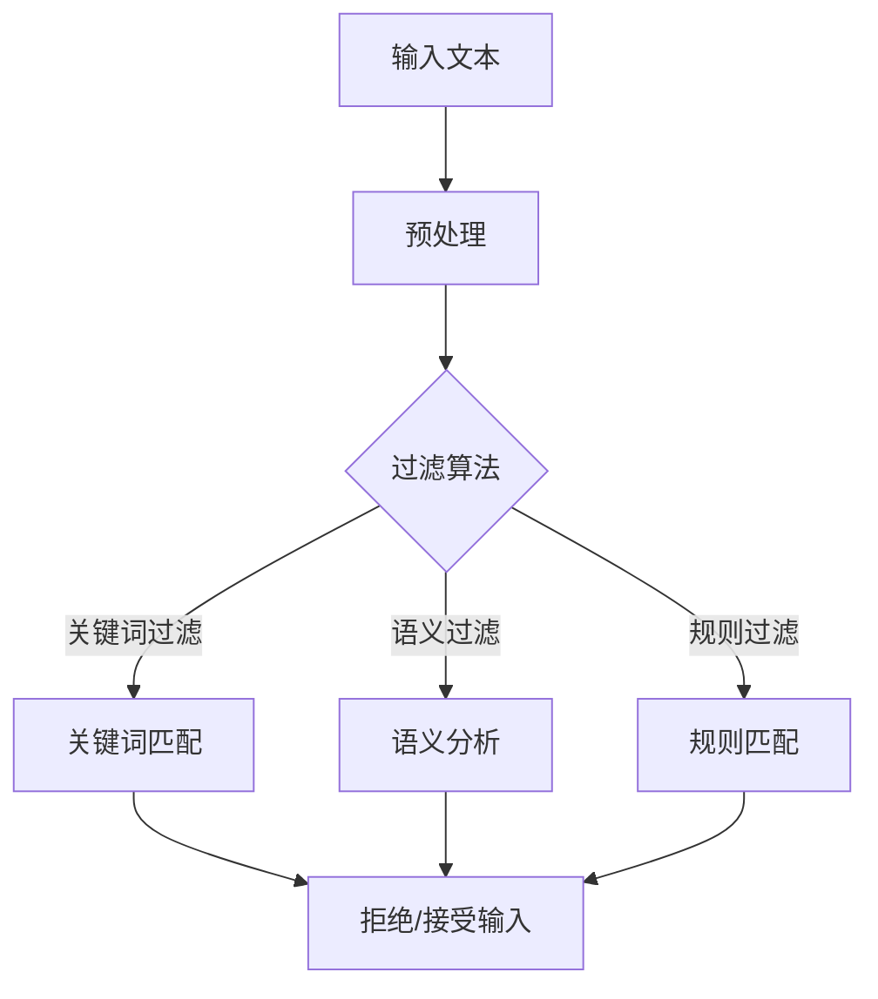
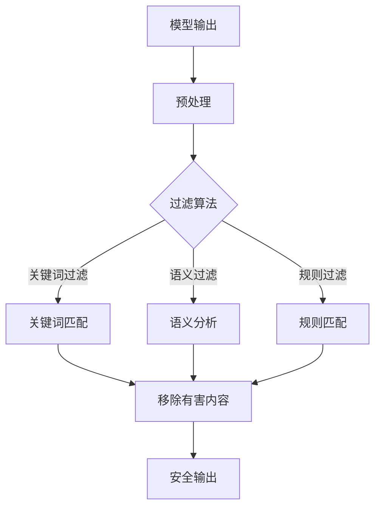
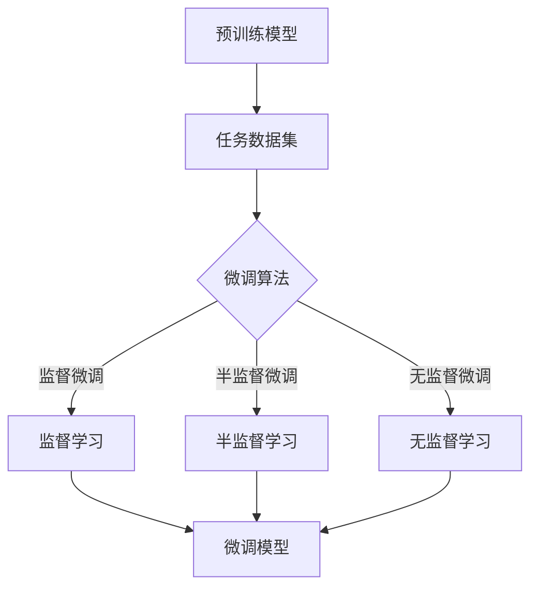
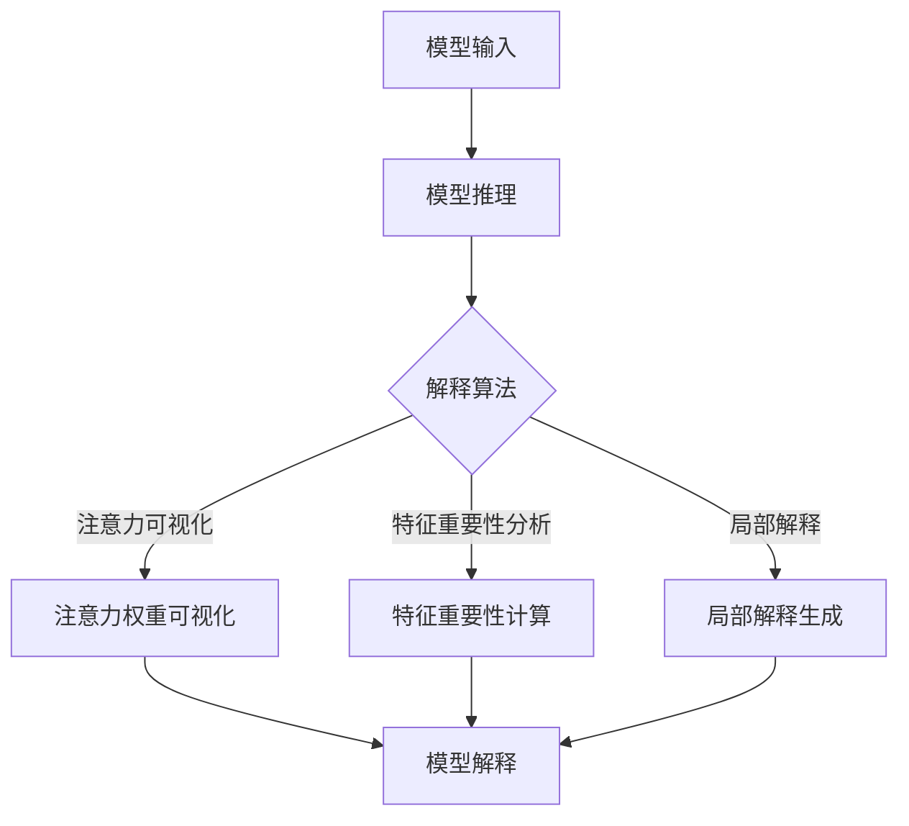

# 大语言模型应用指南：防御策略

## 1.背景介绍

### 1.1 大语言模型的兴起

近年来,大型语言模型(Large Language Models, LLMs)在自然语言处理领域取得了令人瞩目的进展。这些模型通过在大规模语料库上进行预训练,学习了丰富的语言知识和上下文信息,从而在下游任务中表现出卓越的性能。著名的大语言模型包括GPT-3、PaLM、ChatGPT等,它们不仅能够生成流畅、连贯的文本,还能够处理各种复杂的自然语言任务,如问答、摘要、翻译等。

### 1.2 大语言模型的安全隐患

然而,大语言模型的强大能力也带来了一些安全隐患和潜在风险。由于这些模型是在开放的互联网语料库上训练的,因此它们可能会学习到有害、不当或不确切的内容。此外,由于模型的黑盒性质,我们很难完全控制和解释它们的输出行为。因此,在将大语言模型应用于实际场景时,我们需要采取一些防御措施来确保其安全性和可靠性。

## 2.核心概念与联系

### 2.1 大语言模型的核心概念

大语言模型的核心概念是基于自注意力机制(Self-Attention)的Transformer架构。Transformer通过自注意力机制捕捉输入序列中的长程依赖关系,从而能够更好地建模和生成长序列。此外,大语言模型还采用了掩码语言模型(Masked Language Model)的预训练方式,通过预测被掩码的词来学习语言的上下文信息。

### 2.2 安全防御策略的核心思想

为了确保大语言模型的安全应用,我们需要从以下几个方面入手:

1. **输入过滤**: 对模型的输入进行过滤,防止有害或不当内容进入模型。
2. **输出过滤**: 对模型的输出进行过滤,移除有害或不当的内容。
3. **模型微调**: 在特定领域的数据集上对模型进行微调,使其更加专注于特定任务。
4. **模型解释**: 通过可解释性技术,解释模型的决策过程,增加其透明度和可信度。
5. **人工审查**: 对模型的输出进行人工审查,确保其质量和安全性。

这些防御策略相互关联,需要综合运用才能最大程度地确保大语言模型的安全应用。

## 3.核心算法原理具体操作步骤

### 3.1 输入过滤算法

输入过滤的目标是防止有害或不当内容进入模型。常见的输入过滤算法包括:

1. **关键词过滤**: 维护一个关键词黑名单,对输入进行匹配,如果包含黑名单中的关键词,则拒绝该输入。
2. **语义过滤**: 利用语义模型(如BERT)对输入进行语义分析,判断其是否包含有害或不当内容。
3. **规则过滤**: 根据一系列预定义的规则对输入进行过滤,如检测是否包含暴力、仇恨等内容。

输入过滤算法的具体操作步骤如下:



### 3.2 输出过滤算法

输出过滤的目标是移除模型输出中的有害或不当内容。常见的输出过滤算法包括:

1. **关键词过滤**: 类似于输入过滤,维护一个关键词黑名单,对模型输出进行匹配,移除包含黑名单中关键词的部分。
2. **语义过滤**: 利用语义模型对模型输出进行语义分析,判断其是否包含有害或不当内容,并移除相应部分。
3. **规则过滤**: 根据一系列预定义的规则对模型输出进行过滤,如检测是否包含暴力、仇恨等内容,并移除相应部分。

输出过滤算法的具体操作步骤如下:



### 3.3 模型微调算法

模型微调的目标是在特定领域的数据集上对大语言模型进行进一步训练,使其更加专注于特定任务,提高任务相关性和安全性。常见的模型微调算法包括:

1. **监督微调**: 在标注的任务数据集上对模型进行监督式微调,优化模型在特定任务上的性能。
2. **半监督微调**: 结合少量标注数据和大量未标注数据,采用半监督学习方式对模型进行微调。
3. **无监督微调**: 在大规模未标注数据上对模型进行无监督式微调,学习任务相关的语言模式。

模型微调算法的具体操作步骤如下:



### 3.4 模型解释算法

模型解释的目标是增加大语言模型的透明度和可解释性,让用户更好地理解模型的决策过程。常见的模型解释算法包括:

1. **注意力可视化**: 可视化模型的自注意力机制,展示模型关注的输入token和相关程度。
2. **特征重要性分析**: 通过梯度或其他方法计算输入特征对模型输出的重要性,识别影响模型决策的关键特征。
3. **局部解释**: 针对特定输入,生成局部的解释,解释模型对该输入的决策原因。

模型解释算法的具体操作步骤如下:



## 4.数学模型和公式详细讲解举例说明

### 4.1 自注意力机制

自注意力机制是Transformer架构的核心组件,它能够捕捉输入序列中的长程依赖关系。给定一个输入序列 $X = (x_1, x_2, \dots, x_n)$,自注意力机制计算每个位置 $i$ 的注意力向量 $a_i$ 如下:

$$a_i = \text{softmax}\left(\frac{(WQ_i)(WK)^T}{\sqrt{d_k}}\right)WV$$

其中 $Q_i$、$K$ 和 $V$ 分别表示查询(Query)、键(Key)和值(Value),它们是通过线性变换从输入序列 $X$ 得到的。$W$ 是可学习的权重矩阵,用于将查询、键和值映射到相同的维度空间。$d_k$ 是缩放因子,用于防止点积的值过大或过小。

注意力向量 $a_i$ 捕捉了输入序列中其他位置对位置 $i$ 的重要性,通过加权求和的方式,可以获得位置 $i$ 的表示 $y_i$:

$$y_i = \sum_{j=1}^n a_{ij}v_j$$

其中 $a_{ij}$ 表示位置 $j$ 对位置 $i$ 的注意力权重,而 $v_j$ 是位置 $j$ 的值向量。

自注意力机制能够有效地建模长程依赖关系,是Transformer架构取得巨大成功的关键所在。

### 4.2 掩码语言模型

掩码语言模型(Masked Language Model, MLM)是大语言模型预训练的常用方式之一。它的目标是根据上下文预测被掩码的词。

具体来说,给定一个输入序列 $X = (x_1, x_2, \dots, x_n)$,我们随机选择一些位置,将对应的词替换为特殊的掩码符号 [MASK]。假设被掩码的位置集合为 $M$,那么模型的目标是最大化以下条件概率:

$$\prod_{i \in M} P(x_i | X \setminus \{x_i\})$$

其中 $X \setminus \{x_i\}$ 表示去掉位置 $i$ 的词后的剩余序列。

通过最大化上述条件概率,模型可以学习到丰富的语言知识和上下文信息,从而在下游任务中表现出良好的泛化能力。

### 4.3 示例:掩码语言模型的训练过程

假设我们有一个输入序列 "今天天气很好,我们去[MASK]公园玩吧"。其中 "公园" 这个词被掩码为 [MASK]。

在训练过程中,模型需要根据上下文预测掩码位置的词。具体来说,模型会计算每个候选词在该位置出现的条件概率,例如:

$$\begin{aligned}
P(\text{"公园"} | \text{"今天天气很好,我们去[MASK]玩吧"}) &= 0.8 \\
P(\text{"游乐场"} | \text{"今天天气很好,我们去[MASK]玩吧"}) &= 0.1 \\
P(\text{"商场"} | \text{"今天天气很好,我们去[MASK]玩吧"}) &= 0.05 \\
&\dots
\end{aligned}$$

模型会选择条件概率最大的词 "公园" 作为预测结果,并根据预测的正确与否调整模型参数,以最小化预测误差。

通过大量这样的训练样本,模型可以学习到丰富的语言知识和上下文信息,从而在下游任务中表现出良好的泛化能力。

## 5.项目实践:代码实例和详细解释说明

在本节中,我们将提供一个基于Hugging Face Transformers库的代码示例,演示如何对大语言模型进行微调和推理。

### 5.1 导入必要的库

```python
from transformers import AutoTokenizer, AutoModelForCausalLM, TrainingArguments, Trainer
from datasets import load_dataset
```

我们从Hugging Face Transformers库中导入了必要的模块,包括tokenizer、预训练模型、训练参数和Trainer类。

### 5.2 加载数据集和预训练模型

```python
# 加载数据集
dataset = load_dataset("csv", data_files="data.csv")

# 加载预训练模型和tokenizer
model_name = "gpt2"
tokenizer = AutoTokenizer.from_pretrained(model_name)
model = AutoModelForCausalLM.from_pretrained(model_name)
```

我们从CSV文件中加载了自定义的数据集,并加载了预训练的GPT-2模型和对应的tokenizer。

### 5.3 数据预处理

```python
def preprocess_data(examples):
    inputs = examples["text"]
    model_inputs = tokenizer(inputs, max_length=1024, truncation=True)
    return model_inputs

dataset = dataset.map(preprocess_data, batched=True)
```

我们定义了一个数据预处理函数,用于将文本输入转换为模型可接受的格式。在这个示例中,我们使用tokenizer对输入进行编码,并设置了最大长度为1024。

### 5.4 定义训练参数和Trainer

```python
training_args = TrainingArguments(
    output_dir="output",
    evaluation_strategy="epoch",
    learning_rate=2e-5,
    per_device_train_batch_size=8,
    per_device_eval_batch_size=8,
    num_train_epochs=3,
    weight_decay=0.01,
)

trainer = Trainer(
    model=model,
    args=training_args,
    train_dataset=dataset["train"],
    eval_dataset=dataset["val"],
)
```

我们定义了训练参数,包括输出目录、评估策略、学习率、批次大小、训练轮数和权重衰减系数。然后,我们创建了一个