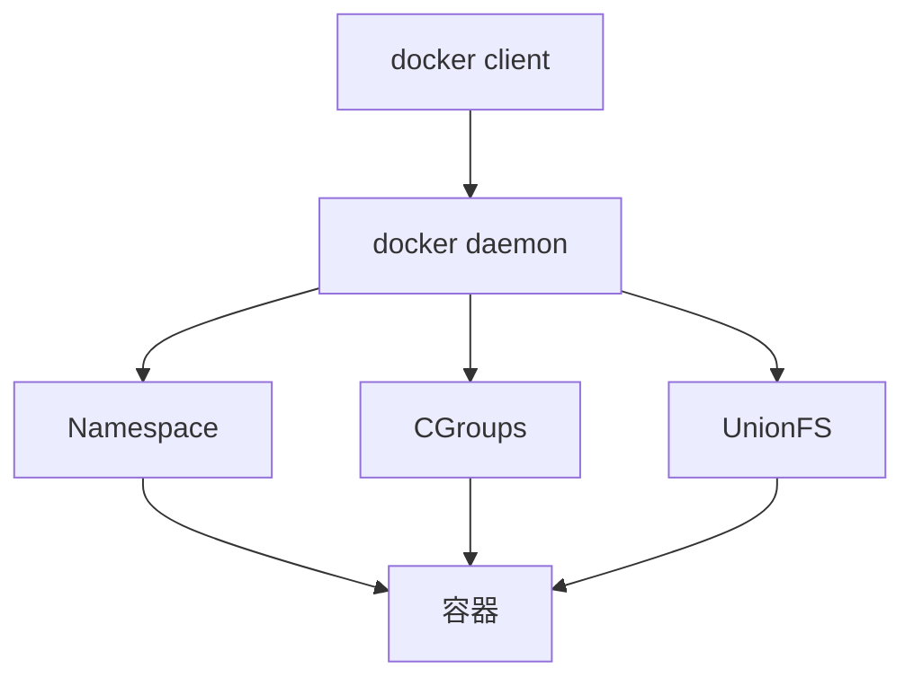

# 容器 原理与代码实例讲解

## 1.背景介绍

### 1.1 容器技术的兴起

随着云计算、微服务架构的发展,容器技术因其轻量级、可移植、易于部署等特点而备受青睐。容器为应用提供了一个独立的运行环境,使得应用可以在不同的系统环境中稳定运行。

### 1.2 容器带来的优势

容器相比传统的虚拟机,具有如下优势:

- 更高的资源利用率:容器与宿主机共享OS内核,不需要运行完整的操作系统,因此更加轻量。
- 更快的启动速度:容器可以在秒级别内启动,而虚拟机通常需要分钟级。  
- 更方便的迁移和扩展:容器可以很容易地在不同环境间迁移,支持弹性伸缩。
- 更好的隔离性:每个容器有自己独立的文件系统、网络等资源,容器间不会相互影响。

### 1.3 容器生态系统概览

容器技术的蓬勃发展也催生了丰富的容器生态,主要包括:

- 容器运行时:如Docker、containerd等,提供容器的运行环境。
- 容器编排工具:如Kubernetes、Docker Swarm等,用于容器的编排和管理。 
- 容器镜像仓库:如Docker Hub、Harbor等,存储和分发容器镜像。
- 容器网络方案:如Flannel、Calico等,为容器提供overlay网络。
- 容器存储方案:如Ceph、GlusterFS等,为容器提供持久化存储。

## 2.核心概念与联系

要深入理解容器技术,需要先了解几个核心概念:

### 2.1 容器 (Container)

容器是一种轻量级的虚拟化技术,通过namespace和cgroups等内核特性实现资源隔离和限制,为应用提供独立的运行环境。每个容器有自己的根文件系统、网络栈、进程空间等。

### 2.2 镜像 (Image) 

镜像是容器的模板,包含了容器运行所需的文件系统和应用。镜像采用分层存储机制,下层是只读的,上层是可写的容器层。多个容器可以共享同一个镜像,启动容器时会在镜像的最上层加载一个可写层。

### 2.3 仓库 (Registry)

仓库用于存储和分发容器镜像,分为公有仓库和私有仓库。Docker Hub是默认的公有仓库,包含大量的官方和第三方镜像。企业内部也可以搭建私有仓库,如Harbor,用于存储自己的业务镜像。

### 2.4 编排 (Orchestration)

容器编排是指对大量容器进行调度、管理和协同的过程。编排工具如Kubernetes,可以自动化容器的部署、扩缩容、故障恢复等,大大简化了容器集群的运维。

它们之间的关系如下图所示:


## 3.核心实现原理

下面我们来看看容器的核心实现原理。以Docker为例,它主要利用了Linux内核的以下特性:

### 3.1 Namespace 

通过Namespace实现资源隔离,Docker主要用到以下几种Namespace:

- PID Namespace:进程隔离,容器有自己的进程号空间。
- Mount Namespace:挂载隔离,容器有自己独立的挂载点。  
- UTS Namespace:主机名隔离,容器可以有自己的hostname。
- IPC Namespace:进程间通信隔离,容器有独立的IPC资源如消息队列。 
- Network Namespace:网络隔离,容器有独立的网络栈和IP地址。

### 3.2 CGroups

通过CGroups实现资源限制,可以限制容器的CPU、内存、IO等资源使用。Docker会为每个容器创建一个独立的CGroup,防止容器占用过多资源影响其他容器和宿主机。

### 3.3 UnionFS 

通过UnionFS实现镜像和容器的分层存储。Docker支持多种存储驱动,如AUFS、Overlay2等。镜像包含多个只读层,而容器在镜像之上有一个可写层。当修改容器中的文件时,文件会被复制到可写层进行修改,这种机制叫Copy-on-Write。

### 3.4 容器运行流程

结合上述技术,一个容器的运行流程大致如下:

1. 用户通过docker client请求创建容器
2. docker daemon创建容器进程,为其分配独立的Namespace 
3. 根据镜像创建容器的文件系统,并挂载到容器的Mount Namespace中
4. 为容器创建独立的网络栈,并将其加入到Network Namespace中  
5. 启动容器内的应用进程,进程在各个Namespace内运行
6. 通过CGroup限制容器的资源使用,隔离容器间和宿主机的影响

容器运行的架构如下图:



## 4.数学模型和公式

容器技术主要依赖于操作系统内核的特性,涉及的数学模型和公式相对较少。这里主要介绍CGroups的资源限制算法。

CGroups通过在cgroup虚拟文件系统中设置参数,来控制一组进程的资源使用。以CPU为例,主要涉及两个参数:

- cpu.cfs_period_us:时间周期长度,默认为100000(即100ms)
- cpu.cfs_quota_us:在一个周期内可以使用的CPU时间,单位为微秒

两者的比值就决定了容器的CPU使用限制:

$$ CPU\_Limit = \frac{cfs\_quota\_us}{cfs\_period\_us} $$

例如,如果设置cfs_period_us为100000,cfs_quota_us为50000,则:

$$ CPU\_Limit = \frac{50000}{100000} = 0.5 $$

即容器最多只能使用0.5个CPU核心的计算力。

CGroups的内存限制也通过类似的机制,设置memory.limit_in_bytes参数来限制容器的最大内存使用量。

## 5.项目实践:代码实例

下面通过一个具体的代码实例,演示如何使用Docker来构建和运行一个简单的Web应用容器。

### 5.1 编写应用代码

首先编写一个简单的Python Flask应用,创建app.py文件:

```python
from flask import Flask
app = Flask(__name__)

@app.route('/')
def hello():
    return "Hello World!"

if __name__ == '__main__':
    app.run(host='0.0.0.0', port=8080)
```

### 5.2 编写Dockerfile

然后编写Dockerfile,描述如何构建应用的容器镜像:

```dockerfile
FROM python:3.9-slim

WORKDIR /app

COPY app.py .
RUN pip install flask 

EXPOSE 8080

CMD ["python", "app.py"]
```

这个Dockerfile包含以下步骤:

- 基于python:3.9-slim基础镜像构建
- 设置工作目录为/app
- 复制app.py到镜像中
- 安装flask依赖
- 暴露8080端口
- 设置容器启动命令为python app.py

### 5.3 构建镜像

在Dockerfile所在目录执行构建命令:

```bash
docker build -t myapp:v1 .
```

-t参数指定镜像的名称和标签,最后的.表示Dockerfile在当前目录。

### 5.4 运行容器

构建完成后,可以基于该镜像运行容器:

```bash
docker run -d -p 8080:8080 --name myapp myapp:v1  
```

- -d表示在后台运行容器
- -p将容器的8080端口映射到宿主机的8080端口
- --name指定容器名称
- 最后是要运行的镜像名称和标签

### 5.5 访问应用

容器启动后,可以在浏览器中访问`http://localhost:8080`,就可以看到应用返回的"Hello World!"。

### 5.6 查看和停止容器

可以通过`docker ps`命令查看运行中的容器:

```bash
$ docker ps
CONTAINER ID   IMAGE          COMMAND            CREATED          STATUS         PORTS                    NAMES
1f8d1c5d0d48   myapp:v1       "python app.py"    5 seconds ago    Up 4 seconds   0.0.0.0:8080->8080/tcp   myapp
```

要停止容器,可以使用`docker stop`命令:

```bash
docker stop myapp
```

## 6.实际应用场景

容器技术在以下场景中有广泛应用:

### 6.1 微服务架构

容器天然适合微服务架构,每个微服务可以打包为一个独立的容器镜像,通过容器平台编排部署。容器的轻量和快速启动特性,也使得微服务架构更加灵活和可扩展。

### 6.2 持续集成/持续部署

容器可以提供一致的应用运行环境,非常适合CI/CD流程。开发、测试、生产环境可以共用同一个容器镜像,减少环境差异导致的问题。容器平台可以与CI/CD工具集成,实现应用的自动化测试和部署。

### 6.3 多租户隔离  

在多租户场景下,容器可以为不同租户提供隔离的运行环境。每个租户的应用和数据都在独立的容器中,既保证了安全性,又提高了资源利用率。

### 6.4 混合云管理

容器可以跨不同的基础设施(物理机、虚拟机、公有云等)进行迁移和部署,这为混合云环境中的应用管理带来了很大便利。通过容器编排平台,可以实现跨云的容器调度和管理。

## 7.工具和资源推荐

### 7.1 容器运行时
- [Docker](https://www.docker.com/):目前最主流的容器引擎 
- [containerd](https://containerd.io/):通用的容器运行时,被Docker和Kubernetes等广泛采用
- [CRI-O](https://cri-o.io/):专门为Kubernetes设计的容器运行时

### 7.2 容器编排工具
- [Kubernetes](https://kubernetes.io/):事实上的容器编排标准,功能强大,生态丰富
- [Docker Swarm](https://docs.docker.com/engine/swarm/):Docker原生的编排引擎,简单易用
- [Apache Mesos](http://mesos.apache.org/):通用的资源管理和调度平台,可以管理容器等异构工作负载

### 7.3 容器镜像仓库 
- [Docker Hub](https://hub.docker.com/):Docker官方的公共镜像仓库,拥有大量的官方和第三方镜像
- [Quay](https://quay.io/):Red Hat运营的容器镜像仓库
- [Harbor](https://goharbor.io/):开源的企业级私有容器镜像仓库

### 7.4 容器网络方案
- [Flannel](https://github.com/flannel-io/flannel):CoreOS开源的容器网络方案,提供多种后端如VxLAN、host-gw等
- [Calico](https://www.tigera.io/project-calico/):基于BGP的纯三层容器网络方案,支持网络策略
- [Weave Net](https://www.weave.works/oss/net/):多主机容器网络方案,易于使用

### 7.5 容器存储方案
- [Ceph](https://ceph.io/):分布式存储系统,常用于为容器提供块存储和文件存储
- [GlusterFS](https://www.gluster.org/):开源的分布式文件系统,可用于容器的持久化存储  
- [Rook](https://rook.io/):云原生的存储编排工具,支持Ceph、NFS等多种存储系统

## 8.总结:未来发展趋势与挑战

### 8.1 无服务器化

随着Serverless架构的兴起,容器技术也开始向无服务器化方向发展。像AWS Fargate、Google Cloud Run这样的Serverless容器平台,使得用户不再需要管理容器基础设施,进一步降低了应用部署和运维的复杂度。

### 8.2 安全与合规

容器的安全性和合规性仍然是一个挑战。容器镜像的漏洞检测、容器运行时的安全加固、容器间的网络隔离等,都需要完善的解决方案。同时,在一些有监管要求的行业,如何确保容器平台符合相关标准,也是一个重要课题。

### 8.3 多云与边缘计算

随着5G、物联网的发展,边缘计算开始崛起。如何将