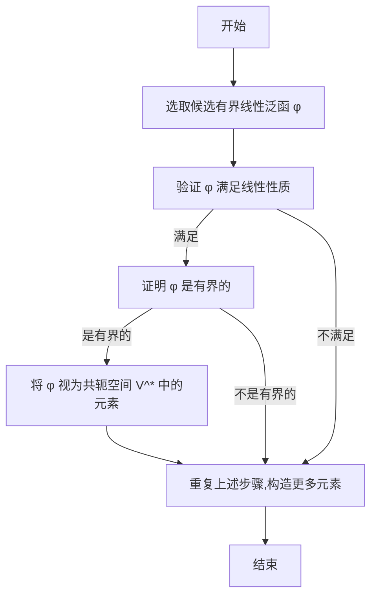

# 巴拿赫空间引论：共轭空间的定义及例（某些常用空间上有界线性泛函的表现形式）

## 1. 背景介绍

### 1.1 函数空间和线性泛函

在数学分析中,我们经常会遇到函数空间的概念。函数空间是由一些满足特定性质的函数所组成的集合,例如连续函数空间、可积函数空间等。这些函数空间通常被赋予一些代数结构,使其成为线性空间。

在研究函数空间时,线性泛函扮演着重要的角色。线性泛函是一种从线性空间到数域(通常是实数域或复数域)的线性映射。直观地说,线性泛函将一个函数映射为一个数值,并且满足线性性质。

### 1.2 有界线性泛函和共轭空间

在函数空间的研究中,我们经常会关注有界线性泛函,即那些映射范围有界的线性泛函。有界线性泛函具有许多重要的性质,例如它们在函数空间上构成了一个线性空间,称为共轭空间(dual space)。

共轭空间是一个抽象的概念,它为我们提供了一种研究和理解函数空间的新视角。通过研究共轭空间,我们可以更深入地了解函数空间的结构和性质,并且可以应用于许多数学领域,如泛函分析、偏微分方程等。

## 2. 核心概念与联系

### 2.1 线性空间和线性泛函

在讨论共轭空间之前,我们需要先了解线性空间和线性泛函的概念。

一个线性空间是一个非空集合,其中定义了两种代数运算:向量加法和数量乘法,并且满足一些代数运算律。常见的线性空间包括实数域上的有限维欧几里得空间、复数域上的有限维复空间、无限维函数空间等。

线性泛函是一种从线性空间到数域(通常是实数域或复数域)的映射,并且满足线性性质。具体来说,对于任意线性空间 $V$ 上的元素 $x,y$ 和任意标量 $\alpha,\beta$,线性泛函 $f$ 满足:

$$
\begin{aligned}
f(\alpha x + \beta y) &= \alpha f(x) + \beta f(y) \\
f(x + y) &= f(x) + f(y)
\end{aligned}
$$

线性泛函在函数空间的研究中扮演着重要的角色,因为它们可以将一个函数映射为一个数值,从而为我们研究函数空间提供了一种新的视角。

### 2.2 有界线性泛函和共轭空间

对于一个线性空间 $V$ 上的线性泛函 $f$,如果存在一个常数 $M > 0$,使得对于任意 $x \in V$,都有 $|f(x)| \leq M \|x\|$,那么我们称 $f$ 为有界线性泛函。其中 $\|x\|$ 表示 $x$ 在该线性空间中的范数。

有界线性泛函的集合在代数运算下也构成一个线性空间,我们将其称为原线性空间 $V$ 的共轭空间(dual space),记作 $V^*$。具体来说,对于任意 $f,g \in V^*$ 和任意标量 $\alpha,\beta$,我们定义:

$$
(\alpha f + \beta g)(x) = \alpha f(x) + \beta g(x), \quad \forall x \in V
$$

共轭空间 $V^*$ 中的元素就是原线性空间 $V$ 上的有界线性泛函。研究共轭空间可以帮助我们更深入地了解线性空间的结构和性质,并且在许多数学领域都有重要的应用。

### 2.3 共轭空间与原线性空间的关系

原线性空间 $V$ 和它的共轭空间 $V^*$ 之间存在着密切的联系。事实上,我们可以将原线性空间 $V$ 嵌入到它的双共轭空间 $V^{**}$ 中,从而建立起 $V$ 和 $V^*$ 之间的关系。

具体来说,对于任意 $x \in V$,我们可以定义一个映射 $\hat{x}: V^* \rightarrow \mathbb{F}$ (其中 $\mathbb{F}$ 表示数域,通常是实数域或复数域),使得:

$$
\hat{x}(f) = f(x), \quad \forall f \in V^*
$$

这个映射 $\hat{x}$ 实际上就是一个线性泛函,属于 $V^{**}$。我们将这种映射称为自然嵌入(natural embedding),它建立了 $V$ 和 $V^{**}$ 之间的同构关系。

通过自然嵌入,我们可以将 $V$ 视为 $V^{**}$ 的一个子空间。这种联系为我们研究共轭空间提供了一种有力的工具,因为我们可以利用 $V$ 和 $V^{**}$ 之间的同构关系来推导出 $V$ 和 $V^*$ 之间的一些性质。

## 3. 核心算法原理具体操作步骤

虽然共轭空间是一个抽象的概念,但是我们可以通过一些具体的算法来构造和研究共轭空间。下面我们将介绍一种常用的算法,用于计算某些特定函数空间上的有界线性泛函的表现形式。

### 3.1 算法描述

假设我们有一个函数空间 $V$,我们想要找出它的共轭空间 $V^*$ 中元素的具体表现形式。我们可以采用以下步骤:

1. 选取一个候选有界线性泛函 $\varphi$,它的形式通常是一个积分或者级数。
2. 验证 $\varphi$ 是否满足线性性质,即对于任意 $f,g \in V$ 和任意标量 $\alpha,\beta$,都有:
   $$
   \varphi(\alpha f + \beta g) = \alpha \varphi(f) + \beta \varphi(g)
   $$
3. 证明 $\varphi$ 是有界的,即存在一个常数 $M > 0$,使得对于任意 $f \in V$,都有:
   $$
   |\varphi(f)| \leq M \|f\|
   $$
   其中 $\|f\|$ 表示 $f$ 在该函数空间中的范数。
4. 如果上述条件都满足,那么 $\varphi$ 就是 $V^*$ 中的一个元素,我们得到了 $V^*$ 中元素的一种表现形式。
5. 重复上述步骤,尝试构造出更多 $V^*$ 中元素的表现形式。

需要注意的是,不同的函数空间可能需要采用不同的技巧来构造和证明有界线性泛函的存在性和有界性。下面我们将给出一些常用函数空间上有界线性泛函的具体例子。

### 3.2 算法流程图

## 4. 数学模型和公式详细讲解举例说明

在上一节中,我们介绍了构造共轭空间元素的一般算法。现在,我们将给出一些常用函数空间上有界线性泛函的具体例子,并详细讲解它们的数学模型和公式。

### 4.1 连续函数空间上的有界线性泛函

设 $C([a,b])$ 表示定义在闭区间 $[a,b]$ 上的连续函数空间,范数定义为:

$$
\|f\|_\infty = \max_{x \in [a,b]} |f(x)|
$$

对于任意 $\mu \in C([a,b])^*$,根据 Riesz 表示定理,存在唯一的 $g \in C([a,b])$,使得对于任意 $f \in C([a,b])$,有:

$$
\mu(f) = \int_a^b f(x) g(x) dx
$$

也就是说,在连续函数空间上,任意有界线性泛函都可以表示为与某个连续函数的内积。这个结果为我们研究连续函数空间提供了一种有力的工具。

### 4.2 Lebesgue 可积函数空间上的有界线性泛函

设 $L^p([a,b])$ 表示定义在区间 $[a,b]$ 上的 Lebesgue 可积函数空间,范数定义为:

$$
\|f\|_p = \left(\int_a^b |f(x)|^p dx\right)^{1/p}, \quad 1 \leq p < \infty
$$

对于任意 $\mu \in (L^p([a,b]))^*$,根据 Riesz 表示定理,存在唯一的 $g \in L^q([a,b])$,使得对于任意 $f \in L^p([a,b])$,有:

$$
\mu(f) = \int_a^b f(x) g(x) dx
$$

其中 $\frac{1}{p} + \frac{1}{q} = 1$。这个结果被称为 Hölder 不等式,它为我们研究 Lebesgue 可积函数空间提供了一种有力的工具。

### 4.3 Hilbert 空间上的有界线性泛函

设 $H$ 是一个 Hilbert 空间,范数定义为:

$$
\|f\| = \sqrt{\langle f, f \rangle}
$$

其中 $\langle \cdot, \cdot \rangle$ 表示 Hilbert 空间中的内积。

对于任意 $\mu \in H^*$,根据 Riesz 表示定理,存在唯一的 $g \in H$,使得对于任意 $f \in H$,有:

$$
\mu(f) = \langle f, g \rangle
$$

也就是说,在 Hilbert 空间上,任意有界线性泛函都可以表示为与某个元素的内积。这个结果为我们研究 Hilbert 空间提供了一种有力的工具。

### 4.4 示例:计算 $L^2([0,1])$ 上某些有界线性泛函的表现形式

考虑 $L^2([0,1])$ 空间,对于任意 $f \in L^2([0,1])$,定义:

$$
\varphi(f) = \int_0^1 f(x) dx
$$

我们可以验证 $\varphi$ 满足线性性质,并且由于 Hölder 不等式,我们有:

$$
|\varphi(f)| \leq \int_0^1 |f(x)| dx \leq \sqrt{\int_0^1 1^2 dx} \cdot \sqrt{\int_0^1 |f(x)|^2 dx} = \|f\|_2
$$

因此 $\varphi$ 是 $L^2([0,1])$ 上的一个有界线性泛函,属于 $(L^2([0,1]))^*$。

类似地,对于任意 $x_0 \in [0,1]$,定义:

$$
\varphi_{x_0}(f) = f(x_0)
$$

我们可以验证 $\varphi_{x_0}$ 也是 $L^2([0,1])$ 上的一个有界线性泛函。事实上,所有这样的 $\varphi_{x_0}$ 构成了 $(L^2([0,1]))^*$ 的一个子空间。

通过上述例子,我们可以看到,在具体的函数空间上,有界线性泛函可以具有不同的表现形式,例如积分形式或者函数值形式。掌握这些表现形式对于我们深入理解和研究共轭空间是非常有帮助的。

## 5. 项目实践:代码实例和详细解释说明

虽然共轭空间是一个抽象的数学概念,但是我们可以通过编程来实现一些相关的算法和计算。下面我们将给出一些 Python 代码示例,用于计算某些特定函数空间上有界线性泛函的表现形式。

### 5.1 连续函数空间上的有界线性泛函

我们先来实现一个计算连续函数空间 $C([a,b])$ 上有界线性泛函的函数。根据 Riesz 表示定理,任意有界线性泛函都可以表示为与某个连续函数的内积。因此,我们只需要计算出这个连续函数即可