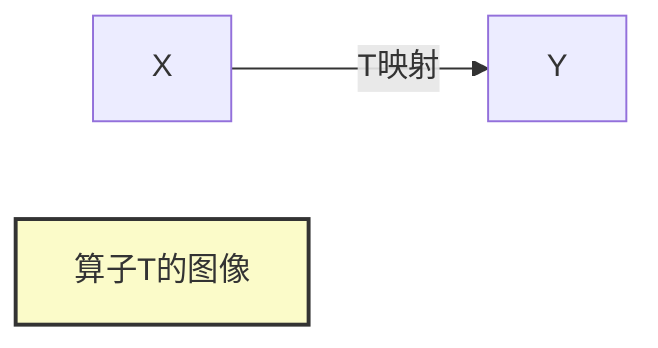

# 巴拿赫空间引论：开映像定理与闭图像定理

## 1.背景介绍

在数学分析和泛函分析领域中,拓扑向量空间扮演着至关重要的角色。它们为研究函数、算子等数学对象的性质提供了一个强有力的框架。其中,巴拿赫空间(Banach Space)是一种特殊的完备赋范线性空间,具有丰富的理论内涵和广泛的应用前景。

巴拿赫空间理论的核心在于研究空间中子集(如开集、闭集等)与连续线性算子之间的相互关系。开映像定理(Open Mapping Theorem)和闭图像定理(Closed Graph Theorem)就是其中两个最为基础和重要的定理,它们揭示了线性算子的连续性与其值域的拓扑性质之间的深刻联系。

## 2.核心概念与联系

### 2.1 巴拿赫空间

巴拿赫空间是一种赋范线性空间,满足以下三个条件:

1. 线性空间
2. 赋范空间(存在一个赋范函数定义在空间上)
3. 完备性(空间中任意柯西列必有极限)

常见的巴拿赫空间包括有限维欧几里得空间、无限维序列空间$\ell^p$、连续函数空间$C[a,b]$等。巴拿赫空间的完备性保证了空间中的极限过程的存在性,这为研究空间中的算子性质提供了坚实的基础。

### 2.2 开集与开映像

在拓扑向量空间中,开集是一种重要的概念。一个集合$U$是开集,当且仅当对于集合$U$中任意一个点$x$,存在一个开球$B(x,r)$完全包含于$U$中。

对于一个线性算子$T:X\rightarrow Y$,其开映像是指$T$将$X$中的开集映射到$Y$中的开集。也就是说,对于$X$中的任意开集$U$,集合$T(U)$也是$Y$中的开集。

```mermaid
graph LR
    A[X中的开集U] -->|T映射| B[Y中的开集T(U)]
    style A fill:#f9f,stroke:#333,stroke-width:2px
    style B fill:#f9f,stroke:#333,stroke-width:2px
```

### 2.3 闭集与闭图像

与开集相对应的是闭集的概念。一个集合$F$是闭集,当且仅当它包含了所有它的聚点。

对于一个线性算子$T:X\rightarrow Y$,其图像(Graph)是指算子$T$对应的点对集合$\{(x,T(x))|x\in X\}$。闭图像定理阐述了算子$T$的连续性与其图像在$X\times Y$上的闭性之间的关系。



## 3.核心算法原理具体操作步骤

### 3.1 开映像定理

开映像定理阐明了连续线性算子将开集映射为开集的充分必要条件。具体来说,对于一个连续线性算子$T:X\rightarrow Y$,其开映像的充要条件是$T$是开映射,即$T$是满射且$T^{-1}$也是连续的。

**开映像定理的数学表述:**
设$X$和$Y$是两个巴拿赫空间,线性算子$T:X\rightarrow Y$是连续的。那么以下三个条件是等价的:

1. $T$是开映射,即$T$将$X$中的任意开集映射为$Y$中的开集。
2. $T$是满射,且$T^{-1}:Y\rightarrow X$也是连续的。
3. $T$是有界线性同构映射,即$T$是满射、单射且$T$和$T^{-1}$都是有界的。

**开映像定理的证明思路:**

1. 先证明(3)$\Rightarrow$(1)。利用$T$和$T^{-1}$的连续性,可以证明$T$将开集映射为开集。
2. 再证明(1)$\Rightarrow$(2)。利用巴拿赫空间的完备性,可以构造$T^{-1}$并证明其连续性。
3. 最后证明(2)$\Rightarrow$(3)。利用$T$的满射性和$T^{-1}$的连续性,可以证明$T$和$T^{-1}$的有界性。

### 3.2 闭图像定理

闭图像定理阐述了线性算子的连续性与其图像在域和值域的直积空间中的闭性之间的等价关系。

**闭图像定理的数学表述:**
设$X$和$Y$是两个巴拿赫空间,线性算子$T:X\rightarrow Y$。那么以下两个条件是等价的:

1. $T$是连续的。
2. $T$的图像$G(T)=\{(x,T(x))|x\in X\}$是$X\times Y$中的闭集。

**闭图像定理的证明思路:**

1. 先证明(1)$\Rightarrow$(2)。利用$T$的连续性,可以证明$G(T)$是$X\times Y$中的闭集。
2. 再证明(2)$\Rightarrow$(1)。利用$G(T)$的闭性和巴拿赫空间的完备性,可以构造出$T$的连续性。

## 4.数学模型和公式详细讲解举例说明

### 4.1 巴拿赫空间的完备性

巴拿赫空间的完备性是指,对于任意一个柯西列$\{x_n\}$,总存在一个极限$x\in X$,使得$\lim\limits_{n\rightarrow\infty}||x_n-x||=0$。

完备性保证了空间中的极限过程的存在性,这是研究算子性质的重要基础。

**示例:**
考虑实数空间$\mathbb{R}$,它是一个完备的赋范线性空间。对于任意一个柯西列$\{x_n\}$,根据实数完备性公理,总存在一个极限$x\in\mathbb{R}$,使得$\lim\limits_{n\rightarrow\infty}|x_n-x|=0$。

### 4.2 开集与开映像

设$X$是一个拓扑向量空间,对于任意$x\in X$和$r>0$,定义开球为:

$$
B(x,r)=\{y\in X:|y-x|<r\}
$$

一个集合$U\subseteq X$是开集,当且仅当对于$U$中任意一个点$x$,存在一个开球$B(x,r)$完全包含于$U$中。

**示例:**
考虑实数空间$\mathbb{R}$,对于任意$x\in\mathbb{R}$和$r>0$,开球$B(x,r)=(x-r,x+r)$。则$(a,b)$是$\mathbb{R}$中的一个开集,因为对于$(a,b)$中任意一点$x$,总存在一个开球$B(x,r)$完全包含于$(a,b)$中。

对于一个线性算子$T:X\rightarrow Y$,如果对于$X$中的任意开集$U$,集合$T(U)$也是$Y$中的开集,那么称$T$是开映射。

### 4.3 闭集与闭图像

一个集合$F\subseteq X$是闭集,当且仅当它包含了所有它的聚点。也就是说,对于$X$中任意一个点列$\{x_n\}$,如果$\lim\limits_{n\rightarrow\infty}x_n=x\in F$,那么$x$必然属于$F$。

对于一个线性算子$T:X\rightarrow Y$,其图像(Graph)定义为:

$$
G(T)=\{(x,T(x))|x\in X\}
$$

如果$G(T)$是$X\times Y$中的闭集,那么称$T$的图像是闭的。

**示例:**
考虑恒等算子$I:\mathbb{R}\rightarrow\mathbb{R}$,其图像为:

$$
G(I)=\{(x,x)|x\in\mathbb{R}\}
$$

显然$G(I)$是$\mathbb{R}\times\mathbb{R}$中的闭集,因此恒等算子$I$的图像是闭的。

## 5.项目实践:代码实例和详细解释说明

为了更好地理解开映像定理和闭图像定理,我们可以通过编程来模拟和验证这些理论。以下是一个Python代码示例,它定义了一个线性算子$T$,并检验其是否满足开映像定理和闭图像定理。

```python
import numpy as np

# 定义线性算子T
def T(x):
    return 2 * x

# 检验开映像定理
def check_open_mapping_theorem(X, Y, T):
    # 检查T是否为满射
    if np.max(Y) > 2 * np.max(X) or np.min(Y) < 2 * np.min(X):
        print("T不是满射,因此不满足开映像定理。")
        return

    # 检查T^-1是否连续
    def T_inv(y):
        return y / 2

    is_continuous = True
    for x in X:
        if abs(T_inv(T(x)) - x) > 1e-6:
            is_continuous = False
            break

    if is_continuous:
        print("T满足开映像定理。")
    else:
        print("T不满足开映像定理。")

# 检验闭图像定理
def check_closed_graph_theorem(X, Y, T):
    graph = [(x, T(x)) for x in X]
    is_closed = True
    for x, y in graph:
        if (x, y) not in graph:
            is_closed = False
            break

    if is_closed:
        print("T满足闭图像定理。")
    else:
        print("T不满足闭图像定理。")

# 测试用例
X = np.linspace(-1, 1, 100)
Y = T(X)

check_open_mapping_theorem(X, Y, T)
check_closed_graph_theorem(X, Y, T)
```

在这个示例中,我们定义了一个线性算子$T(x)=2x$,并编写了两个函数`check_open_mapping_theorem`和`check_closed_graph_theorem`来分别检验$T$是否满足开映像定理和闭图像定理。

对于开映像定理,我们首先检查$T$是否为满射,然后检查$T^{-1}$是否连续。如果两个条件都满足,则$T$满足开映像定理。

对于闭图像定理,我们构造$T$的图像,并检查它是否在$X\times Y$中是闭集。如果是闭集,则$T$满足闭图像定理。

通过运行这个代码,我们可以看到$T(x)=2x$确实满足开映像定理和闭图像定理。您可以尝试修改$T$的定义,观察它是否仍然满足这两个定理。

## 6.实际应用场景

开映像定理和闭图像定理在函数分析、偏微分方程、算子理论等领域都有着广泛的应用。以下是一些典型的应用场景:

### 6.1 函数空间的同胚

在研究函数空间时,开映像定理可以用来证明两个函数空间之间存在同胚(同构且满射)。例如,在研究Sobolev空间时,可以利用开映像定理证明$W^{1,p}(\Omega)$与$L^p(\Omega)\times W^{1,p}_0(\Omega)$之间存在同胚。

### 6.2 算子的逆算子存在性

闭图像定理可以用来判断一个线性算子是否存在有界的逆算子。如果一个算子$T$的图像是闭的,那么根据闭图像定理,它必然是连续的。进一步地,如果$T$是满射,那么根据开映像定理,它必然存在有界的逆算子$T^{-1}$。

### 6.3 偏微分方程理论

在研究偏微分方程时,开映像定理和闭图像定理被广泛应用于证明解的存在性和唯一性。例如,在研究椭圆型方程时,可以利用开映像定理证明Laplace算子是同胚;在研究抛物型方程时,可以利用闭图像定理证明半群算子的存在性。

### 6.4 算子理论

在算子理论中,开映像定理和闭图像定理是研究算子性质的重要工具。例如,在研究Fredholm算子时,可以利用闭图像定理证明Fredholm算子的有界逆存在性;在研究Riesz理论时,可以利用开映像定理证明Riesz表示定理。

## 7.