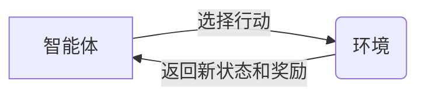

# 强化学习(Reinforcement Learning) - 原理与代码实例讲解

## 1. 背景介绍
强化学习（Reinforcement Learning, RL）是机器学习的一个重要分支，它在游戏、机器人控制、资源管理等众多领域展现出了巨大的潜力。与监督学习和无监督学习不同，强化学习关注如何基于环境给出的奖励或惩罚来进行学习，以达到某种目标。它的核心思想是智能体（agent）通过与环境（environment）的交互，学习选择最佳行动（action）以最大化累积奖励。

## 2. 核心概念与联系
在强化学习中，智能体、环境、状态（state）、行动、奖励（reward）和策略（policy）是核心概念。智能体在某一状态下执行行动，环境根据行动给出新的状态和奖励，智能体根据奖励来调整其策略。这个过程可以用以下Mermaid流程图表示：



## 3. 核心算法原理具体操作步骤
强化学习的核心算法包括但不限于Q学习（Q-Learning）、Sarsa、深度Q网络（Deep Q-Network, DQN）等。以Q学习为例，其操作步骤如下：

1. 初始化Q表格，为所有状态-行动对赋予初始值。
2. 选择一个行动，通常使用ε-贪婪策略。
3. 执行行动，观察奖励和新状态。
4. 更新Q值，根据奖励和最大化未来奖励的预期。
5. 如果未达到终止条件，返回步骤2。

## 4. 数学模型和公式详细讲解举例说明
Q学习的核心是Q函数的更新公式：

$$ Q(s_t, a_t) \leftarrow Q(s_t, a_t) + \alpha [r_{t+1} + \gamma \max_{a} Q(s_{t+1}, a) - Q(s_t, a_t)] $$

其中，$s_t$和$a_t$分别代表当前状态和行动，$r_{t+1}$是执行行动后获得的奖励，$\alpha$是学习率，$\gamma$是折扣因子，$\max_{a} Q(s_{t+1}, a)$代表下一个状态所有可能行动的最大Q值。

## 5. 项目实践：代码实例和详细解释说明
以一个简单的迷宫游戏为例，我们可以实现一个Q学习的强化学习智能体。代码如下：

```python
import numpy as np

# 初始化参数
gamma = 0.9  # 折扣因子
alpha = 0.1  # 学习率
num_episodes = 1000  # 训练回合数
max_steps_per_episode = 100  # 每回合最大步数

# 初始化Q表
Q = np.zeros((num_states, num_actions))

# 训练过程
for episode in range(num_episodes):
    state = env.reset()
    for step in range(max_steps_per_episode):
        action = choose_action(state, Q)  # ε-贪婪策略选择行动
        new_state, reward, done, info = env.step(action)
        # 更新Q表
        Q[state, action] = Q[state, action] + alpha * (reward + gamma * np.max(Q[new_state]) - Q[state, action])
        state = new_state
        if done:
            break
```

## 6. 实际应用场景
强化学习已被应用于多个领域，如自动驾驶、推荐系统、金融交易等。在自动驾驶中，智能体需要学习如何在复杂的交通环境中安全驾驶。在推荐系统中，智能体学习用户的偏好，以提供个性化的内容推荐。

## 7. 工具和资源推荐
- OpenAI Gym：提供多种环境的测试平台。
- TensorFlow和PyTorch：支持深度学习的强化学习算法实现。
- RLlib：强化学习库，提供分布式训练支持。

## 8. 总结：未来发展趋势与挑战
强化学习的未来发展趋势包括算法的进一步优化、多智能体系统、模拟与现实世界的结合等。挑战包括样本效率、稳定性和泛化能力的提升。

## 9. 附录：常见问题与解答
Q: 强化学习和监督学习有什么区别？
A: 强化学习是基于环境反馈的奖励或惩罚来学习，而监督学习是基于标签数据来学习。

Q: 如何选择合适的强化学习算法？
A: 需要根据具体问题的特点和需求来选择，例如状态空间的大小、是否需要考虑长期奖励等。

作者：禅与计算机程序设计艺术 / Zen and the Art of Computer Programming