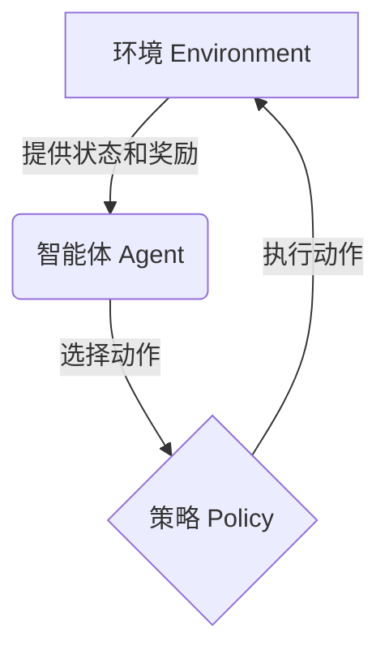
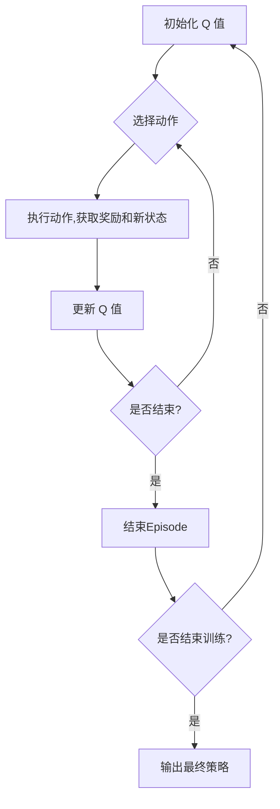

# 强化学习(Reinforcement Learning) - 原理与代码实例讲解

## 1.背景介绍

强化学习(Reinforcement Learning, RL)是机器学习的一个重要分支,它关注如何基于与环境的交互来学习行为策略,以最大化长期的累积奖励。与监督学习和无监督学习不同,强化学习没有给定的输入-输出数据集,而是通过与环境的反复试错来学习。

强化学习的思想源于行为主义心理学,它试图通过奖励和惩罚来塑造行为。在强化学习中,智能体(Agent)与环境(Environment)进行交互,根据当前状态执行动作,并从环境中获得反馈奖励。智能体的目标是学习一个最优策略,以最大化未来累积的奖励。

### 1.1 强化学习的关键要素

强化学习系统由以下几个关键要素组成:

- **智能体(Agent)**: 执行动作并与环境交互的决策实体。
- **环境(Environment)**: 智能体所处的外部世界,它根据智能体的动作提供下一个状态和奖励。
- **状态(State)**: 环境的当前情况,通常用一个向量表示。
- **动作(Action)**: 智能体在当前状态下可以执行的操作。
- **奖励(Reward)**: 环境对智能体当前动作的反馈,表示该动作的好坏程度。
- **策略(Policy)**: 智能体根据当前状态选择动作的规则或策略函数。
- **价值函数(Value Function)**: 评估一个状态或状态-动作对的长期累积奖励。

强化学习的目标是找到一个最优策略,使得在该策略下,智能体可以获得最大的长期累积奖励。

### 1.2 强化学习的应用场景

强化学习已被广泛应用于多个领域,包括但不限于:

- 机器人控制
- 游戏AI
- 自动驾驶
- 资源管理
- 金融交易
- 自然语言处理
- 计算机系统优化

任何需要基于经验学习并做出序列决策的问题,都可以使用强化学习方法进行建模和求解。

## 2.核心概念与联系

### 2.1 马尔可夫决策过程(Markov Decision Process, MDP)

强化学习问题通常建模为马尔可夫决策过程(MDP),它是一个离散时间的随机控制过程,具有以下特性:

- 离散的状态空间 $\mathcal{S}$
- 离散的动作空间 $\mathcal{A}$
- 状态转移概率 $\mathcal{P}_{ss'}^a = \mathbb{P}(S_{t+1}=s'|S_t=s, A_t=a)$
- 奖励函数 $\mathcal{R}_s^a = \mathbb{E}[R_{t+1}|S_t=s, A_t=a]$
- 折扣因子 $\gamma \in [0, 1)$,用于权衡当前奖励和未来奖励的重要性

MDP的核心思想是,在当前状态下执行某个动作,将会影响未来状态的概率分布和即时奖励。智能体的目标是找到一个最优策略 $\pi^*$,使得期望的累积折扣奖励最大化:

$$
\pi^* = \arg\max_\pi \mathbb{E}_\pi \left[ \sum_{t=0}^\infty \gamma^t R_{t+1} \right]
$$

其中,期望是关于状态序列 $S_0, A_0, S_1, A_1, \dots$ 的分布取的。

### 2.2 价值函数(Value Function)

价值函数用于评估一个状态或状态-动作对的长期累积奖励。它是强化学习中最核心的概念之一。

- 状态价值函数 $V^\pi(s)$: 在策略 $\pi$ 下,从状态 $s$ 开始,期望获得的累积折扣奖励:

$$
V^\pi(s) = \mathbb{E}_\pi \left[ \sum_{t=0}^\infty \gamma^t R_{t+1} | S_0 = s \right]
$$

- 状态-动作价值函数 $Q^\pi(s, a)$: 在策略 $\pi$ 下,从状态 $s$ 执行动作 $a$ 开始,期望获得的累积折扣奖励:

$$
Q^\pi(s, a) = \mathbb{E}_\pi \left[ \sum_{t=0}^\infty \gamma^t R_{t+1} | S_0 = s, A_0 = a \right]
$$

价值函数满足贝尔曼方程(Bellman Equation),这是强化学习算法的核心基础。

### 2.3 策略迭代(Policy Iteration)与价值迭代(Value Iteration)

策略迭代和价值迭代是求解MDP的两种经典算法:

- 策略迭代:
    1. 初始化一个随机策略 $\pi_0$
    2. 对当前策略 $\pi_i$ 求解其价值函数 $V^{\pi_i}$ (策略评估)
    3. 基于 $V^{\pi_i}$ 更新策略 $\pi_{i+1}$ 使其改善 (策略改善)
    4. 重复步骤2-3,直到收敛到最优策略 $\pi^*$

- 价值迭代:
    1. 初始化一个任意的价值函数 $V_0$
    2. 更新价值函数 $V_{i+1}$ 使其满足贝尔曼最优方程 (价值迭代更新)
    3. 重复步骤2,直到收敛到最优价值函数 $V^*$
    4. 从 $V^*$ 导出最优策略 $\pi^*$

策略迭代和价值迭代都能收敛到最优策略,但它们在计算效率和收敛速度上有所不同。

## 3.核心算法原理具体操作步骤

### 3.1 Q-Learning

Q-Learning是强化学习中最著名和最成功的算法之一。它属于无模型算法,不需要事先了解MDP的转移概率和奖励函数,而是通过与环境交互来直接学习最优的状态-动作价值函数 $Q^*(s, a)$。

Q-Learning的算法步骤如下:

1. 初始化 $Q(s, a)$ 为任意值 (通常为0)
2. 对每个Episode:
    - 初始化状态 $S$
    - 对每个时间步:
        - 选择动作 $A$ (通常使用 $\epsilon$-贪婪策略)
        - 执行动作 $A$,观察奖励 $R$ 和新状态 $S'$
        - 更新 $Q(S, A)$ 值:
        
        $$
        Q(S, A) \leftarrow Q(S, A) + \alpha \left[ R + \gamma \max_a Q(S', a) - Q(S, A) \right]
        $$
        
        其中 $\alpha$ 是学习率, $\gamma$ 是折扣因子
        - $S \leftarrow S'$
    - 直到Episode结束

Q-Learning算法的关键在于,它使用时序差分(Temporal Difference, TD)目标来更新Q值,TD目标包含了即时奖励 $R$ 和下一状态的最大Q值 $\max_a Q(S', a)$。通过不断缩小TD误差,Q值将收敛到最优值 $Q^*(s, a)$。

### 3.2 Deep Q-Network (DQN)

传统的Q-Learning算法在处理大规模状态空间时会遇到维数灾难的问题。Deep Q-Network (DQN) 通过使用深度神经网络来近似Q函数,从而能够处理高维连续状态空间。

DQN算法的核心思想是使用一个神经网络 $Q(s, a; \theta)$ 来近似 $Q^*(s, a)$,其中 $\theta$ 是网络的参数。算法步骤如下:

1. 初始化网络参数 $\theta$
2. 初始化经验回放池 $\mathcal{D}$
3. 对每个Episode:
    - 初始化状态 $S$
    - 对每个时间步:
        - 选择动作 $A = \arg\max_a Q(S, a; \theta)$ (通常使用 $\epsilon$-贪婪策略)
        - 执行动作 $A$,观察奖励 $R$ 和新状态 $S'$
        - 存储 $(S, A, R, S')$ 到 $\mathcal{D}$
        - 从 $\mathcal{D}$ 中采样一批数据 $(S_j, A_j, R_j, S_j')$
        - 计算TD目标 $y_j = R_j + \gamma \max_{a'} Q(S_j', a'; \theta^-)$
        - 优化网络参数 $\theta$ 使得 $\sum_j (y_j - Q(S_j, A_j; \theta))^2$ 最小化
        - $S \leftarrow S'$
    - 直到Episode结束

DQN算法引入了两个关键技术:

1. **经验回放池(Experience Replay)**: 将智能体的经验存储在一个池子中,并从中随机采样数据进行训练,打破了数据之间的相关性,提高了数据利用效率。
2. **目标网络(Target Network)**: 使用一个独立的目标网络 $Q(s, a; \theta^-)$ 来计算TD目标,其参数 $\theta^-$ 是主网络参数 $\theta$ 的滞后值,提高了算法的稳定性。

DQN算法在多个复杂的环境中取得了卓越的表现,如Atari游戏等,开创了深度强化学习的新纪元。

## 4.数学模型和公式详细讲解举例说明

### 4.1 马尔可夫决策过程(MDP)

马尔可夫决策过程是强化学习问题的数学模型,由一个五元组 $(\mathcal{S}, \mathcal{A}, \mathcal{P}, \mathcal{R}, \gamma)$ 定义:

- $\mathcal{S}$ 是有限的离散状态空间
- $\mathcal{A}$ 是有限的离散动作空间
- $\mathcal{P}_{ss'}^a = \mathbb{P}(S_{t+1}=s'|S_t=s, A_t=a)$ 是状态转移概率
- $\mathcal{R}_s^a = \mathbb{E}[R_{t+1}|S_t=s, A_t=a]$ 是奖励函数
- $\gamma \in [0, 1)$ 是折扣因子

在MDP中,智能体在时间步 $t$ 处于状态 $S_t$,执行动作 $A_t$,然后转移到新状态 $S_{t+1}$,并获得即时奖励 $R_{t+1}$。状态转移和奖励分布由 $\mathcal{P}$ 和 $\mathcal{R}$ 决定。

智能体的目标是找到一个最优策略 $\pi^*$,使得期望的累积折扣奖励最大化:

$$
\pi^* = \arg\max_\pi \mathbb{E}_\pi \left[ \sum_{t=0}^\infty \gamma^t R_{t+1} \right]
$$

其中,期望是关于状态序列 $S_0, A_0, S_1, A_1, \dots$ 的分布取的。

### 4.2 价值函数(Value Function)

价值函数用于评估一个状态或状态-动作对的长期累积奖励。

- 状态价值函数 $V^\pi(s)$:

$$
V^\pi(s) = \mathbb{E}_\pi \left[ \sum_{t=0}^\infty \gamma^t R_{t+1} | S_0 = s \right]
$$

它表示在策略 $\pi$ 下,从状态 $s$ 开始,期望获得的累积折扣奖励。

- 状态-动作价值函数 $Q^\pi(s, a)$:

$$
Q^\pi(s, a) = \mathbb{E}_\pi \left[ \sum_{t=0}^\infty \gamma^t R_{t+1} | S_0 = s, A_0 = a \right]
$$

它表示在策略 $\pi$ 下,从状态 $s$ 执行动作 $a$ 开始,期望获得的累积折扣奖励。

价值函数满足贝尔曼方程(Bell