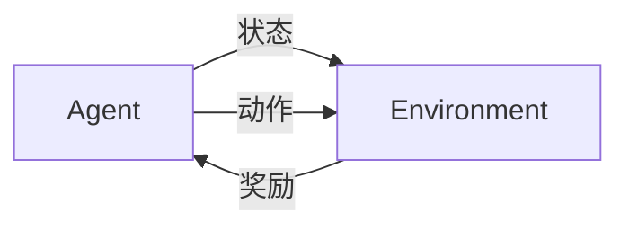

# 强化学习Reinforcement Learning探索与利用策略深度剖析

## 1. 背景介绍
### 1.1 强化学习的起源与发展
### 1.2 强化学习的定义与特点
### 1.3 强化学习的应用领域

## 2. 核心概念与联系
### 2.1 马尔可夫决策过程(MDP)
#### 2.1.1 状态空间、动作空间、转移概率和奖励函数
#### 2.1.2 最优策略与值函数
### 2.2 探索与利用的平衡
#### 2.2.1 探索的必要性
#### 2.2.2 利用的重要性
#### 2.2.3 探索与利用的权衡
### 2.3 值函数近似
#### 2.3.1 值函数的概念
#### 2.3.2 值函数近似的方法
### 2.4 策略梯度方法
#### 2.4.1 策略梯度定理
#### 2.4.2 REINFORCE算法

## 3. 核心算法原理具体操作步骤
### 3.1 Q-learning算法
#### 3.1.1 Q-learning的更新规则
#### 3.1.2 Q-learning的收敛性证明
#### 3.1.3 Q-learning的伪代码
### 3.2 SARSA算法
#### 3.2.1 SARSA的更新规则
#### 3.2.2 SARSA与Q-learning的区别
#### 3.2.3 SARSA的伪代码
### 3.3 DQN算法
#### 3.3.1 DQN的网络结构
#### 3.3.2 DQN的损失函数
#### 3.3.3 DQN的目标网络
#### 3.3.4 DQN的经验回放
### 3.4 策略梯度算法
#### 3.4.1 REINFORCE算法的具体步骤
#### 3.4.2 Actor-Critic算法
#### 3.4.3 A3C算法

## 4. 数学模型和公式详细讲解举例说明
### 4.1 MDP的数学定义
#### 4.1.1 状态转移概率矩阵
#### 4.1.2 奖励函数的数学表示
#### 4.1.3 折扣因子的意义
### 4.2 Bellman方程
#### 4.2.1 状态值函数的Bellman方程
#### 4.2.2 动作值函数的Bellman方程
#### 4.2.3 最优Bellman方程
### 4.3 策略梯度定理的推导
#### 4.3.1 期望奖励的梯度
#### 4.3.2 对数似然梯度
### 4.4 探索与利用的数学描述
#### 4.4.1 ε-greedy策略
#### 4.4.2 softmax探索
#### 4.4.3 UCB算法

## 5. 项目实践：代码实例和详细解释说明
### 5.1 Q-learning算法在网格世界环境中的应用
#### 5.1.1 网格世界环境的构建
#### 5.1.2 Q-learning算法的代码实现
#### 5.1.3 训练过程可视化与分析
### 5.2 DQN算法在Atari游戏中的应用  
#### 5.2.1 Atari游戏环境的搭建
#### 5.2.2 DQN算法的PyTorch实现
#### 5.2.3 超参数调优与训练结果分析
### 5.3 REINFORCE算法在连续控制任务中的应用
#### 5.3.1 连续控制任务的环境介绍
#### 5.3.2 REINFORCE算法的代码实现
#### 5.3.3 训练结果与策略可视化

## 6. 实际应用场景
### 6.1 智能交通系统中的信号灯控制
### 6.2 推荐系统中的在线学习
### 6.3 机器人控制中的运动规划
### 6.4 电商平台中的在线广告投放
### 6.5 自动驾驶中的决策控制

## 7. 工具和资源推荐
### 7.1 强化学习框架
#### 7.1.1 OpenAI Gym
#### 7.1.2 DeepMind Control Suite
#### 7.1.3 MuJoCo
### 7.2 深度学习库
#### 7.2.1 TensorFlow
#### 7.2.2 PyTorch
### 7.3 强化学习竞赛平台
#### 7.3.1 OpenAI Retro Contest
#### 7.3.2 NIPS 强化学习竞赛
### 7.4 强化学习论文与教程
#### 7.4.1 Richard S. Sutton的《Reinforcement Learning: An Introduction》
#### 7.4.2 David Silver的强化学习课程
#### 7.4.3 BAIR的Deep Reinforcement Learning课程

## 8. 总结：未来发展趋势与挑战
### 8.1 强化学习的研究热点
#### 8.1.1 基于模型的强化学习
#### 8.1.2 分层强化学习
#### 8.1.3 元强化学习
#### 8.1.4 多智能体强化学习
### 8.2 强化学习面临的挑战
#### 8.2.1 样本效率问题
#### 8.2.2 奖励稀疏问题
#### 8.2.3 探索的困难
#### 8.2.4 泛化能力不足
### 8.3 强化学习的发展前景
#### 8.3.1 与计算机视觉、自然语言处理等领域的结合
#### 8.3.2 强化学习在工业界的应用前景
#### 8.3.3 通用人工智能的实现

## 9. 附录：常见问题与解答
### 9.1 强化学习与监督学习、非监督学习的区别是什么？
### 9.2 强化学习主要应用在哪些领域？
### 9.3 强化学习算法的收敛性如何证明？
### 9.4 如何权衡探索与利用？
### 9.5 深度强化学习需要大量的样本，如何提高样本效率？

强化学习是一种机器学习范式，它研究如何让智能体（agent）在与环境（environment）的交互中学习最优策略，以获得最大的累积奖励。与监督学习和非监督学习不同，强化学习不需要预先准备好标注数据，而是通过探索环境、获得奖励反馈来学习。

强化学习的数学基础是马尔可夫决策过程（Markov Decision Process, MDP）。MDP可以用一个五元组 $(S,A,P,R,\gamma)$ 来描述：

- 状态空间 $S$：智能体所处的环境状态集合。
- 动作空间 $A$：智能体可以采取的动作集合。
- 状态转移概率 $P$：在状态 $s$ 下采取动作 $a$ 后转移到状态 $s'$ 的概率，即 $P(s'|s,a)$。
- 奖励函数 $R$：在状态 $s$ 下采取动作 $a$ 后获得的即时奖励，即 $R(s,a)$。
- 折扣因子 $\gamma$：用于衡量未来奖励的重要性，$\gamma \in [0,1]$。

强化学习的目标是学习一个策略 $\pi$，使得智能体在与环境交互的过程中获得最大的期望累积奖励。期望累积奖励可以表示为：

$$
J(\pi) = \mathbb{E}_{\pi} \left[ \sum_{t=0}^{\infty} \gamma^t R(s_t,a_t) \right]
$$

其中，$s_t$ 和 $a_t$ 分别表示在时刻 $t$ 的状态和动作。

为了实现最大化期望累积奖励的目标，强化学习算法通常基于值函数（value function）或策略梯度（policy gradient）来更新策略。

值函数刻画了在状态 $s$ 下采取策略 $\pi$ 的期望累积奖励，分为状态值函数和动作值函数两种：

- 状态值函数：$V^{\pi}(s) = \mathbb{E}_{\pi} \left[ \sum_{t=0}^{\infty} \gamma^t R(s_t,a_t) | s_0=s \right]$
- 动作值函数：$Q^{\pi}(s,a) = \mathbb{E}_{\pi} \left[ \sum_{t=0}^{\infty} \gamma^t R(s_t,a_t) | s_0=s, a_0=a \right]$

值函数满足Bellman方程：

$$
V^{\pi}(s) = \sum_{a} \pi(a|s) \sum_{s'} P(s'|s,a) \left[ R(s,a) + \gamma V^{\pi}(s') \right]
$$

$$
Q^{\pi}(s,a) = \sum_{s'} P(s'|s,a) \left[ R(s,a) + \gamma \sum_{a'} \pi(a'|s') Q^{\pi}(s',a') \right]
$$

基于值函数的强化学习算法，如Q-learning和SARSA，通过不断更新值函数来逼近最优策略。以Q-learning为例，其更新规则为：

$$
Q(s,a) \leftarrow Q(s,a) + \alpha \left[ R(s,a) + \gamma \max_{a'} Q(s',a') - Q(s,a) \right]
$$

其中，$\alpha$ 是学习率。

而策略梯度方法直接对策略函数进行参数化，并通过梯度上升来更新策略参数。根据策略梯度定理，策略梯度可以表示为：

$$
\nabla_{\theta} J(\pi_{\theta}) = \mathbb{E}_{\pi_{\theta}} \left[ \sum_{t=0}^{\infty} \gamma^t \nabla_{\theta} \log \pi_{\theta}(a_t|s_t) Q^{\pi_{\theta}}(s_t,a_t) \right]
$$

其中，$\theta$ 是策略函数的参数。

在实际应用中，为了平衡探索（exploration）和利用（exploitation），常用的探索策略有 $\epsilon$-greedy 和 softmax 探索。$\epsilon$-greedy 策略以 $\epsilon$ 的概率随机选择动作，以 $1-\epsilon$ 的概率选择当前价值最高的动作。softmax 探索则根据动作的价值计算选择概率，价值越高的动作被选择的概率越大。

除了传统的表格型方法，深度强化学习将深度神经网络引入强化学习，用于逼近值函数或策略函数。代表性的算法包括DQN（Deep Q-Network）、DDPG（Deep Deterministic Policy Gradient）、A3C（Asynchronous Advantage Actor-Critic）等。这些算法在Atari游戏、机器人控制等领域取得了显著的成果。

强化学习的一个重要挑战是探索与利用的平衡问题。过多的探索会导致学习效率低下，而过多的利用则可能使智能体陷入局部最优。为了更好地权衡探索与利用，研究者提出了一些高级探索策略，如Upper Confidence Bound（UCB）算法和Thompson采样等。

另一个挑战是样本效率问题。由于强化学习需要大量的与环境交互的样本数据，因此提高样本效率十分重要。解决思路包括基于模型的强化学习、元强化学习、分层强化学习等。

强化学习作为一种通用的智能优化方法，在智能交通、推荐系统、机器人控制、广告投放、自动驾驶等领域有广泛的应用前景。未来强化学习将与计算机视觉、自然语言处理等领域深度结合，推动人工智能在更多领域的落地应用。同时，多智能体强化学习、元强化学习等前沿方向的研究，有望为实现通用人工智能铺平道路。

作者：禅与计算机程序设计艺术 / Zen and the Art of Computer Programming