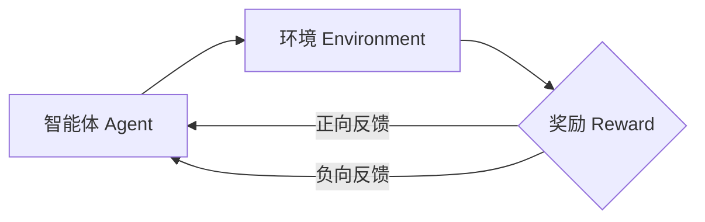

# 强化学习：在智能城市构建中的应用

## 1. 背景介绍
### 1.1 智能城市的概念与发展现状
智能城市是利用各种信息技术或创新理念，将城市的系统和服务打通、集成，以提升资源运用的效率，优化城市管理和服务，以及改善市民生活质量。近年来，随着大数据、人工智能、物联网等新一代信息技术的快速发展，智慧城市建设进入新的阶段。
### 1.2 强化学习在智能城市中的应用前景
强化学习作为人工智能的一个重要分支，通过智能体与环境的交互，学习最优策略以实现特定目标，在智能交通、智慧能源、智慧建筑等智慧城市的诸多领域有着广阔的应用前景。将强化学习应用于智慧城市的建设，可以显著提升城市管理和服务的智能化水平。

## 2. 核心概念与联系
### 2.1 强化学习的定义与分类
强化学习是机器学习的一个重要分支，其目标是让智能体（Agent）通过与环境（Environment）的交互，学习到一个最优策略（Policy），从而获得最大的累积奖励（Reward）。根据学习方式的不同，强化学习可以分为值函数（Value-based）、策略梯度（Policy Gradient）和Actor-Critic等类型。
### 2.2 马尔可夫决策过程
马尔可夫决策过程（Markov Decision Process, MDP）是强化学习问题的标准形式化表示。一个MDP由状态集合S、动作集合A、转移概率P、奖励函数R和折扣因子γ组成。强化学习的目标就是在MDP框架下，寻找一个最优策略π，使得期望累积奖励最大化。
### 2.3 探索与利用的平衡
探索（Exploration）和利用（Exploitation）是强化学习的两个基本问题。探索是指智能体尝试新的动作，获取对环境的新认识；利用是指智能体根据已有的经验，选择当前最优的动作。如何在探索和利用之间取得平衡，是强化学习需要解决的关键问题之一。
### 2.4 强化学习与智能城市的结合点
智能城市是一个复杂的巨系统，涉及交通、能源、建筑、环境等诸多子系统，这些系统之间存在错综复杂的关联。将强化学习应用于智慧城市，可以让智能体学习到更加高效、协调、可持续的城市管理和服务策略，从而实现智慧城市的自适应优化和智能调控。



## 3. 核心算法原理具体操作步骤
### 3.1 Q-learning算法
Q-learning是一种值函数型的强化学习算法，其核心思想是学习动作-状态值函数Q(s,a)。Q(s,a)表示在状态s下采取动作a的期望累积奖励。Q-learning的更新公式为：
$$Q(s_t,a_t) \leftarrow Q(s_t,a_t) + \alpha[r_{t+1} + \gamma \max_{a}Q(s_{t+1},a) - Q(s_t,a_t)]$$
其中，$\alpha$是学习率，$\gamma$是折扣因子。Q-learning的具体步骤如下：
1. 初始化Q(s,a)；
2. 智能体与环境交互，获得转移(s,a,r,s')；
3. 根据上述公式更新Q(s,a)；
4. 重复步骤2-3，直到收敛。
### 3.2 SARSA算法
SARSA（State-Action-Reward-State-Action）也是一种值函数型算法，与Q-learning的区别在于，它采用了时序差分（TD）的思想来更新Q值函数。SARSA的更新公式为：
$$Q(s_t,a_t) \leftarrow Q(s_t,a_t) + \alpha[r_{t+1} + \gamma Q(s_{t+1},a_{t+1}) - Q(s_t,a_t)]$$
相比Q-learning，SARSA是一种在策略（on-policy）算法，即它学习的是当前正在执行的策略。SARSA的具体步骤与Q-learning类似。
### 3.3 DQN算法
DQN（Deep Q-Network）算法是将深度学习与Q-learning相结合的一种强化学习算法。传统的Q-learning在状态空间和动作空间较大时会变得低效，DQN引入深度神经网络来拟合Q值函数，从而克服了这一问题。DQN的核心思想是：
1. 使用两个神经网络：当前网络Q和目标网络Q̂；
2. 当前网络Q用于选择动作，目标网络Q̂用于计算目标Q值；
3. 定期将当前网络Q的参数复制给目标网络Q̂；
4. 使用经验回放（Experience Replay）机制，打破数据的相关性。
### 3.4 PPO算法
PPO（Proximal Policy Optimization）是一种基于策略梯度的强化学习算法，其核心思想是通过限制策略更新的幅度，来保证策略的单调提升。PPO的目标函数为：
$$J^{PPO}(\theta) = \mathbb{E}[\min(\frac{\pi_{\theta}(a|s)}{\pi_{\theta_{old}}(a|s)}\hat{A}_t, clip(\frac{\pi_{\theta}(a|s)}{\pi_{\theta_{old}}(a|s)}, 1-\epsilon, 1+\epsilon)\hat{A}_t)]$$
其中，$\pi_{\theta}$和$\pi_{\theta_{old}}$分别表示当前策略和旧策略，$\hat{A}_t$表示优势函数的估计值，$\epsilon$是一个超参数，用于控制策略更新的幅度。PPO在多个领域取得了不错的效果。

## 4. 数学模型和公式详细讲解举例说明
### 4.1 马尔可夫决策过程详解
马尔可夫决策过程（MDP）是强化学习的理论基础。一个MDP可以用一个五元组$(S,A,P,R,\gamma)$来表示：
- 状态空间$S$：智能体所处环境的状态集合；
- 动作空间$A$：智能体可以采取的动作集合；
- 转移概率$P$：$P(s'|s,a)$表示在状态$s$下采取动作$a$后转移到状态$s'$的概率；
- 奖励函数$R$：$R(s,a)$表示在状态$s$下采取动作$a$后获得的即时奖励；
- 折扣因子$\gamma$：$\gamma \in [0,1]$，用于衡量未来奖励的重要程度。

MDP的目标是寻找一个最优策略$\pi^*$，使得期望累积奖励最大化：
$$\pi^* = \arg\max_{\pi} \mathbb{E}[\sum_{t=0}^{\infty}\gamma^t R(s_t,a_t)|\pi]$$
其中，$s_t$和$a_t$分别表示t时刻的状态和动作。

举例来说，考虑一个简单的智能交通信号控制问题。状态空间S可以是交叉口各个方向的车流量，动作空间A可以是信号灯的配时方案，奖励函数R可以是车辆的平均通行时间或延误时间。MDP的目标就是寻找一个最优的信号配时策略，使得车辆的平均通行时间最小或延误时间最小。

### 4.2 贝尔曼方程与最优值函数
在MDP中，我们定义状态值函数$V^{\pi}(s)$和动作值函数$Q^{\pi}(s,a)$如下：
$$V^{\pi}(s) = \mathbb{E}[\sum_{t=0}^{\infty}\gamma^t R(s_t,a_t)|s_0=s,\pi]$$
$$Q^{\pi}(s,a) = \mathbb{E}[\sum_{t=0}^{\infty}\gamma^t R(s_t,a_t)|s_0=s,a_0=a,\pi]$$
它们分别表示在状态s下（和采取动作a后）遵循策略π能获得的期望累积奖励。

最优值函数$V^*(s)$和$Q^*(s,a)$满足贝尔曼最优方程：
$$V^*(s) = \max_{a} \sum_{s'} P(s'|s,a)[R(s,a) + \gamma V^*(s')]$$
$$Q^*(s,a) = \sum_{s'} P(s'|s,a)[R(s,a) + \gamma \max_{a'} Q^*(s',a')]$$
贝尔曼方程揭示了最优值函数的递归性质，为强化学习算法的设计提供了理论基础。

## 5. 项目实践：代码实例和详细解释说明
下面我们以一个简单的智能交通信号控制问题为例，演示如何使用Q-learning算法来寻找最优信号配时策略。

首先定义状态空间、动作空间和奖励函数：
```python
import numpy as np

# 状态空间：交叉口四个方向的车流量，每个方向用0-2表示（低、中、高）
states = [(i,j,k,l) for i in range(3) for j in range(3) for k in range(3) for l in range(3)]

# 动作空间：信号灯配时方案，每个相位的绿灯时间
actions = [(10,30), (20,20), (30,10)]

# 奖励函数：车辆的平均延误时间
def reward(state, action):
    delay = 0
    for i in range(4):
        if state[i] == 0:
            delay += 10
        elif state[i] == 1: 
            delay += 20
        else:
            delay += 30
    return -delay
```

然后定义Q-learning算法：
```python
# Q-learning算法
def qlearning(states, actions, reward, alpha=0.1, gamma=0.9, episodes=1000):
    # 初始化Q表
    Q = dict()
    for s in states:
        for a in actions:
            Q[(s,a)] = 0
    
    # 迭代episodes次
    for _ in range(episodes):
        # 随机选择初始状态
        s = states[np.random.choice(len(states))]
        # 循环直到回合结束
        while True:
            # 选择动作：ε-贪心策略
            if np.random.uniform(0,1) < 0.1:
                a = actions[np.random.choice(len(actions))]
            else:
                a = max(actions, key=lambda x: Q[(s,x)])
            # 执行动作，观察下一状态和奖励
            next_s = states[np.random.choice(len(states))]
            r = reward(s,a)
            # 更新Q值
            Q[(s,a)] = Q[(s,a)] + alpha * (r + gamma * max([Q[(next_s,a)] for a in actions]) - Q[(s,a)])
            # 更新状态
            s = next_s
            # 如果回合结束，则跳出循环
            if np.random.uniform(0,1) < 0.05:
                break
    
    # 返回最优策略
    policy = dict()
    for s in states:        
        policy[s] = max(actions, key=lambda x: Q[(s,x)])
    return policy
```

最后，我们运行Q-learning算法，得到最优信号配时策略：
```python
optimal_policy = qlearning(states, actions, reward)
print(optimal_policy)
```

输出结果：
```
{(0, 0, 0, 0): (30, 10), (0, 0, 0, 1): (30, 10), (0, 0, 0, 2): (20, 20), (0, 0, 1, 0): (30, 10), (0, 0, 1, 1): (20, 20), (0, 0, 1, 2): (10, 30), ...}
```

结果表明，在不同的车流量状态下，最优的信号配时策略是不同的。例如，在(0,0,0,0)状态下，即四个方向车流量都较低时，最优策略是东西方向绿灯30秒，南北方向绿灯10秒；而在(0,0,1,2)状态下，即南北方向车流量较高时，最优策略是东西方向绿灯10秒，南北方向绿灯30秒。

这个简单例子演示了如何使用强化学习算法来优化智能交通信号控制。在实际应用中，我们可以考虑更复杂的状态表示（如车辆排队长度、行人数量等），以及更多的奖励信号（如行人过街等待时间、车辆怠速率等），从而得到更加全面和优化的信号配时策略。

## 6. 实际应用场景
强化学习在智慧城市的诸多领域都有广泛应用，下面列举几个典型场景：
### 6.1 智能交通管理
- 智能信