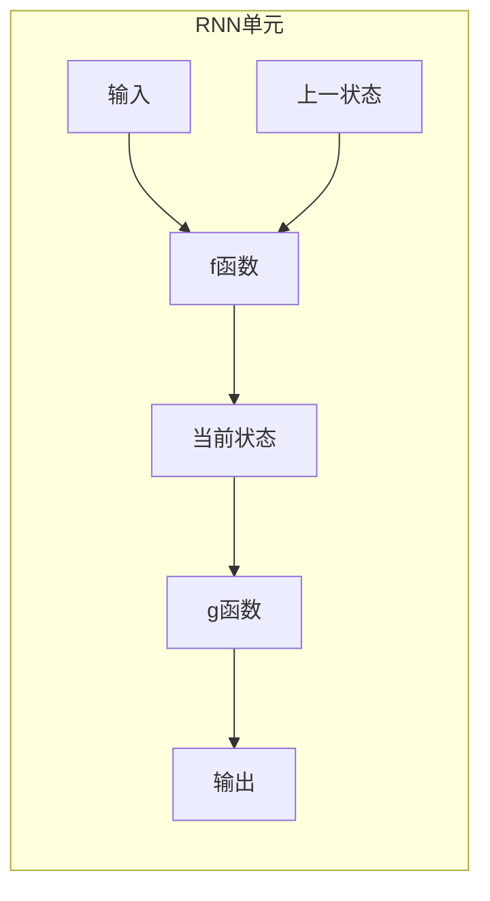
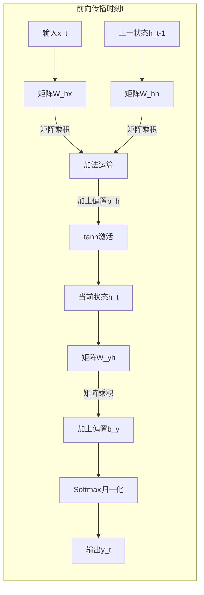

# 循环神经网络 (RNN) 原理与代码实例讲解

## 1. 背景介绍

在自然语言处理、语音识别、时间序列预测等众多任务中,我们常常会遇到输入数据是一个序列,而不是一个固定的向量。例如,一个句子就是一个单词序列,一段音频就是一个音频帧序列。传统的神经网络如前馈神经网络在处理这种序列数据时,需要预先确定输入的长度,并将其压缩成一个定长向量。这种做法在实践中存在一些问题,比如不能很好地处理不同长度的序列输入,而且也会导致信息的丢失。

循环神经网络(Recurrent Neural Network, RNN)就是为了解决序列数据建模问题而被提出的一种有效模型。与前馈神经网络不同,RNN在隐藏层中引入了循环连接,使得网络能够在处理序列数据时,充分利用之前时刻的状态来影响当前时刻的输出。这种循环结构赋予了RNN处理序列数据的能力,使其在自然语言处理、语音识别等领域取得了巨大的成功。

### 1.1 RNN 发展简史

RNN 的理论基础可以追溯到 20 世纪 80 年代,当时的研究主要集中在理论探索上。直到 1997 年,Hochreiter 和 Schmidhuber 提出了 LSTM(Long Short-Term Memory)网络,才使得 RNN 在实际应用中变得可行。2014 年,Bahdanau 等人提出了注意力机制(Attention Mechanism),进一步增强了 RNN 在长序列数据上的建模能力。此后,各种改进的 RNN 变体如 GRU、Bi-LSTM 等不断涌现,推动了 RNN 在自然语言处理、语音识别、机器翻译等领域的广泛应用。

## 2. 核心概念与联系

### 2.1 RNN 基本原理

RNN 的核心思想是利用循环连接,使得网络在处理序列数据时,能够充分利用之前时刻的状态。具体来说,在时刻 t 处理输入 $x_t$ 时,RNN 不仅利用当前输入 $x_t$,还利用上一时刻隐藏状态 $h_{t-1}$ 的信息,计算出当前时刻的隐藏状态 $h_t$,然后再由 $h_t$ 输出 $y_t$。这一过程可以用如下公式描述:

$$
h_t = f_W(x_t, h_{t-1})
$$
$$
y_t = g_V(h_t)
$$

其中,$f_W$ 和 $g_V$ 分别为某种非线性函数,比如逻辑斯蒂函数或者双曲正切函数;$W$ 和 $V$ 为相应的权重矩阵。

从上面的公式可以看出,RNN 在处理序列数据时,实际上是在序列的每一个时刻,根据当前输入和上一个隐藏状态,计算出新的隐藏状态,并由此输出相应的结果。这种循环的方式,使得 RNN 能够很好地捕捉序列数据中的长期依赖关系。

### 2.2 RNN 在实践中的挑战

尽管 RNN 理论上能够捕捉长期依赖关系,但在实践中,由于梯度消失和梯度爆炸的问题,导致 RNN 难以有效地学习到很长序列中的长期依赖关系。这是因为在反向传播过程中,梯度值会指数级衰减或者爆炸,从而使得 RNN 难以捕捉到很长时间前的信息。

为了解决这一问题,研究者们提出了多种改进方案,其中最著名的就是 LSTM(Long Short-Term Memory)和 GRU(Gated Recurrent Unit)。这两种变体通过引入门控机制,很大程度上缓解了梯度消失和梯度爆炸的问题,使得 RNN 能够更好地捕捉长期依赖关系。

### 2.3 注意力机制

即使使用 LSTM 和 GRU 等改进的 RNN 变体,在处理极长序列时,也可能由于计算资源的限制而无法完全捕捉到长期依赖关系。为了进一步增强 RNN 在长序列数据上的建模能力,研究者们提出了注意力机制(Attention Mechanism)。

注意力机制的核心思想是,在预测一个词时,不再等权利用整个输入序列,而是根据当前需要关注的部分,给予输入序列中不同位置的信息以不同的权重,从而更加关注对当前预测目标更加重要的信息。

通过引入注意力机制,RNN 在处理长序列时,能够更加专注于对当前预测目标最为重要的信息,从而大大提高了模型的性能。

## 3. 核心算法原理具体操作步骤  

### 3.1 RNN 前向传播

我们以一个简单的 RNN 模型为例,具体介绍 RNN 在前向传播时的计算步骤。假设输入序列为 $x_1, x_2, \cdots, x_T$,对应的目标序列为 $y_1, y_2, \cdots, y_T$。

1) 初始化隐藏状态 $h_0$,一般将其设置为全 0 向量。

2) 对于时刻 $t=1,2,\cdots,T$,执行以下计算:

$$
h_t = \tanh(W_{hx}x_t + W_{hh}h_{t-1} + b_h)
$$
$$
o_t = W_{yh}h_t + b_y
$$
$$
y_t = \text{Softmax}(o_t)
$$

其中:
- $W_{hx}$ 为输入到隐藏层的权重矩阵
- $W_{hh}$ 为隐藏层到隐藏层的权重矩阵,体现了 RNN 的循环特性
- $b_h$ 为隐藏层的偏置向量
- $W_{yh}$ 为隐藏层到输出层的权重矩阵
- $b_y$ 为输出层的偏置向量
- $\tanh$ 为双曲正切激活函数
- $\text{Softmax}$ 为 Softmax 函数,用于将输出值映射到 (0,1) 范围内,方便作为概率值输出

上述计算过程可以用下面的流程图来描述:

通过以上步骤,RNN 在每个时刻 t 处理输入 $x_t$ 时,都会利用上一时刻的隐藏状态 $h_{t-1}$,从而捕捉到序列数据中的动态行为和长期依赖关系。

### 3.2 RNN 反向传播

在训练 RNN 模型时,我们需要通过反向传播算法,计算损失函数关于各个权重矩阵和偏置向量的梯度,并根据梯度值更新模型参数。具体来说,反向传播过程包括以下步骤:

1) 计算输出层的误差项:

$$
\delta_t^o = y_t - \hat{y}_t
$$

其中 $\hat{y}_t$ 为样本的真实标签。

2) 计算隐藏层的误差项,需要引入 BPTT(Backpropagation Through Time)算法:

$$
\delta_t^h = (W_{yh}^T\delta_t^o + \delta_{t+1}^h W_{hh})\odot(1-h_t^2)
$$

其中 $\odot$ 表示元素wise乘积。可以看出,隐藏层的误差项不仅与当前时刻的输出误差有关,还与下一时刻的隐藏层误差有关,这就体现了 BPTT 算法通过时间展开捕捉长期依赖关系的特点。

3) 根据隐藏层和输出层的误差项,计算各个权重矩阵和偏置向量的梯度:

$$
\frac{\partial J}{\partial W_{yh}} = \sum_t \delta_t^o h_t^T
$$
$$  
\frac{\partial J}{\partial W_{hh}} = \sum_t \delta_t^h h_{t-1}^T
$$
$$
\frac{\partial J}{\partial W_{hx}} = \sum_t \delta_t^h x_t^T  
$$
$$
\frac{\partial J}{\partial b_y} = \sum_t \delta_t^o
$$
$$
\frac{\partial J}{\partial b_h} = \sum_t \delta_t^h
$$

4) 使用随机梯度下降等优化算法,根据梯度值更新模型参数。

通过以上反向传播过程,RNN 可以有效地学习到序列数据中的动态行为和长期依赖关系,从而提高在相关任务上的性能表现。

## 4. 数学模型和公式详细讲解举例说明

在 RNN 中,我们通常使用以下数学符号:

- $x_t$: 时刻 t 的输入向量
- $y_t$: 时刻 t 的输出向量或标量
- $h_t$: 时刻 t 的隐藏状态向量
- $W_{hx}, W_{hh}, W_{yh}$: 分别为输入到隐藏层、隐藏层到隐藏层、隐藏层到输出层的权重矩阵
- $b_h, b_y$: 分别为隐藏层和输出层的偏置向量

我们使用以下公式来描述 RNN 在时刻 t 的前向计算过程:

$$
h_t = f(W_{hx}x_t + W_{hh}h_{t-1} + b_h)
$$
$$
o_t = W_{yh}h_t + b_y
$$
$$
y_t = g(o_t)
$$

其中:

- $f$ 为隐藏层的激活函数,通常使用 $\tanh$ 或 ReLU 等非线性函数
- $g$ 为输出层的激活函数,根据任务的不同可以是 Softmax、Sigmoid 等

我们以一个简单的字符级语言模型任务为例,具体说明 RNN 是如何工作的。

假设我们的训练数据是一个长度为 T 的字符序列 $c_1, c_2, \cdots, c_T$,我们的目标是基于前 t-1 个字符,预测第 t 个字符是什么。也就是说,我们的输入序列为 $x_1, x_2, \cdots, x_{T-1}$,其中 $x_t$ 为第 t 个字符的 one-hot 向量表示;输出序列为 $y_1, y_2, \cdots, y_T$,其中 $y_t$ 为第 t+1 个字符在词表中的概率分布。

在时刻 t,RNN 的计算过程为:

1) 将当前输入 $x_t$ 和上一时刻的隐藏状态 $h_{t-1}$ 连接,并与输入到隐藏层的权重矩阵 $W_{hx}$ 和 $W_{hh}$ 相乘,得到 $W_{hx}x_t$ 和 $W_{hh}h_{t-1}$。

2) 将 $W_{hx}x_t$ 和 $W_{hh}h_{t-1}$ 相加,再加上隐藏层的偏置 $b_h$,得到 $W_{hx}x_t + W_{hh}h_{t-1} + b_h$。

3) 将上一步的结果输入到激活函数 $f$ 中,得到当前时刻的隐藏状态 $h_t$:

$$
h_t = f(W_{hx}x_t + W_{hh}h_{t-1} + b_h)
$$

4) 将隐藏状态 $h_t$ 与输出层的权重矩阵 $W_{yh}$ 相乘,再加上输出层的偏置 $b_y$,得到 $W