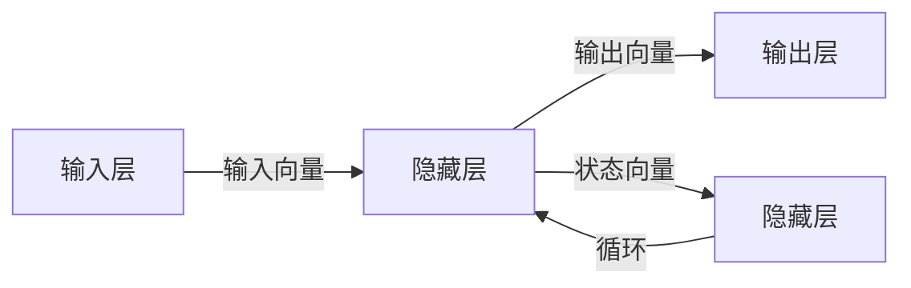

# 循环神经网络 (Recurrent Neural Networks, RNN) 原理与代码实例讲解

## 1. 背景介绍

在人工智能的众多分支中，深度学习技术因其强大的数据表征能力而备受关注。循环神经网络（Recurrent Neural Networks, RNN）是深度学习中的一种重要网络结构，它在处理序列数据方面展现出了独特的优势。无论是语音识别、自然语言处理还是视频内容分析，RNN都扮演着不可或缺的角色。本文将深入探讨RNN的工作原理、数学模型，并通过代码实例带领读者领略其魅力。

## 2. 核心概念与联系

RNN的核心在于其能够处理序列数据并保持状态（state）的能力。与传统的前馈神经网络（Feedforward Neural Networks）不同，RNN在处理当前输入时能够考虑到之前的信息，这种特性使得RNN在时间序列分析等任务中表现卓越。

### 2.1 RNN的基本结构



### 2.2 状态与记忆

RNN的隐藏层不仅接收来自输入层的数据，还接收上一时刻隐藏层的输出，这种设计使得网络能够“记忆”之前的信息，并影响后续的输出。

## 3. 核心算法原理具体操作步骤

RNN的核心算法原理可以分为以下几个步骤：

1. 初始化网络参数，包括权重矩阵和偏置项。
2. 在每个时间步骤，计算隐藏层的状态。
3. 根据隐藏层的状态计算输出。
4. 通过比较预测输出和实际输出计算损失。
5. 使用反向传播算法更新网络参数。

## 4. 数学模型和公式详细讲解举例说明

RNN的数学模型可以用以下公式表示：

$$
h_t = \sigma(W_{hh}h_{t-1} + W_{xh}x_t + b_h)
$$
$$
y_t = W_{hy}h_t + b_y
$$

其中，$h_t$ 是时间步 $t$ 的隐藏状态，$x_t$ 是时间步 $t$ 的输入，$W_{hh}$、$W_{xh}$ 和 $W_{hy}$ 是权重矩阵，$b_h$ 和 $b_y$ 是偏置项，$\sigma$ 是激活函数。

## 5. 项目实践：代码实例和详细解释说明

在本节中，我们将通过一个简单的Python代码示例来展示RNN的实现过程。

```python
import numpy as np

# 定义RNN参数
Wxh = np.random.randn(hidden_size, input_size) * 0.01
Whh = np.random.randn(hidden_size, hidden_size) * 0.01
Why = np.random.randn(output_size, hidden_size) * 0.01
bh = np.zeros((hidden_size, 1))
by = np.zeros((output_size, 1))

def rnn_step_forward(x, h_prev, Wxh, Whh, Why, bh, by):
    h_next = np.tanh(np.dot(Wxh, x) + np.dot(Whh, h_prev) + bh)
    y = np.dot(Why, h_next) + by
    return h_next, y

# 假设我们有一个简单的输入序列和初始隐藏状态
x_seq = np.array([...])  # 输入序列
h_prev = np.zeros((hidden_size, 1))

# 逐时间步前向传播
for t in range(len(x_seq)):
    x = x_seq[t]
    h_prev, y = rnn_step_forward(x, h_prev, Wxh, Whh, Why, bh, by)
    # 这里可以添加损失计算和反向传播
```

## 6. 实际应用场景

RNN在许多实际应用中都有着广泛的应用，包括但不限于：

- 语言模型和文本生成
- 机器翻译
- 语音识别
- 时间序列预测

## 7. 工具和资源推荐

对于希望深入学习RNN的读者，以下是一些有用的工具和资源：

- TensorFlow和Keras：提供高级API以简化RNN的构建和训练过程。
- PyTorch：一个动态神经网络库，非常适合研究和原型开发。
- Fast.ai：一个基于PyTorch的库，旨在使深度学习更加易于访问。

## 8. 总结：未来发展趋势与挑战

RNN虽然在序列数据处理方面有着独特的优势，但也存在一些挑战，如梯度消失或梯度爆炸问题。长短时记忆网络（LSTM）和门控循环单元（GRU）是为解决这些问题而提出的变种。未来，随着计算能力的提升和算法的优化，RNN及其变种将在更多领域得到应用。

## 9. 附录：常见问题与解答

Q1: RNN如何处理变长输入序列？
A1: RNN可以通过循环处理序列中的每个元素来应对变长输入，通常配合填充（padding）和遮罩（masking）技术使用。

Q2: 如何选择RNN、LSTM和GRU？
A2: 这取决于具体任务和数据。LSTM和GRU通常在处理长序列时表现更好，但也更加复杂和计算密集。实践中，建议尝试不同的模型以找到最佳方案。

作者：禅与计算机程序设计艺术 / Zen and the Art of Computer Programming