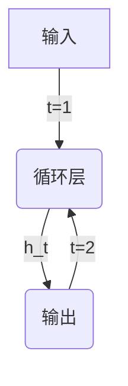

# 循环神经网络(Recurrent Neural Networks) - 原理与代码实例讲解

## 1.背景介绍

### 1.1 神经网络简介

神经网络是一种受生物神经系统启发而设计的计算模型,旨在模拟人脑的工作原理。它由大量互相连接的节点(神经元)组成,这些节点可以接收输入、执行计算并产生输出。神经网络擅长从数据中识别模式,并可应用于各种任务,如图像识别、自然语言处理和决策制定等。

### 1.2 传统神经网络的局限性

传统的前馈神经网络(Feedforward Neural Networks)在处理序列数据(如文本、语音和时间序列数据)时存在局限性。这些网络将输入数据视为独立且无序的样本,无法有效地捕捉序列数据中的时间依赖关系和上下文信息。

### 1.3 循环神经网络的出现

为了解决传统神经网络在处理序列数据时的局限性,循环神经网络(Recurrent Neural Networks, RNNs)应运而生。循环神经网络是一种特殊类型的神经网络,它通过引入循环连接,使得网络能够记住先前的输入,从而捕捉序列数据中的时间依赖关系。这种独特的结构使得循环神经网络在处理序列数据方面表现出色,广泛应用于自然语言处理、语音识别、时间序列预测等领域。

## 2.核心概念与联系

### 2.1 循环神经网络的基本结构

循环神经网络的核心结构是一个循环单元,它由一个或多个循环层组成。每个循环层都包含一组相互连接的神经元,这些神经元不仅接收当前时间步的输入,还接收来自前一时间步的输出。这种循环连接使得网络能够记住过去的信息,并将其与当前输入相结合,从而捕捉序列数据中的时间依赖关系。

上图展示了一个简单的循环神经网络结构。在每个时间步 t,循环层接收当前时间步的输入 x_t 和前一时间步的隐藏状态 h_(t-1)。然后,循环层根据当前输入和先前状态计算新的隐藏状态 h_t,并将其作为输出。这个过程在每个时间步重复进行,直到处理完整个序列。

### 2.2 循环神经网络的计算过程

循环神经网络的计算过程可以概括为以下几个步骤:

1. **初始化隐藏状态**: 在处理序列之前,需要初始化循环层的初始隐藏状态 h_0,通常将其设置为全零向量。

2. **前向传播**: 对于每个时间步 t,循环层接收当前输入 x_t 和前一时间步的隐藏状态 h_(t-1),并计算新的隐藏状态 h_t。这个计算过程通常由一个非线性函数(如 tanh 或 ReLU)实现,并可能包含其他操作,如门控机制(Gate Mechanisms)。

3. **输出计算**: 根据当前隐藏状态 h_t,计算当前时间步的输出 y_t。输出可能是一个分类标签、一个实值预测或者是一个新的序列。

4. **反向传播**: 在训练过程中,通过计算损失函数并反向传播误差梯度,更新循环层中的可训练参数(如权重和偏置)。

这个过程在每个时间步重复进行,直到处理完整个序列。循环神经网络的关键在于它能够通过隐藏状态来捕捉序列数据中的时间依赖关系,从而更好地处理序列数据。

### 2.3 循环神经网络的变体

为了解决传统循环神经网络在实际应用中存在的一些问题(如梯度消失/爆炸、记忆能力有限等),研究人员提出了多种循环神经网络的变体,例如:

- **长短期记忆网络(Long Short-Term Memory, LSTM)**: 引入了门控机制,可以更好地捕捉长期依赖关系,并缓解梯度消失/爆炸问题。
- **门控循环单元(Gated Recurrent Unit, GRU)**: 相对于 LSTM,它采用了更简单的结构,但仍然具有捕捉长期依赖关系的能力。
- **双向循环神经网络(Bidirectional RNNs)**: 通过组合正向和反向的循环层,可以同时捕捉序列数据中的过去和未来信息。
- **注意力机制(Attention Mechanism)**: 通过引入注意力机制,循环神经网络可以更好地关注序列中的关键部分,提高模型的性能。

这些变体在不同的应用场景中表现出不同的优势,为循环神经网络的发展提供了丰富的选择。

## 3.核心算法原理具体操作步骤

### 3.1 基本循环神经网络的前向传播

基本循环神经网络的前向传播过程可以概括为以下步骤:

1. **初始化隐藏状态**: 将初始隐藏状态 h_0 设置为全零向量。

2. **循环计算**: 对于每个时间步 t,执行以下操作:
   a. 将当前输入 x_t 与前一时间步的隐藏状态 h_(t-1) 连接。
   b. 通过一个仿射变换(affine transformation)计算潜在隐藏状态 $\tilde{h}_t$:

$$\tilde{h}_t = W_{hh}h_{t-1} + W_{xh}x_t + b_h$$

其中 $W_{hh}$ 和 $W_{xh}$ 分别是隐藏状态和输入的权重矩阵,而 $b_h$ 是偏置向量。

   c. 通过一个非线性激活函数(如 tanh)计算新的隐藏状态 $h_t$:

$$h_t = \tanh(\tilde{h}_t)$$

   d. 计算当前时间步的输出 $y_t$:

$$y_t = W_{hy}h_t + b_y$$

其中 $W_{hy}$ 是输出权重矩阵,而 $b_y$ 是输出偏置向量。

3. **输出序列**: 重复步骤 2,直到处理完整个输入序列,得到完整的输出序列 $\{y_1, y_2, \dots, y_T\}$。

这是基本循环神经网络的前向传播过程。在实际应用中,通常会使用更复杂的变体(如 LSTM 或 GRU)来提高模型的性能和稳定性。

### 3.2 长短期记忆网络(LSTM)的前向传播

长短期记忆网络(LSTM)是一种广泛使用的循环神经网络变体,它通过引入门控机制来解决传统循环神经网络存在的梯度消失/爆炸问题,并提高了捕捉长期依赖关系的能力。

LSTM 的前向传播过程可以概括为以下步骤:

1. **初始化状态**: 将初始细胞状态 $c_0$ 和初始隐藏状态 $h_0$ 设置为全零向量。

2. **循环计算**: 对于每个时间步 t,执行以下操作:
   a. 计算遗忘门 $f_t$:

$$f_t = \sigma(W_f[h_{t-1}, x_t] + b_f)$$

其中 $\sigma$ 是 sigmoid 激活函数,用于控制保留或丢弃先前的细胞状态。

   b. 计算输入门 $i_t$ 和候选细胞状态 $\tilde{c}_t$:

$$i_t = \sigma(W_i[h_{t-1}, x_t] + b_i)$$
$$\tilde{c}_t = \tanh(W_c[h_{t-1}, x_t] + b_c)$$

输入门控制更新细胞状态的程度,而候选细胞状态是一个新的细胞状态向量。

   c. 更新细胞状态 $c_t$:

$$c_t = f_t \odot c_{t-1} + i_t \odot \tilde{c}_t$$

其中 $\odot$ 表示元素wise乘积。这一步将先前的细胞状态与当前输入和隐藏状态相结合,以更新新的细胞状态。

   d. 计算输出门 $o_t$ 和隐藏状态 $h_t$:

$$o_t = \sigma(W_o[h_{t-1}, x_t] + b_o)$$
$$h_t = o_t \odot \tanh(c_t)$$

输出门控制从细胞状态到隐藏状态的信息流动,而隐藏状态是基于当前细胞状态和输出门的输出。

3. **输出序列**: 重复步骤 2,直到处理完整个输入序列,得到完整的输出序列 $\{h_1, h_2, \dots, h_T\}$。

LSTM 通过引入门控机制,可以更好地捕捉长期依赖关系,并缓解梯度消失/爆炸问题。这使得 LSTM 在处理长序列数据时表现出色,广泛应用于自然语言处理、语音识别和时间序列预测等领域。

### 3.3 门控循环单元(GRU)的前向传播

门控循环单元(GRU)是另一种广泛使用的循环神经网络变体,相对于 LSTM,它采用了更简单的结构,但仍然具有捕捉长期依赖关系的能力。

GRU 的前向传播过程可以概括为以下步骤:

1. **初始化隐藏状态**: 将初始隐藏状态 $h_0$ 设置为全零向量。

2. **循环计算**: 对于每个时间步 t,执行以下操作:
   a. 计算重置门 $r_t$:

$$r_t = \sigma(W_r[h_{t-1}, x_t] + b_r)$$

重置门决定了如何组合新输入与先前的记忆。

   b. 计算更新门 $z_t$:

$$z_t = \sigma(W_z[h_{t-1}, x_t] + b_z)$$

更新门控制了保留先前隐藏状态的程度。

   c. 计算候选隐藏状态 $\tilde{h}_t$:

$$\tilde{h}_t = \tanh(W_h[r_t \odot h_{t-1}, x_t] + b_h)$$

候选隐藏状态是基于当前输入和重置门控制下的先前隐藏状态计算得到的。

   d. 更新隐藏状态 $h_t$:

$$h_t = (1 - z_t) \odot h_{t-1} + z_t \odot \tilde{h}_t$$

新的隐藏状态是先前隐藏状态与候选隐藏状态的组合,由更新门控制。

3. **输出序列**: 重复步骤 2,直到处理完整个输入序列,得到完整的输出序列 $\{h_1, h_2, \dots, h_T\}$。

GRU 通过引入重置门和更新门,可以有效地捕捉长期依赖关系,同时具有比 LSTM 更简单的结构。这使得 GRU 在许多任务上表现出色,并且计算效率更高。

## 4.数学模型和公式详细讲解举例说明

在前面的章节中,我们已经介绍了循环神经网络及其变体(LSTM 和 GRU)的核心算法原理和具体操作步骤。现在,让我们深入探讨一些关键的数学模型和公式,并通过具体示例来加深理解。

### 4.1 循环神经网络的基本数学模型

循环神经网络的基本数学模型可以表示为:

$$h_t = f_W(x_t, h_{t-1})$$
$$y_t = g_V(h_t)$$

其中:

- $x_t$ 是时间步 $t$ 的输入
- $h_t$ 是时间步 $t$ 的隐藏状态
- $y_t$ 是时间步 $t$ 的输出
- $f_W$ 是计算隐藏状态的函数,参数化by $W$
- $g_V$ 是计算输出的函数,参数化by $V$

在基本循环神经网络中,$f_W$ 和 $g_V$ 通常是仿射变换(affine transformation)后接非线性激活函数,如:

$$f_W(x_t, h_{t-1}) = \tanh(W_{hh}h_{t-1} + W_{xh}x_t + b_h)$$
$$g_V(h_t) = W_{hy}h