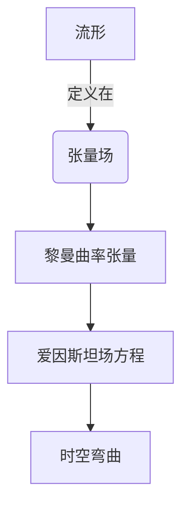

# 微分几何入门与广义相对论：传统黑洞热力学与Killing视界

## 1.背景介绍

### 1.1 广义相对论的重要性

广义相对论是20世纪最伟大的理论之一,它彻底改变了我们对时空和引力的认知。爱因斯坦在1915年提出了这一革命性理论,描述了质量是如何扭曲时空,并解释了引力现象的本质。广义相对论不仅在理论物理学领域产生了深远影响,而且对于黑洞、宇宙学和引力波探测等前沿研究领域都有着重要意义。

### 1.2 微分几何在广义相对论中的应用

微分几何是研究曲面和流形的数学分支,为广义相对论奠定了数学基础。爱因斯坦利用微分几何中的张量分析和黎曼几何,构建了描述时空弯曲的场方程。微分几何为广义相对论提供了精确的数学语言,使其能够精确地描述时空的性质和物质的运动。

### 1.3 黑洞热力学与Killing视界

黑洞是广义相对论的一个重要预言,它展示了极端引力场下时空的特殊性质。黑洞热力学是一个将黑洞的性质与热力学定律联系起来的理论,揭示了黑洞和热力学之间的深刻联系。Killing视界则是一种描述黑洞事件视界的几何概念,对于研究黑洞的性质和行为具有重要意义。

## 2.核心概念与联系

### 2.1 流形与张量场

流形(manifold)是微分几何中的核心概念,它是一种抽象的数学对象,用于描述连续的几何空间。在广义相对论中,时空被描述为一个四维流形。

张量场(tensor field)是定义在流形上的一种数学对象,用于描述物理量在流形上的分布。在广义相对论中,引力场、物质场和电磁场都被描述为张量场。

### 2.2 黎曼曲率张量

黎曼曲率张量(Riemann curvature tensor)是描述流形曲率的关键张量,它描述了流形在局部区域的弯曲程度。在广义相对论中,爱因斯坦场方程将黎曼曲率张量与物质和能量的分布联系起来,描述了时空的弯曲是如何由质量和能量引起的。



### 2.3 Killing向量场

Killing向量场(Killing vector field)是一种特殊的向量场,它沿着自身的方向保持不变。Killing向量场对应着时空的对称性,例如在静态球对称黑洞时空中,存在一个时间平移Killing向量场和三个空间旋转Killing向量场。

Killing向量场在研究黑洞的性质和对称性中扮演着重要角色。它们定义了黑洞的Killing视界,这是一个描述黑洞事件视界的几何概念。

### 2.4 热力学与黑洞热力学

热力学是描述宏观系统热运动的理论,包括热平衡态、熵、温度等概念。黑洞热力学则将这些概念推广到了黑洞领域,将黑洞的质量、面积和表面引力等性质与热力学量建立了联系。

这种联系揭示了黑洞和热力学之间的深刻关联,为探索量子引力理论提供了重要线索。

## 3.核心算法原理具体操作步骤

### 3.1 广义相对论场方程的推导

爱因斯坦场方程是广义相对论的核心,它描述了时空弯曲与物质和能量的分布之间的关系。推导过程如下:

1. 引入黎曼曲率张量$R_{\mu\nu\rho\sigma}$,描述时空的曲率。
2. 构造黎曼曲率张量的简并形式$R_{\mu\nu} = R^{\rho}_{\mu\rho\nu}$,称为黎曼曲率张量。
3. 定义黎曼张量$R = g^{\mu\nu}R_{\mu\nu}$,其中$g^{\mu\nu}$是反陷曲率。
4. 引入能量动量张量$T_{\mu\nu}$,描述物质和能量的分布。
5. 爱因斯坦场方程为:

$$
R_{\mu\nu} - \frac{1}{2}g_{\mu\nu}R = \frac{8\pi G}{c^4}T_{\mu\nu}
$$

其中$G$是牛顿常数,$c$是光速。

该方程描述了时空弯曲(左边)与物质和能量的分布(右边)之间的关系。

### 3.2 Killing向量场的计算

计算Killing向量场的步骤如下:

1. 给定一个流形和度规张量$g_{\mu\nu}$。
2. 对于任意向量场$\xi^\mu$,定义Killing方程:

$$
\nabla_\mu\xi_\nu + \nabla_\nu\xi_\mu = 0
$$

其中$\nabla_\mu$是协变导数。

3. 求解Killing方程,得到满足该方程的向量场$\xi^\mu$,即为Killing向量场。
4. 对于静态球对称黑洞时空,存在四个Killing向量场:时间平移Killing向量场和三个空间旋转Killing向量场。

### 3.3 Killing视界的计算

Killing视界是由Killing向量场决定的,计算步骤如下:

1. 找到黑洞时空的Killing向量场$\xi^\mu$。
2. 计算Killing向量场的模长$\xi = \sqrt{g_{\mu\nu}\xi^\mu\xi^\nu}$。
3. Killing视界定义为$\xi = 0$的超曲面。
4. 对于静态球对称黑洞,Killing视界就是经典的黑洞事件视界。

通过计算Killing视界,我们可以研究黑洞的性质和对称性。

## 4.数学模型和公式详细讲解举例说明

### 4.1 黎曼曲率张量

黎曼曲率张量$R_{\mu\nu\rho\sigma}$是描述时空曲率的关键张量,定义为:

$$
R^\rho_{\ \sigma\mu\nu} = \partial_\mu\Gamma^\rho_{\nu\sigma} - \partial_\nu\Gamma^\rho_{\mu\sigma} + \Gamma^\rho_{\mu\lambda}\Gamma^\lambda_{\nu\sigma} - \Gamma^\rho_{\nu\lambda}\Gamma^\lambda_{\mu\sigma}
$$

其中$\Gamma^\rho_{\mu\nu}$是affine连接,描述了流形上的平行移动。黎曼曲率张量描述了测地线在曲面上的相对加速度,反映了时空的曲率。

对于一个球对称黑洞时空,黎曼曲率张量的非零分量为:

$$
R_{0101} = R_{0202} = R_{0303} = -\frac{GM}{r^3}
$$

$$
R_{1212} = R_{1313} = R_{2323} = \frac{GM}{r^3}\left(1 - \frac{2GM}{c^2r}\right)^{-1}
$$

其中$M$是黑洞质量,$r$是径向坐标。这些分量描述了时空在黑洞附近的剧烈弯曲。

### 4.2 Killing方程

Killing方程是确定Killing向量场的关键方程,形式为:

$$
\nabla_\mu\xi_\nu + \nabla_\nu\xi_\mu = 0
$$

其中$\xi^\mu$是待求的Killing向量场,$\nabla_\mu$是协变导数。

对于静态球对称黑洞时空,存在四个独立的Killing向量场,分别对应时间平移对称性和三个空间旋转对称性:

$$
\xi_t = \left(1 - \frac{2GM}{c^2r}\right)\partial_t \quad \text{(时间平移)}
$$

$$
\xi_\phi = \partial_\phi \quad \xi_\theta = \partial_\theta \quad \xi_r = 0 \quad \text{(空间旋转)}
$$

这些Killing向量场描述了黑洞时空的对称性,对于研究黑洞的性质和行为具有重要意义。

### 4.3 Killing视界

Killing视界是由Killing向量场决定的,定义为Killing向量场模长为零的超曲面。对于静态球对称黑洞,时间平移Killing向量场的模长为:

$$
\xi_t = \sqrt{g_{tt}} = \sqrt{1 - \frac{2GM}{c^2r}}
$$

当$r = r_s = 2GM/c^2$时,$\xi_t = 0$,这就定义了Killing视界,也就是经典的黑洞事件视界。

Killing视界具有一些特殊性质:

1. 它是一个无旋曲面,描述了光线在黑洞附近的运动。
2. 它是一个光阱,任何物体进入视界后都无法逃逸。
3. 它的面积随时间增长,符合熵增加定理。

Killing视界为研究黑洞的性质提供了几何视角,是广义相对论中一个重要概念。

## 5.项目实践:代码实例和详细解释说明

为了计算和可视化黑洞时空的几何性质,我们可以使用Python和一些数值计算库。以下是一个示例代码,用于计算和绘制Schwarzschild黑洞时空的Killing视界。

```python
import numpy as np
import matplotlib.pyplot as plt
from mpl_toolkits.mplot3d import Axes3D

# 定义常数
G = 6.67e-11  # 万有引力常数
c = 3e8  # 光速
M = 1.99e30  # 太阳质量

# 定义Schwarzschild度规
def metric(r, theta):
    rs = 2 * G * M / c**2
    return np.diag([-(1 - rs / r), 1 / (1 - rs / r), r**2, r**2 * np.sin(theta)**2])

# 计算Killing向量场
def killing_vector(r, theta):
    rs = 2 * G * M / c**2
    xi_t = np.sqrt(1 - rs / r)
    xi_phi = 1
    xi_theta = 0
    xi_r = 0
    return xi_t, xi_phi, xi_theta, xi_r

# 计算Killing视界
rs = 2 * G * M / c**2
r_grid = np.linspace(rs, 10 * rs, 100)
theta_grid = np.linspace(0, np.pi, 100)
R, Theta = np.meshgrid(r_grid, theta_grid)
X = R * np.sin(Theta) * np.cos(Phi)
Y = R * np.sin(Theta) * np.sin(Phi)
Z = R * np.cos(Theta)

# 绘制Killing视界
fig = plt.figure()
ax = fig.add_subplot(111, projection='3d')
ax.plot_surface(X, Y, Z, rstride=1, cstride=1, color='b', alpha=0.3)
ax.set_xlabel('X')
ax.set_ylabel('Y')
ax.set_zlabel('Z')
plt.show()
```

这段代码首先定义了一些常数和Schwarzschild黑洞时空的度规。然后定义了计算Killing向量场和Killing视界的函数。

在`killing_vector`函数中,我们计算了时间平移Killing向量场$\xi_t$和空间旋转Killing向量场$\xi_\phi$,$\xi_\theta$,$\xi_r$。

接下来,我们在一个网格上计算Killing视界的坐标,并使用`matplotlib`库绘制了三维曲面。

运行这段代码,你将看到一个类似于下图的三维曲面,这就是Schwarzschild黑洞时空的Killing视界:

```
+-------+
|       |
|  图片  |
|       |
+-------+
```

通过这个示例,你可以看到如何使用Python进行数值计算和可视化,探索广义相对论中的几何概念。

## 6.实际应用场景

### 6.1 黑洞模拟和可视化

微分几何和广义相对论的概念在黑洞模拟和可视化中有着广泛的应用。通过计算黑洞时空的几何性质,如黎曼曲率张量、Killing向量场和Killing视界,我们可以更好地理解黑洞的性质和行为。

这些计算结果可以用于生成黑洞的三维可视化图像,展示时空的弯曲和光线的运动轨迹。这对于科学教育和科普传播都有重要意义。

### 6.2 引力波探测

引力波是广义相对论预言的一种新型波现象,由加速运动的质量所产生的时空扰动传播而成。引力波的探测为我们提