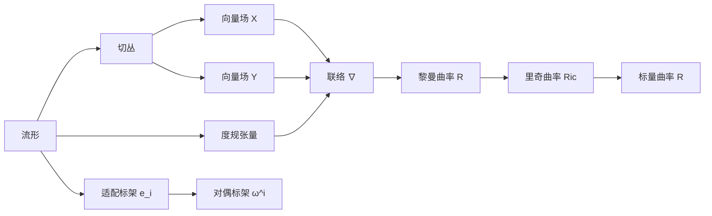

# 微分几何入门与广义相对论：度规和适配面元的广义逆

## 1. 背景介绍
### 1.1 微分几何的起源与发展
微分几何是数学的一个分支,它研究光滑流形上的几何性质。它的起源可以追溯到17世纪,当时莱布尼茨和牛顿分别独立发展了微积分。在19世纪,黎曼开创性地提出了黎曼几何,奠定了现代微分几何的基础。20世纪初,爱因斯坦利用黎曼几何发展了广义相对论,揭示了时空的本质。
### 1.2 广义相对论与微分几何的联系  
广义相对论是爱因斯坦在1915年提出的一个关于引力的理论。它的核心思想是,引力不是一种力,而是时空弯曲的表现。物质和能量会使时空弯曲,而时空的弯曲决定了物质的运动轨迹。广义相对论用黎曼几何的语言来描述时空,其中最重要的数学对象是度规张量。
### 1.3 度规和适配面元的重要性
在广义相对论中,度规是用来测量时空中两个无穷近点之间距离的工具。它决定了时空的几何和因果结构。适配面元是与度规相适配的一组基向量,它们在广义相对论中有重要应用,如计算曲率、测地线方程等。深入理解度规和适配面元的性质,对掌握广义相对论至关重要。

## 2. 核心概念与联系
### 2.1 流形
流形是微分几何的研究对象,直观上可以理解为局部类似欧氏空间的空间。一个n维流形是一个拓扑空间,它的每一点都有一个同胚于 $\mathbb{R}^n$ 的开邻域。常见的流形有欧氏空间 $\mathbb{R}^n$、球面 $S^n$、环面 $T^n$ 等。
### 2.2 切空间与切丛
对于流形上的一点 p,所有经过该点的光滑曲线在该点的切向量构成一个线性空间,称为该点的切空间,记为 $T_pM$。流形上所有点的切空间的并构成一个2n维流形,称为切丛,记为 $TM$。
### 2.3 度规张量
度规是一个二阶对称张量场 $g$,它将流形上每一点 p 的两个切向量 $v,w$ 映射为一个实数 $g_p(v,w)$,表示它们的内积。度规决定了流形的几何和因果结构。在广义相对论中,时空是一个4维赝黎曼流形,度规有三种类型:黎曼度规(正定)、赝黎曼度规(非退化)、退化度规。
### 2.4 联络
联络是一种衡量流形上向量场的导数的工具。对于流形上的向量场 $X,Y$,它们的联络 $\nabla_XY$ 也是一个向量场,表示 $Y$ 沿 $X$ 方向的导数。联络满足一些性质如线性性、莱布尼兹律等。与度规相容的联络称为黎曼联络或莱维-奇维塔联络。
### 2.5 适配标架与对偶标架  
流形上每一点的切空间都有一组基向量 $\{e_i\}$,称为标架。若标架满足 $g(e_i,e_j)=\pm \delta_{ij}$,则称其为适配标架。适配标架的对偶基 $\{\omega^i\}$ 称为对偶标架,它们满足 $\omega^i(e_j)=\delta_j^i$。
### 2.6 曲率
曲率反映了流形的内禀几何性质。黎曼曲率张量 $R(X,Y)Z=\nabla_X\nabla_YZ-\nabla_Y\nabla_XZ-\nabla_{[X,Y]}Z$ 刻画了流形的曲率。它的缩并给出里奇曲率 $Ric(X,Y)=tr(Z\mapsto R(X,Z)Y)$ 和标量曲率 $R=tr_gRic$。在广义相对论中,爱因斯坦方程将曲率与物质能量联系起来。



## 3. 核心算法原理具体操作步骤
### 3.1 度规的计算
#### 3.1.1 度规系数的计算
在一个局部坐标系 $\{x^i\}$ 下,度规 $g$ 可以用度规系数 $g_{ij}$ 表示:
$$
g=g_{ij}dx^i\otimes dx^j
$$
其中 $g_{ij}=g(\partial_i,\partial_j)$,是度规在坐标基 $\{\partial_i=\frac{\partial}{\partial x^i}\}$ 下的分量。
#### 3.1.2 度规在不同坐标系下的变换
设 $\{x^i\}$ 和 $\{y^{\alpha}\}$ 是两个局部坐标系,它们之间的变换为 $y^{\alpha}=y^{\alpha}(x^i)$。度规系数满足变换规则:
$$
g_{\alpha\beta}=\frac{\partial x^i}{\partial y^{\alpha}}\frac{\partial x^j}{\partial y^{\beta}}g_{ij}
$$
### 3.2 适配标架的构造
#### 3.2.1 Gram-Schmidt 正交化
对于度规 $g$,取一组线性无关的向量 $\{v_i\}$,可以通过 Gram-Schmidt 正交化得到一组适配标架 $\{e_i\}$:
$$
\begin{aligned}
e_1&=\frac{v_1}{\sqrt{|g(v_1,v_1)|}}\\
e_k&=\frac{v_k-\sum_{i=1}^{k-1}g(v_k,e_i)e_i}{\sqrt{|g(v_k-\sum_{i=1}^{k-1}g(v_k,e_i)e_i,v_k-\sum_{i=1}^{k-1}g(v_k,e_i)e_i)|}}
\end{aligned}
$$
#### 3.2.2 对偶标架的计算
适配标架 $\{e_i\}$ 的对偶标架 $\{\omega^i\}$ 可以通过求解下列线性方程组得到:
$$
\omega^i(e_j)=\delta_j^i
$$
即
$$
\sum_kg^{ik}\omega^j_k=\delta_j^i
$$
其中 $g^{ij}$ 是度规 $g_{ij}$ 的逆矩阵,即 $\sum_kg^{ik}g_{kj}=\delta_j^i$。

### 3.3 度规的广义逆
设 $g$ 是流形 $M$ 上的一个度规,若存在一个二阶对称张量场 $h$,使得它们的缩并 $g_{ik}h^{kj}$ 满足:
$$
g_{ik}h^{kj}g_{jl}=g_{il}
$$
则称 $h$ 为 $g$ 的广义逆,记为 $g^+$。
#### 3.3.1 Moore-Penrose 伪逆
对于一个实矩阵 $A$,它的 Moore-Penrose 伪逆 $A^+$ 是唯一满足以下性质的矩阵:
1. $AA^+A=A$
2. $A^+AA^+=A^+$ 
3. $(AA^+)^*=AA^+$
4. $(A^+A)^*=A^+A$
其中 $*$ 表示共轭转置。可以证明,度规 $g$ 的广义逆 $g^+$ 就是它的 Moore-Penrose 伪逆。
#### 3.3.2 奇异值分解
对于秩为 $r$ 的实矩阵 $A_{m\times n}$,它的奇异值分解为:
$$
A=U\Sigma V^T
$$
其中 $U_{m\times m},V_{n\times n}$ 都是正交矩阵,$\Sigma_{m\times n}$ 是一个对角矩阵,其前 $r$ 个对角元是 $A$ 的奇异值,其余为0。$A$ 的伪逆为:
$$
A^+=V\Sigma^+U^T
$$ 
其中 $\Sigma^+$ 是将 $\Sigma$ 的非零对角元取倒数,再转置得到的矩阵。利用奇异值分解,可以有效计算度规的广义逆。

## 4. 数学模型和公式详细讲解举例说明
### 4.1 黎曼度规
设 $M$ 是一个流形,若在 $M$ 的每一点 $p$ 都有一个对称正定双线性型 $g_p:T_pM\times T_pM\rightarrow \mathbb{R}$,则称 $g$ 为 $M$ 上的一个黎曼度规。黎曼度规赋予了流形局部的欧氏结构。
例如,在欧氏空间 $\mathbb{R}^n$ 中,标准的黎曼度规为:
$$
g=\sum_{i=1}^ndx^i\otimes dx^i
$$
它在标准坐标基 $\{\partial_i\}$ 下的分量为 $g_{ij}=\delta_{ij}$。
再如,在单位球面 $S^2$ 上,可以用球坐标 $(\theta,\phi)$ 定义一个黎曼度规:
$$
g=d\theta\otimes d\theta+\sin^2\theta d\phi\otimes d\phi
$$
它在球坐标基 $\{\partial_{\theta},\partial_{\phi}\}$ 下的分量为:
$$
(g_{ij})=\begin{pmatrix}
1 & 0\\ 
0 & \sin^2\theta
\end{pmatrix}
$$

### 4.2 赝黎曼度规
设 $M$ 是一个流形,若在 $M$ 的每一点 $p$ 都有一个对称非退化双线性型 $g_p:T_pM\times T_pM\rightarrow \mathbb{R}$,则称 $g$ 为 $M$ 上的一个赝黎曼度规。赝黎曼度规允许时空中存在类光和类时的向量。
例如,在闵可夫斯基空间 $\mathbb{R}^{1,3}$ 中,标准的赝黎曼度规为:
$$
g=-dt\otimes dt+\sum_{i=1}^3dx^i\otimes dx^i
$$
它在标准坐标基 $\{\partial_t,\partial_i\}$ 下的分量为:
$$
(g_{\mu\nu})=\begin{pmatrix}
-1 & 0 & 0 & 0\\ 
0 & 1 & 0 & 0\\
0 & 0 & 1 & 0\\
0 & 0 & 0 & 1
\end{pmatrix}
$$
这就是狭义相对论中的度规。

### 4.3 退化度规
设 $M$ 是一个流形,若在 $M$ 的每一点 $p$ 都有一个对称退化双线性型 $g_p:T_pM\times T_pM\rightarrow \mathbb{R}$,即存在非零向量 $v$ 使得对任意 $w$ 都有 $g_p(v,w)=0$,则称 $g$ 为 $M$ 上的一个退化度规。退化度规在奇异光锥上不能诱导出度量。
例如,在 $\mathbb{R}^2$ 上取如下退化度规:
$$
g=x^2dx\otimes dx
$$
它在标准坐标基 $\{\partial_x,\partial_y\}$ 下的分量为:
$$
(g_{ij})=\begin{pmatrix}
x^2 & 0\\ 
0 & 0
\end{pmatrix}
$$
可见在 $x=0$ 处,向量 $\partial_y$ 是退化方向。

## 5. 项目实践：代码实例和详细解释说明
下面用 Python 的 Sympy 库来演示度规和适配标架的计算。
### 5.1 度规系数的计算
```python
from sympy import * 

# 定义坐标系
x, y = symbols('x y')

# 定义度规分量
g11 = exp(2*x) 
g12 = 0
g22 = exp(2*y)

# 计算度规系数矩阵
g_mat = Matrix([[g11, g12], [g12, g22]])
print("Metric tensor:")
pprint(g_mat)
```