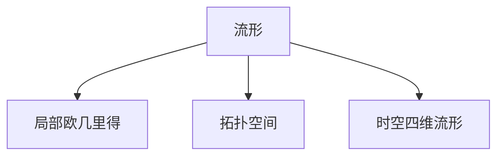
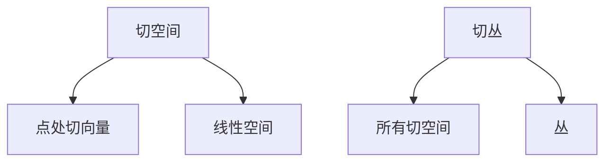
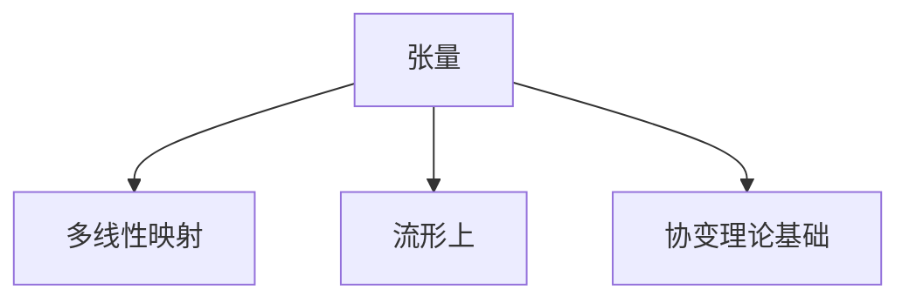
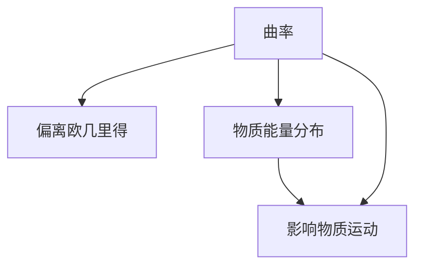
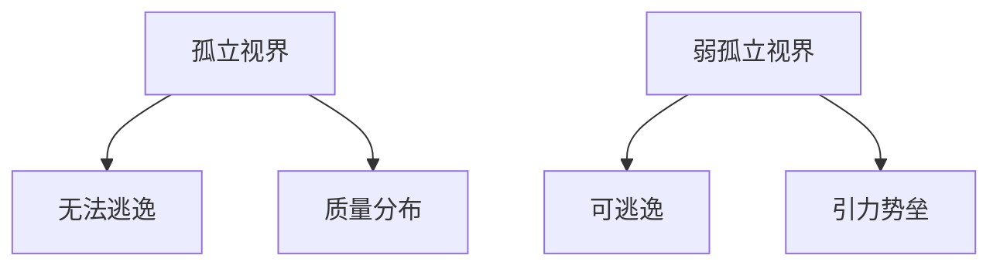

# 微分几何入门与广义相对论：弱孤立视界和孤立视界的对称性

## 1. 背景介绍

### 1.1 广义相对论的重要性

广义相对论是阿尔伯特·爱因斯坦在1915年提出的一个划时代的理论,它将引力现象解释为时空曲率的结果,从根本上改变了人类对时空和引力的认知。广义相对论不仅在理论物理学领域产生了深远影响,也为现代科技的发展做出了重大贡献,如GPS导航系统、黑洞探测等都依赖于广义相对论的基本原理。

### 1.2 微分几何在广义相对论中的作用

微分几何是研究曲面和更一般流形的内在几何性质的数学分支。由于广义相对论将时空描述为一个四维流形,因此微分几何为广义相对论提供了必要的数学工具。爱因斯坦场方程的推导过程中广泛使用了微分几何的概念和方法,如张量、切空间、曲率等。掌握微分几何有助于更深入地理解广义相对论的本质。

### 1.3 孤立视界和弱孤立视界

孤立视界和弱孤立视界是广义相对论中两个重要的概念。孤立视界是指围绕着一个质量分布的时空区域,在这个区域内,任何物体都无法逃逸,即使以光速运动也不行。而弱孤立视界是指一个更广阔的时空区域,在这个区域内,虽然物体可以逃逸,但是需要克服极大的引力势垒。研究孤立视界和弱孤立视界的对称性有助于深入理解黑洞等极端引力场的性质。

## 2. 核心概念与联系

### 2.1 流形

在微分几何中,流形(Manifold)是一个基本概念。流形是一个局部看起来像欧几里得空间的拓扑空间。时空在广义相对论中被描述为一个四维流形。

### 2.2 切空间和切丛

切空间(Tangent Space)是流形上一个点处的所有切向量构成的线性空间。切丛(Tangent Bundle)则是所有切空间构成的丛,是一个更广阔的概念。在广义相对论中,切空间和切丛用于描述时空中的运动和变化。

### 2.3 张量

张量(Tensor)是一种几何对象,可以看作是在流形上的多线性映射。在广义相对论中,张量用于描述物理量在不同坐标系下的变换规律,是建立协变理论的基础。

### 2.4 曲率

曲率(Curvature)描述了流形偏离欧几里得空间的程度。在广义相对论中,时空的曲率由物质和能量的分布决定,反过来也影响着物质和能量的运动。爱因斯坦场方程就是描述了这种相互关系。

### 2.5 孤立视界和弱孤立视界

孤立视界(Event Horizon)是指围绕着一个质量分布的时空区域,在这个区域内,任何物体都无法逃逸,即使以光速运动也不行。弱孤立视界(Apparent Horizon)是指一个更广阔的时空区域,在这个区域内,虽然物体可以逃逸,但是需要克服极大的引力势垒。

上述概念相互关联、相辅相成,共同构成了微分几何在广义相对论中的理论框架。掌握这些核心概念有助于深入理解广义相对论的本质和内涵。

## 3. 核心算法原理具体操作步骤

### 3.1 流形的定义和结构

流形是一个局部看起来像欧几里得空间的拓扑空间。具体来说,一个流形M是一个拓扑空间,对于M上的每一点p,都存在一个开集U,使得U的拓扑与R^n(n为正整数)上的拓扑是同构的。这种同构映射被称为坐标映射或卡映射。

1. 确定流形M的拓扑结构。
2. 对于M上的每一点p,找到一个包含p的开集U。
3. 构造一个从U到R^n的坐标映射φ,使得φ(U)是R^n上的一个开集。
4. 验证不同坐标映射之间的转换是光滑的。

通过上述步骤,我们就可以将一个拓扑空间赋予流形结构。时空在广义相对论中被描述为一个四维流形,因此需要使用四个坐标来表示时空中的每一点。

### 3.2 切空间和切丛的构造

切空间是流形上一个点处的所有切向量构成的线性空间。切丛则是所有切空间构成的丛。

1. 在流形M上取一点p。
2. 定义所有过p点的曲线的导数,得到切向量的集合T_p(M),这就是p点处的切空间。
3. 对于M上的每一点,都可以构造出对应的切空间。
4. 将所有切空间"捆绑"在一起,就得到了切丛TM。

切空间和切丛为研究流形上的向量场和张量场提供了必要的工具。在广义相对论中,切空间和切丛用于描述时空中的运动和变化。

### 3.3 张量的定义和运算

张量是一种几何对象,可以看作是在流形上的多线性映射。具体来说,对于一个n维流形M,一个阶数为(r,s)的张量场T就是一个映射:

$$T: \underbrace{TM \times \cdots \times TM}_{r个} \times \underbrace{T^*M \times \cdots \times T^*M}_{s个} \rightarrow \mathbb{R}$$

其中,TM表示切丛,T^*M表示余切丛。

1. 确定流形M和张量场T的阶数(r,s)。
2. 在每一点p处,取r个切向量和s个余切向量,将它们代入T,得到一个实数值。
3. 对于不同的切向量和余切向量的选取,将得到不同的实数值。
4. 这些实数值就构成了张量场T在点p处的分量。

张量场可以在流形上进行加法、数乘等代数运算,也可以做张量积、张量外积等张量运算。在广义相对论中,张量用于描述物理量在不同坐标系下的变换规律,是建立协变理论的基础。

### 3.4 计算曲率

曲率描述了流形偏离欧几里得空间的程度。对于一个n维流形M,其曲率可以通过里奇张量(Ricci Tensor)和曲率张量(Riemann Tensor)来表示。

1. 计算流形M上的仿射连接(Affine Connection),它描述了在M上平移向量时的变化规律。
2. 利用仿射连接,计算曲率张量R:

$$R(X,Y)Z = \nabla_X\nabla_YZ - \nabla_Y\nabla_XZ - \nabla_{[X,Y]}Z$$

其中,X,Y,Z是切向量场,∇表示借助仿射连接定义的协变导数。

3. 从曲率张量R,可以计算出里奇张量Ric:

$$Ric(X,Y) = \mathrm{tr}(Z \mapsto R(Z,X)Y)$$

4. 里奇张量的迹就是曲率标量(Ricci Scalar)R:

$$R = \mathrm{tr}(Ric)$$

在广义相对论中,时空的曲率由物质和能量的分布决定,反过来也影响着物质和能量的运动。爱因斯坦场方程就是描述了这种相互关系。

### 3.5 孤立视界和弱孤立视界的判定

孤立视界和弱孤立视界是描述极端引力场的重要概念。判定一个时空区域是否为孤立视界或弱孤立视界,需要利用边值问题和边界条件。

1. 确定研究的时空区域Σ,它是一个三维空间像曲面。
2. 在Σ上施加适当的边值条件,如质量分布、能量张量等。
3. 求解初值问题,得到Σ在时空中的嵌入方式。
4. 计算Σ上的外向单位法向量场n^a。
5. 若存在一个闭合的陷阱曲面S,使得n^a处处为内向或光性,则S就是孤立视界。
6. 若存在一个闭合的陷阱曲面S,使得n^a处处为内向或光性或外向,则S就是弱孤立视界。

通过上述步骤,我们可以判断一个时空区域是否为孤立视界或弱孤立视界,从而研究极端引力场的性质。

## 4. 数学模型和公式详细讲解举例说明

### 4.1 流形的数学模型

流形是一个局部看起来像欧几里得空间的拓扑空间。具体来说,一个n维流形M是一个拓扑空间,对于M上的每一点p,都存在一个开集U,使得U的拓扑与R^n上的拓扑是同构的。这种同构映射被称为坐标映射或卡映射。

设φ:U→R^n是一个坐标映射,那么对于U中的任意一点q,我们可以用n个坐标(x^1,x^2,...,x^n)来表示它,即:

$$q = (x^1(q),x^2(q),...,x^n(q))$$

两个不同的坐标映射φ和ψ之间的转换关系可以写作:

$$x'^i = x'^i(x^1,x^2,...,x^n)$$

其中,转换函数x'^i必须是光滑的,这样才能保证流形的结构是光滑的。

例如,二维球面S^2就是一个二维流形。我们可以使用经纬度坐标(θ,φ)来参数化球面上的点:

$$\begin{align*}
x &= \sin\theta\cos\phi \\
y &= \sin\theta\sin\phi \\
z &= \cos\theta
\end{align*}$$

这里的坐标映射φ就将球面上的点(θ,φ)映射到了三维欧几里得空间R^3中。通过这种方式,我们可以将球面赋予流形结构。

### 4.2 切空间和切丛的数学模型

切空间是流形上一个点处的所有切向量构成的线性空间。切丛则是所有切空间构成的丛。

具体来说,对于一个n维流形M,在M上取一点p,所有过p点的曲线的导数就构成了p点处的切空间T_p(M)。一个切向量可以写作:

$$V = \sum_{i=1}^n V^i\frac{\partial}{\partial x^i}$$

其中,V^i是切向量在第i个坐标方向上的分量。

将M上所有点处的切空间"捆绑"在一起,就得到了切丛TM。切丛TM可以表示为:

$$TM = \bigcup_{p\in M} T_p(M)$$

在切丛TM上,我们可以定义向量场等重要的几何对象。例如,一个向量场X就是一个映射:

$$X: M \rightarrow TM, \quad p \mapsto X_p$$

其中,X_p是p点处的一个切向量。

通过切空间和切丛,我们可以在流形上研究向量场、张量场等几何对象,这为广义相对论的数学描述奠定了基础。

### 4.3 张量的数学模型

张量是一种几何对象,可以看作是在流形上的多线性映射。具体来说,对于一个n维流形M,一个阶数为(r,s)的张量场T就是一个映射:

$$T: \underbrace{