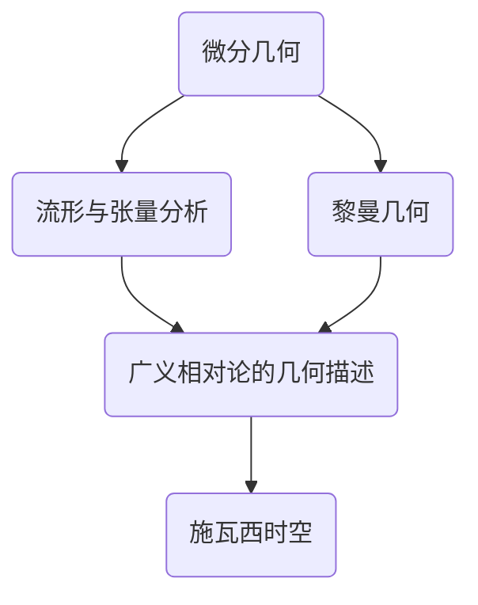

# 微分几何入门与广义相对论：施瓦西时空

## 1. 背景介绍
### 1.1 微分几何的发展历程
#### 1.1.1 微分几何的起源
#### 1.1.2 现代微分几何的建立
#### 1.1.3 微分几何在物理学中的应用

### 1.2 广义相对论概述  
#### 1.2.1 狭义相对论的局限性
#### 1.2.2 广义相对论的核心思想
#### 1.2.3 广义相对论的数学基础

### 1.3 施瓦西时空的重要性
#### 1.3.1 施瓦西时空的发现
#### 1.3.2 施瓦西时空在广义相对论中的地位
#### 1.3.3 研究施瓦西时空的意义

## 2. 核心概念与联系
### 2.1 流形与张量分析
#### 2.1.1 流形的定义与分类
#### 2.1.2 切丛与余切丛
#### 2.1.3 张量的定义与运算

### 2.2 黎曼几何初步
#### 2.2.1 黎曼度量与黎曼曲率
#### 2.2.2 测地线方程
#### 2.2.3 共形变换与共形群

### 2.3 广义相对论的几何描述
#### 2.3.1 时空流形与度规张量
#### 2.3.2 广义相对论场方程
#### 2.3.3 能动张量与能量守恒

## 3. 核心算法原理具体操作步骤
### 3.1 施瓦西度规的推导
#### 3.1.1 静态球对称假设
#### 3.1.2 求解广义相对论场方程
#### 3.1.3 引入质量参数得到施瓦西度规

### 3.2 施瓦西时空的测地线方程
#### 3.2.1 测地线方程的一般形式  
#### 3.2.2 施瓦西时空中的测地线方程
#### 3.2.3 径向自由落体运动

### 3.3 事件视界与黑洞
#### 3.3.1 事件视界的定义
#### 3.3.2 施瓦西黑洞
#### 3.3.3 黑洞热力学

## 4. 数学模型和公式详细讲解举例说明
### 4.1 张量分析中的重要公式
#### 4.1.1 诱导度量与第一基本形式
$ds^2 = g_{ij}dx^idx^j$
#### 4.1.2 克氏符号与协变导数
$\nabla_{\partial_i}\partial_j = \Gamma^k_{ij}\partial_k$
#### 4.1.3 黎曼曲率张量
$R^l_{ijk} = \partial_i\Gamma^l_{jk} - \partial_j\Gamma^l_{ik} + \Gamma^l_{im}\Gamma^m_{jk} - \Gamma^l_{jm}\Gamma^m_{ik}$

### 4.2 广义相对论场方程与能动张量  
#### 4.2.1 爱因斯坦场方程
$$R_{\mu\nu} - \frac{1}{2}Rg_{\mu\nu} = \frac{8\pi G}{c^4}T_{\mu\nu}$$
#### 4.2.2 能动张量的定义
$T^{\mu\nu} = \frac{2}{\sqrt{-g}}\frac{\delta S_M}{\delta g_{\mu\nu}}$
#### 4.2.3 能量动量守恒律
$\nabla_{\mu}T^{\mu\nu} = 0$

### 4.3 施瓦西度规与黑洞视界
#### 4.3.1 施瓦西度规的表达式
$$ds^2 = -\left(1-\frac{2GM}{c^2r}\right)c^2dt^2 + \left(1-\frac{2GM}{c^2r}\right)^{-1}dr^2 + r^2(d\theta^2+\sin^2\theta d\varphi^2)$$
#### 4.3.2 事件视界半径
$r_s = \frac{2GM}{c^2}$
#### 4.3.3 黑洞熵与霍金温度
$S_{BH} = \frac{k_BAc^3}{4G\hbar}, \quad T_H = \frac{\hbar c^3}{8\pi GMk_B}$

## 5. 项目实践：代码实例和详细解释说明
### 5.1 符号计算软件的使用
#### 5.1.1 Mathematica中的张量计算
#### 5.1.2 SymPy中的广义相对论模块
#### 5.1.3 Maple中的微分几何工具包

### 5.2 数值相对论的程序实现
#### 5.2.1 时空网格的构建
#### 5.2.2 广义相对论场方程的数值求解
#### 5.2.3 测地线方程的数值积分

### 5.3 可视化与数据分析
#### 5.3.1 施瓦西时空的可视化
#### 5.3.2 黑洞吸积盘的光线追踪
#### 5.3.3 引力波信号的数据处理

## 6. 实际应用场景
### 6.1 黑洞与引力波天文学
#### 6.1.1 黑洞的观测证据
#### 6.1.2 引力波探测的原理与方法
#### 6.1.3 多信使天文学的发展

### 6.2 宇宙学中的应用
#### 6.2.1 宇宙学原理与费里曼-罗伯逊-沃尔克度规
#### 6.2.2 宇宙学参数的测量
#### 6.2.3 暗物质与暗能量问题

### 6.3 其他前沿领域的联系
#### 6.3.1 量子引力理论
#### 6.3.2 全息原理与AdS/CFT对应
#### 6.3.3 引力的热力学描述

## 7. 工具和资源推荐
### 7.1 教材与专著
#### 7.1.1 《广义相对论》 - 史蒂文·卡罗尔
#### 7.1.2 《引力》 - 詹姆斯·哈特尔
#### 7.1.3 《黑洞、白洞与虫洞》 - 基普·索恩

### 7.2 在线课程与视频资源
#### 7.2.1 Leonard Susskind的广义相对论课程
#### 7.2.2 MathTheBeautiful的微分几何视频系列
#### 7.2.3 3Blue1Brown的张量分析动画

### 7.3 学术期刊与预印本平台
#### 7.3.1 Classical and Quantum Gravity
#### 7.3.2 General Relativity and Gravitation
#### 7.3.3 arXiv.org的gr-qc分类

## 8. 总结：未来发展趋势与挑战
### 8.1 广义相对论的经典检验
#### 8.1.1 水星近日点进动
#### 8.1.2 光线偏折
#### 8.1.3 引力红移

### 8.2 当前研究的前沿问题  
#### 8.2.1 黑洞信息丢失悖论
#### 8.2.2 奇性的本质与去奇方案
#### 8.2.3 量子引力理论的构建

### 8.3 未来的发展方向
#### 8.3.1 精确引力波形的计算
#### 8.3.2 高维时空与额外维度
#### 8.3.3 时空的量子起源

## 9. 附录：常见问题与解答
### 9.1 为什么说广义相对论是一个几何理论？
广义相对论将引力描述为时空几何的内禀性质，引力场方程反映了时空曲率与物质分布之间的联系。这种几何化的处理方式是广义相对论的核心特征。

### 9.2 协变导数和偏导数有什么区别？
偏导数只描述了张量分量值的变化率，而协变导数还考虑了坐标基矢的变化对张量的影响。在曲线坐标系下，协变导数才是张量的正确导数定义。

### 9.3 什么是广义协变性原理？
广义协变性原理指出，物理定律在任意坐标变换下都应保持不变的形式。这保证了广义相对论方程组是广义协变的，即与坐标选择无关。

作者：禅与计算机程序设计艺术 / Zen and the Art of Computer Programming