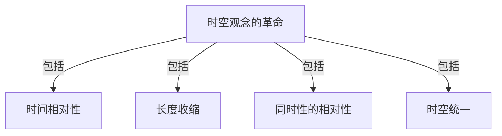
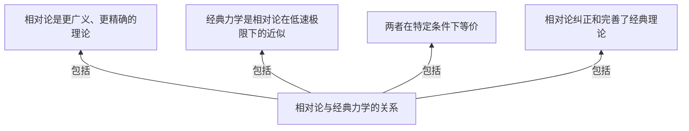
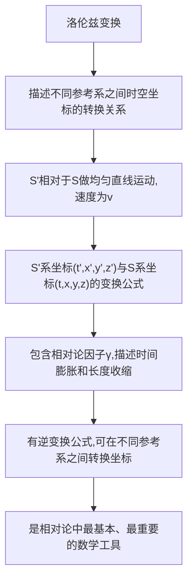
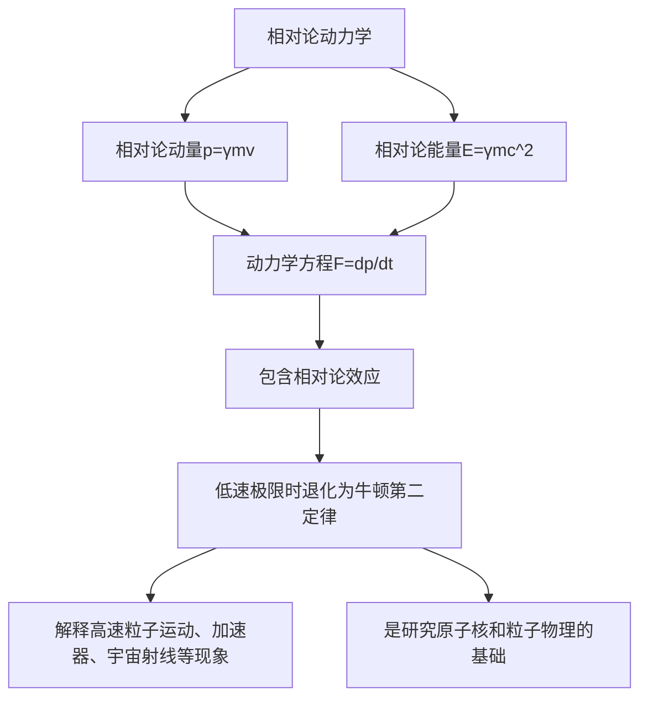
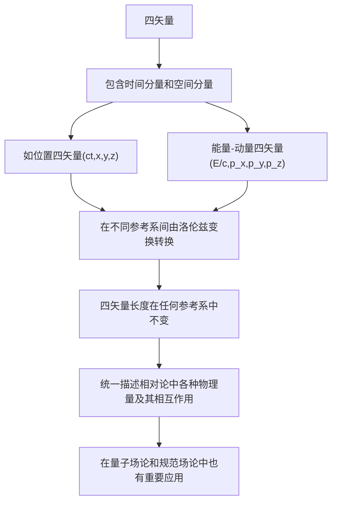

# 微分几何入门与广义相对论：狭义相对论

## 1. 背景介绍

### 1.1 狭义相对论的产生背景

狭义相对论是20世纪初由阿尔伯特·爱因斯坦提出的一个革命性理论,它彻底改变了人类对时空和运动的传统观念。在19世纪末,科学界面临着两大难题:一是麦克斯韦方程组与牛顿经典力学之间的矛盾,二是迈克耳孙-莫雷实验的负面结果。

麦克斯韦方程组描述了电磁场的产生和传播,但是它们与牛顿经典力学存在根本矛盾。牛顿力学认为时间和空间是绝对的,而麦克斯韦方程组暗示了电磁波在真空中以光速传播,这意味着时空观念需要重新定义。

1887年,迈克耳孙和莫雷进行了一个著名的实验,试图测量地球相对于"以太"的运动。根据当时流行的以太理论,光波应该是在一种看不见的介质"以太"中传播的。然而,他们的实验结果与理论预期完全相反,没有发现任何以太风的存在。这个负面结果严重动摇了以太理论的基础。

### 1.2 爱因斯坦的绝对思考

面对这些困境,爱因斯坦进行了深入的思考和分析。他意识到需要放弃牛顿绝对时空的观念,建立一种新的时空观。1905年,他在著名的《论动体的电动力学》一文中,提出了狭义相对论的基本假设和基本原理。

狭义相对论的两个基本假设是:

1. **光速不变原理**:真空中的光速是一个普遍常量,与发射源的运动状态无关。
2. **相对性原理**:所有的惯性系都是等价的,在任何惯性系中,自然规律的形式都是一样的。

基于这两个基本假设,爱因斯坦推导出了狭义相对论的基本结果,包括相对论时间dilati on、长度收缩、质能等价等。这些结果与经典力学形成了根本的分歧,但后来都被实验所证实。

狭义相对论的出现,不仅解决了当时的理论困境,更重要的是,它开启了人类对时空的新视角,为后来的广义相对论和现代物理学奠定了基础。

## 2. 核心概念与联系

### 2.1 时空观念的革命

狭义相对论最根本的贡献,是颠覆了牛顿对时空的绝对观念。在经典力学中,时间和空间被认为是绝对的、不随参考系改变的。而相对论则认为,时间和空间是相对的,它们的测量值取决于观测者的运动状态。

具体来说,相对论时空观念包括以下几个核心概念:

1. **时间相对性**:不同运动的参考系中,时间流速不同,快时间会变慢。这就是著名的时间膨胀现象。
2. **长度收缩**:沿运动方向,尺度会缩短,垂直于运动方向的尺度不变。
3. **同时性的相对性**:两个事件在一个参考系中是同时发生的,在另一个参考系中未必同时。
4. **时空统一**:时间和空间是紧密联系的,构成了四维时空连续体。

这些概念都与经典力学的观念格格不入,但它们都得到了实验的证实,如著名的hafele-keating实验等。相对论时空观的核心思想是:时空的测量是相对的,取决于观测者的运动状态,不存在绝对的时空参照系。

### 2.2 质能等价原理

除了时空观念的革命外,狭义相对论的另一个重大发现是质能等价原理。这一原理建立了质量和能量之间的等价关系,被概括为著名的公式:

$$E=mc^2$$

其中,E代表能量,m代表质量,c是真空中的光速。这个公式意味着,质量也是一种能量的形式,两者可以相互转化。

质能等价原理解释了许多之前无法解释的现象,如放射性衰变、原子能等。它也为后来的粒子物理学和核物理学奠定了基础。此外,这个简单而深刻的公式,也展现了相对论思维方式的力量——从最基本的假设和推理,可以导出极为重大的结论。

### 2.3 狭义相对论与经典力学的关系

虽然狭义相对论在时空观念和动力学上与经典力学存在根本分歧,但它并非完全否定了经典理论。事实上,当物体运动速度远小于光速时,相对论就会逐渐接近经典力学,后者可以看作是相对论在低速极限下的近似。

这种"相对论极限下的经典力学"关系,使得两种理论在特定条件下是等价的。因此,经典力学在日常生活和大部分工程应用中仍然有效,只是在极高能量或极高精度的情况下,才需要使用相对论。

总的来说,狭义相对论与经典力学的关系是:相对论是一种更为广义和精确的理论,而经典力学只是其中的一个特殊极限情形。相对论纠正和完善了经典理论,但并没有完全抛弃它,而是将其作为一种理想化的近似。

## 3. 核心算法原理具体操作步骤

### 3.1 洛伦兹变换

洛伦兹变换是狭义相对论的数学基础,它描述了不同参考系之间时空坐标的转换关系。具体来说,假设有两个参考系S和S',其中S'相对于S做了均匀直线运动,速度为v。那么,S'系中的时空坐标(t',x',y',z')与S系中的坐标(t,x,y,z)之间的关系由洛伦兹变换给出:

$$\begin{aligned}
t' &= \gamma(t - vx/c^2) \\
x' &= \gamma(x - vt) \\
y' &= y \\
z' &= z
\end{aligned}$$

其中$\gamma = 1/\sqrt{1-v^2/c^2}$是相对论因子。这组变换方程描述了相对论效应,如时间膨胀和长度收缩,是从光速不变原理和相对性原理推导出来的。

洛伦兹变换的逆变换为:

$$\begin{aligned}
t &= \gamma(t' + vx'/c^2) \\
x &= \gamma(x' + vt') \\
y &= y' \\
z &= z'
\end{aligned}$$

利用洛伦兹变换,我们可以在不同参考系之间转换时空坐标,并计算相对论效应。它是相对论中最基本、最重要的数学工具。

### 3.2 相对论动力学

在狭义相对论中,动力学也有了新的描述。牛顿第二定律在相对论极限下需要作出修正。相对论动力学的核心概念是相对论动量和相对论能量:

$$\begin{aligned}
\vec{p} &= \gamma m\vec{v} \\
E &= \gamma mc^2
\end{aligned}$$

其中$\vec{p}$是相对论动量,$\vec{v}$是物体速度,m是静止质量,E是相对论能量。当物体静止时,E=mc^2,就是著名的质能等价公式。

相对论动力学的核心方程是:

$$\vec{F} = \frac{d\vec{p}}{dt}$$

与牛顿第二定律$\vec{F}=m\vec{a}$的形式类似,但动量$\vec{p}$现在包含了相对论效应。这个方程在低速极限下就会退化为牛顿定律。

利用相对论动力学,我们可以研究高速运动的粒子动力学,解释如电子在加速器中的运动、宇宙射线的产生等现象。它也是研究原子核和粒子物理的基础。

### 3.3 四矢量

在狭义相对论中,我们发现时间和空间是统一的,因此需要一种新的数学工具来描述时空中的物理量。这就是四矢量的概念。

四矢量是一个四维数组,其分量包括一个时间分量和三个空间分量。例如,位置四矢量为:

$$x^\mu = (ct, x, y, z)$$

能量-动量四矢量为:

$$p^\mu = (E/c, p_x, p_y, p_z)$$

这里使用了爱因斯坦求和约定,即重复的上下指标自动求和。

四矢量在不同参考系之间的转换,由洛伦兹变换给出。而且,四矢量的"长度"在任何参考系中都是不变的,这就是相对论不变量的概念。

利用四矢量,我们可以用一种统一的数学语言描述相对论中的各种物理量及其相互作用,使得理论更加简洁和优雅。四矢量不仅在相对论中有重要应用,在后来的量子场论和规范场论中也扮演着核心角色。

## 4. 数学模型和公式详细讲解举例说明

### 4.1 洛伦兹变换的推导

洛伦兹变换是从光速不变原理和相对性原理推导出来的,这里我们将给出详细的推导过程。

假设有两个参考系S和S',其中S'相对于S做了均匀直线运动,速度为v。在S系中发出一束光,在x方向上传播。根据光速不变原理,这束光在S系和S'系中的速度都是c。

$$\require{AMScd}
\begin{CD}
    @. S \\
    @. \begin{pmatrix}
        ct \\
        x
    \end{pmatrix} \\
    @. \\
    @. S' \\
    @. \begin{pmatrix}
        ct' \\
        x'
    \en