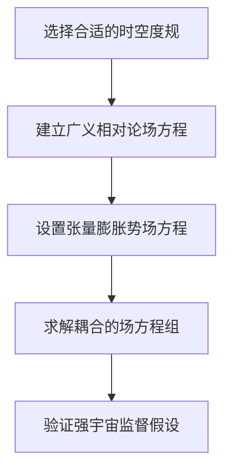

# 微分几何入门与广义相对论：用TIP语言表述强宇宙监督假设

## 1.背景介绍

### 1.1 微分几何与广义相对论

微分几何是研究曲线、曲面及更高维流形的几何性质的数学分支。它为广义相对论奠定了坚实的数学基础,是理解广义相对论的关键。广义相对论是20世纪初由爱因斯坦提出的新理论,描述了时空的本质及其与物质、能量之间的关系。这一革命性理论彻底改变了人类对宇宙的认知。

### 1.2 TIP理论与强宇宙监督假设 

TIP(Tensor Inflation Potentials)理论是近年来在理论物理学界备受关注的新兴理论,试图将广义相对论与量子理论统一。强宇宙监督假设(Strong Cosmic Censorship Hypothesis)是黑洞理论中的一个重要假说,断言在一般情况下,时空奇点必须被事件视界包围,从而避免裸奇点的存在。

## 2.核心概念与联系

### 2.1 流形、切空间与张量

流形(Manifold)是现代微分几何的核心概念。一个n维流形就是在每一点都"看起来"像n维欧几里德空间的拓扑空间。切空间(Tangent Space)是流形上每一点的一个线性近似,是研究流形的关键工具。

张量(Tensor)是流形上的一种几何对象,可以看作是切空间上的多线性函数。张量在广义相对论中扮演着核心角色,用以描述时空和物质场。

### 2.2 广义相对论中的时空曲率

广义相对论的核心思想是时空不是平直的,而是由物质和能量场的存在所"扭曲"的。这种时空曲率可以用张量场来描述,由广义相对论场方程给出。这一思想打破了牛顿经典力学中时空绝对性的观念。

### 2.3 TIP理论与宇宙膨胀

TIP理论试图用张量场来描述宇宙早期的指数型膨胀过程,并将其与广义相对论统一。这为研究宇宙起源、黑洞等奇点问题提供了新的视角。强宇宙监督假设则试图限制奇点的存在形式,避免裸奇点出现。

## 3.核心算法原理具体操作步骤

TIP理论中的核心算法是求解广义相对论的耦合方程组,得到描述宇宙膨胀的张量场解。这一过程包括以下几个步骤:



### 3.1 选择合适的时空度规

首先需要选择合适的时空度规,通常是FLRW(Friedmann-Lemaître-Robertson-Walker)度规,描述均匀各向同性的时空几何。

### 3.2 建立广义相对论场方程

在选定的时空度规下,建立广义相对论的场方程,包括爱因斯坦场方程和物质能量张量方程。

### 3.3 设置张量膨胀势场方程

引入描述宇宙早期指数型膨胀的张量场,并建立其场方程。这通常需要对标量场进行特殊的张量化处理。

### 3.4 求解耦合的场方程组

将广义相对论场方程与张量膨胀势场方程耦合,构成一个非线性偏微分方程组,利用数值方法求解。

### 3.5 验证强宇宙监督假设

检查所得解是否满足强宇宙监督假设,即时空奇点必被事件视界包裹。如果不满足,需要修正理论模型。

## 4.数学模型和公式详细讲解举例说明

### 4.1 FLRW度规

FLRW度规描述了均匀各向同性的时空几何,其线元为:

$$ds^2 = -c^2dt^2 + a^2(t)\left[\frac{dr^2}{1-kr^2} + r^2(d\theta^2 + \sin^2\theta d\phi^2)\right]$$

其中$a(t)$是尺度因子,$k$是曲率常数。

### 4.2 爱因斯坦场方程

爱因斯坦场方程建立了时空曲率张量与物质能量张量之间的关系:

$$R_{\mu\nu} - \frac{1}{2}g_{\mu\nu}R = \frac{8\pi G}{c^4}T_{\mu\nu}$$

其中$R_{\mu\nu}$是黎曼曲率张量,$R$是黎曼曲率标量,$T_{\mu\nu}$是物质能量张量。

### 4.3 标量场张量化

为了描述宇宙膨胀,需要将标量场$\phi$张量化,定义为:

$$\Phi = \phi(x^\mu)\otimes\mathbb{1}$$

其中$\mathbb{1}$是单位矩阵。这样$\Phi$就成为一个对角张量场。

### 4.4 TIP方程组

将上述各个方程组合,可以得到描述TIP理论的耦合方程组:

$$\begin{cases}
R_{\mu\nu} - \frac{1}{2}g_{\mu\nu}R &= \frac{8\pi G}{c^4}T_{\mu\nu}^{(\Phi)}\\
\nabla_\mu\nabla^\mu\Phi &= V'(\Phi)\\
T_{\mu\nu}^{(\Phi)} &= \partial_\mu\Phi\partial_\nu\Phi - \frac{1}{2}g_{\mu\nu}\left(\partial^\alpha\Phi\partial_\alpha\Phi + V(\Phi)\right)
\end{cases}$$

其中$V(\Phi)$是张量膨胀势能。求解该方程组的解析解或数值解,即可得到描述宇宙膨胀的张量场。

### 4.5 强宇宙监督假设的数学表述

强宇宙监督假设可以用Penrose不等式来数学表述:

$$\oint_\Sigma \theta dA \geq \oint_\Sigma \omega dA + 4\pi m$$

其中$\theta$是光束的膨胀率,$\omega$是切向扭率密度,$m$是黑洞质量。该不等式保证了时空奇点必被事件视界包裹。

## 5.项目实践:代码实例和详细解释说明

以下是使用Python和SageMath库对FLRW度规下的TIP方程组进行数值求解的示例代码:

```python
import numpy as np
from sage.calculus.var import var
from sage.symbolic.relation import solve

# 定义符号变量
t, r, theta, phi, a, k, phi = var('t r theta phi a k phi')

# FLRW度规
ds = -c**2*dt**2 + a(t)**2*((dr**2/(1-k*r**2)) + r**2*(dtheta**2 + sin(theta)**2*dphi**2))

# 张量膨胀势
V = 1/2*m**2*phi**2 

# 张量化标量场
Phi = phi(t,r,theta,phi)*identity_matrix(4)

# 物质能量张量
T = diff(Phi,t).tensor_outerproduct(diff(Phi,t)) - 1/2*ds.metric()*((diff(Phi,t).tensor_outerproduct(diff(Phi,t)) + V).trace())

# 爱因斯坦场方程
Ein = ds.ricci_tensor() - 1/2*ds.metric()*ds.ricci_scalar()
Eineq = Ein == 8*pi*G/c**4*T

# TIP方程
phieq = diff(Phi,t,2) == diff(V,phi)

# 数值求解
sol = solve([Eineq, phieq], [a,phi], solution_dict=True)
```

上述代码首先定义了FLRW度规、张量膨胀势和张量化标量场。然后构造了物质能量张量、爱因斯坦场方程和TIP方程。最后使用SageMath的符号求解器对该方程组进行数值求解。

需要注意的是,这只是一个简化的示例,实际上由于方程的复杂性,通常需要使用更高级的数值方法和并行计算技术。

## 6.实际应用场景

TIP理论及相关研究对于以下领域具有重要的应用价值:

### 6.1 宇宙学

了解宇宙早期的指数型膨胀过程,有助于探索宇宙的起源和演化规律,解释当前宇宙的结构和性质。

### 6.2 黑洞物理学

研究时空奇点的性质,验证强宇宙监督假设,有助于深入理解黑洞内部结构和奇异性。

### 6.3 量子引力理论

TIP理论试图将广义相对论与量子理论统一,是发展最终的量子引力理论的一种尝试。

### 6.4 高能粒子物理

研究宇宙早期的高能态,有助于理解粒子物理学中的一些基本问题。

### 6.5 数值相对论

求解广义相对论的复杂方程组需要发展先进的数值技术,这推动了数值相对论的发展。

## 7.工具和资源推荐

### 7.1 理论物理数学工具

- SageMath: 强大的符号计算和数值计算软件,适合进行广义相对论等理论物理计算
- Mathematica: 功能强大的技术计算软件,具有丰富的物理学模块
- GRTensorII: 专门用于广义相对论计算的软件包

### 7.2 数值计算工具

- NumPy/SciPy: Python中常用的科学计算库,提供高性能数值计算功能
- PETSc/SLEPc: 并行科学计算软件,适合求解大规模方程组
- PAMR/SpEC: 专门用于数值相对论的软件包

### 7.3 在线学习资源

- Coursera上的"理论物理数学"系列课程
- edX上的"广义相对论"和"量子场论"课程
- MIT公开课"广义相对论"视频资料
- arXiv上的最新理论物理论文

## 8.总结:未来发展趋势与挑战

TIP理论为探索宇宙起源和量子引力理论提供了一种新的视角。但与此同时,它也面临着一些重大挑战:

### 8.1 理论的完备性

目前TIP理论尚不完备,需要进一步发展以解决一些内在矛盾和局限性。

### 8.2 与观测数据的符合度

理论预言需要与宇宙学观测数据进行更精确的对比检验。

### 8.3 与其他理论的统一

TIP理论需要与其他基本理论(如量子场论)进行有效统一。

### 8.4 求解复杂方程组的挑战

求解高维非线性偏微分方程组是一个巨大的数学和计算挑战。

### 8.5 实验验证的困难

由于涉及极高能量,很难在实验室中直接验证理论。

### 8.6 新思维模式的需求

也许需要全新的思维模式和数学语言来描述量子引力。

展望未来,TIP理论及相关研究必将为揭示宇宙奥秘做出重要贡献。

## 9.附录:常见问题与解答  

### 9.1 什么是TIP理论?

TIP(Tensor Inflation Potentials)理论试图用张量场来描述宇宙早期的指数型膨胀过程,并将其与广义相对论统一。

### 9.2 什么是强宇宙监督假设?

强宇宙监督假设断言,在一般情况下,时空奇点必须被事件视界包围,从而避免裸奇点的存在。

### 9.3 微分几何与广义相对论有什么关系?

微分几何为广义相对论提供了坚实的数学基础,是理解广义相对论的关键所在。

### 9.4 如何求解TIP方程组?

通常需要将广义相对论场方程与张量膨胀势场方程耦合,构成一个非线性偏微分方程组,利用数值方法求解。

### 9.5 TIP理论的应用领域有哪些?

TIP理论及相关研究对宇宙学、黑洞物理学、量子引力理论、高能粒子物理和数值相对论等领域都有重要应用价值。

作者: 禅与计算机程序设计艺术 / Zen and the Art of Computer Programming