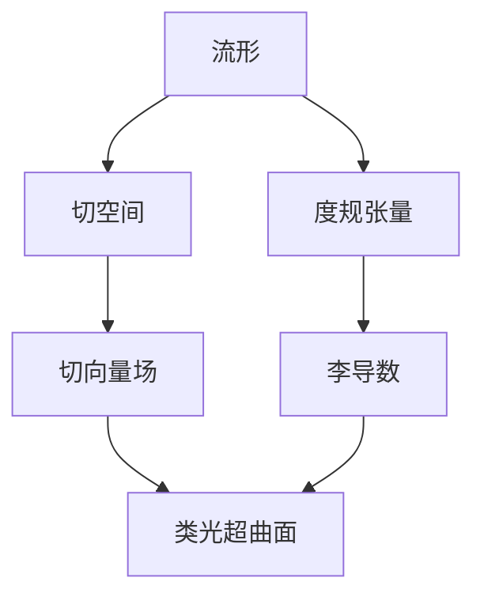
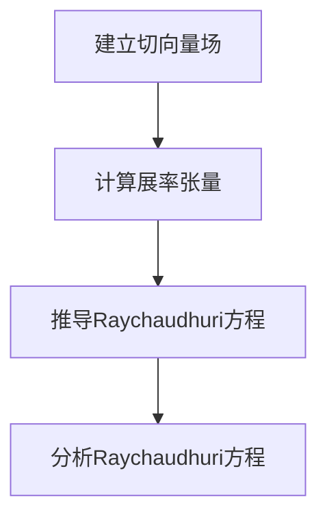

# 微分几何入门与广义相对论：类光超曲面上的Raychaudhuri方程

## 1.背景介绍

### 1.1 广义相对论简介
广义相对论是爱因斯坦于1915年提出的一种描述重力的理论,它将重力视为时空弯曲的现象。在这种理论中,物质和能量使时空产生弯曲,而物体沿着时空的曲率线运动。广义相对论不仅解释了牛顿经典力学无法解释的一些现象,如水星运行轨道展舒、光线偏折等,而且预言了黑洞和大爆炸的存在。

### 1.2 微分几何在广义相对论中的作用
微分几何是研究曲面和曲线的几何理论,为广义相对论提供了描述时空弯曲的数学工具。爱因斯坦场方程使用了微分几何中的张量分析,将物质和能量与时空曲率联系起来。因此,微分几何是理解和研究广义相对论的基础。

### 1.3 Raychaudhuri方程的重要性
Raychaudhuri方程描述了光线在弯曲时空中的行为,是广义相对论中的一个关键方程。它揭示了光线是如何聚焦或发散的,对于研究黑洞和宇宙学具有重要意义。Raychaudhuri方程建立在微分几何的基础之上,描述了类光超曲面上的光线传播。

## 2.核心概念与联系

### 2.1 流形(Manifold)
流形是微分几何中的核心概念,用于描述一般的几何空间。在广义相对论中,时空被视为一个四维流形。

### 2.2 切空间(Tangent Space)和切丛(Tangent Bundle)
切空间是流形上某一点的所有切向量组成的线性空间。切丛则是所有切空间组成的集合,用于研究流形上的切向量场。

### 2.3 度规张量(Metric Tensor)
度规张量定义了流形上的内积,描述了空间的几何性质。在广义相对论中,度规张量决定了时空的曲率。

### 2.4 切向量场(Vector Field)
切向量场是一个将每个流形点关联到一个切向量的函数。光线在时空中的传播可以用切向量场来描述。

### 2.5 李导数(Lie Derivative)
李导数描述了一个张量场沿着一个向量场的变化率。它在研究光线传播时扮演了关键角色。

### 2.6 类光超曲面(Null Hypersurface)
类光超曲面是由光线在时空中传播形成的曲面。Raychaudhuri方程描述了类光超曲面上光线的行为。



## 3.核心算法原理具体操作步骤

Raychaudhuri方程描述了类光超曲面上光线传播的行为,其推导过程如下:

### 3.1 建立切向量场
首先,我们需要建立一个切向量场 $\vec{k}$ 来描述光线在时空中的传播。这个切向量场满足以下条件:

$$
\vec{k} \cdot \vec{k} = 0 \quad \text{(光线是无质量的)}
$$

### 3.2 计算展率张量
接下来,我们需要计算展率张量 $\theta$,它描述了光线是如何聚焦或发散的。展率张量的定义为:

$$
\theta \equiv \nabla_{\vec{k}} \vec{k}
$$

其中 $\nabla_{\vec{k}}$ 表示沿着 $\vec{k}$ 方向的协变导数。

### 3.3 推导Raychaudhuri方程
利用展率张量的定义,我们可以推导出Raychaudhuri方程:

$$
\frac{d\theta}{d\lambda} = -\frac{1}{2}\theta^2 - \sigma_{\mu\nu}\sigma^{\mu\nu} - R_{\mu\nu}k^\mu k^\nu
$$

这里 $\lambda$ 是仿射参数, $\sigma_{\mu\nu}$ 是剪切张量, $R_{\mu\nu}$ 是黎曼曲率张量。

该方程描述了展率张量沿着光线传播方向的变化率。右边第一项表示光线本身的聚焦或发散效应,第二项表示剪切效应,第三项表示时空曲率对光线的影响。

### 3.4 分析Raychaudhuri方程
- 当 $\theta < 0$ 时,光线发散;当 $\theta > 0$ 时,光线聚焦。
- 如果 $R_{\mu\nu}k^\mu k^\nu < 0$,时空的曲率会加速光线的聚焦。这种情况下,如果没有其他力量阻止,光线会在有限仿射参数处聚焦形成奇点,即黑洞。
- 如果 $R_{\mu\nu}k^\mu k^\nu > 0$,时空的曲率会减缓光线的聚焦,甚至使光线发散。这在描述大爆炸之后的宇宙膨胀时很重要。



## 4.数学模型和公式详细讲解举例说明

### 4.1 流形和切空间
流形是一种抽象的几何概念,用于描述一般的空间。一个 $n$ 维流形 $\mathcal{M}$ 在每一点都可以赋予一个 $n$ 维切空间 $T_p\mathcal{M}$,切空间由所有过该点的切向量组成。

例如,在二维欧几里得空间中,一条曲线就是一个一维流形。在每一点,切空间由该点的切向量构成。

### 4.2 度规张量
度规张量 $g_{\mu\nu}$ 定义了流形上的内积,描述了空间的几何性质。在广义相对论中,度规张量决定了时空的曲率。

对于任意两个向量 $\vec{u}$、$\vec{v}$,它们的内积可以写作:

$$
\vec{u} \cdot \vec{v} = g_{\mu\nu}u^\mu v^\nu
$$

其中 $u^\mu$、$v^\nu$ 是向量 $\vec{u}$、$\vec{v}$ 的分量。

例如,在四维时空中,度规张量可以写作:

$$
g_{\mu\nu} = \begin{pmatrix}
-c^2 & 0 & 0 & 0\\
0 & 1 & 0 & 0\\
0 & 0 & 1 & 0\\
0 & 0 & 0 & 1
\end{pmatrix}
$$

这就是著名的洛伦兹度规,描述了特殊相对论中的时空结构。

### 4.3 切向量场
切向量场 $\vec{X}$ 是一个将每个流形点关联到一个切向量的函数:

$$
\vec{X}: \mathcal{M} \rightarrow T\mathcal{M}, \quad p \mapsto \vec{X}_p
$$

其中 $T\mathcal{M}$ 是切丛,包含了所有切空间。

在广义相对论中,光线在时空中的传播可以用切向量场来描述。对于每一点,切向量场给出了光线在该点的传播方向。

### 4.4 李导数
李导数描述了一个张量场沿着一个向量场的变化率。对于任意张量场 $T$,其沿着向量场 $\vec{X}$ 的李导数定义为:

$$
\mathcal{L}_{\vec{X}}T \equiv \lim_{\epsilon\rightarrow 0}\frac{1}{\epsilon}\left(\Phi_{\epsilon*}T - T\right)
$$

这里 $\Phi_\epsilon$ 是沿着向量场 $\vec{X}$ 流动 $\epsilon$ 单位时间的微分同胚。

在研究光线传播时,我们需要计算展率张量沿着切向量场的李导数,即 $\mathcal{L}_{\vec{k}}\theta$,从而得到Raychaudhuri方程。

### 4.5 剪切张量
剪切张量 $\sigma_{\mu\nu}$ 描述了光线在传播过程中的剪切变形。它是展率张量的无迹部分:

$$
\sigma_{\mu\nu} \equiv \left(\nabla_\mu k_\nu + \nabla_\nu k_\mu\right) - \frac{1}{2}g_{\mu\nu}\theta
$$

剪切张量在Raychaudhuri方程的右边第二项中出现,表示剪切效应对光线聚焦或发散的影响。

### 4.6 黎曼曲率张量
黎曼曲率张量 $R_{\mu\nu\rho\sigma}$ 描述了流形的内在曲率,在广义相对论中用于描述时空的曲率。它的定义为:

$$
R_{\mu\nu\rho}^{\;\;\;\;\sigma} \equiv \partial_\mu\Gamma_{\nu\rho}^{\sigma} - \partial_\nu\Gamma_{\mu\rho}^{\sigma} + \Gamma_{\mu\lambda}^{\sigma}\Gamma_{\nu\rho}^{\lambda} - \Gamma_{\nu\lambda}^{\sigma}\Gamma_{\mu\rho}^{\lambda}
$$

其中 $\Gamma_{\mu\nu}^{\rho}$ 是引力连接,描述了流形上的平行移动。

在Raychaudhuri方程中,我们只需要黎曼曲率张量与切向量场的收缩 $R_{\mu\nu}k^\mu k^\nu$,它描述了时空曲率对光线聚焦或发散的影响。

通过上述数学工具,我们可以准确地描述光线在弯曲时空中的行为,从而研究广义相对论中的各种现象。

## 5.项目实践:代码实例和详细解释说明

为了更好地理解Raychaudhuri方程在实践中的应用,我们将编写一个Python程序来模拟光线在曲率时空中的传播。

在这个示例中,我们将考虑一个简单的二维时空模型,其度规张量为:

$$
g_{\mu\nu} = \begin{pmatrix}
-e^{2\Phi(r)} & 0\\
0 & e^{2\Lambda(r)}
\end{pmatrix}
$$

其中 $\Phi(r)$ 和 $\Lambda(r)$ 是与径向坐标 $r$ 有关的函数,描述了时空的曲率。

我们将沿着径向方向发射一束光线,并计算它们在传播过程中的展率张量和剪切张量。

### 5.1 导入所需的库

```python
import numpy as np
import matplotlib.pyplot as plt
```

### 5.2 定义时空度规和相关函数

```python
def metric(r, phi, lam):
    """
    返回给定坐标和度规函数的度规张量
    """
    g = np.array([[-np.exp(2 * phi), 0], [0, np.exp(2 * lam)]])
    return g

def christoffel(r, phi, lam, dphi, dlam):
    """
    计算引力连接符
    """
    gamma = np.zeros((2, 2, 2))
    gamma[0, 1, 1] = gamma[1, 0, 1] = np.exp(-2 * lam) * dlam
    gamma[1, 0, 0] = gamma[0, 1, 0] = np.exp(-2 * phi) * dphi
    return gamma

def riemann(r, phi, lam, dphi, dlam, ddphi, ddlam):
    """
    计算黎曼曲率张量
    """
    gamma = christoffel(r, phi, lam, dphi, dlam)
    riemann = np.zeros((2, 2, 2, 2))
    riemann[0, 1, 0, 1] = -np.exp(-2 * lam) * ddlam
    riemann[1, 0, 1, 0] = -np.exp(-2 * phi) * ddphi
    for i in range(2):
        for j in range(2):
            for k in range(2):
                for l in range(2):
                    riemann[i, j, k, l] += (
                        gamma[i, j, m] * gamma[m, k, l]
                        - gamma[i, k, m] * gamma[m, j, l]
                    )
    return riemann
```

### 5.3 定义光线传播函数

```python
def propagate(r0, k0, steps, phi, lam, dphi, dlam, ddphi, ddlam):
    """
    模拟光线在曲率时空中的传播
    """
    r = r0
    k = k0
    theta = []
    sigma = []
    for _ in range(steps):
        g = metric(r, phi(r), lam(r))
        gamma = christoffel(r, phi(r), lam(r), dphi(r), dlam(r))
        riemann =