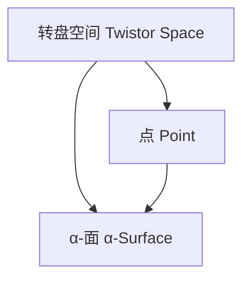

# 微分几何入门与广义相对论：转盘系的空间几何

## 1.背景介绍

微分几何是研究曲线、曲面及更高维流形的几何性质的数学分支。它在物理学中扮演着重要角色,尤其是在相对论和量子场论中。广义相对论是爱因斯坦于1915年提出的理论,描述了时空的本质及其与物质的相互作用。该理论将时间和空间统一为时空连续体,并引入了曲率的概念。

转盘系(Twistor Theory)是由英国数学家罗杰·彭罗斯于1967年提出的一种新的几何语言,旨在统一经典场论和量子理论。它将物理学中的场方程转化为代数几何中的代数方程,从而简化了复杂的微分方程。转盘系不仅在数学物理领域有重要应用,在代数几何、代数拓扑和复分析等纯数学领域也有广泛影响。

### 1.1 微分几何与物理学

微分几何为物理学提供了描述时空的数学工具。例如,广义相对论中的Einstein场方程描述了时空曲率与物质能量动量张量之间的关系:

$$
R_{\mu\nu} - \frac{1}{2}g_{\mu\nu}R = \frac{8\pi G}{c^4}T_{\mu\nu}
$$

其中$R_{\mu\nu}$是黎曼曲率张量,$R$是黎曼曲率标量,$g_{\mu\nu}$是度规张量,$T_{\mu\nu}$是能量动量张量。这个方程揭示了时空几何与物质分布之间的内在联系。

### 1.2 转盘系的产生

转盘系的产生源于彭罗斯对解决量子理论与相对论统一的追求。经典场论和量子理论在数学结构上存在巨大差异,使得两者的统一成为一个巨大挑战。转盘系通过将物理量用代数几何对象表示,为两者的统一提供了一种新的几何语言。

## 2.核心概念与联系

### 2.1 转盘系的基本概念

转盘系的核心概念是转盘(Twistor),它是一个四维复射影空间$\mathbb{CP}^3$中的无穷小元素。一个转盘$Z^\alpha$可以表示为一个四元组$(ω^A, \pi_{A'})$,其中$\omega^A$是一个双旋量,描述了一条光线在复空间中的方向,$\pi_{A'}$是另一个双旋量,描述了该光线在实空间中的位置。

转盘空间$\mathbb{PT}$是所有转盘的集合,它是一个六维复射影空间$\mathbb{CP}^{3}\times\mathbb{CP}^{3}$。在转盘空间中,一个点$(x^{\mu})$对应于一个实analyticα曲面,称为α-面。反之,一个α-面对应于一个点。这种对应关系被称为彭罗斯变换。



### 2.2 转盘系与微分几何

转盘系与微分几何之间存在着内在联系。在转盘空间中,一条光线对应于一个α-面上的一个点。而α-面本身对应于一个点在实空间中的全部光锥(光锥是由所有通过该点的光线所构成的曲面)。这种对应关系使得转盘系能够将复杂的微分方程简化为代数方程。

例如,在转盘空间中,Maxwell方程可以表示为:

$$
\nabla^{A'B'}\phi_{AB'} = 0
$$

其中$\phi_{AB'}$是一个转盘函数,描述了电磁场。这个代数方程比原始的Maxwell微分方程更加简洁。

### 2.3 转盘系与广义相对论

转盘系也为广义相对论提供了一种新的几何描述。在转盘空间中,时空可以被看作是一个实analyticα曲面的集合。这些α-面满足一些代数约束条件,这些条件对应于Einstein场方程。

因此,通过研究转盘空间中的α-面,我们可以获得广义相对论的解析解。这为求解Einstein场方程提供了一种新的途径。

## 3.核心算法原理具体操作步骤

### 3.1 转盘系的基本算法

转盘系的核心算法是将物理量(如电磁场、引力场等)表示为转盘函数,然后在转盘空间中研究这些函数的性质。具体步骤如下:

1. 将物理量用转盘函数表示。例如,电磁场可以表示为$\phi_{AB'}$。
2. 在转盘空间$\mathbb{PT}$中研究转盘函数的解析性质。
3. 利用彭罗斯变换将转盘函数在转盘空间中的性质转化为实空间中的物理量的性质。

这种算法的优势在于,它将复杂的微分方程简化为代数方程,从而使得求解过程更加简单。

### 3.2 求解Maxwell方程的示例

我们以求解Maxwell方程为例,说明转盘系算法的具体步骤:

1. 将电磁场表示为转盘函数$\phi_{AB'}$。
2. 在转盘空间$\mathbb{PT}$中,Maxwell方程可以写为:

$$
\nabla^{A'B'}\phi_{AB'} = 0
$$

这是一个代数方程,比原始的微分方程更加简洁。

3. 求解这个代数方程,得到$\phi_{AB'}$的解析解。
4. 利用彭罗斯变换,将$\phi_{AB'}$在转盘空间中的解析解转化为实空间中电磁场的解。

通过这种方式,我们可以避免直接求解复杂的Maxwell微分方程,而是在转盘空间中求解更简单的代数方程。

### 3.3 求解Einstein场方程的示例

类似地,我们可以利用转盘系求解Einstein场方程。具体步骤如下:

1. 在转盘空间$\mathbb{PT}$中,时空被表示为一族实analyticα曲面。
2. 这些α-面满足一些代数约束条件,这些条件对应于Einstein场方程。
3. 求解这些代数约束条件,得到α-面的解析解。
4. 利用彭罗斯变换,将α-面的解析解转化为实空间中的时空几何解。

通过这种方式,我们将复杂的Einstein微分方程转化为代数约束条件,从而简化了求解过程。

## 4.数学模型和公式详细讲解举例说明

在这一部分,我们将详细讲解转盘系中的一些核心数学模型和公式,并给出具体的例子说明。

### 4.1 转盘空间的数学结构

转盘空间$\mathbb{PT}$是一个六维复射影空间$\mathbb{CP}^{3}\times\mathbb{CP}^{3}$。它可以用两个复射影三维空间$\mathbb{CP}^3$的直积来表示。

每个转盘$Z^\alpha$可以表示为一个四元组$(ω^A, \pi_{A'})$,其中$\omega^A$和$\pi_{A'}$都是双旋量。双旋量是一种特殊的张量,它可以用两个复数表示。

在转盘空间中,一个点$(x^{\mu})$对应于一个实analyticα曲面,该曲面由所有通过该点的光线构成。反之,一个α-面对应于一个点。这种对应关系被称为彭罗斯变换。

### 4.2 彭罗斯变换

彭罗斯变换建立了转盘空间$\mathbb{PT}$和实空间$\mathbb{M}$之间的对应关系。具体来说,对于实空间中的一个点$(x^{\mu})$,它在转盘空间中对应于一个实analyticα曲面$X$,该曲面由所有通过$(x^{\mu})$的光线构成。反之,一个α-面$X$对应于实空间中的一个点$(x^{\mu})$。

数学上,这种对应关系可以用以下方程表示:

$$
\omega^A = ix^{\alpha\alpha'}\pi_{A'}
$$

其中$x^{\alpha\alpha'}$是一个旋量,它将双旋量$\pi_{A'}$映射到另一个双旋量$\omega^A$上。

这种对应关系使得我们可以在转盘空间中研究α-面的性质,并将结果转化为实空间中的物理量。

### 4.3 转盘函数

在转盘系中,物理量被表示为转盘函数。例如,电磁场可以表示为一个转盘函数$\phi_{AB'}$,它是一个双旋量值函数,定义在转盘空间$\mathbb{PT}$上。

对于任意一个α-面$X$,我们可以将$\phi_{AB'}$限制在$X$上,得到一个新的函数$\phi_X$。这个新函数描述了α-面$X$对应的实空间点$(x^{\mu})$处的电磁场。

转盘函数满足一些微分方程,这些方程对应于实空间中的物理定律。例如,Maxwell方程在转盘空间中可以写为:

$$
\nabla^{A'B'}\phi_{AB'} = 0
$$

这是一个代数方程,比原始的微分方程更加简洁。

通过研究这些代数方程的解析解,我们可以获得实空间中物理量的解。

### 4.4 广义相对论中的转盘系

在广义相对论中,时空被看作是一族实analyticα曲面的集合。这些α-面满足一些代数约束条件,这些条件对应于Einstein场方程。

具体来说,对于一个给定的能量动量张量$T_{\mu\nu}$,存在一族α-面满足以下约束条件:

$$
\Omega_{ABCD}\pi^{A'}\pi^{B'}\pi^{C'}\pi^{D'} = T_{\mu\nu}\pi^{A'}\pi^{B'}
$$

其中$\Omega_{ABCD}$是一个四旋量,它描述了时空的曲率。

通过求解这些代数约束条件,我们可以获得α-面的解析解,进而利用彭罗斯变换得到实空间中的时空几何解。

这种方法为求解Einstein场方程提供了一种新的途径,避免了直接求解复杂的微分方程。

## 5.项目实践:代码实例和详细解释说明

在这一部分,我们将给出一些实际的代码示例,展示如何利用转盘系进行计算和模拟。

### 5.1 计算转盘函数的示例

下面是一个Python代码示例,用于计算一个简单的转盘函数:

```python
import numpy as np

# 定义转盘空间坐标
omega_A = np.array([1.0, 2.0, 3.0, 4.0])
pi_Ap = np.array([5.0, 6.0, 7.0, 8.0])

# 定义转盘函数
def twistor_function(omega_A, pi_Ap):
    return np.sum(omega_A * pi_Ap)

# 计算转盘函数的值
result = twistor_function(omega_A, pi_Ap)
print(f"Twistor function value: {result}")
```

在这个示例中,我们首先定义了转盘空间坐标`omega_A`和`pi_Ap`。然后,我们定义了一个简单的转盘函数`twistor_function`,它计算`omega_A`和`pi_Ap`的点积。最后,我们计算并打印出这个转盘函数的值。

这个示例展示了如何在代码中表示和操作转盘空间中的对象。在实际应用中,我们可以定义更加复杂的转盘函数,并研究它们的性质。

### 5.2 求解Maxwell方程的示例

下面是一个Python代码示例,用于求解Maxwell方程在转盘空间中的代数形式:

```python
import sympy as sp

# 定义转盘空间坐标
omega_A, pi_Ap = sp.symbols('omega_A pi_Ap', cls=sp.IndexedBase)

# 定义转盘函数
phi_ABp = sp.IndexedBase('phi_ABp')

# Maxwell方程在转盘空间中的形式
maxwell_equation = sp.Sum(sp.diff(phi_ABp[i, j], pi_Ap[j]), (j, 0, 3))

# 求解Maxwell方程
solution = sp.solve(maxwell_equation, phi_ABp)

print(f"Solution to Maxwell's equation in twistor space: {solution}")
```

在这个示例中,我们首先使用SymPy库定义了转盘空间坐标`omega_A`和`pi_Ap`。然后,我们定义了一个转盘函数`phi_ABp`。

接下来,我们构造了Maxwell方程在转