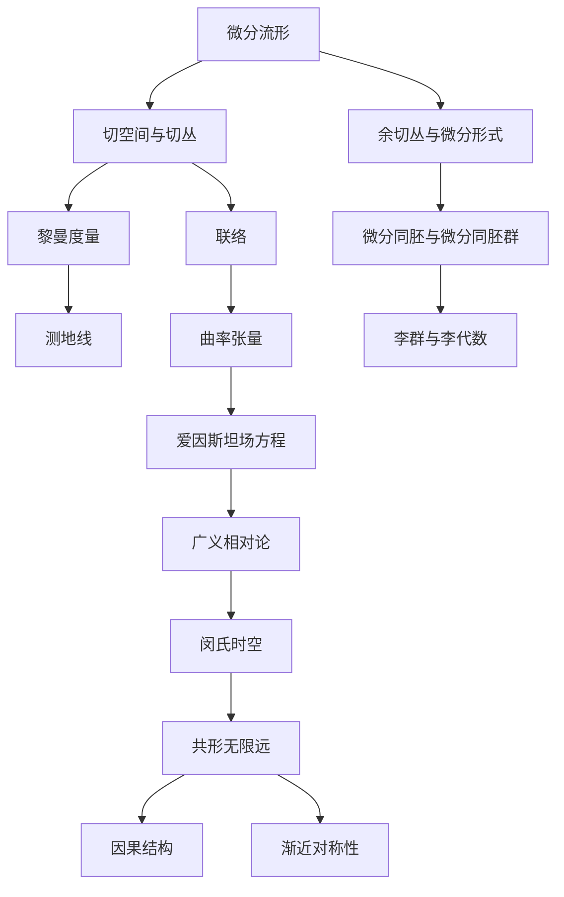

# 微分几何入门与广义相对论：闵氏时空的共形无限远

## 1.背景介绍

### 1.1 微分几何的发展历程
#### 1.1.1 微分几何的起源
#### 1.1.2 现代微分几何的建立
#### 1.1.3 微分几何在物理学中的应用

### 1.2 广义相对论概述  
#### 1.2.1 狭义相对论的局限性
#### 1.2.2 广义相对论的基本原理
#### 1.2.3 广义相对论的数学基础

### 1.3 闵氏时空简介
#### 1.3.1 闵氏时空的定义
#### 1.3.2 闵氏时空的性质
#### 1.3.3 闵氏时空在广义相对论中的重要性

## 2.核心概念与联系

### 2.1 微分流形
#### 2.1.1 拓扑空间与微分结构
#### 2.1.2 切空间与切丛
#### 2.1.3 余切丛与微分形式

### 2.2 联络与曲率
#### 2.2.1 黎曼度量与克氏符
#### 2.2.2 联络的概念与性质
#### 2.2.3 曲率张量与黎曼曲率张量

### 2.3 共形变换与共形无限远
#### 2.3.1 共形变换的定义与性质
#### 2.3.2 闵氏时空的共形无限远
#### 2.3.3 共形无限远与因果结构

## 3.核心算法原理具体操作步骤

### 3.1 测地线方程的推导
#### 3.1.1 变分法与欧拉-拉格朗日方程
#### 3.1.2 测地线方程的导出
#### 3.1.3 测地线方程的物理意义

### 3.2 曲率张量的计算
#### 3.2.1 克氏符的计算方法
#### 3.2.2 黎曼曲率张量的计算步骤
#### 3.2.3 里奇张量与标量曲率的计算

### 3.3 共形无限远的构造
#### 3.3.1 闵氏时空的共形嵌入
#### 3.3.2 共形无限远边界的定义
#### 3.3.3 共形无限远边界的性质

## 4.数学模型和公式详细讲解举例说明

### 4.1 微分流形与切丛
#### 4.1.1 微分流形的定义与例子
#### 4.1.2 切空间与切向量的计算
#### 4.1.3 切丛的构造与性质

### 4.2 黎曼度量与测地线
#### 4.2.1 黎曼度量的定义与性质
#### 4.2.2 测地线方程的详细推导
#### 4.2.3 测地线的几何意义与例子

### 4.3 曲率张量与爱因斯坦场方程
#### 4.3.1 黎曼曲率张量的定义与性质
#### 4.3.2 爱因斯坦场方程的推导
#### 4.3.3 爱因斯坦场方程的物理意义

## 5.项目实践：代码实例和详细解释说明

### 5.1 微分流形与切丛的计算机实现
#### 5.1.1 流形的数据结构设计
#### 5.1.2 切向量与切丛的数值计算
#### 5.1.3 微分形式的离散化表示

### 5.2 测地线方程的数值求解
#### 5.2.1 测地线方程的数值离散化
#### 5.2.2 测地线方程的数值求解算法
#### 5.2.3 测地线可视化与分析

### 5.3 曲率张量与爱因斯坦场方程的数值模拟
#### 5.3.1 黎曼曲率张量的数值计算
#### 5.3.2 爱因斯坦场方程的数值离散化
#### 5.3.3 引力场的数值模拟与可视化

## 6.实际应用场景

### 6.1 广义相对论在天体物理中的应用
#### 6.1.1 黑洞与视界的研究
#### 6.1.2 引力波的探测与分析
#### 6.1.3 宇宙学模型的构建

### 6.2 微分几何在计算机视觉中的应用
#### 6.2.1 曲面重建与参数化
#### 6.2.2 形状分析与特征提取
#### 6.2.3 图像配准与变换

### 6.3 微分几何在机器学习中的应用
#### 6.3.1 流形学习与降维
#### 6.3.2 黎曼度量学习
#### 6.3.3 几何深度学习

## 7.工具和资源推荐

### 7.1 微分几何学习资源
#### 7.1.1 经典教材与参考书
#### 7.1.2 在线课程与视频教程
#### 7.1.3 学术论文与研究综述

### 7.2 广义相对论学习资源
#### 7.2.1 物理学经典著作
#### 7.2.2 相对论专题讲义
#### 7.2.3 科普读物与通俗著作

### 7.3 计算机辅助工具
#### 7.3.1 数学软件与符号计算系统
#### 7.3.2 可视化与绘图工具
#### 7.3.3 数值计算与模拟平台

## 8.总结：未来发展趋势与挑战

### 8.1 微分几何的前沿研究方向
#### 8.1.1 非交换几何与量子群
#### 8.1.2 几何流与几何分析
#### 8.1.3 拓扑数据分析与应用

### 8.2 广义相对论的未来发展
#### 8.2.1 量子引力理论的探索
#### 8.2.2 宇宙学的前沿问题
#### 8.2.3 引力波天文学的发展

### 8.3 交叉学科的机遇与挑战
#### 8.3.1 微分几何与物理学的融合
#### 8.3.2 微分几何在信息科学中的应用
#### 8.3.3 微分几何与人工智能的结合

## 9.附录：常见问题与解答

### 9.1 微分几何的学习建议
#### 9.1.1 学习路线与方法
#### 9.1.2 常见误区与注意事项
#### 9.1.3 深入学习的参考资料

### 9.2 广义相对论的理解难点
#### 9.2.1 时空观念的转变
#### 9.2.2 数学工具的掌握
#### 9.2.3 物理直觉的培养

### 9.3 计算机实现的常见问题
#### 9.3.1 数值稳定性与误差控制
#### 9.3.2 大规模计算与优化
#### 9.3.3 可视化与交互式探索

微分几何作为现代数学的重要分支,在理论研究和应用领域都有着广泛而深刻的影响。它不仅为广义相对论等物理学理论提供了坚实的数学基础,也在计算机科学、机器学习等领域展现出巨大的应用潜力。

本文以闵氏时空的共形无限远为切入点,系统介绍了微分几何的核心概念和方法,并探讨了其在广义相对论中的重要应用。通过对微分流形、黎曼几何、联络与曲率等概念的深入讲解,读者可以建立起微分几何的基本框架,并理解其在物理学和计算机科学中的应用原理。

在具体内容方面,本文重点介绍了测地线方程、曲率张量、爱因斯坦场方程等核心算法与模型,并给出了详细的数学推导和代码实例。通过对这些内容的学习,读者可以掌握微分几何的基本计算方法,并将其应用到实际问题的求解中。

此外,本文还讨论了微分几何在天体物理、计算机视觉、机器学习等领域的实际应用场景,展示了这一学科的广阔前景。通过对前沿研究方向和未来发展趋势的展望,读者可以了解微分几何的最新进展,并思考其在交叉学科中的机遇与挑战。

总的来说,微分几何是一门内容丰富、思想深刻的数学学科,它不仅为物理学和计算机科学等领域提供了重要的理论工具,也为我们认识自然、探索未知打开了新的视角。通过本文的学习,相信读者能够对微分几何有一个全面而深入的了解,并为进一步的研究和应用打下坚实的基础。

作者：禅与计算机程序设计艺术 / Zen and the Art of Computer Programming