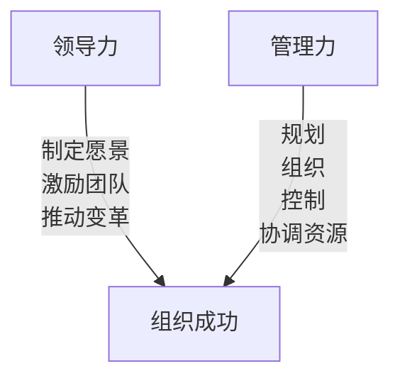
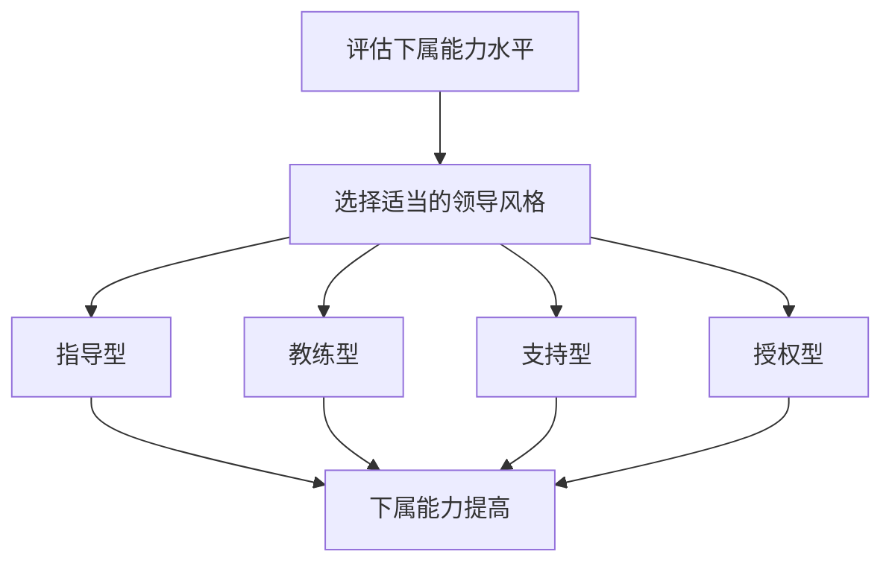

# 怎样培养出色的领导和管理能力

## 1.背景介绍

在当今瞬息万变的商业环境中，拥有出色的领导和管理能力已经成为组织成功的关键因素。无论是初创公司还是跨国企业,都需要有远见卓识、富有魄力的领导者,以及高效管理团队来引领公司走向辉煌。然而,培养出色的领导和管理者绝非一蹴而就,需要系统的学习、实践和自我提升。

## 2.核心概念与联系 

### 2.1 领导力与管理力的区别

领导力和管理力虽然密切相关,但却有着本质的区别。领导力侧重于制定愿景、激励团队、推动变革;而管理力则更注重规划、组织、控制和协调资源,确保日常运营高效有序。优秀的领导者应该具备远见卓识、魄力和影响力,能够激发团队的热情和潜能;而出色的管理者则需要专业的知识技能,精于计划、组织和控制。



### 2.2 领导力的核心要素

卓越的领导力通常包含以下几个核心要素:

1. **远见卓识**:能够洞察行业趋势,制定清晰的愿景和战略方向。
2. **激励能力**:善于激发团队的热情和潜能,营造积极向上的氛围。
3. **决策力**:在复杂环境下,能够果断做出正确决策。
4. **沟通技巧**:擅长倾听和表达,与团队建立有效沟通。
5. **情商管理**:具备高度的情商,能够处理人际关系和管理情绪。

### 2.3 管理力的核心要素

出色的管理力则需要掌握以下核心技能:

1. **规划能力**:能够制定详细的工作计划和目标。
2. **组织协调**:善于组织和分配资源,协调团队高效运作。
3. **控制监督**:对工作进度和质量进行有效的控制和监督。
4. **解决问题**:快速识别并解决工作中遇到的各种问题。
5. **专业知识**:掌握所在领域的专业知识和技能。

## 3.核心算法原理具体操作步骤

培养出色的领导和管理能力需要遵循一定的原理和步骤,这里介绍一种广为人知的"情景领导理论"(Situational Leadership Theory)。



1. **评估下属的能力水平**:根据下属的工作能力、经验和自我驱动力,将其划分为四个层次:新手、有能力但缺乏自信、有能力且自信、高度自主。

2. **选择适当的领导风格**:根据下属的能力水平,领导者应采取不同的领导风格:
   - 指导型:对于新手,领导者需要给予明确的指导和监督。
   - 教练型:对有能力但缺乏自信的下属,领导者应当提供建议和支持。
   - 支持型:对于有能力且自信的下属,领导者可以适当放权,提供必要的支持。
   - 授权型:对于高度自主的下属,领导者可以完全授权,让其自主工作。

3. **持续调整领导风格**:随着下属能力的提高,领导者应当及时调整领导风格,给予更多自主权和责任,促进下属的成长。

4. **建立双向沟通机制**:领导者要与下属保持良好的沟通,了解他们的需求和困难,并提供必要的支持和反馈。

通过情景领导理论,领导者可以根据不同下属的能力水平,采取合适的领导方式,从而最大限度地发挥团队的潜能。

## 4.数学模型和公式详细讲解举例说明

在管理学领域,有一些数学模型和公式可以帮助我们更好地理解和优化管理过程。以下是一些常见的模型和公式:

### 4.1 小世界网络模型

小世界网络模型(Small-World Network Model)是一种描述复杂系统中节点之间关系的模型,它可以用来分析和优化组织内部的信息流动和协作效率。

在这个模型中,每个节点代表一个个体或部门,边代表它们之间的关系或联系。小世界网络具有以下两个特征:

1. **高聚类系数**:网络中的节点倾向于形成紧密的小团体或集群。
2. **短平均路径长度**:任意两个节点之间的平均距离(边的数量)都很短。

小世界网络模型的数学表达式如下:

$$
C(G) = \frac{1}{n}\sum_{i=1}^{n}C_i \\
L(G) = \frac{1}{n(n-1)}\sum_{i\neq j}d(i,j)
$$

其中:
- $C(G)$表示网络的平均聚类系数,反映了节点形成紧密集群的程度。
- $C_i$表示节点$i$的聚类系数,即节点$i$的邻居节点之间实际存在的边数与最大可能边数之比。
- $L(G)$表示网络的平均路径长度,反映了任意两个节点之间的平均距离。
- $d(i,j)$表示节点$i$和节点$j$之间的最短路径长度。
- $n$表示网络中节点的总数。

通过优化组织的小世界网络结构,可以提高信息传递效率,促进跨部门协作,从而提高整体管理效率。

### 4.2 队列理论模型

队列理论模型(Queueing Theory Model)是一种描述和优化服务系统的数学模型,它可以用于分析和改进组织内部的工作流程和资源分配。

在队列理论中,客户到达服务系统形成一个队列,由服务台(服务器)按先来先服务的原则为客户提供服务。队列模型的核心参数包括:

- $\lambda$:客户到达率(每单位时间内到达的客户数)
- $\mu$:服务率(每单位时间内服务器可以服务的客户数)
- $\rho = \lambda / \mu$:系统利用率或繁忙度
- $L_q$:队列长度(等待服务的客户数)
- $W_q$:队列等待时间(客户在队列中等待的平均时间)

对于最简单的M/M/1队列模型(客户到达服从泊松分布,服务时间服从负指数分布,只有一个服务台),平均队列长度和平均等待时间的公式如下:

$$
L_q = \frac{\rho^2}{1-\rho} \\
W_q = \frac{\rho}{\mu(1-\rho)}
$$

通过分析队列模型,管理者可以优化服务系统的配置,如增加服务台数量、提高服务率等,从而缩短队列长度和等待时间,提高工作效率和客户满意度。

## 5.项目实践:代码实例和详细解释说明

为了更好地理解和应用领导力和管理力理论,我们可以通过编程实现一些相关的模型和算法。以下是一个使用Python实现小世界网络模型的示例:

```python
import networkx as nx
import matplotlib.pyplot as plt

# 创建一个随机的小世界网络
n = 100  # 节点数量
k = 4    # 每个节点的邻居数
p = 0.1  # 重连边的概率

# 生成Watts-Strogatz小世界网络模型
G = nx.watts_strogatz_graph(n, k, p)

# 计算网络的聚类系数和平均路径长度
clustering_coeff = nx.average_clustering(G)
avg_path_length = nx.average_shortest_path_length(G)

print(f"聚类系数: {clustering_coeff:.4f}")
print(f"平均路径长度: {avg_path_length:.4f}")

# 可视化网络结构
pos = nx.spring_layout(G)
nx.draw(G, pos, node_color='lightblue', with_labels=False)
plt.show()
```

在这个示例中,我们使用NetworkX库生成一个Watts-Strogatz小世界网络模型,并计算其聚类系数和平均路径长度。最后,我们使用Matplotlib库将网络结构可视化。

运行这段代码,你将看到输出的聚类系数和平均路径长度,以及网络结构的可视化图形。通过调整参数`n`、`k`和`p`,你可以观察不同网络结构的特征。

这个示例展示了如何使用编程来实现和分析小世界网络模型,有助于加深对该模型的理解和应用。同样,你也可以尝试实现其他管理模型和算法,以巩固对领导力和管理力理论的掌握。

## 6.实际应用场景

出色的领导力和管理力在各个领域都有广泛的应用,以下是一些典型的应用场景:

1. **企业管理**:企业领导者需要具备远见卓识和激励能力,制定发展战略并带领团队执行;中层管理者则需要掌握规划、组织、控制等管理技能,确保日常运营高效有序。

2. **项目管理**:项目经理需要具备出色的领导力,能够有效协调各方资源,推动项目顺利进行;同时也需要掌握项目管理的专业知识和技能,如进度控制、风险管理等。

3. **政府机构**:政府官员需要具备卓越的领导力,制定符合民意的政策方针,并有效推动执行;同时也需要管理好内部机构的运作,提高行政效率。

4. **非营利组织**:非营利组织的领导者需要具备远见卓识和感染力,树立组织的使命和价值观,激励志愿者和员工的工作热情;同时也需要管理好有限的资源,确保组织高效运转。

5. **教育机构**:学校领导需要具备领导力,制定办学理念和发展规划,营造良好的学习氛围;同时也需要管理好教职工队伍,优化教学资源的配置。

6. **体育队伍**:优秀的教练需要具备出色的领导力,能够激励运动员发挥最佳水平;同时也需要掌握科学的训练管理方法,合理安排训练计划。

无论是在哪个领域,出色的领导力和管理力都是组织取得成功的关键因素。通过系统的学习和实践,我们都可以不断提升自己的领导和管理能力。

## 7.工具和资源推荐

要培养出色的领导力和管理力,除了理论学习外,还需要借助一些实用的工具和资源,以下是一些推荐:

1. **领导力培训课程**:许多知名机构和培训公司都提供领导力培训课程,通过案例分析、角色扮演等方式,帮助学员提升领导技能。

2. **管理技能在线课程**:一些在线教育平台如Coursera、edX等,提供了大量管理学相关的在线课程,可以系统学习管理理论和实践技巧。

3. **领导力测评工具**:一些专业机构开发了领导力测评工具,通过测试和反馈,帮助个人了解自己的领导力特征和需要改进的方面。

4. **管理模拟软件**:一些管理模拟软件可以模拟真实的管理场景,让用户通过虚拟实践来锻炼管理决策能力。

5. **领导力书籍**:市面上有许多优秀的领导力书籍,如《从优秀到卓越》、《第五项修炼》等,可以从中汲取领导智慧。

6. **管理学期刊和论文**:阅读权威的管理学期刊和论文,可以了解最新的管理理论和研究成果。

7. **mentorship项目**:一些组织会为年轻的潜力股匹配经验丰富的mentor,通过亲身指导和交流,促进领导力和管理力的成长。

8. **在线社区和论坛**:加入一些专业的在线社区和论坛,与同行交流分享经验和心得,互相学习和提升。

利用这些工具和