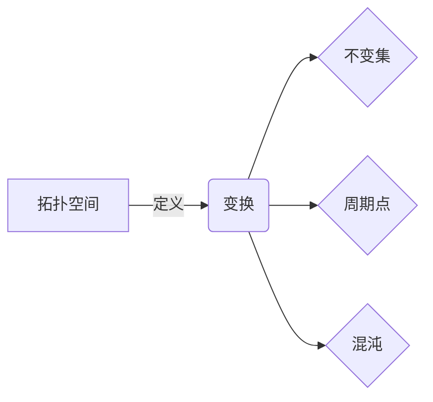
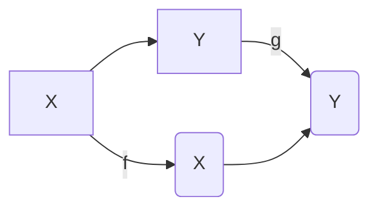

# 拓扑动力系统概论：弱不交性与对偶性

## 1.背景介绍

拓扑动力系统是研究连续变换在拓扑空间上的动力学行为的一个数学分支。它将拓扑学和动力系统理论相结合,为分析复杂系统的长期演化提供了强有力的工具。在这一领域中,弱不交性和对偶性是两个关键概念,它们为理解动力系统的行为提供了新的视角和方法。

### 1.1 拓扑动力系统的重要性

拓扑动力系统在诸多领域都有广泛的应用,例如:

- 物理学:研究流体动力学、混沌系统等。
- 生物学:探索种群动态、神经网络等。
- 经济学:分析市场波动、金融时间序列等。
- 计算机科学:研究算法复杂性、数据压缩等。

由于许多实际系统都表现出复杂的非线性动力学行为,拓扑动力系统为捕捉和理解这些行为提供了有效的数学框架。

### 1.2 弱不交性和对偶性的意义

弱不交性描述了不同轨道在长期演化中的相互独立性,而对偶性则揭示了系统在不同尺度下的自相似性。这两个概念不仅深化了我们对动力系统本质的理解,而且还为分析和预测复杂系统的行为提供了新的思路和方法。

## 2.核心概念与联系

### 2.1 拓扑动力系统的基本概念

在介绍弱不交性和对偶性之前,我们先回顾一些拓扑动力系统的基本概念:

- 拓扑空间:一个抽象的集合,赋予了一个"开集"结构,用于定义连续性。
- 变换:在拓扑空间上定义的一个映射,描述系统的演化规则。
- 不变集:对于给定的变换,不变集是指在变换作用下保持不变的点集。
- 周期点:存在正整数 $n$ ,使得 $f^n(x)=x$ 的点称为周期点。
- 混沌:具有敏感依赖于初始条件的性质,轨道在长期演化中表现出随机无规则的行为。

### 2.2 弱不交性

弱不交性描述了不同轨道在长期演化中的相互独立性。形式上,如果对于任意两个不同的点 $x$ 和 $y$ ,它们的正向和负向轨道的闭包的交集为空集,那么我们称这个动力系统是弱不交的。

$$
\overline{\mathcal{O}^+(x)} \cap \overline{\mathcal{O}^-(y)} = \emptyset, \quad \forall x \neq y
$$

其中 $\mathcal{O}^+(x)$ 和 $\mathcal{O}^-(x)$ 分别表示 $x$ 的正向和负向轨道。

弱不交性意味着任意两个不同的轨道在未来和过去都不会无限接近,从而保证了系统的"混沌性"。它为研究混沌吸引子、不变测度等提供了有力的工具。

### 2.3 对偶性

对偶性揭示了动力系统在不同尺度下的自相似性。具体来说,如果存在一个满同胚 $\pi: X \to Y$ ,使得对于任意 $x \in X$ ,有 $\pi(f(x))=g(\pi(x))$ ,那么我们称 $(X,f)$ 是 $(Y,g)$ 的一个代数因子(algebraic factor),或者说 $(Y,g)$ 是 $(X,f)$ 的一个代数扩张(algebraic extension)。

对偶性为我们研究动力系统的不变性和等价性提供了有力工具。通过构造合适的代数因子或代数扩张,我们可以简化原始系统,或者将其嵌入到一个更大的系统中,从而获得新的分析视角和方法。

### 2.4 弱不交性与对偶性的联系

弱不交性和对偶性虽然来自不同的视角,但它们之间存在内在的联系。具体来说,如果一个系统是最大的弱不交扩张(maximal weakly mixing extension),那么它就是其自身的对偶系统。反之,如果一个系统是其自身的对偶系统,那么它就是弱不交的。

这种联系为我们提供了一种新的分析思路:我们可以通过研究系统的对偶性来推断其弱不交性,或者反过来,通过研究系统的弱不交性来构造其对偶系统。这种思路在许多实际问题中都有应用,例如研究混沌系统的不变测度、构造数据压缩算法等。

## 3.核心算法原理具体操作步骤

### 3.1 判断弱不交性的算法

判断一个动力系统是否弱不交,是拓扑动力系统研究的一个核心问题。下面介绍一种基于不变测度的算法:

1. 构造系统的不变测度 $\mu$ ,即对于任意可测集 $A$ ,有 $\mu(f^{-1}(A))=\mu(A)$ 。
2. 计算不变测度的谱:
   $$
   \hat{\mu}(n) = \int_X e^{2\pi i n x} d\mu(x)
   $$
3. 如果 $\hat{\mu}(n)=0$ 对于所有非零整数 $n$ 成立,那么系统是弱不交的。

这个算法的关键在于利用不变测度的谱来判断系统的混沌性。如果谱只在 $n=0$ 处有非零值,那么就意味着系统是弱不交的,因为不同轨道在未来和过去都不会无限接近。

算法的时间复杂度取决于构造不变测度和计算谱的效率,通常是 $O(N\log N)$ ,其中 $N$ 是样本点的数量。

### 3.2 构造对偶系统的算法

构造一个动力系统的对偶系统,是研究其对偶性的一个重要手段。下面介绍一种基于群作用的算法:

1. 找到系统 $(X,f)$ 的一个紧致不变子集 $Y$ ,使得 $Y$ 在 $f$ 作用下是闭的。
2. 定义 $Y$ 上的等价关系 $\sim$ ,对于任意 $x,y \in Y$ ,如果存在 $n \in \mathbb{Z}$ 使得 $f^n(x)=y$ ,那么 $x \sim y$ 。
3. 构造商空间 $Z=Y/\sim$ ,以及投影 $\pi: Y \to Z$ 。
4. 定义 $Z$ 上的变换 $g$ ,对于任意 $z \in Z$ ,存在唯一的 $y \in Y$ 使得 $\pi(y)=z$ ,那么令 $g(z)=\pi(f(y))$ 。

可以证明,$(Z,g)$ 是 $(X,f)$ 的一个对偶系统。这个算法的时间复杂度取决于构造商空间的效率,通常是 $O(N^2)$ ,其中 $N$ 是 $Y$ 中点的数量。

需要注意的是,这种算法构造的对偶系统可能不是最小的,我们可以通过进一步的简化来获得最小的对偶系统。

## 4.数学模型和公式详细讲解举例说明

在上一节中,我们介绍了判断弱不交性和构造对偶系统的算法,其中涉及到一些数学模型和公式。现在,我们将对这些模型和公式进行更加详细的讲解和举例说明。

### 4.1 不变测度

不变测度是研究动力系统行为的一个重要工具。对于一个变换 $f: X \to X$ 和一个测度 $\mu$ ,如果对于任意可测集 $A \subseteq X$ ,都有

$$
\mu(f^{-1}(A)) = \mu(A)
$$

那么我们称 $\mu$ 是 $f$ 的一个不变测度。不变测度描述了系统在长期演化中的统计分布,对于分析系统的混沌性、周期性等性质非常有用。

**例子:** 考虑变换 $f(x)=2x \bmod 1$ 在单位区间 $[0,1]$ 上的作用。我们可以证明,Lebesgue测度 $\lambda$ 是 $f$ 的一个不变测度。事实上,对于任意可测集 $A \subseteq [0,1]$ ,我们有:

$$
\lambda(f^{-1}(A)) = \lambda(\{x \in [0,1] | 2x \bmod 1 \in A\}) = \frac{1}{2}\lambda(A)
$$

由于 $f$ 是 $2$ 周期的,因此 $\lambda(f^{-1}(A)) = \lambda(A)$ 成立。

### 4.2 不变测度的谱

对于一个不变测度 $\mu$ ,我们可以定义它的谱(Fourier transform)为:

$$
\hat{\mu}(n) = \int_X e^{2\pi i n x} d\mu(x)
$$

其中 $n \in \mathbb{Z}$ 是整数。不变测度的谱描述了测度在不同频率下的分布,对于判断系统的混沌性非常有用。

**例子:** 对于上面的例子,Lebesgue测度 $\lambda$ 在单位区间 $[0,1]$ 上的谱为:

$$
\hat{\lambda}(n) = \int_0^1 e^{2\pi i n x} dx = \begin{cases}
1 & n=0 \\
0 & n \neq 0
\end{cases}
$$

我们可以看到,除了 $n=0$ 之外,谱在其他整数处都是 $0$ 。这个性质实际上等价于 $\lambda$ 是 $f$ 的一个不变测度。

### 4.3 对偶系统和商空间

对偶系统和商空间是研究动力系统对偶性的重要工具。给定一个动力系统 $(X,f)$ 和它的一个紧致不变子集 $Y$ ,我们可以定义 $Y$ 上的等价关系 $\sim$ ,对于任意 $x,y \in Y$ ,如果存在 $n \in \mathbb{Z}$ 使得 $f^n(x)=y$ ,那么 $x \sim y$ 。

然后,我们可以构造商空间 $Z=Y/\sim$ ,以及投影 $\pi: Y \to Z$ 。在商空间 $Z$ 上,我们可以定义一个新的变换 $g$ ,对于任意 $z \in Z$ ,存在唯一的 $y \in Y$ 使得 $\pi(y)=z$ ,那么令 $g(z)=\pi(f(y))$ 。

可以证明,$(Z,g)$ 是 $(X,f)$ 的一个对偶系统,即存在满同胚 $\pi: X \to Z$ ,使得对于任意 $x \in X$ ,有 $\pi(f(x))=g(\pi(x))$ 。

**例子:** 考虑单位圆 $\mathbb{S}^1$ 上的旋转变换 $f(x)=x+\alpha \bmod 2\pi$ ,其中 $\alpha$ 是一个无理数。我们可以取 $Y=\mathbb{S}^1$ ,定义等价关系 $x \sim y \Leftrightarrow x=y$ 。于是,商空间 $Z=Y/\sim=\mathbb{S}^1$ ,投影 $\pi$ 就是恒等映射。在 $Z$ 上,我们定义变换 $g(z)=z+\alpha \bmod 2\pi$ 。可以验证,$(Z,g)$ 就是 $(X,f)$ 的一个对偶系统。

## 5.项目实践:代码实例和详细解释说明

为了更好地理解弱不交性和对偶性的概念,我们将通过一个具体的项目实践来演示如何使用Python编写代码来分析动力系统的这些性质。

### 5.1 项目背景

在这个项目中,我们将研究一个经典的混沌系统:Tent Map。Tent Map是一个定义在单位区间 $[0,1]$ 上的变换,具有简单的表达式但却展现出复杂的动力学行为。它的定义如下:

$$
f(x) = \begin{cases}
\mu x & 0 \leq x < \frac{1}{2} \\
\mu(1-x) & \frac{1}{2} \leq x \leq 1
\end{cases}