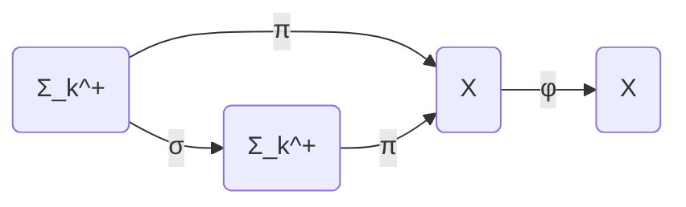

# 拓扑动力系统概论：测度混合性

## 1.背景介绍
### 1.1 拓扑动力系统的起源与发展
#### 1.1.1 起源
拓扑动力系统是现代数学的一个重要分支,它起源于19世纪末20世纪初数学家们对于动力系统、微分方程等领域的研究。早期的先驱包括庞加莱、Birkhoff等,他们开创性地将拓扑学的方法引入到对动力系统的研究中。

#### 1.1.2 发展历程
20世纪30-60年代,在Morse、Hedlund、Smale等数学家的推动下,符号动力系统理论得到蓬勃发展。70年代以后,人们开始将遍历理论、代数拓扑等现代数学工具应用到拓扑动力系统研究中,极大拓展了这一领域的深度和广度。近年来,拓扑动力系统与其他数学分支如几何群论、算子代数、分形几何等的交叉渗透日益频繁,呈现出勃勃生机。

### 1.2 测度混合性的重要意义
#### 1.2.1 刻画系统的混沌程度
测度混合性是拓扑动力系统的一个核心概念,它从测度论的角度刻画了系统在长时间演化后的混沌程度。一个系统的混合性越强,其对初始状态的敏感依赖性就越强,展现出的随机性和不可预测性也就越明显。因此,测度混合性可以作为判断系统是否具有混沌行为的一个重要指标。

#### 1.2.2 揭示系统的遍历性质
测度混合性与系统的遍历性质密切相关。通常来说,一个混合系统往往具有更强的遍历性,即轨道能够在相空间中到处游走,并且在每个区域内部停留时间与该区域的测度成正比。这种遍历性质保证了系统在长时间演化后能够充分展现其内禀的统计规律。

#### 1.2.3 应用于其他数学领域
测度混合性不仅是研究动力系统的利器,也是现代数学许多分支的重要主题。在遍历理论、人口动力学、随机过程、分形几何、调和分析等领域,测度混合性往往扮演着不可或缺的角色。深入理解测度混合性,有助于我们在更广阔的数学视野中思考问题。

## 2.核心概念与联系
### 2.1 拓扑动力系统的定义
一个拓扑动力系统是一个三元组$(X,T,\varphi)$,其中:
- $X$是一个拓扑空间,称为相空间;
- $T$是时间集合,通常取实数集$\mathbb{R}$或整数集$\mathbb{Z}$;
- $\varphi:X\times T\to X$是一个连续映射,称为相流,满足:
  - $\varphi(x,0)=x, \forall x\in X$
  - $\varphi(\varphi(x,s),t)=\varphi(x,s+t),\forall x\in X,s,t\in T$

直观地说,相流$\varphi$描述了系统在时间$T$上的演化规律。$\varphi(x,t)$表示初始状态为$x$的点经过时间$t$后的新位置。

### 2.2 不变测度与遍历性
#### 2.2.1 不变测度
设$\mu$是相空间$X$上的一个概率测度。如果对任意$t\in T$和任意可测集$A\subset X$,都有:
$$\mu(\varphi(A,t))=\mu(A)$$
则称$\mu$是$\varphi$的一个不变测度。不变测度刻画了系统在测度意义下的对称性。

#### 2.2.2 遍历性
设$\mu$是$\varphi$的一个不变测度。如果对任意可测集$A\subset X$,都有:
$$\lim_{T\to\infty}\frac{1}{T}\int_0^T \mathbf{1}_A(\varphi(x,t))dt = \mu(A), \text{a.e. }x\in X$$
则称$\varphi$是遍历的。遍历性表明,在绝大多数初始点出发,轨道在每个区域内的停留时间频率收敛于该区域的测度。

### 2.3 混合性的定义与分类
设$\mu$是$\varphi$的一个不变测度。如果对任意两个可测集$A,B\subset X$,都有:
$$\lim_{t\to\infty}\mu(\varphi(A,t)\cap B) = \mu(A)\mu(B)$$
则称$\varphi$是测度混合的。这表明,在充分长时间后,集合$A$在$\varphi$作用下的像$\varphi(A,t)$会近似均匀地分布在整个空间$X$中。

根据混合的速度,可以进一步细分为:
- 强混合(mixing of all orders): $\forall A_0,A_1,...,A_k\subset X$,
$$\lim_{t_1,...,t_k\to\infty}\mu(\bigcap_{i=0}^k \varphi(A_i,t_i))=\prod_{i=0}^k\mu(A_i)$$
- 弱混合(weak mixing): $\exists A,B\subset X$使得
$$\liminf_{t\to\infty}\mu(\varphi(A,t)\cap B) < \mu(A)\mu(B)$$

### 2.4 混合性与其他性质的关系
- 混合性蕴含遍历性,但反之不然;
- 强混合蕴含弱混合,但反之不然;
- 混合性与熵的关系:正熵(测度熵或拓扑熵)是混合性的必要条件。

## 3.核心算法原理具体操作步骤
### 3.1 符号动力系统与混合性判定
#### 3.1.1 符号动力系统的构造
对于一般的拓扑动力系统,直接判定其混合性通常较困难。一个行之有效的方法是将其表示为某个符号动力系统的因子。

具体地,设$\mathcal{A}=\{0,1,...,k-1\}$为一个有限字母表,记$\Sigma_k^+=\mathcal{A}^{\mathbb{N}}$为单边符号空间,$\Sigma_k=\mathcal{A}^{\mathbb{Z}}$为双边符号空间。移位映射$\sigma:\Sigma_k^+\to\Sigma_k^+$定义为
$$\sigma(\omega)_i=\omega_{i+1},\forall \omega\in\Sigma_k^+,i\in\mathbb{N}$$
类似可定义$\Sigma_k$上的双边移位映射。

给定拓扑动力系统$(X,T,\varphi)$,如果存在满射$\pi:\Sigma_k^+\to X$使得下图交换:

则称$(X,T,\varphi)$是$(\Sigma_k^+,\sigma)$的因子,而$\pi$称为因子映射。

#### 3.1.2 利用符号动力系统判定混合性
设$(\Sigma_k^+,\sigma)$为符号动力系统,$\pi:\Sigma_k^+\to X$为因子映射,则
- 如果$(\Sigma_k^+,\sigma)$是混合的,那么它的因子$(X,T,\varphi)$也是混合的;
- 进一步,如果$\pi$是一一对应的,那么$(X,T,\varphi)$的混合性等价于$(\Sigma_k^+,\sigma)$的混合性。

因此,判定一般系统的混合性,可以转化为判定其对应的符号动力系统的混合性。而对于符号动力系统,其混合性可以用转移矩阵的谱半径刻画(详见4.2)。

### 3.2 Rokhlin塔构造与混合速度估计
#### 3.2.1 Rokhlin塔的构造
设$\varphi:X\to X$为保测变换,即$\varphi$保持概率测度$\mu$不变。Rokhlin塔是刻画$\varphi$在测度意义下的周期行为的有力工具。

具体地,对任意$n\in\mathbb{N}$和$\varepsilon>0$,存在可测集$B\subset X$满足:
- $B,\varphi(B),...,\varphi^{n-1}(B)$两两不交;
- $\mu(\bigcup_{i=0}^{n-1}\varphi^i(B))>1-\varepsilon$。

称$B$为$\varphi$的一个$(n,\varepsilon)$-Rokhlin塔,其高度为$n$,剩余集的测度小于$\varepsilon$。

#### 3.2.2 利用Rokhlin塔估计混合速度
Rokhlin塔的存在性为估计系统的混合速度提供了思路。

具体地,设$\varphi$是遍历的,则对任意$k\in\mathbb{N}$,存在$\varphi$的一个$(n_k,\frac{1}{k})$-Rokhlin塔$B_k$。记$A,C$为任意两个可测集,定义
$$r_k=\sup_{0\leq i<n_k}|\mu(\varphi^i(A)\cap C)-\mu(A)\mu(C)|$$

直观地,$r_k$刻画了$A$在$\varphi$作用下经过$n_k$步后与$C$的相关程度。可以证明:
$$\limsup_{t\to\infty}|\mu(\varphi^t(A)\cap C)-\mu(A)\mu(C)|\leq 2\liminf_{k\to\infty}r_k$$

因此,如果$\lim_{k\to\infty}r_k=0$,那么$\varphi$是混合的。进一步,如果$r_k$以多项式速度或指数速度趋于0,则可相应得到$\varphi$的混合速度估计。

## 4.数学模型和公式详细讲解举例说明
### 4.1 混合性的谱刻画
设$\varphi:X\to X$为保测变换,其不变测度为$\mu$。考虑由$\varphi$诱导的合成算子(Koopman算子)$U_\varphi:L^2(X,\mu)\to L^2(X,\mu)$:
$$U_\varphi f = f\circ\varphi,\forall f\in L^2(X,\mu)$$

可以证明:
- $\varphi$是遍历的当且仅当$U_\varphi$的特征值$1$是单重的;
- $\varphi$是混合的当且仅当$U_\varphi$在$L^2_0(X,\mu)=\{f\in L^2(X,\mu):\int_X fd\mu=0\}$上的谱半径严格小于$1$。

进一步,如果$\varphi$是混合的,则$U_\varphi$在$L^2_0(X,\mu)$上的谱半径的倒数给出了$\varphi$的混合速度的一个下界。

### 4.2 符号动力系统混合性判定
设$(\Sigma_k^+,\sigma)$为符号动力系统,其转移矩阵为$A=(a_{ij})_{k\times k}$,其中
$$a_{ij}=\begin{cases}
1, & \text{如果}j\text{可以跟在}i\text{后面}\\
0, & \text{其他}
\end{cases}$$

记$\rho(A)$为$A$的谱半径,即$A$的特征值的模的最大值,则
- $(\Sigma_k^+,\sigma)$是遍历的当且仅当$A$不可约;
- $(\Sigma_k^+,\sigma)$是混合的当且仅当$A$是本原的,即$\exists n\in\mathbb{N}$使得$A^n>0$;
- 进一步,如果$A$是本原的,则$\sigma$的混合速度由$\rho(A)$刻画:
  - 如果$\rho(A)<1$,则$\sigma$具有指数混合速度;
  - 如果$\rho(A)=1$,则$\sigma$通常具有多项式混合速度。

### 举例说明
考虑双边符号空间$\Sigma_2=\{0,1\}^{\mathbb{Z}}$上的$\frac{1}{2}$-Bernoulli移位$\sigma_B$,其转移矩阵为
$$A=\begin{pmatrix}1 & 1\\ 1 & 1\end{pmatrix}$$
容易验证$A$是本原的,且$\rho(A)=2>1$。因此,$\sigma_B$是指数混合的。事实上,对任意两个柱集$[i_1...i_m],[j_1...j_n]$,有
$$|\mu_