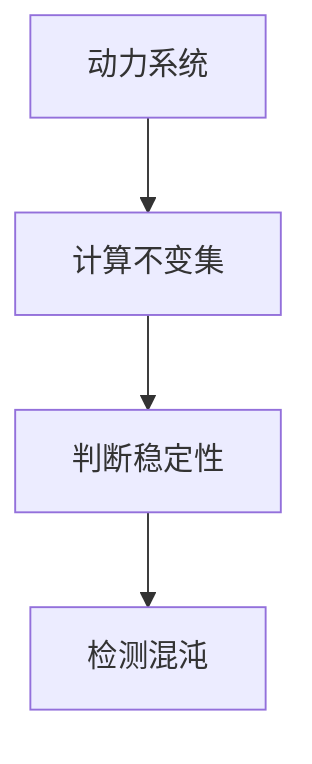

# 拓扑动力系统概论：笔记

## 1. 背景介绍

拓扑动力系统是一个研究连续动力系统的数学分支,它结合了拓扑学和动力系统理论。拓扑动力系统的研究对象是在拓扑空间上定义的动力系统,主要关注系统的定性行为,如周期性、稳定性和混沌性等。

拓扑动力系统理论源于20世纪初,当时数学家开始研究流形上的微分方程。后来,这一理论被广泛应用于许多领域,如天体力学、流体力学、生物学、经济学和计算机科学等。

### 1.1 拓扑动力系统的重要性

拓扑动力系统理论对于理解复杂系统的行为至关重要。它提供了一种研究非线性动力系统的有效方法,有助于揭示系统的本质特征和长期演化趋势。此外,拓扑动力系统理论还为分析混沌系统提供了强有力的工具。

### 1.2 应用领域

拓扑动力系统理论在许多领域都有广泛的应用,例如:

- 天体力学:研究行星运动和恒星系统的稳定性。
- 流体力学:分析流体运动的混沌性和湍流现象。
- 生物学:建模生物种群动态和生态系统的演化。
- 经济学:研究经济周期和金融市场的动态行为。
- 计算机科学:研究迭代函数系统和混沌加密算法。

## 2. 核心概念与联系

### 2.1 拓扑空间

拓扑空间是拓扑动力系统理论的基础。它是一个非空集合,配备了一个开集族,满足某些公理。拓扑空间提供了一种描述点集之间邻近关系的方式,是研究连续性和收敛性的关键工具。

### 2.2 动力系统

动力系统是一个描述某个状态随时间演化的数学模型。在拓扑动力系统中,动力系统是定义在拓扑空间上的,通常由一个离散时间或连续时间的变换来描述。

### 2.3 不变集

不变集是指在动力系统的演化过程中保持不变的点集。研究不变集对于理解系统的长期行为至关重要,例如周期轨道、吸引子和混沌集等。

### 2.4 稳定性

稳定性是指系统在受到小扰动后,能否回到初始状态或保持在其附近。稳定性分析是拓扑动力系统理论的一个核心主题,有助于确定系统的鲁棒性和预测其长期行为。

### 2.5 混沌

混沌是指系统的行为对初始条件高度敏感,即微小的初始扰动会导致系统的轨迹发生巨大的偏离。混沌现象在许多自然和人为系统中都可以观察到,拓扑动力系统理论为研究混沌提供了有力的工具。

### 2.6 Mermaid 流程图

这个 Mermaid 流程图展示了拓扑动力系统的核心概念及其联系。拓扑空间是动力系统的基础,动力系统产生不变集,不变集的性质决定了系统的稳定性,而混沌现象则是系统行为的一种特殊表现形式。

## 3. 核心算法原理具体操作步骤

拓扑动力系统理论中有许多重要的算法和原理,下面我们将介绍其中一些核心算法的具体操作步骤。

### 3.1 计算不变集

不变集是拓扑动力系统理论中的一个关键概念。计算不变集的步骤如下:

1. 确定动力系统的定义域和变换规则。
2. 对于每个点集 $A$,计算其正向轨道 $\mathcal{O}^+(A) = \bigcup_{n=0}^\infty f^n(A)$ 和负向轨道 $\mathcal{O}^-(A) = \bigcup_{n=0}^\infty f^{-n}(A)$。
3. 计算点集 $A$ 的不变部分 $\operatorname{Inv}(A) = \mathcal{O}^+(A) \cap \mathcal{O}^-(A)$。
4. 如果 $\operatorname{Inv}(A) = A$,则 $A$ 是一个不变集。

### 3.2 判断稳定性

稳定性是拓扑动力系统中另一个重要的概念。判断一个不变集是否稳定的步骤如下:

1. 确定不变集 $\Lambda$ 及其邻域 $U$。
2. 计算 $\Lambda$ 的稳定集 $W^s(\Lambda) = \{x \in U \mid d(f^n(x), \Lambda) \rightarrow 0, n \rightarrow \infty\}$。
3. 计算 $\Lambda$ 的不稳定集 $W^u(\Lambda) = \{x \in U \mid d(f^{-n}(x), \Lambda) \rightarrow 0, n \rightarrow \infty\}$。
4. 如果 $W^s(\Lambda)$ 和 $W^u(\Lambda)$ 都是开集,则 $\Lambda$ 是稳定的。

### 3.3 检测混沌

混沌是拓扑动力系统中一种特殊的行为模式。检测混沌的步骤如下:

1. 确定动力系统的定义域和变换规则。
2. 计算系统的李雅普诺夫指数 $\lambda$,它衡量了轨迹在相邻点之间的指数级分离率。
3. 如果 $\lambda > 0$,则系统存在混沌。
4. 可以进一步计算其他混沌指标,如熵、分形维数等,以更好地描述混沌的性质。

### 3.4 Mermaid 流程图

这个 Mermaid 流程图展示了拓扑动力系统理论中几个核心算法的操作步骤及其关系。首先需要确定动力系统,然后计算不变集,再判断不变集的稳定性,最后检测系统是否存在混沌行为。

## 4. 数学模型和公式详细讲解举例说明

在拓扑动力系统理论中,数学模型和公式扮演着重要的角色。下面我们将详细讲解一些核心的数学模型和公式,并给出具体的例子说明。

### 4.1 动力系统模型

动力系统是拓扑动力系统理论的核心对象。一个动力系统可以用一个三元组 $(X, f, \mathbb{T})$ 来表示,其中:

- $X$ 是一个拓扑空间,称为相空间或状态空间。
- $f: X \rightarrow X$ 是一个连续变换,称为动力系统的演化规则。
- $\mathbb{T}$ 是一个单参数群,通常取作实数 $\mathbb{R}$ (连续时间系统)或整数 $\mathbb{Z}$ (离散时间系统)。

对于每个初始条件 $x_0 \in X$ 和时间 $t \in \mathbb{T}$,动力系统的轨迹由下式给出:

$$
x(t) = f^t(x_0)
$$

其中 $f^t$ 表示将变换 $f$ 作用 $t$ 次。

**例子:** 考虑一个简单的离散时间动力系统,定义在实数集 $\mathbb{R}$ 上,演化规则为 $f(x) = rx(1-x)$,其中 $r$ 是一个常数参数。这个动力系统被称为logistic映射,广泛用于种群动力学建模。当 $r = 4$ 时,该系统会表现出混沌行为。

### 4.2 不变集

不变集是拓扑动力系统理论中的一个基本概念。对于一个动力系统 $(X, f, \mathbb{T})$,一个子集 $A \subseteq X$ 被称为不变集,如果对于任意 $x \in A$ 和 $t \in \mathbb{T}$,都有 $f^t(x) \in A$。换言之,不变集在动力系统的演化过程中保持不变。

形式上,不变集 $A$ 满足:

$$
f(A) = A
$$

不变集可以分为几种类型,如固定点、周期轨道、吸引子和混沌集等。研究不变集对于理解系统的长期行为至关重要。

**例子:** 对于logistic映射 $f(x) = rx(1-x)$,当 $r = 1$ 时,点 $x = 0$ 是一个不变集,因为 $f(0) = 0$。当 $r = 3$ 时,点 $x = (r-1)/r$ 也是一个不变集。

### 4.3 稳定性

稳定性是拓扑动力系统理论中另一个重要的概念。一个不变集 $\Lambda$ 被称为稳定的,如果对于任意邻域 $U$ 包含 $\Lambda$,存在一个较小的邻域 $V \subseteq U$,使得对于任意 $x \in V$,其正向轨道 $\{f^n(x)\}_{n=0}^\infty$ 都位于 $U$ 中。

形式上,不变集 $\Lambda$ 的稳定集定义为:

$$
W^s(\Lambda) = \{x \in X \mid d(f^n(x), \Lambda) \rightarrow 0, n \rightarrow \infty\}
$$

其中 $d$ 是相空间 $X$ 上的距离函数。如果 $W^s(\Lambda)$ 是一个开集,则 $\Lambda$ 是稳定的。

**例子:** 对于logistic映射,当 $r < 1$ 时,不变集 $x = 0$ 是稳定的,因为对于任意初始条件 $x_0 \in (0, 1)$,轨迹 $\{f^n(x_0)\}$ 都会收敛到 $0$。然而,当 $r > 1$ 时,不变集 $x = 0$ 就变得不稳定了。

### 4.4 混沌

混沌是拓扑动力系统理论中一种特殊的行为模式。一个动力系统被称为混沌的,如果它满足以下三个条件:

1. 敏感依赖于初始条件:对于任意初始条件 $x_0$ 和 $y_0$,无论它们多么接近,总存在一个时间 $t$,使得 $d(f^t(x_0), f^t(y_0))$ 变得很大。
2. 拓扑传递性:对于任意两个非空开集 $U$ 和 $V$,存在一个时间 $t$ 和一个点 $x \in U$,使得 $f^t(x) \in V$。
3. 存在dense周期轨道:对于任意开集 $U$,都存在一个周期轨道完全位于 $U$ 中。

混沌系统表现出不可预测的行为,对初始条件高度敏感。研究混沌对于理解复杂系统的动力学行为至关重要。

**例子:** 当参数 $r > 3.57$ 时,logistic映射会表现出混沌行为。例如,当 $r = 4$ 时,对于任意两个非常接近的初始条件 $x_0$ 和 $y_0$,它们的轨迹 $\{f^n(x_0)\}$ 和 $\{f^n(y_0)\}$ 会迅速分离,展现出敏感依赖于初始条件的特征。

### 4.5 Mermaid 流程图

这个 Mermaid 流程图展示了数学模型和公式在拓扑动力系统理论中的关系。动力系统模型是基础,不变集是动力系统的关键对象,稳定性描述了不变集的局部行为,而混沌则是一种特殊的全局行为模式。

## 5. 项目实践:代码实例和详细解释说明

为了更好地理解拓扑动力系统理论,我们将通过一个具体的项目实践来演示如何使用代码实现一些核心概念和算法。在这个项目中,我们将使用Python编程语言,并利用NumPy和Matplotlib等流行的科学计算库。

### 5.1 logistic映射

我们将以logistic映射作为案例研究对象。logistic映射是一个简单但具有