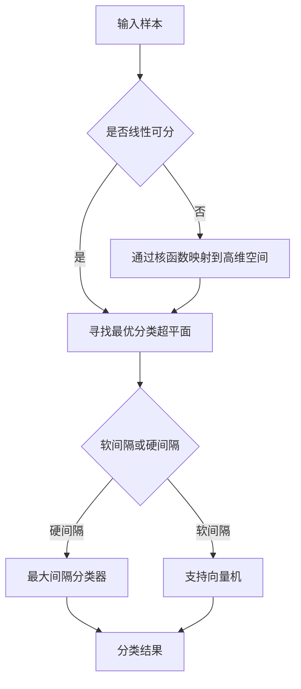

# 支持向量机 原理与代码实例讲解

## 1. 背景介绍
### 1.1 机器学习的发展历程
#### 1.1.1 早期的机器学习
#### 1.1.2 统计学习方法的兴起
#### 1.1.3 深度学习的崛起

### 1.2 支持向量机的诞生
#### 1.2.1 Vapnik和统计学习理论 
#### 1.2.2 最大间隔分类器
#### 1.2.3 核函数的引入

### 1.3 支持向量机的应用价值
#### 1.3.1 分类问题
#### 1.3.2 回归问题
#### 1.3.3 异常检测

## 2. 核心概念与联系
### 2.1 线性可分性
#### 2.1.1 线性可分的定义
#### 2.1.2 线性不可分问题的解决方案

### 2.2 最优分类超平面
#### 2.2.1 什么是最优分类超平面
#### 2.2.2 最优分类超平面的性质
#### 2.2.3 支持向量的概念

### 2.3 核函数
#### 2.3.1 核函数的作用
#### 2.3.2 常见的核函数
#### 2.3.3 核函数的选择

### 2.4 软间隔与正则化
#### 2.4.1 硬间隔的局限性
#### 2.4.2 软间隔的引入
#### 2.4.3 正则化参数C的作用

### 2.5 支持向量机的分类器


## 3. 核心算法原理具体操作步骤
### 3.1 线性支持向量机
#### 3.1.1 原始问题
#### 3.1.2 对偶问题
#### 3.1.3 SMO算法求解对偶问题
#### 3.1.4 分类决策函数

### 3.2 非线性支持向量机
#### 3.2.1 核技巧
#### 3.2.2 常用核函数
#### 3.2.3 分类决策函数

### 3.3 支持向量回归
#### 3.3.1 ε-不敏感损失函数
#### 3.3.2 支持向量回归模型
#### 3.3.3 SMO算法求解支持向量回归

## 4. 数学模型和公式详细讲解举例说明 
### 4.1 函数间隔和几何间隔
#### 4.1.1 函数间隔的定义
#### 4.1.2 几何间隔的定义
#### 4.1.3 函数间隔和几何间隔的关系

### 4.2 最优化问题的建立
#### 4.2.1 最大间隔分类器的最优化问题
$$
\begin{aligned}
\max_{w,b} \quad & \frac{1}{||w||} \\
s.t. \quad & y_i(w^Tx_i+b) \geq 1, \quad i=1,2,...,N
\end{aligned}
$$
#### 4.2.2 引入拉格朗日乘子
#### 4.2.3 对偶问题的推导
$$
\begin{aligned}
\max_{\alpha} \quad & \sum_{i=1}^N \alpha_i - \frac{1}{2} \sum_{i,j=1}^N \alpha_i \alpha_j y_i y_j (x_i \cdot x_j) \\
s.t. \quad & \sum_{i=1}^N \alpha_i y_i = 0 \\
& \alpha_i \geq 0, \quad i=1,2,...,N
\end{aligned}
$$

### 4.3 核函数的数学本质
#### 4.3.1 希尔伯特空间
#### 4.3.2 再生核希尔伯特空间
#### 4.3.3 正定核函数与再生核希尔伯特空间的关系

### 4.4 软间隔支持向量机的最优化问题
$$
\begin{aligned}
\min_{w,b,\xi} \quad & \frac{1}{2}||w||^2 + C\sum_{i=1}^N \xi_i \\
s.t. \quad & y_i(w^T\phi(x_i)+b) \geq 1-\xi_i \\
& \xi_i \geq 0, \quad i=1,2,...,N  
\end{aligned}
$$

## 5. 项目实践：代码实例和详细解释说明
### 5.1 scikit-learn中的SVM
#### 5.1.1 SVC类
#### 5.1.2 SVR类
#### 5.1.3 重要参数说明

### 5.2 线性SVM分类器的实现
```python
from sklearn.svm import SVC
from sklearn.datasets import load_iris
from sklearn.model_selection import train_test_split

# 加载鸢尾花数据集
iris = load_iris() 
X = iris.data
y = iris.target

# 划分训练集和测试集
X_train, X_test, y_train, y_test = train_test_split(X, y, test_size=0.2, random_state=42)

# 训练线性SVM分类器
svm_clf = SVC(kernel='linear', C=1.0)
svm_clf.fit(X_train, y_train)

# 在测试集上评估性能
accuracy = svm_clf.score(X_test, y_test)
print("Accuracy: {:.2f}".format(accuracy))
```

### 5.3 非线性SVM分类器的实现
```python
from sklearn.svm import SVC  
from sklearn.datasets import make_moons
from sklearn.preprocessing import StandardScaler

# 生成非线性可分的半月形数据集
X, y = make_moons(n_samples=200, noise=0.15, random_state=42)

# 数据标准化
scaler = StandardScaler()
X_scaled = scaler.fit_transform(X)

# 训练高斯核SVM分类器
svm_clf = SVC(kernel='rbf', C=1.0, gamma=0.1) 
svm_clf.fit(X_scaled, y)

# 可视化决策边界
plot_decision_boundary(svm_clf, X_scaled, y)
```

### 5.4 支持向量回归的实现
```python
from sklearn.svm import SVR
from sklearn.datasets import make_regression
from sklearn.model_selection import train_test_split

# 生成回归数据集
X, y = make_regression(n_samples=200, n_features=1, noise=20, random_state=42)

# 划分训练集和测试集  
X_train, X_test, y_train, y_test = train_test_split(X, y, test_size=0.2, random_state=42)

# 训练支持向量回归模型
svr = SVR(kernel='rbf', C=100, gamma=0.1, epsilon=0.1)
svr.fit(X_train, y_train)

# 在测试集上评估性能
y_pred = svr.predict(X_test)
mse = mean_squared_error(y_test, y_pred)
print("Mean Squared Error: {:.2f}".format(mse))
```

## 6. 实际应用场景
### 6.1 文本分类
#### 6.1.1 新闻分类
#### 6.1.2 情感分析
#### 6.1.3 垃圾邮件检测

### 6.2 图像分类
#### 6.2.1 手写数字识别
#### 6.2.2 人脸识别
#### 6.2.3 遥感图像分类

### 6.3 生物信息学
#### 6.3.1 蛋白质结构预测
#### 6.3.2 基因表达数据分析
#### 6.3.3 药物活性预测

### 6.4 金融领域
#### 6.4.1 信用评分
#### 6.4.2 股票价格预测
#### 6.4.3 欺诈检测

## 7. 工具和资源推荐
### 7.1 scikit-learn
#### 7.1.1 官方文档
#### 7.1.2 示例代码
#### 7.1.3 社区支持

### 7.2 LIBSVM和LIBLINEAR
#### 7.2.1 高效的SVM实现
#### 7.2.2 多种编程语言接口
#### 7.2.3 命令行工具

### 7.3 TensorFlow和Keras
#### 7.3.1 深度学习框架中的SVM
#### 7.3.2 自定义损失函数和核函数
#### 7.3.3 GPU加速

### 7.4 在线学习资源
#### 7.4.1 在线课程
#### 7.4.2 教程和博客
#### 7.4.3 研究论文

## 8. 总结：未来发展趋势与挑战
### 8.1 核方法的理论研究
#### 8.1.1 非欧几里得空间中的核学习
#### 8.1.2 多核学习
#### 8.1.3 核函数的自动选择

### 8.2 大规模训练算法
#### 8.2.1 在线学习算法
#### 8.2.2 分布式计算框架
#### 8.2.3 随机梯度下降法

### 8.3 深度学习与SVM的结合
#### 8.3.1 深度核方法
#### 8.3.2 核函数与深度特征的融合
#### 8.3.3 端到端的深度支持向量机

### 8.4 可解释性与鲁棒性
#### 8.4.1 支持向量机的可解释性研究
#### 8.4.2 对抗攻击下的鲁棒性
#### 8.4.3 置信度估计与不确定性量化

## 9. 附录：常见问题与解答
### 9.1 SVM的优缺点是什么？
### 9.2 SVM对数据规模和维度有什么要求？
### 9.3 核函数的选择有哪些经验法则？
### 9.4 SVM的调参有哪些技巧？
### 9.5 SVM可以用于非监督学习吗？
### 9.6 SVM与逻辑回归、决策树等方法相比有何异同？
### 9.7 如何解释SVM的预测结果？
### 9.8 SVM在不平衡数据集上的表现如何？
### 9.9 多分类问题中SVM应该如何使用？
### 9.10 SVM的最新进展有哪些值得关注的方向？

作者：禅与计算机程序设计艺术 / Zen and the Art of Computer Programming