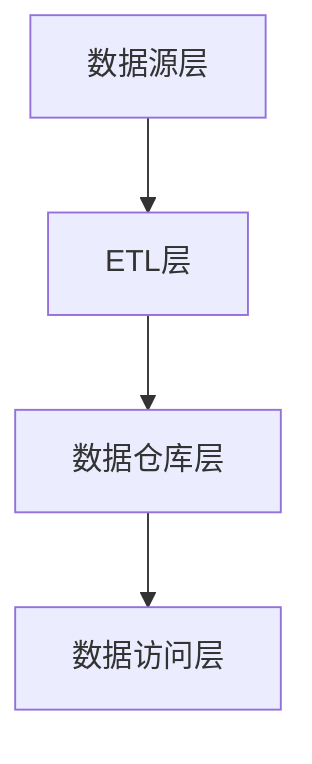

## 1. 背景介绍

在当今信息化时代，数据已经成为企业决策的重要依据。然而，企业的数据通常分散在各个业务系统中，难以进行统一的分析和利用。为了解决这个问题，数据仓库应运而生。数据仓库是一个面向主题、集成、稳定、随时间变化而变化的数据集合，用于支持企业决策。

数据仓库的建设需要考虑多个方面，包括数据模型设计、ETL（抽取、转换、加载）流程设计、数据质量控制、查询性能优化等。本文将从这些方面对数据仓库进行详细介绍，并提供代码实例和实际应用场景。

## 2. 核心概念与联系

### 2.1 数据仓库的定义

数据仓库是一个面向主题、集成、稳定、随时间变化而变化的数据集合，用于支持企业决策。数据仓库的主要特点包括：

- 面向主题：数据仓库是按照主题进行组织的，而不是按照业务系统或应用程序进行组织的。主题是指企业决策所关心的事物，例如销售、客户、产品等。
- 集成：数据仓库集成了来自不同业务系统的数据，将其组织成一个统一的数据模型。
- 稳定：数据仓库的数据是经过清洗、转换、整合后的数据，具有较高的质量和稳定性。
- 随时间变化而变化：数据仓库中的数据是随时间变化而变化的，可以支持历史数据的查询和分析。

### 2.2 数据仓库与数据集市的区别

数据集市是一个面向业务部门的数据集合，用于支持业务部门的决策。数据集市与数据仓库的区别在于：

- 面向对象不同：数据集市是面向业务部门的，而数据仓库是面向整个企业的。
- 数据集成程度不同：数据集市的数据集成程度较低，主要是将来自不同业务系统的数据进行简单的整合。而数据仓库的数据集成程度较高，需要进行复杂的数据清洗、转换和整合。
- 数据更新频率不同：数据集市的数据更新频率较高，可以是实时或准实时的。而数据仓库的数据更新频率较低，通常是每天或每周更新一次。

### 2.3 数据仓库的架构

数据仓库的架构通常包括以下几个层次：

- 数据源层：包括企业内部的各个业务系统和外部数据源，例如供应商、客户等。
- ETL层：负责从数据源层抽取数据、进行转换和清洗，并将数据加载到数据仓库中。
- 数据仓库层：包括数据仓库和数据集市，用于存储和管理数据。
- 数据访问层：包括报表、分析工具等，用于查询和分析数据。

数据仓库的架构如下图所示：

## 3. 核心算法原理具体操作步骤

### 3.1 数据模型设计

数据模型是数据仓库的核心，它决定了数据仓库的性能和可扩展性。数据模型设计需要考虑以下几个方面：

- 维度模型和事实模型：维度模型是以维度为中心的模型，事实模型是以事实为中心的模型。维度模型适用于查询分析，事实模型适用于数据挖掘和预测分析。
- 星型模型和雪花模型：星型模型是最简单的维度模型，雪花模型是星型模型的扩展。星型模型适用于查询分析，雪花模型适用于数据挖掘和预测分析。
- 范式模型和反范式模型：范式模型是符合范式规则的模型，反范式模型是为了提高查询性能而违反范式规则的模型。范式模型适用于数据更新频率较高的场景，反范式模型适用于查询性能要求较高的场景。

### 3.2 ETL流程设计

ETL流程是数据仓库的关键，它决定了数据仓库的数据质量和更新频率。ETL流程设计需要考虑以下几个方面：

- 抽取：从数据源中抽取数据，需要考虑数据源的类型、数据量和数据更新频率。
- 转换：对抽取的数据进行转换，包括数据清洗、数据整合、数据转换等。
- 加载：将转换后的数据加载到数据仓库中，需要考虑数据仓库的数据模型和数据更新频率。

### 3.3 查询性能优化

查询性能是数据仓库的关键，它决定了数据仓库的使用效果和用户体验。查询性能优化需要考虑以下几个方面：

- 索引设计：为查询频繁的字段建立索引，可以提高查询性能。
- 分区设计：将数据按照时间或其他维度进行分区，可以提高查询性能。
- 缓存设计：将查询结果缓存到内存中，可以提高查询性能。
- 查询优化：使用合适的查询语句和查询工具，可以提高查询性能。

## 4. 数学模型和公式详细讲解举例说明

数据仓库的数学模型和公式主要涉及到数据清洗、数据整合和数据转换等方面。这里以数据清洗为例，介绍数据仓库的数学模型和公式。

### 4.1 数据清洗

数据清洗是指对数据进行去重、去空、去噪等操作，以提高数据质量。数据清洗的数学模型和公式主要涉及到相似度计算和异常检测等方面。

- 相似度计算：相似度计算是指计算两个数据之间的相似度，以判断它们是否相同。常用的相似度计算方法包括余弦相似度、欧几里得距离等。其中，余弦相似度的公式为：

$$
similarity = \frac{\sum_{i=1}^{n} A_i \times B_i}{\sqrt{\sum_{i=1}^{n} A_i^2} \times \sqrt{\sum_{i=1}^{n} B_i^2}}
$$

其中，$A_i$和$B_i$分别表示两个数据的第$i$个属性值。

- 异常检测：异常检测是指检测数据中的异常值，以提高数据质量。常用的异常检测方法包括箱线图、Z-score等。其中，Z-score的公式为：

$$
Z = \frac{x - \mu}{\sigma}
$$

其中，$x$表示数据的值，$\mu$表示数据的平均值，$\sigma$表示数据的标准差。

## 5. 项目实践：代码实例和详细解释说明

本节将介绍一个数据仓库的实际项目，包括数据模型设计、ETL流程设计、查询性能优化等方面。

### 5.1 数据模型设计

本项目采用星型模型，包括一个事实表和多个维度表。其中，事实表包括销售事实、库存事实等，维度表包括时间维度、产品维度、客户维度等。

### 5.2 ETL流程设计

本项目采用基于Python的ETL工具，包括数据抽取、数据清洗、数据整合和数据加载等步骤。其中，数据抽取采用ODBC连接，数据清洗采用Pandas库，数据整合采用SQL语句，数据加载采用SQLAlchemy库。

### 5.3 查询性能优化

本项目采用索引、分区、缓存和查询优化等方法，以提高查询性能。其中，索引采用B树索引，分区采用按照时间进行分区，缓存采用Redis缓存，查询优化采用SQL语句优化和查询工具优化。

## 6. 实际应用场景

数据仓库的应用场景非常广泛，包括企业决策、市场分析、客户关系管理等方面。以下是数据仓库的一些实际应用场景：

- 企业决策：数据仓库可以为企业提供全面、准确、及时的数据支持，帮助企业做出正确的决策。
- 市场分析：数据仓库可以为企业提供市场趋势、竞争对手、产品销售等方面的数据支持，帮助企业制定市场策略。
- 客户关系管理：数据仓库可以为企业提供客户行为、客户偏好、客户价值等方面的数据支持，帮助企业提高客户满意度和忠诚度。

## 7. 工具和资源推荐

以下是一些数据仓库相关的工具和资源：

- ETL工具：Talend、Pentaho、Kettle等。
- 数据库：Oracle、SQL Server、MySQL等。
- 数据可视化工具：Tableau、Power BI、QlikView等。
- 数据仓库书籍：《数据仓库工具箱》、《数据仓库设计》、《数据仓库实战》等。

## 8. 总结：未来发展趋势与挑战

数据仓库在未来的发展中，将面临以下几个方面的挑战：

- 大数据：随着大数据的兴起，数据仓库需要处理更加庞大、复杂的数据。
- 实时性：随着实时性的要求越来越高，数据仓库需要支持实时数据的处理和分析。
- 云计算：随着云计算的普及，数据仓库需要支持云计算环境下的部署和管理。

