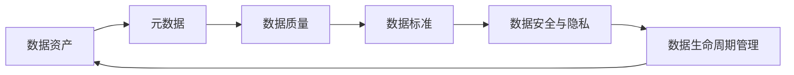
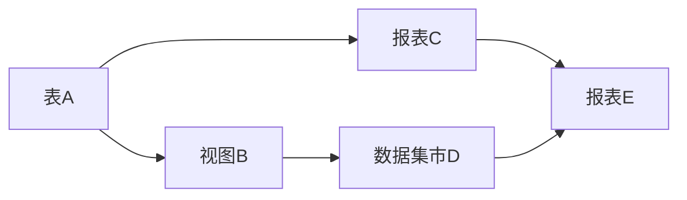

# 数据治理 原理与代码实例讲解

## 1. 背景介绍

在当今数据爆炸式增长的时代,企业和组织面临着前所未有的数据管理挑战。数据的质量、安全性、可访问性和合规性等问题日益凸显,亟需一套完善的数据治理体系来应对。数据治理作为一种战略性的框架和方法论,旨在通过制定数据管理政策、流程和标准,实现对数据资产的有效管控,提升数据价值,支撑业务发展。本文将深入探讨数据治理的核心概念、原理和实践,并结合代码实例进行详细讲解,为读者提供全面系统的认知。

### 1.1 数据治理的定义与内涵
### 1.2 数据治理的必要性与价值
### 1.3 数据治理的发展历程与现状

## 2. 核心概念与联系

要建立有效的数据治理体系,首先需要理解几个核心概念及其内在联系。

### 2.1 数据资产
数据资产是指组织拥有或掌控的,能够带来潜在效益的数据。它包括结构化数据(如关系型数据库)、半结构化数据(如XML、JSON)和非结构化数据(如文本、图像、音视频等)。数据资产是数据治理的对象和载体。

### 2.2 元数据
元数据是对数据的描述性信息,用于定义数据的语义、结构、来源、权限等属性。通过元数据管理,可以实现数据资产的分类、检索、溯源和质量控制。元数据是数据治理不可或缺的基础。

### 2.3 数据质量 
数据质量是衡量数据是否符合业务需求和使用目的的关键指标。它包括数据的准确性、完整性、一致性、及时性、可理解性等维度。提升数据质量是数据治理的重要目标之一。

### 2.4 数据标准
数据标准是对数据元素、代码、格式等进行规范化定义的规则体系。通过制定和执行数据标准,可以消除数据的二义性,实现数据的共享和交换。数据标准是数据治理的重要手段。

### 2.5 数据安全与隐私
数据安全是保护数据免受未经授权访问、篡改和破坏的措施。数据隐私是合法合规地收集、存储、使用和共享个人信息的要求。加强数据安全与隐私保护是数据治理的基本原则。

### 2.6 数据生命周期管理
数据生命周期管理是指对数据从产生到消亡的全过程进行策略性管控。它涵盖了数据采集、存储、处理、应用、归档和销毁等阶段。数据生命周期管理是数据治理的重点内容。

数据资产、元数据、数据质量、数据标准、数据安全与隐私,以及数据生命周期管理这些概念环环相扣,构成了数据治理的核心要素。只有协同推进,才能形成完整的闭环,发挥数据治理的整体效能。



## 3. 核心算法原理具体操作步骤

数据治理需要一系列算法和技术作为支撑,下面以数据质量评估为例,介绍其中的核心算法原理和操作步骤。

### 3.1 数据质量评估算法

数据质量评估是对数据进行全面"体检"的过程,需要从不同维度对数据进行量化考量。常见的数据质量评估算法包括:

#### 3.1.1 完整性检查
完整性检查用于评估数据记录的缺失程度。可以使用缺失值率等指标:

$completeness=1-\frac{missing\_values}{total\_values}$

其中,$missing\_values$为缺失值数量,$total\_values$为总值数量。

#### 3.1.2 一致性检查
一致性检查用于评估数据在不同来源或系统间的逻辑匹配程度。可以使用一致性比率等指标:

$consistency=\frac{matched\_values}{total\_values}$

其中,$matched\_values$为匹配一致的值数量。

#### 3.1.3 准确性检查
准确性检查用于评估数据与真实世界的吻合程度。可以采用抽样调查,计算准确率:

$accuracy=\frac{accurate\_values}{sampled\_values}$

其中,$accurate\_values$为抽样检查发现的准确值数量,$sampled\_values$为抽样总量。

#### 3.1.4 及时性检查
及时性检查用于评估数据更新的时效性。可以计算数据时间戳与当前时间的差值:

$timeliness=current\_time - data\_timestamp$

如果$timeliness$超过设定的阈值,则表明数据更新不及时。

### 3.2 数据质量评估操作步骤

数据质量评估通常按照以下步骤展开:

1. 明确评估目的和范围,确定关键数据对象和属性。
2. 选择和定制数据质量评估算法及其参数。
3. 收集元数据和业务知识,构建数据质量规则。
4. 对数据进行采样和特征提取。 
5. 应用数据质量评估算法,计算各项质量指标。
6. 生成数据质量评估报告,识别数据质量问题。
7. 制定并实施数据质量改进措施,持续监控数据质量。

通过规范化、自动化的数据质量评估,可以洞察数据健康状况,为后续的数据治理行动提供依据。

## 4. 数学模型和公式详细讲解举例说明

在数据治理过程中,经常需要借助数学模型和公式来刻画数据的内在规律和关联。这里以数据血缘分析中的网络模型为例进行说明。

### 4.1 数据血缘网络模型

数据血缘是指数据对象之间的依赖和转换关系,反映了数据的来龙去脉。借助图论,可以将数据血缘抽象为一个有向无环图(DAG):

$G=(V,E)$

其中,$V$表示顶点集,对应各个数据对象;$E$表示有向边集,对应数据对象间的血缘关系。

假设图$G$包含$n$个顶点,$m$条边,顶点$i$的入度为$d_i^{in}$,出度为$d_i^{out}$。则可以定义以下指标:

- 数据对象的重要度:$importance_i=\alpha \cdot d_i^{in}+\beta \cdot d_i^{out}$,其中$\alpha$和$\beta$为权重系数。入度和出度越大,说明数据对象被引用和依赖的程度越高,重要度也就越大。
  
- 数据血缘路径的长度:$length_p=\sum_{e_i \in p} w_i$,其中$p$为血缘路径,$e_i$为路径上的边,$w_i$为边的权重(如转换耗时)。路径长度反映了数据对象间的距离和依赖复杂度。
  
- 数据血缘网络的密度:$density=\frac{2m}{n(n-1)}$。血缘网络越密集,说明数据对象间的耦合度越高,越难以解耦和维护。

### 4.2 数据血缘分析举例

现有一个简单的数据血缘网络如下:



顶点集$V=\{A,B,C,D,E\}$,边集$E=\{(A,B),(A,C),(B,D),(C,E),(D,E)\}$。

假设各边权重$w_i=1$,重要度计算权重$\alpha=0.6,\beta=0.4$。则可得:

- 各顶点的入度和出度:
  $d_A^{in}=0,d_A^{out}=2$
  $d_B^{in}=1,d_B^{out}=1$ 
  $d_C^{in}=1,d_C^{out}=1$
  $d_D^{in}=1,d_D^{out}=1$
  $d_E^{in}=2,d_E^{out}=0$

- 各顶点的重要度:
  $importance_A=0.6 \times 0+0.4 \times 2=0.8$
  $importance_B=importance_C=importance_D=0.6 \times 1+0.4 \times 1=1.0$
  $importance_E=0.6 \times 2+0.4 \times 0=1.2$
  可见,报表E的重要度最高,其次是视图B、报表C和数据集市D,表A的重要度最低。

- 血缘路径(A,E)的长度:
  $length_{A \rightarrow C \rightarrow E}=1+1=2$ 
  $length_{A \rightarrow B \rightarrow D \rightarrow E}=1+1+1=3$
  A到E存在两条血缘路径,长度分别为2和3。

- 血缘网络的密度:
  $density=\frac{2 \times 5}{5 \times (5-1)}=0.5$
  该血缘网络的密度为0.5,处于中等水平。

通过血缘网络模型,可以量化分析数据资产的重要程度、溯源路径和内部依赖,进而指导数据治理工作的优先级排序和影响范围控制。

## 5. 项目实践:代码实例和详细解释说明

下面以Python为例,演示数据血缘分析的代码实现。

### 5.1 构建数据血缘网络

首先,定义一个`DataNode`类表示数据节点,一个`DataGraph`类表示数据血缘图。

```python
class DataNode:
    def __init__(self, name):
        self.name = name
        self.inbound = []
        self.outbound = []
        
    def add_inbound(self, node):
        self.inbound.append(node)
        
    def add_outbound(self, node):
        self.outbound.append(node)
        
class DataGraph:
    def __init__(self):
        self.nodes = {}
        
    def add_node(self, node):
        self.nodes[node.name] = node
        
    def add_edge(self, src, dst):
        self.nodes[src].add_outbound(dst)
        self.nodes[dst].add_inbound(src)
```

`DataNode`包含节点名称、入边列表和出边列表。`DataGraph`维护了一个节点字典,并提供了添加节点和边的方法。

接下来,创建图5.2中的示例血缘网络。

```python
# 创建节点
node_A = DataNode('A')
node_B = DataNode('B')
node_C = DataNode('C')
node_D = DataNode('D') 
node_E = DataNode('E')

# 创建图
graph = DataGraph()
graph.add_node(node_A)
graph.add_node(node_B)
graph.add_node(node_C)
graph.add_node(node_D)
graph.add_node(node_E)

# 添加边
graph.add_edge('A', 'B')
graph.add_edge('A', 'C')
graph.add_edge('B', 'D')
graph.add_edge('C', 'E')
graph.add_edge('D', 'E')
```

### 5.2 计算数据对象重要度

```python
def calc_importance(graph, alpha=0.6, beta=0.4):
    importance = {}
    for name, node in graph.nodes.items():
        importance[name] = alpha * len(node.inbound) + beta * len(node.outbound)
    return importance

print(calc_importance(graph))
```

输出:
```
{'A': 0.8, 'B': 1.0, 'C': 1.0, 'D': 1.0, 'E': 1.2}
```

### 5.3 查找数据血缘路径

```python
def find_paths(graph, src, dst, path=[]):
    path = path + [src]
    if src == dst:
        return [path]
    paths = []
    for node in graph.nodes[src].outbound:
        if node not in path:
            newpaths = find_paths(graph, node, dst, path)
            for newpath in newpaths:
                paths.append(newpath)
    return paths

print(find_paths(graph, 'A', 'E'))  
```

输出:
```
[['A', 'C', 'E'], ['A', 'B', 'D', 'E']]
```

### 5.4 计算血缘网络密度

```python
def calc_density(graph):
    n = len(graph.nodes)
    m = sum(len(node.outbound) for node in graph.nodes.values())
    return 2 * m / (n * (n - 1))
  
print(calc_density(graph))
```

输出:
```
0.5
```

以上代码