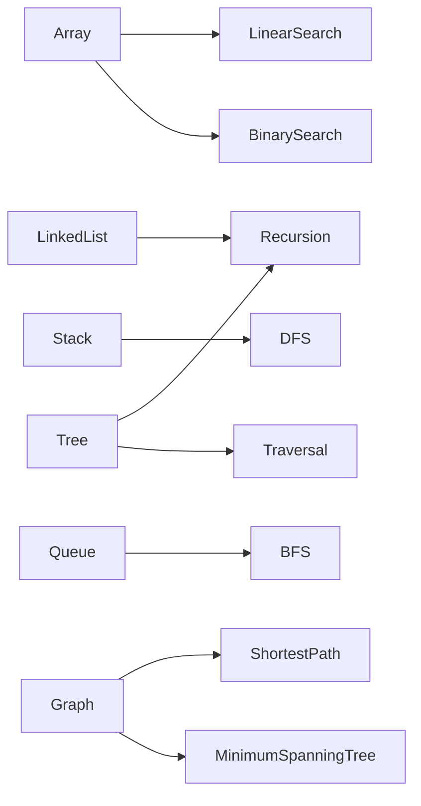

# 数据结构与算法原理与代码实战案例讲解

## 1.背景介绍
### 1.1 数据结构与算法的重要性
在计算机科学领域中,数据结构与算法是两个最基本也是最重要的概念。数据结构决定了如何组织和存储数据,而算法则定义了如何操作和处理这些数据。良好的数据结构和算法设计,可以大幅提升程序的运行效率,降低资源消耗。相反,糟糕的数据结构和算法会导致程序性能低下,甚至无法正常工作。因此,对于每一位计算机从业者来说,深入理解和掌握数据结构与算法的原理和实践,都是必备的基本功。

### 1.2 学习数据结构与算法的意义
学习数据结构与算法,不仅是为了应付面试和考试,更重要的是培养程序设计的思维能力,锻炼分析和解决问题的能力。很多经典的数据结构和算法,都蕴含着非凡的智慧和精妙的设计,学习它们的过程,就是一个启发思考、开拓思路的过程。同时,许多实际的软件开发问题,都可以抽象为特定的数据结构和算法问题。学习数据结构与算法,有助于我们站在更高的层次思考问题,想出更优的解决方案。

### 1.3 本文的主要内容
本文将重点介绍几种常见的数据结构,包括数组、链表、栈、队列、树、图等,剖析它们的特点、优缺点和典型应用;同时介绍基本的算法思想,如枚举、递归、分治、贪心、动态规划等,并给出具体的代码实现。此外,本文还将通过实际的案例,演示如何利用这些数据结构和算法解决实际的编程问题。通过学习本文,读者将对数据结构和算法有一个全面系统的认识,为进一步深入学习打下坚实基础。

## 2.核心概念与联系
### 2.1 数据结构概述
数据结构是指相互之间存在一种或多种特定关系的数据元素的集合。通俗地说,就是如何按一定的逻辑结构来组织存储数据。根据其逻辑结构,数据结构可分为线性结构和非线性结构两大类。

#### 2.1.1 线性结构
线性结构是最简单、最基本的一类数据结构,其特点是数据元素之间存在一对一的线性关系。常见的线性结构有:
- 数组(Array):由相同类型的元素构成有序序列的线性表
- 链表(Linked List):由一系列结点组成的链式存储结构 
- 栈(Stack):限定仅在表尾进行插入和删除操作的线性表
- 队列(Queue):只允许在一端插入,而在另一端删除的线性表

#### 2.1.2 非线性结构
非线性结构的数据元素之间不再是简单的一对一关系,而是可能存在一对多或多对多的复杂关系。代表性的非线性结构有:
- 树(Tree):由n个有限节点组成一个具有层次关系的集合
- 图(Graph):由若干顶点及连接两顶点的边组成的图形结构

### 2.2 算法概述 
算法是为解决特定问题而规定的一系列操作步骤。一个好的算法应该具备以下特征:
- 输入:算法具有0个或多个输入
- 输出:算法至少有1个或多个输出
- 有穷性:算法在执行有限的步骤之后自动结束,并且每一个步骤在可接受的时间内完成
- 确定性:算法的每一步骤都具有确定的含义,不会出现二义性
- 可行性:算法的每一步都必须是可行的,即每一步都能够通过执行有限次数完成

按照其设计思想,算法可以分为以下几类:
- 枚举(Enumeration):一种暴力搜索法,将问题的所有可能解罗列出来,逐个检查,直到找到正确答案
- 递归(Recursion):把问题分解为规模缩小的同类子问题求解
- 分治(Divide and Conquer):将问题分成多个小的子问题,递归求解,再将子问题的解合并得到原问题的解
- 贪心(Greedy):通过每步选取局部最优解,最终得到全局最优解
- 动态规划(Dynamic Programming):通过把原问题分解为相对简单的子问题的方式求解复杂问题的方法

### 2.3 数据结构和算法的关系
数据结构是算法的基础,算法是数据结构的灵魂。数据结构为算法提供了必要的存储结构和操作接口,算法则赋予了数据结构生命力。两者相辅相成,缺一不可。

一方面,数据结构是算法实现的载体。算法思想的实现离不开具体的数据结构,只有选择合适的数据结构,才能最大限度发挥算法的威力。很多时候,改进算法效率的关键,就在于改进数据结构。

另一方面,没有算法的数据结构只是一个空壳。数据结构的价值在于它们所能执行的操作以及这些操作的效率,这些都依赖于背后的算法。数据结构的设计往往就是算法设计的一部分。

下图展示了几种常见数据结构和算法的关联:

## 3.核心算法原理具体操作步骤
本节将对几种常见的算法进行介绍,并给出其基本步骤。

### 3.1 枚举算法
枚举算法的基本思想是:列举出所有可能情况,逐一判断是否符合条件,并记录符合条件的解。
基本步骤如下:
1. 确定枚举对象和范围
2. 逐一列举可能情况
3. 判断是否符合条件
4. 记录符合条件的解
5. 输出最终结果

枚举算法适用于问题规模较小、解的个数较少的情况。当问题规模较大时,枚举的效率会非常低下。

### 3.2 递归算法
递归算法的基本思想是:把问题分解为规模缩小的同类子问题求解。
一个递归算法必须包含两个部分:
1. 基本情况(Base Case):能直接得到结果的最小子问题
2. 递归情况(Recursive Case):把问题分解为更小的子问题

编写递归程序时,要注意:
1. 递归要有终止条件
2. 递归前进段和回归段的逻辑要一致
3. 避免无意义的递归

递归算法适用于问题具有递归结构、问题的规模随着递归而减小的情况。但是递归算法的效率往往不高,且可能出现栈溢出等问题,需要谨慎使用。

### 3.3 分治算法
分治算法的基本思想是:将一个复杂的问题分解成两个或更多的相同或相似的子问题,再把子问题分解成更小的子问题,直到最后子问题可以简单的直接求解,原问题的解即子问题的解的合并。

分治算法的基本步骤是:
1. 分解(Divide):将原问题分解为若干个规模较小,相互独立,与原问题形式相同的子问题
2. 解决(Conquer):若子问题规模较小而容易被解决则直接解,否则递归地解各个子问题
3. 合并(Combine):将各个子问题的解合并为原问题的解

分治算法适用于问题可以分解为互不相关的子问题、子问题与原问题形式相同但规模较小、子问题可以递归求解、子问题的解可以合并为原问题的解的情况。

### 3.4 贪心算法
贪心算法的基本思想是:在对问题求解时,总是做出在当前看来最好的选择。也就是说,不从整体最优考虑,算法得到的是在某种意义上的局部最优解。

贪心算法的基本步骤是:
1. 将优化问题转化为这样的问题,即先做出选择,再解决剩下的子问题
2. 证明原问题总是存在最优解,且贪心选择总是安全的,不会丢失全局最优解
3. 求解剩余的子问题,直到将问题解完

贪心算法适用于问题的最优解可以通过一系列局部最优的选择达到的情况,这种情况下,每一步贪心选择都应该是最优的。但并非所有问题都能用贪心算法求解。

### 3.5 动态规划
动态规划的基本思想是:将待求解问题分解成若干个相互联系的子问题,先求解子问题,然后从这些子问题的解得到原问题的解。

动态规划算法的基本步骤是:
1. 刻画最优解的结构特征
2. 递归地定义最优解的值
3. 自底向上地计算最优解的值
4. 由计算出的结果构造一个最优解

动态规划算法适用于问题的最优解包含其子问题的最优解、问题可分解为若干个互相联系的子问题、子问题只需求解一次的情况。它可以避免递归算法中的重复计算,因而效率较高,但同时也增加了存储开销。

## 4.数学模型和公式详细讲解举例说明
很多数据结构和算法问题都可以用数学模型和公式来描述和分析。下面以几个具体的例子来说明。

### 4.1 大O符号
在分析算法的效率时,我们经常使用大O符号。它用于描述算法的运行时间和空间复杂度。
定义:$T(n)=O(f(n))$表示存在常数$c>0$和$n_0>0$,使得当$n\geq n_0$时,$T(n)\leq cf(n)$。

常见的时间复杂度有:
- $O(1)$:常数阶,如直接取数组元素
- $O(\log n)$:对数阶,如二分查找
- $O(n)$:线性阶,如顺序查找
- $O(n\log n)$:如快速排序
- $O(n^2)$:平方阶,如冒泡排序
- $O(2^n)$:指数阶,如斐波那契数列

### 4.2 主定理
对于形如$T(n)=aT(\frac{n}{b})+f(n)$的递归式,其中$a\geq1,b>1,f(n)=O(n^d)$,主定理给出了其渐近解:

$$
T(n)=
\begin{cases}
O(n^d) & \text{若}d>\log_ba \\
O(n^d\log n) & \text{若}d=\log_ba \\
O(n^{\log_ba}) & \text{若}d<\log_ba
\end{cases}
$$

例如,对于归并排序,其递归式为$T(n)=2T(\frac{n}{2})+O(n)$,其中$a=2,b=2,d=1$。由于$d=\log_22=1$,所以$T(n)=O(n\log n)$。

### 4.3 概率分析
有些算法的运行时间依赖于输入数据的性质,如快速排序。这时,我们可以用概率分析的方法来估计其期望运行时间。

例如,对于快速排序,假设所有输入数据都是等概率的,那么其期望比较次数$C_n$满足递推式:

$$
C_n=\frac{2}{n}\sum_{k=1}^{n-1}C_k+n-1
$$

解得:

$$
C_n=O(n\log n)
$$

这表明,快速排序的期望时间复杂度为$O(n\log n)$。

### 4.4 摊还分析
有些算法的单次操作的最坏情况代价很高,但是多次操作的总代价却较低。这时,我们可以用摊还分析的方法来分析其时间复杂度。

例如,对于动态数组,其插入操作的最坏情况是数组空间不足需要扩容,此时的时间代价是$O(n)$。但是,如果每次扩容都将数组大小增加一倍,那么$n$次插入操作的总时间代价为:

$$
\sum_{i=1}^{\log n}2^i=2^{\log n+1}-2=2n-2=O(n)
$$

所以,动态数组插入操作的摊还时间复杂度为$O(1)$