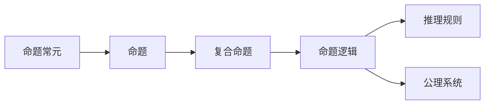
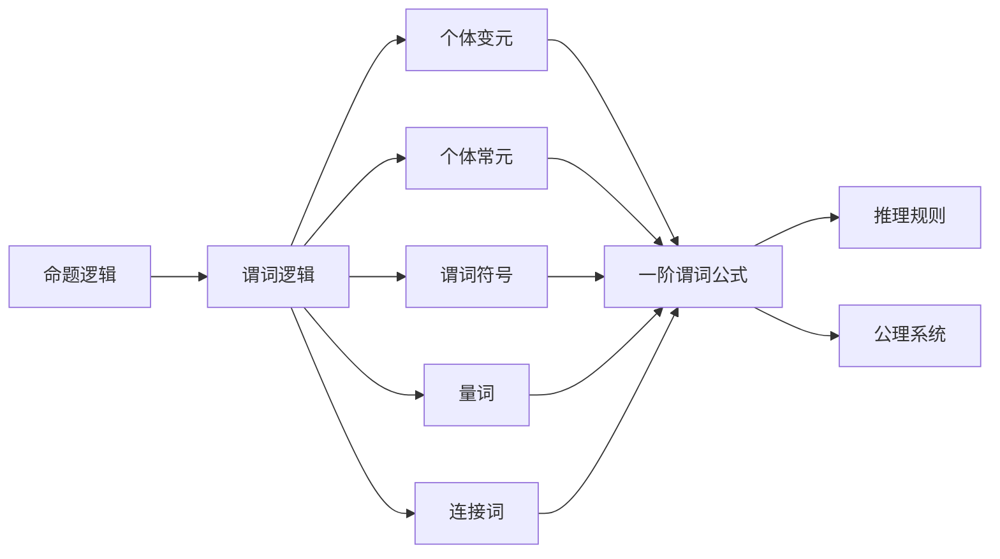

# 数理逻辑：命题常元、谢孚竖

## 1.背景介绍

数理逻辑是一门研究形式语言、形式系统及其解释的学科,是数学与逻辑学的交叉领域。它为计算机科学、人工智能、数学等诸多领域奠定了理论基础。在数理逻辑中,命题逻辑和谓词逻辑是两个核心分支。

命题逻辑研究复合命题之间的逻辑联系,是最基本、最简单的逻辑形式。而谓词逻辑则在命题逻辑的基础上,引入了量词和谓词等概念,使之能够处理更加复杂的逻辑关系。

### 1.1 命题常元

命题常元(Propositional Constant)是命题逻辑中最基本的逻辑符号,代表一个最小的不可分割的命题。常用的命题常元有 $p$、$q$、$r$ 等小写拉丁字母。命题常元本身没有确定的真值,但在给定解释下可以赋予它们真值"真"或"假"。

### 1.2 谢孚竖

在命题逻辑和谓词逻辑中,谢孚竖符号 ($\vdash$) 用于表示"推理出"或"可证明"的关系。如果有一个前件(前提)命题组 $\Gamma$ 和一个后件(结论)命题 $\phi$,那么 $\Gamma \vdash \phi$ 就表示 $\phi$ 可以从 $\Gamma$ 中推理出来或证明获得。

## 2.核心概念与联系  

### 2.1 命题逻辑

命题逻辑研究复合命题之间的逻辑联系,是最基本、最简单的逻辑形式。在命题逻辑中,基本的逻辑连接词包括:

- 合取连词 ($\land$): 命题 $p \land q$ 当且仅当 $p$ 和 $q$ 都为真时为真。
- 析取连词 ($\lor$): 命题 $p \lor q$ 当且仅当 $p$ 或 $q$ 至少有一个为真时为真。  
- 条件连词 ($\rightarrow$): 命题 $p \rightarrow q$ 当 $p$ 为真而 $q$ 为假时为假,其他情况为真。
- 双条件连词 ($\leftrightarrow$): 命题 $p \leftrightarrow q$ 当 $p$ 和 $q$ 同为真或同为假时为真。
- 否定连词 ($\neg$): 命题 $\neg p$ 的真值与 $p$ 的真值相反。

利用这些逻辑连接词,我们可以构造出复杂的复合命题。命题逻辑的核心在于研究这些复合命题之间的逻辑联系,并建立一套形式化的推理规则和公理系统。

### 2.2 谓词逻辑

谓词逻辑在命题逻辑的基础上,引入了量词和谓词等概念,使之能够处理更加复杂的逻辑关系。谓词逻辑中的基本符号包括:

- 个体变元 (Individual Variables): 如 $x$、$y$、$z$ 等,代表任意个体。
- 个体常元 (Individual Constants): 如 $a$、$b$、$c$ 等,代表特定个体。
- 谓词符号 (Predicate Symbols): 如 $P$、$Q$、$R$ 等,代表性质或关系。
- 连接词: 与命题逻辑中的连接词相同。
- 全称量词 ($\forall$): 命题 $\forall x \phi(x)$ 表示对于任意个体 $x$,命题 $\phi(x)$ 都为真。
- 存在量词 ($\exists$): 命题 $\exists x \phi(x)$ 表示存在某个个体 $x$,使得命题 $\phi(x)$ 为真。

利用这些基本符号,我们可以构造出复杂的一阶谓词公式,并研究其逻辑性质和推理规则。

### 2.3 命题常元与谢孚竖的关系

命题常元是构成命题逻辑和谓词逻辑最基本的逻辑符号。而谢孚竖符号 $\vdash$ 则用于表示在某一逻辑系统中,一个命题或公式可以从给定的前提中推理出来或证明获得。

在命题逻辑和谓词逻辑的形式化推理系统中,我们通常会给出一组公理或公理schema,以及一组推理规则。利用这些公理和推理规则,我们可以从已知的前提命题组 $\Gamma$ 推导出新的命题或公式 $\phi$,这种推理关系就可以用谢孚竖 $\Gamma \vdash \phi$ 来表示。

因此,命题常元作为最基本的逻辑符号,是构成命题逻辑和谓词逻辑公式的基石;而谢孚竖则是表示在形式化的逻辑系统中,命题或公式之间的推理关系的重要符号。二者都是数理逻辑不可或缺的核心概念。

## 3.核心算法原理具体操作步骤

在命题逻辑和谓词逻辑的形式化推理系统中,我们通常会给出一组公理或公理schema,以及一组推理规则。利用这些公理和推理规则,我们就可以从已知的前提命题组推导出新的命题或公式。这种推理过程可以用一种形式化的证明演算来描述,其核心算法原理和具体操作步骤如下:

1. **确定公理和推理规则**

   首先,我们需要确定逻辑系统的公理和推理规则。不同的逻辑系统会有不同的公理和推理规则集合。例如,在经典命题逻辑中,常用的公理包括:

   - 重言式公理: $\vdash p \rightarrow (q \rightarrow p)$
   - 合取公理: $\vdash (p \land q) \rightarrow p$, $\vdash (p \land q) \rightarrow q$
   - 析取公理: $\vdash p \rightarrow (p \lor q)$, $\vdash q \rightarrow (p \lor q)$
   - ...

   常用的推理规则包括:

   - 模式推理规则: 如 $\vdash \phi \rightarrow \psi$, $\vdash \phi$, 则可推出 $\vdash \psi$。
   - 推理规则的等值替换: 如 $\vdash \phi \leftrightarrow \psi$, 且已证 $\Gamma \vdash \phi$, 则可推出 $\Gamma \vdash \psi$。
   - ...

2. **确定前提命题组和要证明的命题**

   接下来,我们需要确定前提命题组 $\Gamma$ 和要证明的命题 $\phi$。前提命题组 $\Gamma$ 是一组已知为真的命题,而 $\phi$ 是我们希望从 $\Gamma$ 中推导出来的命题。

3. **构建证明序列**

   利用公理和推理规则,我们需要构建一个证明序列,将前提命题组 $\Gamma$ 和要证明的命题 $\phi$ 连接起来。证明序列是一系列命题,每一个命题都是从前面的命题通过公理或推理规则推导出来的。

   证明序列的构建过程如下:

   1) 将前提命题组 $\Gamma$ 中的每个命题都列为证明序列的一行。
   2) 利用公理和推理规则,从已有的命题推导出新的命题,并将其添加到证明序列中。
   3) 重复步骤 2),直到推导出要证明的命题 $\phi$。

   在构建证明序列的过程中,我们需要注意:

   - 每一步推导都必须明确说明使用了哪个公理或推理规则。
   - 不能出现循环推理,即不能利用要证明的命题 $\phi$ 来推导出自身。
   - 尽可能保持证明序列简洁,避免多余的推导步骤。

4. **验证证明的正确性**

   最后,我们需要仔细检查证明序列的每一步,确保每一步推导都是合法的,没有逻辑错误。如果证明序列无误,那么就可以说我们已经成功地从前提命题组 $\Gamma$ 推导出了要证明的命题 $\phi$,即 $\Gamma \vdash \phi$ 成立。

以上就是命题逻辑和谓词逻辑形式化推理系统中,核心算法原理和具体操作步骤。通过严格遵循公理和推理规则,我们可以在这些逻辑系统中进行形式化的推理和证明。

## 4.数学模型和公式详细讲解举例说明

在命题逻辑和谓词逻辑中,我们经常需要使用数学模型和公式来精确地描述和操作逻辑概念。下面我们将详细讲解一些常见的数学模型和公式,并给出具体的例子说明。

### 4.1 真值赋值

在命题逻辑中,我们可以使用真值赋值(Truth Assignment)来为命题常元赋予真值"真"或"假"。一个真值赋值就是一个函数 $v$,将每个命题常元 $p$ 映射到真值 $\{0, 1\}$ 上,其中 $0$ 表示"假",而 $1$ 表示"真"。

例如,对于命题 $p \land (q \lor \neg r)$,我们可以给出如下真值赋值:

$$
v(p) = 1, v(q) = 0, v(r) = 1
$$

根据逻辑连接词的语义,我们可以计算出整个命题的真值:

$$
v(p \land (q \lor \neg r)) = 1 \land (0 \lor \neg 1) = 1 \land (0 \lor 0) = 1 \land 0 = 0
$$

因此,在这个真值赋值下,命题 $p \land (q \lor \neg r)$ 的真值为"假"。

### 4.2 语义表

语义表(Truth Table)是一种列出所有可能的真值赋值,并计算出复合命题对应真值的表格。它可以用来判断一个命题是否是重言式(永真式)或矛盾式(永假式),也可以用来检验两个命题是否等值。

例如,对于命题 $p \rightarrow q$ 和 $\neg p \lor q$,我们可以构造如下语义表:

$$
\begin{array}{c|c|c|c}
p & q & p \rightarrow q & \neg p \lor q \\
\hline
0 & 0 & 1 & 1 \\
0 & 1 & 1 & 1 \\
1 & 0 & 0 & 0 \\
1 & 1 & 1 & 1
\end{array}
$$

从语义表中可以看出,在所有可能的真值赋值下,命题 $p \rightarrow q$ 和 $\neg p \lor q$ 的真值都是相同的,因此它们是等值的。

### 4.3 一阶谓词公式

在谓词逻辑中,我们使用一阶谓词公式来表示复杂的逻辑关系。一阶谓词公式由个体变元、个体常元、谓词符号、连接词和量词构成。

例如,考虑一个简单的一阶谓词公式:

$$
\forall x \exists y (P(x, y) \land \neg Q(y))
$$

这个公式的意思是:"对于任意个体 $x$,都存在一个个体 $y$,使得 $P(x, y)$ 为真,且 $Q(y)$ 为假"。

我们可以使用解释(Interpretation)来为一阶谓词公式赋予语义。一个解释包括:

- 一个非空域 $D$,作为个体变元和个体常元的解释域。
- 对于每个 $n$ 元谓词符号 $P$,一个 $n$ 元关系 $P^I \subseteq D^n$,作为 $P$ 在解释 $I$ 下的解释。

例如,对于上面的一阶谓词公