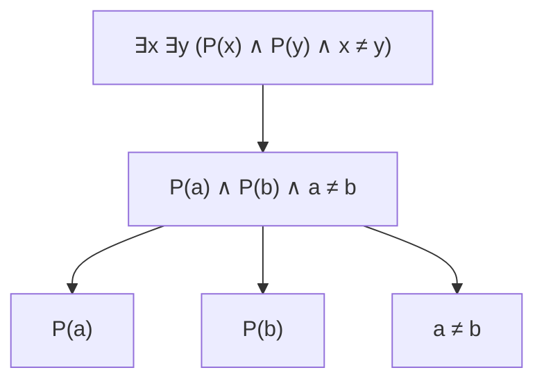
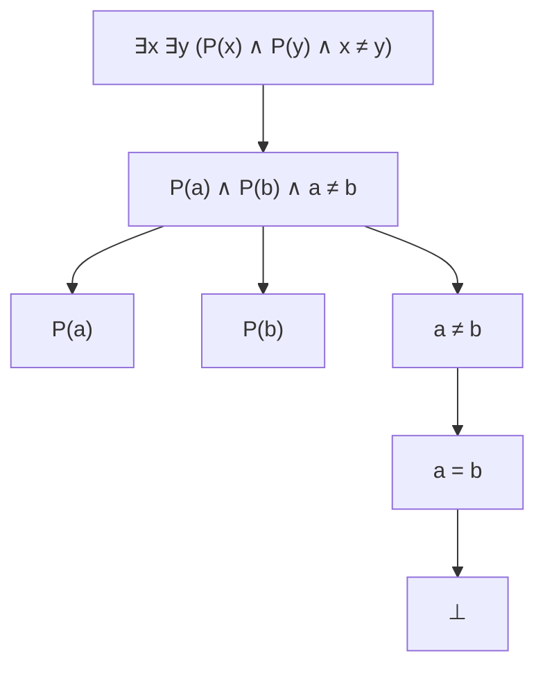

# 数理逻辑：带等词的谓词逻辑的完备性

## 1. 背景介绍

### 1.1 逻辑与推理

逻辑是一门研究有效推理的学科,它为我们提供了一种严格而规范的推理方式。在数学、计算机科学、人工智能等领域中,逻辑扮演着至关重要的角色。它不仅是构建形式化系统的基础,也是推理和论证的工具。

### 1.2 谓词逻辑与等词

谓词逻辑是一种扩展了命题逻辑的逻辑系统,它引入了量词和谓词,使得我们能够更精确地描述和推理复杂的命题。然而,传统的谓词逻辑缺乏对"相等"关系的表达能力,这在某些情况下会带来不便。为了解决这个问题,我们需要引入"等词"(equality symbol)来扩充谓词逻辑。

### 1.3 完备性的重要性

一个逻辑系统的完备性意味着,如果一个命题在该系统中是可证的,那么它就是逻辑上的蕴含。换句话说,完备性保证了推理系统的健全性和有效性。对于带等词的谓词逻辑,证明其完备性是一个重要的理论挑战,也是确保该逻辑系统在实践中可靠运用的关键。

## 2. 核心概念与联系

### 2.1 语法

带等词的谓词逻辑的语法由以下几个部分组成:

- 常元(constant symbols)
- 函数符号(function symbols)
- 谓词符号(predicate symbols)
- 变元(variables)
- 逻辑连接词(logical connectives)
- 量词(quantifiers)
- 等词(equality symbol)

这些元素的组合形成了该逻辑系统中的合式公式(well-formed formulas)。

### 2.2 语义

语义定义了公式的意义,它由一个解释(interpretation)来确定。解释包括:

- 一个非空域(domain)
- 对每个常元的赋值
- 对每个函数符号的赋值
- 对每个谓词符号的赋值

通过解释,我们可以确定一个公式在给定结构中是否为真。

### 2.3 等词的作用

等词的引入使得我们能够在逻辑系统中表达"相等"的概念。它不仅扩展了谓词逻辑的表达能力,也带来了一些新的推理规则和公理。例如,我们需要确保等词满足反身性、对称性和传递性等性质。

### 2.4 完备性的定义

一个逻辑系统被称为完备,当且仅当所有逻辑上有效的公式都是可证的。形式上,如果一个公式 $\varphi$ 在所有可能的解释下都为真,那么它就应该在该逻辑系统中是可证的。

## 3. 核心算法原理具体操作步骤

证明带等词的谓词逻辑的完备性是一个复杂的过程,涉及多个步骤和技术。以下是核心算法原理的具体操作步骤:

### 3.1 构造语义树

首先,我们需要为给定的公式构造一个语义树(semantic tree)。语义树是一种表示公式语义的树状结构,它的每个节点对应着公式的一个子句。

### 3.2 应用规则

接下来,我们需要对语义树应用一系列规则,这些规则描述了如何从现有节点推导出新的节点。规则包括:

- 分支规则(branching rules)
- 等词规则(equality rules)
- 实例化规则(instantiation rules)

通过反复应用这些规则,我们可以从语义树的根节点推导出新的节点,直到达到某些终止条件。

### 3.3 判断语义树的封闭性

如果语义树的所有分支都以矛盾结束(即出现一个节点及其否定),那么我们就说这棵语义树是封闭的(closed)。一棵封闭的语义树意味着原始公式在所有可能的解释下都为真。

### 3.4 构造反证法证明

如果语义树是封闭的,我们就可以通过反证法证明原始公式的有效性。具体来说,我们假设公式 $\varphi$ 是无效的,也就是存在一个解释使得 $\varphi$ 为假。然后,我们利用语义树的封闭性来推导出矛盾,从而证明了我们的假设是错误的,因此 $\varphi$ 必须是有效的。

### 3.5 完备性定理

通过上述步骤,我们可以证明带等词的谓词逻辑是完备的。也就是说,如果一个公式 $\varphi$ 在所有可能的解释下都为真,那么它就是可证的。这个结果被称为完备性定理(completeness theorem)。

## 4. 数学模型和公式详细讲解举例说明

为了更好地理解带等词的谓词逻辑的完备性证明,我们来看一个具体的例子。

### 4.1 示例公式

考虑以下公式:

$$
\forall x \forall y ((P(x) \land P(y)) \rightarrow (x = y))
$$

这个公式表示:如果 $x$ 和 $y$ 都满足谓词 $P$,那么它们必须是相等的。

### 4.2 语义树构造

我们将构造一棵语义树来表示这个公式的语义。根节点是公式的否定:

$$
\exists x \exists y (P(x) \land P(y) \land x \neq y)
$$

接下来,我们应用分支规则和实例化规则,得到以下语义树:



### 4.3 应用等词规则

在这个阶段,我们需要应用等词规则来处理不等式 $a \neq b$。等词规则包括:

- 反身性: $\forall x (x = x)$
- 对称性: $\forall x \forall y (x = y \rightarrow y = x)$
- 传递性: $\forall x \forall y \forall z ((x = y \land y = z) \rightarrow x = z)$
- 替换性: $\forall x \forall y (x = y \rightarrow (P(x) \leftrightarrow P(y)))$

通过应用这些规则,我们可以从 $a \neq b$ 推导出矛盾。具体来说,我们有:

1. 由 $P(a)$ 和 $P(b)$,根据替换性规则,我们得到 $a = b$。
2. 但是,我们也有 $a \neq b$,这与 $a = b$ 矛盾。

因此,我们得到了一棵封闭的语义树,如下所示:



### 4.4 反证法证明

现在,我们可以利用这棵封闭的语义树来证明原始公式的有效性。具体来说,我们假设公式

$$
\forall x \forall y ((P(x) \land P(y)) \rightarrow (x = y))
$$

是无效的,也就是存在一个解释使得它为假。根据语义树的构造,这意味着存在一个解释满足

$$
\exists x \exists y (P(x) \land P(y) \land x \neq y)
$$

但是,我们已经证明了这个公式在任何解释下都会导致矛盾。因此,我们的假设是错误的,原始公式必须在所有解释下都为真,即它是有效的。

通过这个例子,我们可以看到如何利用语义树和等词规则来证明带等词的谓词逻辑的完备性。虽然过程可能看起来复杂,但它确保了我们的推理系统是健全和有效的。

## 5. 项目实践:代码实例和详细解释说明

为了更好地理解带等词的谓词逻辑的完备性证明,我们可以实现一个简单的程序来模拟语义树的构造和规则应用过程。

在这个示例中,我们将使用 Python 编程语言。我们首先定义一些基本的数据结构来表示公式、语义树节点和解释。

```python
class Formula:
    def __init__(self, op, args):
        self.op = op
        self.args = args

    def __str__(self):
        if self.op == 'const':
            return str(self.args)
        elif self.op == 'var':
            return self.args
        elif self.op == 'not':
            return '¬' + str(self.args[0])
        elif self.op == 'and':
            return '(' + str(self.args[0]) + ' ∧ ' + str(self.args[1]) + ')'
        elif self.op == 'or':
            return '(' + str(self.args[0]) + ' ∨ ' + str(self.args[1]) + ')'
        elif self.op == 'imp':
            return '(' + str(self.args[0]) + ' → ' + str(self.args[1]) + ')'
        elif self.op == 'iff':
            return '(' + str(self.args[0]) + ' ↔ ' + str(self.args[1]) + ')'
        elif self.op == 'forall':
            return '∀' + self.args[0] + '(' + str(self.args[1]) + ')'
        elif self.op == 'exists':
            return '∃' + self.args[0] + '(' + str(self.args[1]) + ')'
        elif self.op == 'eq':
            return '(' + str(self.args[0]) + ' = ' + str(self.args[1]) + ')'
        elif self.op == 'pred':
            return self.args[0] + '(' + ', '.join(self.args[1:]) + ')'

class Node:
    def __init__(self, formula, parent=None):
        self.formula = formula
        self.parent = parent
        self.children = []

class Interpretation:
    def __init__(self, domain, constants, functions, predicates):
        self.domain = domain
        self.constants = constants
        self.functions = functions
        self.predicates = predicates
```

接下来,我们实现一些辅助函数来构造语义树、应用规则和检查矛盾。

```python
def construct_semantic_tree(formula):
    root = Node(formula)
    queue = [root]
    while queue:
        node = queue.pop(0)
        f = node.formula
        if f.op == 'not':
            child = Node(f.args[0], node)
            node.children.append(child)
            queue.append(child)
        elif f.op == 'and':
            child1 = Node(f.args[0], node)
            child2 = Node(f.args[1], node)
            node.children.extend([child1, child2])
            queue.extend([child1, child2])
        elif f.op == 'or':
            child1 = Node(f.args[0], node)
            child2 = Node(f.args[1], node)
            node.children.extend([child1, child2])
        elif f.op == 'imp':
            child1 = Node(Formula('not', [f.args[0]]), node)
            child2 = Node(f.args[1], node)
            node.children.extend([child1, child2])
        elif f.op == 'iff':
            child1 = Node(Formula('imp', [f.args[0], f.args[1]]), node)
            child2 = Node(Formula('imp', [f.args[1], f.args[0]]), node)
            node.children.extend([child1, child2])
        elif f.op == 'forall':
            child = Node(f.args[1], node)
            node.children.append(child)
            queue.append(child)
        elif f.op == 'exists':
            child = Node(f.args[1], node)
            node.children.append(child)
    return root

def apply_rules(node, interpretation):
    f = node.formula
    if f.op == 'eq':
        # Apply equality rules
        ...
    elif f.op == 'pred':
        # Evaluate predicate based on interpretation
        ...
    else:
        for child in node.children:
            apply_rules(child, interpretation)

def check_contradiction(node):
    f = node.formula
    if f.op == 'and':
        for child in node.children:
            if check_contradiction(child):
                return True
            if any(child.formula == Formula('not', [other.formula])
                   for other in node.children):
                return True
    elif f.op == 'not':
        child = node.children[0]
        if check_contradiction(child):
            return True
        if any(child.formula == other.formula
               for other in node.parent.children):
            return True
    return False
```

最后,我们可以编写一个主函数来测试完备性证明过程。

```python
def main():
    