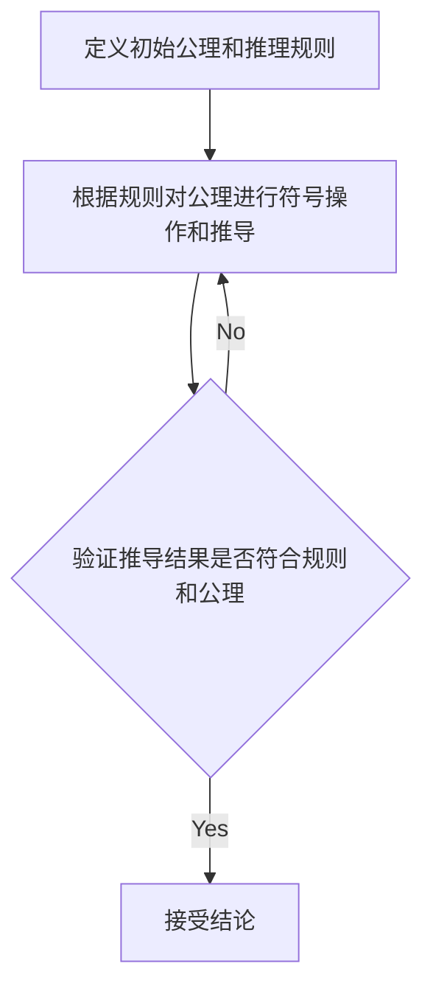
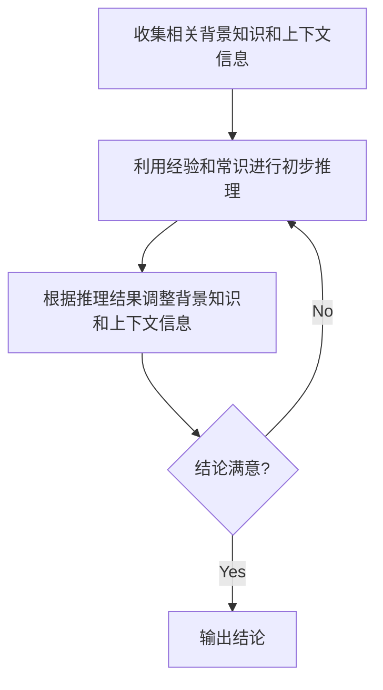

# 数理逻辑：重言式系统和自然推理系统的关系

## 1.背景介绍

数理逻辑是一门研究形式语言、形式系统及其解释的学科,是数学与逻辑学的交叉领域。它为人工智能、计算机科学、数学等领域提供了坚实的理论基础。在这个背景下,重言式系统(Formal System)和自然推理系统(Natural Reasoning System)是两个重要的概念。

### 1.1 重言式系统概述

重言式系统是一种由一组规则、公理和推理规则组成的形式化系统。它通过操作符号来进行推理,并且具有清晰的语法和语义。重言式系统的特点是严格遵循规则,具有高度的一致性和可靠性,但缺乏灵活性和直观性。

### 1.2 自然推理系统概述

自然推理系统是模拟人类思维和推理过程的系统。它基于经验、常识和上下文信息,采用灵活、直观的方式进行推理。与重言式系统不同,自然推理系统更加注重语义和实用性,但缺乏严格的形式化框架。

## 2.核心概念与联系

### 2.1 形式化与非形式化

重言式系统和自然推理系统的核心区别在于形式化程度的不同。重言式系统是高度形式化的,它严格遵循规则和公理,推理过程完全依赖于符号操作。而自然推理系统则是非形式化的,它依赖于上下文信息和人类经验,推理过程更加灵活和直观。

### 2.2 一致性与灵活性

重言式系统具有高度的一致性,推理结果是可靠和可重复的。但是,它缺乏灵活性,难以处理复杂的实际问题。相反,自然推理系统更加灵活,能够处理不确定性和模糊性,但缺乏严格的一致性保证。

### 2.3 语法与语义

重言式系统侧重于语法,即符号的操作和规则。而自然推理系统则更加关注语义,即语言的含义和上下文信息。这两种系统在处理语言和推理时采用了不同的方式。

### 2.4 应用领域

重言式系统广泛应用于数学、逻辑学和计算机科学等领域,为这些领域提供了坚实的理论基础。而自然推理系统则更多应用于人工智能、自然语言处理和认知科学等领域,旨在模拟人类的思维和推理过程。

## 3.核心算法原理具体操作步骤

### 3.1 重言式系统的推理过程

重言式系统的推理过程可以概括为以下步骤:

1. 定义初始公理和推理规则
2. 根据规则对公理进行符号操作和推导
3. 验证推导结果是否符合规则和公理
4. 如果推导结果合法,则接受结论;否则,重新进行推导

这个过程是严格的、机械化的,完全依赖于符号操作和规则。



### 3.2 自然推理系统的推理过程

自然推理系统的推理过程更加灵活和复杂,通常包括以下步骤:

1. 收集相关背景知识和上下文信息
2. 利用经验和常识进行初步推理
3. 根据推理结果调整背景知识和上下文信息
4. 反复迭代上述步骤,直到得出满意的结论

这个过程更加依赖于人类的认知能力和经验积累,具有很强的灵活性和适应性。



## 4.数学模型和公式详细讲解举例说明

### 4.1 命题逻辑

命题逻辑是研究命题之间逻辑关系的分支,是重言式系统的基础。它使用符号表示命题,并定义了一系列逻辑运算符,如合取(∧)、析取(∨)、否定(¬)等。

例如,给定两个命题 $p$ 和 $q$,我们可以用以下公式表示它们的逻辑关系:

$$
p \land q \quad (\text{合取,表示 p 和 q 同时为真})
$$

$$
p \lor q \quad (\text{析取,表示 p 或 q 至少有一个为真})
$$

$$
\neg p \quad (\text{否定,表示 p 为假})
$$

命题逻辑为推理系统提供了严格的形式化框架,但也存在局限性,无法处理更复杂的语言结构和语义信息。

### 4.2 一阶逻辑

一阶逻辑是一种更加强大的逻辑系统,它不仅可以处理命题,还可以处理关于对象和关系的陈述。一阶逻辑引入了量词(全称量词∀和存在量词∃)和变元,使得它能够表达更加丰富的语义信息。

例如,我们可以用以下公式表示"所有人都会死亡"这一命题:

$$
\forall x (Human(x) \rightarrow Mortal(x))
$$

其中, $\forall$ 表示全称量词,"对于所有 $x$", $Human(x)$ 表示 $x$ 是人, $Mortal(x)$ 表示 $x$ 会死亡。

一阶逻辑为自然语言的形式化提供了强有力的工具,但同时也增加了计算复杂度和不确定性。

### 4.3 模态逻辑

模态逻辑是一种研究必然性、可能性和其他模态概念的逻辑系统。它引入了一系列模态运算符,如必然性运算符(□)和可能性运算符(◇),用于描述命题的模态性质。

例如,我们可以用以下公式表示"必然会下雨"这一命题:

$$
\Box Rain
$$

其中,□表示必然性运算符。

模态逻辑为推理系统提供了处理不确定性和模糊性的工具,但同时也增加了形式化的复杂性。

## 5.项目实践:代码实例和详细解释说明

为了更好地理解重言式系统和自然推理系统的原理,我们可以通过实际的代码实例来加深理解。以下是一个基于Python的简单示例,它模拟了一个基于规则的推理系统和一个基于模式匹配的自然推理系统。

### 5.1 重言式系统示例

```python
# 定义规则
rules = {
    "rule1": ("A", "B"),
    "rule2": ("B", "C"),
    "rule3": ("A", "C")
}

# 定义推理函数
def infer(facts, rules):
    new_facts = set(facts)
    while True:
        old_facts = new_facts.copy()
        for rule, (premise1, premise2) in rules.items():
            if premise1 in old_facts and premise2 in old_facts:
                conclusion = rule.replace("rule", "")
                new_facts.add(conclusion)
        if new_facts == old_facts:
            break
    return new_facts

# 运行推理
facts = {"A"}
result = infer(facts, rules)
print(result)
```

在这个示例中,我们定义了三条规则,每条规则由两个前提和一个结论组成。推理函数 `infer` 接受一组初始事实和规则集,并根据规则不断推导新的事实,直到无法推导出新的事实为止。

运行这个程序,我们会得到以下输出:

```
{'A', 'C', 'B'}
```

这说明根据给定的规则和初始事实 `A`,我们可以推导出 `B` 和 `C` 也为真。

### 5.2 自然推理系统示例

```python
# 定义模式和响应
patterns = {
    r"hi|hello": "Hello!",
    r"how are you?": "I'm doing well, thanks for asking!",
    r"what is your name?": "My name is Chatbot.",
    r".*": "I'm sorry, I didn't understand that."
}

# 定义响应函数
import re

def respond(input_text):
    for pattern, response in patterns.items():
        if re.match(pattern, input_text, re.IGNORECASE):
            return response
    return "I'm sorry, I didn't understand that."

# 运行对话
while True:
    user_input = input("You: ")
    response = respond(user_input)
    print("Chatbot:", response)
```

在这个示例中,我们定义了一组模式和对应的响应。`respond` 函数接受用户输入的文本,并使用正则表达式匹配相应的模式,返回对应的响应。如果没有匹配到任何模式,则返回默认响应。

运行这个程序,我们可以与聊天机器人进行简单的对话。例如:

```
You: hi
Chatbot: Hello!
You: how are you?
Chatbot: I'm doing well, thanks for asking!
You: what is the meaning of life?
Chatbot: I'm sorry, I didn't understand that.
```

这个示例展示了自然推理系统如何通过模式匹配来模拟人类的对话和推理过程。

## 6.实际应用场景

重言式系统和自然推理系统在实际应用中扮演着不同的角色,各有优缺点。

### 6.1 重言式系统的应用场景

重言式系统由于其严格的形式化框架和高度的一致性,在以下领域有着广泛的应用:

- 数学证明和定理推导
- 程序验证和形式化方法
- 专家系统和规则引擎
- 自动推理和定理证明

例如,在程序验证领域,重言式系统可以用于检查程序是否满足特定的规格和属性,从而确保程序的正确性和安全性。

### 6.2 自然推理系统的应用场景

自然推理系统由于其灵活性和对语义的处理能力,在以下领域有着广泛的应用:

- 自然语言处理和对话系统
- 问答系统和信息检索
- 推理式机器学习和知识表示
- 认知建模和人工智能

例如,在自然语言处理领域,自然推理系统可以用于理解和生成自然语言,实现人机对话和语义理解。

## 7.工具和资源推荐

### 7.1 重言式系统工具

- Coq: 一种基于构造子逻辑的交互式定理证明助手
- Isabelle: 一种通用的定理证明助手,支持多种逻辑和计算机代数系统
- Z3: 一种高性能的定理证明器,广泛应用于软件和硬件验证领域

### 7.2 自然推理系统工具

- NLTK: 一个用于自然语言处理的Python库,提供了丰富的文本处理和语言学工具
- Stanford CoreNLP: 一个集成了多种自然语言处理工具的套件,包括分词、词性标注、命名实体识别等
- Hugging Face Transformers: 一个支持多种自然语言处理任务的开源库,提供了预训练的语言模型和工具

### 7.3 在线资源

- 斯坦福大学的逻辑教程: https://logic.stanford.edu/
- 麻省理工学院的逻辑课程: https://ocw.mit.edu/courses/linguistics-and-philosophy/24-241-logic-i-spring-2004/
- 自然语言处理在线课程: https://www.coursera.org/learn/language-processing

## 8.总结:未来发展趋势与挑战

重言式系统和自然推理系统都在不断发展和完善,以适应不同领域的需求。

### 8.1 重言式系统的发展趋势

- 更强大的定理证明能力,能够处理更复杂的数学和逻辑问题
- 与其他领域(如程序验证、知识表示等)的深入融合
- 提高可用性和可解释性,使其更易于人类理解和使用

### 8.2 自然推理系统的发展趋势

- 更精确的语义理解和推理能力,能够处理更复杂的自然语言输入
- 与其他人工智能技术(如机器学习、知识图谱等)的深度融合
- 提高可解释性和可信度,确保推理过程的透明性和可靠性

### 8.3 共同的挑战

- 处理不确定性和模糊性
- 提高推理效率和可扩展性
- 解决