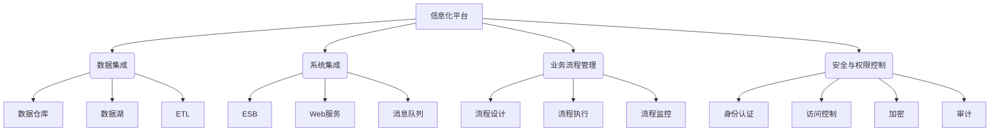

# 整合和管理信息化管理系统搭建信息化平台

## 1.背景介绍

随着信息技术的快速发展,企业和组织面临着日益增长的数据量和复杂的业务流程。为了有效管理这些数据和流程,构建一个统一的信息化平台变得越来越重要。信息化平台可以整合各种信息系统,实现数据共享和业务协同,从而提高工作效率,降低运营成本,并为决策提供有力支持。

企业级信息化平台通常由多个子系统组成,包括办公自动化(OA)系统、客户关系管理(CRM)系统、企业资源计划(ERP)系统、供应链管理(SCM)系统、电子商务(EC)系统等。这些系统分别负责不同的业务领域,但又相互关联和依赖。因此,如何有效地整合和管理这些系统,实现无缝集成和高效协作,是构建企业级信息化平台的关键挑战。

## 2.核心概念与联系

构建企业级信息化平台涉及多个核心概念,包括数据集成、系统集成、业务流程管理、安全与权限控制等。

### 2.1 数据集成

数据集成是将来自不同源系统的数据合并到一个统一的数据存储中,以支持跨系统的数据访问和分析。常用的数据集成技术包括数据仓库、数据湖、ETL(提取、转换、加载)等。

### 2.2 系统集成

系统集成是将不同的应用系统、数据库、中间件等组件连接起来,实现无缝协作。常用的系统集成技术包括企业服务总线(ESB)、Web服务、消息队列等。

### 2.3 业务流程管理

业务流程管理(BPM)是设计、执行、监控和优化业务流程的方法和技术。它可以自动化和优化跨系统的业务流程,提高效率和一致性。

### 2.4 安全与权限控制

在信息化平台中,需要采取适当的安全措施来保护数据和系统的机密性、完整性和可用性。常用的安全技术包括身份认证、访问控制、加密、审计等。同时,还需要建立合理的权限控制机制,确保只有授权用户才能访问相关数据和功能。

这些核心概念相互关联,共同构成了企业级信息化平台的基础架构。

## 3.核心算法原理具体操作步骤

构建企业级信息化平台涉及多个核心算法和技术,包括数据集成、系统集成、业务流程管理和安全与权限控制等方面。下面将分别介绍这些领域的核心算法原理和具体操作步骤。

### 3.1 数据集成

数据集成的核心算法包括ETL(提取、转换、加载)和数据建模。

#### 3.1.1 ETL算法

ETL算法是数据集成的关键步骤,包括以下具体操作:

1. **提取(Extract)**: 从源系统中提取所需数据,可以使用SQL查询、文件读取或API调用等方式。
2. **转换(Transform)**: 对提取的数据进行清洗、转换和规范化处理,以满足目标系统的要求。常用的转换操作包括数据过滤、拆分、合并、计算派生字段等。
3. **加载(Load)**: 将转换后的数据加载到目标数据存储中,如数据仓库或数据湖。

ETL过程可以使用开源或商业ETL工具来实现,如Apache NiFi、Talend、Informatica等。

#### 3.1.2 数据建模

数据建模是设计数据存储结构的过程,包括以下步骤:

1. **概念数据模型**: 确定业务实体及其关系。
2. **逻辑数据模型**: 将概念模型转换为关系模型或维度模型。
3. **物理数据模型**: 根据目标数据库管理系统(DBMS)的特性,优化逻辑模型并创建物理数据库。

数据建模可以使用数据建模工具(如ErWin、PowerDesigner)或直接在DBMS中完成。

### 3.2 系统集成

系统集成的核心技术包括企业服务总线(ESB)、Web服务和消息队列。

#### 3.2.1 企业服务总线(ESB)

ESB是一种基于标准的集成平台,提供了一系列服务和功能,如路由、转换、协议转换等,用于连接和集成不同的应用程序和服务。ESB的典型实现步骤如下:

1. **定义集成模式**: 确定集成的目标和范围,选择适当的集成模式(如点对点、中心化或混合模式)。
2. **设计服务**: 识别需要集成的应用程序和服务,定义服务契约(接口)。
3. **构建ESB基础设施**: 部署ESB产品(如Apache ServiceMix、Mule ESB或商业ESB产品),配置路由规则、转换规则等。
4. **实现服务适配器**: 为每个应用程序或服务开发适配器,以便与ESB进行通信。
5. **测试和部署**: 在开发环境中测试集成解决方案,然后部署到生产环境。

#### 3.2.2 Web服务

Web服务是一种基于标准的应用程序集成技术,通过使用标准协议(如HTTP、SOAP、REST)来实现应用程序之间的通信和数据交换。Web服务的典型实现步骤如下:

1. **定义服务契约**: 使用Web服务描述语言(WSDL)或API文档定义服务的接口和数据格式。
2. **实现服务**: 根据服务契约,使用编程语言(如Java、.NET或Python)开发服务实现。
3. **发布服务**: 将服务部署到Web服务器或应用程序服务器上,并公开服务端点。
4. **发现和调用服务**: 客户端应用程序可以通过服务注册中心发现服务,然后使用标准协议调用服务。

#### 3.2.3 消息队列

消息队列是一种异步通信机制,用于在分布式系统中传递数据或事件。常用的消息队列技术包括Apache Kafka、RabbitMQ、ActiveMQ等。消息队列的典型实现步骤如下:

1. **设置消息队列服务器**: 安装和配置消息队列服务器软件。
2. **定义消息格式**: 确定消息的结构和编码格式(如JSON、XML或自定义二进制格式)。
3. **实现生产者**: 开发应用程序或服务,将消息发送到消息队列。
4. **实现消费者**: 开发应用程序或服务,从消息队列中接收并处理消息。
5. **配置消息路由**: 根据需要,设置消息队列的路由规则和主题/队列。

### 3.3 业务流程管理

业务流程管理(BPM)的核心算法包括流程建模、流程执行和流程监控。

#### 3.3.1 流程建模

流程建模是使用图形符号和规则来定义业务流程的过程。常用的流程建模标准包括BPMN(业务流程模型与标记法)和UML活动图。流程建模的典型步骤如下:

1. **确定流程范围**: 确定需要建模的业务流程及其边界。
2. **收集流程信息**: 与业务专家和参与者讨论,了解流程的详细步骤、规则和数据要求。
3. **绘制流程图**: 使用流程建模工具(如Bizagi、Camunda或BPMN.io)绘制流程图,包括活动、网关、事件、数据对象等元素。
4. **验证和优化流程**: 与利益相关方审查流程模型,识别并解决任何问题或瓶颈。

#### 3.3.2 流程执行

流程执行是根据流程模型自动执行业务流程的过程。典型的流程执行步骤如下:

1. **部署流程模型**: 将流程模型部署到BPM套件或流程引擎中。
2. **启动流程实例**: 通过用户界面、API或其他触发器启动新的流程实例。
3. **执行流程活动**: 流程引擎根据模型执行活动,包括人工任务、系统任务和决策网关等。
4. **处理用户任务**: 分配给人工参与者的任务将显示在工作列表或待办事项列表中,等待处理。
5. **监控流程状态**: 使用BPM套件提供的监控工具跟踪流程实例的状态和进度。

#### 3.3.3 流程监控

流程监控是持续跟踪和分析流程性能的过程,以识别瓶颈并发现改进机会。典型的流程监控步骤如下:

1. **定义关键绩效指标(KPI)**: 确定用于衡量流程效率和效ектив性的指标,如周转时间、等待时间、成本等。
2. **收集流程数据**: 从BPM套件、信息系统和其他相关源中收集流程执行数据。
3. **分析流程性能**: 使用数据分析和可视化工具分析流程数据,计算KPI并识别问题区域。
4. **优化流程**: 根据分析结果,调整流程模型、资源分配或其他因素以改进流程性能。

### 3.4 安全与权限控制

信息化平台的安全和权限控制涉及多种技术和算法,包括身份认证、访问控制、加密和审计等。

#### 3.4.1 身份认证

身份认证是验证用户身份的过程,常用的身份认证算法包括:

- **基于密码的认证**: 使用用户名和密码进行认证,密码通常使用加盐哈希算法(如bcrypt或PBKDF2)进行存储和验证。
- **基于证书的认证**: 使用数字证书(如X.509证书)进行认证,通常与SSL/TLS协议结合使用。
- **多因素认证(MFA)**: 结合多种认证因素(如密码、生物特征、硬件令牌等)提高安全性。

#### 3.4.2 访问控制

访问控制是管理对资源(如数据、功能或服务)的访问权限的过程。常用的访问控制模型包括:

- **基于角色的访问控制(RBAC)**: 根据用户的角色分配权限,常用于企业环境。
- **基于属性的访问控制(ABAC)**: 根据用户属性、资源属性和环境条件动态评估访问权限。
- **强制访问控制(MAC)**: 基于安全级别和规则集严格控制对象之间的信息流动。

访问控制通常与身份认证和授权机制(如OAuth 2.0或XACML)结合使用。

#### 3.4.3 加密

加密是将数据转换为不可读形式以保护其机密性的过程。常用的加密算法包括:

- **对称加密**: 使用相同的密钥进行加密和解密,如AES、DES等。
- **非对称加密**: 使用公钥加密、私钥解密(或反之),如RSA、ECC等。
- **哈希函数**: 将任意长度的数据映射为固定长度的哈希值,如SHA-256、SHA-3等,常用于数据完整性验证。

加密算法通常与密钥管理和数字证书技术结合使用,以确保密钥的安全分发和存储。

#### 3.4.4 审计

审计是记录和分析系统活动的过程,用于检测安全违规行为和问题。常用的审计技术包括:

- **日志记录**: 记录系统、应用程序和用户活动的详细日志。
- **安全信息和事件管理(SIEM)**: 收集和分析来自多个源的安全相关数据,以检测和响应安全事件。
- **用户行为分析(UBA)**: 通过分析用户活动模式来识别异常行为,有助于检测内部威胁。

审计数据通常与安全规则和威胁情报相结合,以提高检测和响应能力。

通过实施这些核心算法和技术,企业可以构建一个安全、高效和可扩展