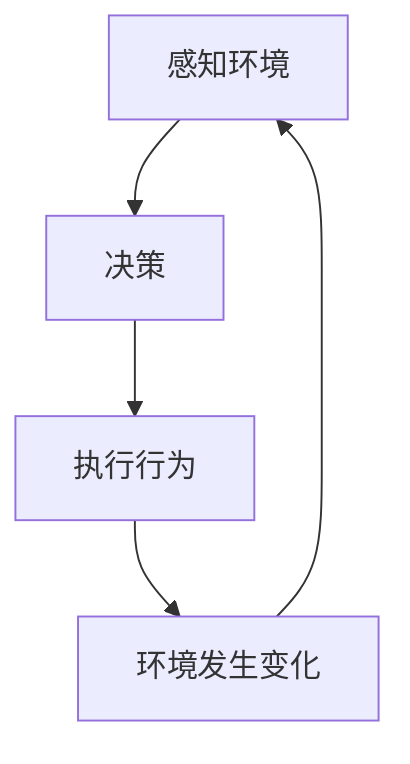

# 智能体 (Agent)

## 1.背景介绍

在人工智能领域中,智能体(Agent)是一个重要的概念。它是指能够感知环境,并根据感知结果采取行动以实现目标的自主系统。智能体可以是软件代理、机器人或其他类型的自主系统。

随着人工智能技术的快速发展,智能体的应用越来越广泛,从游戏AI到自动驾驶汽车,再到智能助理等,无处不在。因此,深入理解智能体的核心概念、原理和算法对于开发高质量的智能系统至关重要。

## 2.核心概念与联系

### 2.1 智能体的特征

智能体具有以下几个关键特征:

1. 感知能力(Perception)
2. 行为选择(Action Selection)
3. 目标导向(Goal-Oriented)
4. 学习能力(Learning Capability)
5. 自主性(Autonomy)

### 2.2 智能体与环境的交互

智能体与环境之间存在着动态的交互过程,可以用一个简单的循环来描述:



1. 感知(Perception):智能体通过传感器获取环境状态信息。
2. 决策(Decision Making):根据感知结果和目标,决策下一步的行为。
3. 行为(Action):执行选择的行为,影响环境状态。
4. 环境变化(Environment Change):行为导致环境发生变化。

### 2.3 智能体的分类

根据智能体与环境的交互方式,可以将智能体分为以下几类:

1. 简单反射智能体(Simple Reflex Agent)
2. 基于模型的智能体(Model-Based Agent)
3. 基于目标的智能体(Goal-Based Agent)
4. 基于效用的智能体(Utility-Based Agent)
5. 学习智能体(Learning Agent)

## 3.核心算法原理具体操作步骤

智能体的核心算法原理主要包括以下几个方面:

### 3.1 状态空间表示

状态空间(State Space)是指智能体所处环境的所有可能状态的集合。对于一个给定的问题,首先需要确定状态空间的表示方式,通常使用以下几种方法:

1. 原子表示(Atomic Representation)
2. 分解表示(Factored Representation)
3. 结构化表示(Structured Representation)

### 3.2 状态转移函数

状态转移函数(State Transition Function)描述了智能体在执行某个行为后,环境状态如何发生变化。它可以表示为:

$$
s' = f(s, a)
$$

其中,$s$表示当前状态,$a$表示执行的行为,$s'$表示执行行为后的新状态。

### 3.3 搜索算法

对于基于模型的智能体,常用的算法包括:

1. 广度优先搜索(Breadth-First Search, BFS)
2. 深度优先搜索(Depth-First Search, DFS)
3. 贪心最优优先搜索(Greedy Best-First Search)
4. A*搜索算法(A* Search)

这些搜索算法的目标是找到从初始状态到目标状态的最优路径。

### 3.4 规划算法

对于基于目标的智能体,常用的算法包括:

1. 前向规划(Forward Planning)
2. 回溯搜索(Backtracking Search)
3. 部分顺序规划(Partial-Order Planning)
4. 层次任务网络规划(Hierarchical Task Network Planning)

这些规划算法的目标是生成一系列行动,使智能体从初始状态达到目标状态。

### 3.5 马尔可夫决策过程

对于基于效用的智能体,常用的算法是马尔可夫决策过程(Markov Decision Process, MDP)。MDP由以下几个要素组成:

1. 状态集合$S$
2. 行为集合$A$
3. 转移概率$P(s'|s,a)$
4. 奖励函数$R(s,a,s')$

MDP的目标是找到一个策略$\pi$,使得在遵循该策略时,预期的累积奖励最大化。常用的算法包括:

1. 价值迭代(Value Iteration)
2. 策略迭代(Policy Iteration)
3. Q-Learning
4. Sarsa

### 3.6 强化学习算法

对于学习智能体,常用的算法是强化学习(Reinforcement Learning)算法。强化学习的核心思想是通过与环境的交互,不断试错并获取反馈,从而学习到一个好的策略。常用的算法包括:

1. Q-Learning
2. Sarsa
3. 策略梯度算法(Policy Gradient Methods)
4. 深度强化学习算法(Deep Reinforcement Learning)

## 4.数学模型和公式详细讲解举例说明

### 4.1 马尔可夫决策过程

马尔可夫决策过程(MDP)是研究智能体决策问题的重要数学模型。MDP由以下要素组成:

1. 状态集合$S$
2. 行为集合$A$
3. 转移概率$P(s'|s,a)$:表示在状态$s$执行行为$a$后,转移到状态$s'$的概率。
4. 奖励函数$R(s,a,s')$:表示在状态$s$执行行为$a$并转移到状态$s'$时获得的即时奖励。
5. 折扣因子$\gamma \in [0,1)$:用于权衡即时奖励和长期累积奖励的重要性。

MDP的目标是找到一个策略$\pi$,使得在遵循该策略时,预期的累积奖励最大化。累积奖励可以表示为:

$$
G_t = \sum_{k=0}^{\infty} \gamma^k R_{t+k+1}
$$

其中,$R_t$表示时间步$t$获得的即时奖励。

对于有限的MDP,我们可以使用动态规划算法来求解最优策略,例如价值迭代(Value Iteration)和策略迭代(Policy Iteration)。

#### 价值迭代算法

价值迭代算法的目标是计算出每个状态的最优价值函数$V^*(s)$,表示在状态$s$开始,遵循最优策略时的预期累积奖励。最优价值函数满足下式:

$$
V^*(s) = \max_a \sum_{s'} P(s'|s,a) \Big[ R(s,a,s') + \gamma V^*(s') \Big]
$$

我们可以通过不断更新$V(s)$的近似值,直到收敛到$V^*(s)$。算法步骤如下:

1. 初始化$V(s)$为任意值
2. 重复以下步骤直到收敛:
    $$
    V(s) \leftarrow \max_a \sum_{s'} P(s'|s,a) \Big[ R(s,a,s') + \gamma V(s') \Big]
    $$
3. 得到的$V(s)$即为$V^*(s)$

有了$V^*(s)$,我们就可以推导出最优策略$\pi^*(s)$:

$$
\pi^*(s) = \arg\max_a \sum_{s'} P(s'|s,a) \Big[ R(s,a,s') + \gamma V^*(s') \Big]
$$

#### 策略迭代算法

策略迭代算法的思路是先假设一个策略$\pi$,然后计算该策略下的价值函数$V^\pi(s)$,再根据$V^\pi(s)$改进策略$\pi$,重复这个过程直到收敛。算法步骤如下:

1. 初始化一个随机策略$\pi$
2. 重复以下步骤直到收敛:
    1. 计算策略$\pi$下的价值函数$V^\pi(s)$:
        $$
        V^\pi(s) = \sum_{s'} P(s'|s,\pi(s)) \Big[ R(s,\pi(s),s') + \gamma V^\pi(s') \Big]
        $$
    2. 根据$V^\pi(s)$更新策略$\pi$:
        $$
        \pi'(s) = \arg\max_a \sum_{s'} P(s'|s,a) \Big[ R(s,a,s') + \gamma V^\pi(s') \Big]
        $$
    3. 如果$\pi' \neq \pi$,令$\pi = \pi'$,否则算法收敛。

收敛时得到的$\pi$即为最优策略$\pi^*$。

### 4.2 Q-Learning算法

Q-Learning是一种基于时序差分(Temporal Difference)的强化学习算法,它不需要事先知道环境的转移概率和奖励函数,而是通过与环境的交互来学习最优策略。

Q-Learning定义了一个行为价值函数$Q(s,a)$,表示在状态$s$执行行为$a$,之后遵循最优策略时的预期累积奖励。最优行为价值函数$Q^*(s,a)$满足下式:

$$
Q^*(s,a) = \mathbb{E}_{s'} \Big[ R(s,a,s') + \gamma \max_{a'} Q^*(s',a') \Big]
$$

Q-Learning算法通过不断更新$Q(s,a)$的近似值,使其收敛到$Q^*(s,a)$。算法步骤如下:

1. 初始化$Q(s,a)$为任意值
2. 对于每个时间步$t$:
    1. 观测当前状态$s_t$
    2. 选择一个行为$a_t$,通常使用$\epsilon$-greedy策略
    3. 执行行为$a_t$,观测到新状态$s_{t+1}$和即时奖励$r_{t+1}$
    4. 更新$Q(s_t,a_t)$:
        $$
        Q(s_t,a_t) \leftarrow Q(s_t,a_t) + \alpha \Big[ r_{t+1} + \gamma \max_{a'} Q(s_{t+1},a') - Q(s_t,a_t) \Big]
        $$
        其中,$\alpha$是学习率。

经过足够多的交互,Q-Learning算法可以使$Q(s,a)$收敛到$Q^*(s,a)$。有了$Q^*(s,a)$,我们就可以推导出最优策略$\pi^*(s)$:

$$
\pi^*(s) = \arg\max_a Q^*(s,a)
$$

Q-Learning算法的优点是简单、通用,可以应用于任何满足马尔可夫性质的环境。但它也存在一些缺陷,如收敛速度较慢、对于连续状态空间的处理效率低下等。

## 5.项目实践:代码实例和详细解释说明

为了更好地理解智能体的原理和算法,我们来看一个基于Python的简单示例。这个示例实现了一个基于Q-Learning的智能体,在一个格子世界(GridWorld)环境中学习如何到达目标位置。

### 5.1 环境:格子世界

格子世界是一个常用的强化学习环境,它是一个二维的网格,智能体可以在网格中上下左右移动。网格中可能存在障碍物、陷阱和目标位置。智能体的目标是从起始位置到达目标位置,并尽可能获得更高的累积奖励。

我们定义格子世界的状态为智能体的当前位置,行为为上下左右四个移动方向。如果智能体移动到了障碍物或陷阱位置,它会受到负奖励;如果到达目标位置,它会获得正奖励。

### 5.2 Q-Learning智能体实现

我们使用Q-Learning算法训练一个智能体,使其学会在格子世界中到达目标位置。具体实现如下:

```python
import numpy as np

# 定义格子世界
WORLD = np.array([
    [0, 0, 0, 1],
    [0, -1, 0, -1],
    [0, 0, 0, 0]
])

# 定义行为
ACTIONS = ['left', 'right', 'up', 'down']

# 定义奖励
REWARDS = {
    0: 0,    # 空格子
    -1: -10, # 陷阱
    1: 100   # 目标
}

# 定义Q-Learning参数
ALPHA = 0.1  # 学习率
GAMMA = 0.9  # 折扣因子
EPSILON = 0.1  # 探索率

# 初始化Q表
Q = {}
for i in range(WORLD.shape[0]):
    for j in range(WORLD.shape[1]):
        Q[(i, j)] = {a: 0 for a in ACTIONS}

# 定义epsilon-greedy策略
def choose_action(state, epsilon):
    if np.random.uniform() < epsilon:
        # 探索
        return np.random.choice(ACTIONS)
    else:
        # 利用
        values = Q[state]
        return max(values, key=values.get)

# 定义环境动态
def step(state, action):
    i, j = state
    if action