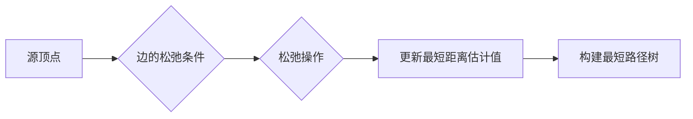

# 最短路径 原理与代码实例讲解

## 1. 背景介绍

在图论和网络优化领域中,最短路径问题是一个非常经典和基础的问题。它在实际应用中有着广泛的应用,例如交通路线规划、网络路由优化、社交网络分析等。最短路径算法旨在找到图中两个顶点之间的最短路径,即权重最小的路径。

### 1.1 图的基本概念

在讨论最短路径算法之前,我们首先需要了解图的一些基本概念。

#### 1.1.1 顶点和边

图由顶点(Vertex)和边(Edge)组成。顶点表示图中的节点或实体,边表示顶点之间的连接或关系。

#### 1.1.2 有向图和无向图  

根据边的方向性,图可以分为有向图(Directed Graph)和无向图(Undirected Graph)。在有向图中,边有特定的方向,表示从一个顶点到另一个顶点的单向连接。而在无向图中,边没有方向,表示顶点之间的双向连接。

#### 1.1.3 权重

在加权图(Weighted Graph)中,每条边都有一个相关的权重(Weight)或成本(Cost)。权重可以表示距离、时间、成本等度量。在最短路径问题中,我们通常考虑加权图,目标是找到权重之和最小的路径。

### 1.2 最短路径问题的分类

最短路径问题可以分为以下几类:

#### 1.2.1 单源最短路径问题

给定图中的一个源顶点,找到从该源顶点到其他所有顶点的最短路径。常见的算法有Dijkstra算法和Bellman-Ford算法。

#### 1.2.2 全源最短路径问题

找到图中所有顶点对之间的最短路径。常见的算法有Floyd-Warshall算法。

#### 1.2.3 单对最短路径问题 

给定图中的一个源顶点和一个目标顶点,找到它们之间的最短路径。可以使用Dijkstra算法或A*搜索算法。

## 2. 核心概念与联系

在最短路径算法中,有几个核心概念需要理解:

### 2.1 松弛操作

松弛操作是最短路径算法的核心操作之一。它用于更新从源顶点到其他顶点的最短距离估计值。通过比较当前最短距离和经过某条边到达该顶点的距离,如果后者更小,则更新最短距离估计值。

### 2.2 最短路径树

最短路径树是以源顶点为根的树,树中的每条路径都是从源顶点到对应顶点的最短路径。在单源最短路径问题中,最短路径树包含了从源顶点到所有可达顶点的最短路径信息。

### 2.3 边的松弛条件

对于一条边(u, v)和源顶点s,如果dist[v] > dist[u] + weight(u, v),则可以通过松弛操作更新dist[v]的值。这个条件保证了算法的正确性和最优性。

下面是这些概念之间的关系图:



## 3. 核心算法原理具体操作步骤

### 3.1 Dijkstra算法

Dijkstra算法是一种用于解决单源最短路径问题的贪心算法。它适用于边权重非负的加权图。

#### 3.1.1 算法步骤

1. 初始化:
   - 创建一个距离数组dist,用于存储从源顶点到其他顶点的最短距离估计值。
   - 将源顶点的距离设为0,其他顶点的距离设为无穷大。
   - 创建一个优先队列(小根堆)来存储顶点及其对应的距离估计值。
   - 将源顶点加入优先队列。

2. 循环直到优先队列为空:
   - 从优先队列中取出距离最小的顶点u。
   - 对于u的每个邻居顶点v,执行松弛操作:
     - 如果通过u到达v的距离小于当前dist[v]的值,则更新dist[v]并将v加入优先队列。

3. 最终,dist数组中存储了从源顶点到所有可达顶点的最短距离。

#### 3.1.2 算法复杂度

- 时间复杂度:使用二叉堆实现优先队列,时间复杂度为O((V+E)logV),其中V是顶点数,E是边数。
- 空间复杂度:O(V),需要存储距离数组和优先队列。

### 3.2 Bellman-Ford算法

Bellman-Ford算法是一种用于解决单源最短路径问题的动态规划算法。与Dijkstra算法不同,它可以处理边权重为负的情况。

#### 3.2.1 算法步骤

1. 初始化:
   - 创建一个距离数组dist,用于存储从源顶点到其他顶点的最短距离估计值。
   - 将源顶点的距离设为0,其他顶点的距离设为无穷大。

2. 进行V-1次迭代(V是顶点数):
   - 对于图中的每条边(u, v),执行松弛操作:
     - 如果通过u到达v的距离小于当前dist[v]的值,则更新dist[v]。

3. 检查是否存在负权重环:
   - 再次遍历所有边,如果还能进行松弛操作,则说明图中存在负权重环,算法终止。

4. 最终,dist数组中存储了从源顶点到所有可达顶点的最短距离。

#### 3.2.2 算法复杂度

- 时间复杂度:O(VE),其中V是顶点数,E是边数。
- 空间复杂度:O(V),需要存储距离数组。

### 3.3 Floyd-Warshall算法

Floyd-Warshall算法是一种用于解决全源最短路径问题的动态规划算法。它可以找到图中所有顶点对之间的最短路径。

#### 3.3.1 算法步骤

1. 初始化:
   - 创建一个二维距离矩阵dist,初始值为图的邻接矩阵。
   - 对于不直接相连的顶点,将距离设为无穷大。
   - 对角线元素(自身到自身的距离)设为0。

2. 进行V次迭代(V是顶点数):
   - 对于每对顶点(i, j),考虑通过中间顶点k是否可以缩短它们之间的距离:
     - 如果dist[i][j] > dist[i][k] + dist[k][j],则更新dist[i][j]的值。

3. 最终,dist矩阵中存储了所有顶点对之间的最短距离。

#### 3.3.2 算法复杂度

- 时间复杂度:O(V^3),其中V是顶点数。
- 空间复杂度:O(V^2),需要存储距离矩阵。

## 4. 数学模型和公式详细讲解举例说明

### 4.1 Dijkstra算法的数学模型

设图G=(V, E),其中V是顶点集合,E是边集合。对于每条边(u, v)∈E,都有一个非负权重w(u, v)。我们的目标是找到从源顶点s到其他所有顶点的最短路径。

定义dist[v]表示从源顶点s到顶点v的最短路径长度。初始时,对于所有v∈V,dist[v]=∞,dist[s]=0。

Dijkstra算法的松弛操作可以表示为:

$$
dist[v] = min(dist[v], dist[u] + w(u, v))
$$

其中,u是当前选择的最近顶点,v是u的邻居顶点。

例如,考虑下面这个带权无向图:

```
   (2)   (3)
(s)---(a)---(b)
 |     |     |
(1)  (4)   (2)
 |     |     |
(c)---(d)---(t)
   (3)   (1)
```

对于源顶点s,Dijkstra算法的执行过程如下:

1. 初始化:dist[s]=0,dist[a]=dist[b]=dist[c]=dist[d]=dist[t]=∞。

2. 选择距离最小的顶点s,对其邻居a和c进行松弛操作:
   - dist[a] = min(∞, 0+2) = 2
   - dist[c] = min(∞, 0+1) = 1

3. 选择距离最小的顶点c,对其邻居d进行松弛操作:
   - dist[d] = min(∞, 1+3) = 4

4. 选择距离最小的顶点a,对其邻居b和d进行松弛操作:
   - dist[b] = min(∞, 2+3) = 5
   - dist[d] = min(4, 2+4) = 4 (不更新)

5. 选择距离最小的顶点d,对其邻居t进行松弛操作:
   - dist[t] = min(∞, 4+1) = 5

6. 选择距离最小的顶点b,对其邻居t进行松弛操作:
   - dist[t] = min(5, 5+2) = 5 (不更新)

最终,我们得到从源顶点s到其他所有顶点的最短距离:dist[s]=0,dist[a]=2,dist[b]=5,dist[c]=1,dist[d]=4,dist[t]=5。

### 4.2 Bellman-Ford算法的数学模型

Bellman-Ford算法的数学模型与Dijkstra算法类似,但它允许存在负权重的边。

设图G=(V, E),其中V是顶点集合,E是边集合。对于每条边(u, v)∈E,都有一个权重w(u, v),可以是正数、零或负数。我们的目标是找到从源顶点s到其他所有顶点的最短路径。

定义dist[v]表示从源顶点s到顶点v的最短路径长度。初始时,对于所有v∈V,dist[v]=∞,dist[s]=0。

Bellman-Ford算法的松弛操作可以表示为:

$$
dist[v] = min(dist[v], dist[u] + w(u, v))
$$

其中,u是当前选择的顶点,v是u的邻居顶点。

Bellman-Ford算法的特点是需要进行V-1次迭代,每次迭代都遍历所有边并执行松弛操作。这样可以确保算法能够正确处理负权重边。

例如,考虑下面这个带权有向图:

```
   (2)   (3)
(s)-->(a)-->(b)
 |     |     |
(1)  (4)   (-2)
 |     |     |
(c)<--(d)<--(t)
   (-3)  (-1)
```

对于源顶点s,Bellman-Ford算法的执行过程如下:

1. 初始化:dist[s]=0,dist[a]=dist[b]=dist[c]=dist[d]=dist[t]=∞。

2. 第一次迭代:
   - 边(s, a):dist[a] = min(∞, 0+2) = 2
   - 边(s, c):dist[c] = min(∞, 0+1) = 1
   - 边(a, b):dist[b] = min(∞, 2+3) = 5
   - 边(a, d):dist[d] = min(∞, 2+4) = 6
   - 边(d, c):dist[c] = min(1, 6-3) = 1 (不更新)
   - 边(d, t):dist[t] = min(∞, 6-1) = 5
   - 边(t, b):dist[b] = min(5, 5-2) = 3
   
3. 第二次迭代:
   - 边(s, a):dist[a] = min(2, 0+2) = 2 (不更新)
   - 边(s, c):dist[c] = min(1, 0+1) = 1 (不更新)
   - 边(a, b):dist[b] = min(3, 2+3) = 3 (不更新)
   - 边(a, d):dist[d] = min(6, 2+4) = 6 (不更新)
   - 边(d, c):dist[c] = min(1, 6-3) = 1 (不更新)
   - 边(d, t):dist[t] = min(5, 6-1) = 5 (不更新)
   - 边(t, b):dist[b] = min(3, 5-2) = 3 (不更新)

4. 第三次迭代:
   - 所有边的松弛操作都不会更新dist数组,算法结束。

最终,我们得到从源顶点s到其他所有顶点的最短距离:dist[s]=0,dist[a]=2,dist[b]=3,dist