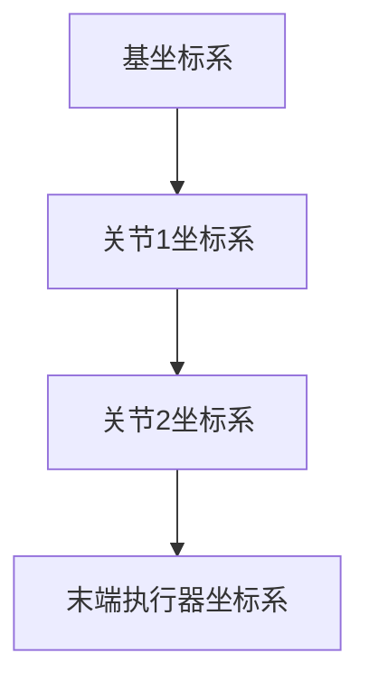

# 机器人学 (Robotics)

## 1. 背景介绍

机器人学是一门涵盖机器人设计、结构、制造和应用的跨学科领域。随着技术的不断进步,机器人已经渗透到我们生活的方方面面,从工业制造到医疗保健,从家庭服务到航空航天探索。机器人的发展离不开多个学科的融合,包括机械工程、电子工程、计算机科学、控制理论等。

机器人的起源可以追溯到20世纪初,当时它们主要用于执行一些重复性的任务。随着计算能力和传感器技术的飞速发展,现代机器人已经能够执行更加复杂和智能化的任务。它们不仅可以进行精确的运动控制,还能够感知环境、做出决策并与人类互动。

## 2. 核心概念与联系

机器人学的核心概念包括:

### 2.1 机构学 (Kinematics)

机构学研究机器人的运动学,包括机器人的位置、速度、加速度等。它描述了机器人各个关节和连杆之间的几何关系,是控制机器人运动的基础。

### 2.2 动力学 (Dynamics)

动力学研究机器人在运动过程中所受到的力和力矩,以及它们对机器人运动的影响。动力学分析有助于优化机器人的设计,提高其效率和稳定性。

### 2.3 控制理论 (Control Theory)

控制理论是机器人学的核心,它研究如何基于传感器数据和期望轨迹,计算出需要施加在机器人上的控制力和力矩。常用的控制算法包括PID控制、自适应控制、机器人运动规划等。

### 2.4 感知与决策 (Perception and Decision Making)

机器人需要感知周围环境,并根据感知信息做出决策。常见的感知方式包括视觉、声学、触觉等。决策则涉及规划、推理和学习等领域。

### 2.5 人机交互 (Human-Robot Interaction)

随着机器人逐渐进入人类生活,人机交互变得越来越重要。它研究如何让机器人更好地理解人类的意图,并以自然、友好的方式与人类互动。

这些核心概念相互关联、相辅相成,共同构建了机器人学这一复杂的学科体系。

## 3. 核心算法原理具体操作步骤

机器人学中有许多核心算法,下面将介绍其中几个重要算法的原理和操作步骤。

### 3.1 逆运动学求解 (Inverse Kinematics)

逆运动学求解是机器人学中一个关键问题,它的目标是根据给定的末端执行器位置和姿态,计算出机器人每个关节的角度。这个过程通常需要求解一系列非线性方程组。

常见的求解步骤如下:

1. 建立机器人的运动学模型,包括连杆长度、关节类型等参数。
2. 将期望的末端执行器位置和姿态转换为机器人基坐标系下的值。
3. 根据运动学模型,建立关节角度与末端执行器位置和姿态之间的关系方程。
4. 使用数值优化算法(如牛顿迭代法、梯度下降法等)求解这个非线性方程组,得到每个关节的角度解。
5. 处理存在多解或无解的情况,选取满足约束条件的最优解。

### 3.2 轨迹规划 (Trajectory Planning)

轨迹规划是指在满足各种约束条件下,为机器人规划出一条平滑、无碰撞的运动轨迹。常用的算法有:

1. **多项式插值法**: 根据起点、终点及若干中间点,拟合出一条平滑的多项式曲线作为轨迹。
2. **三次样条曲线**: 将轨迹分成多段三次曲线,保证每段曲线及其导数在连接点处平滑衔接。
3. **LSPB曲线**: 利用线性二次规划,在满足约束条件下生成最优轨迹。
4. **采样优化**: 将轨迹离散为一系列采样点,使用优化算法(如RRT、A*等)在满足约束的前提下寻找最优轨迹。

### 3.3 运动控制 (Motion Control)

运动控制算法的目标是根据期望轨迹和反馈信号,计算出需要施加在机器人上的控制力和力矩。常用的控制算法包括:

1. **PID控制**: 根据期望值与实际值的偏差及其导数,计算出控制量。
2. **自适应控制**: 在线识别系统参数,并自动调整控制器参数以适应变化。
3. **滑模控制**: 将系统状态导向一个切换面,在该面上保持滑移以获得强鲁棒性。
4. **学习控制**: 利用机器学习算法,从大量数据中学习出最优控制策略。

控制算法的选择取决于系统的具体要求,如响应速度、精度、鲁棒性等。

## 4. 数学模型和公式详细讲解举例说明

机器人学中有许多重要的数学模型和公式,下面将详细介绍其中几个核心内容。

### 4.1 齐次变换矩阵 (Homogeneous Transformation Matrix)

齐次变换矩阵是描述刚体在三维空间中的位置和姿态的一种数学表示方法。它由一个3x3的旋转矩阵和一个3x1的平移向量组成,形式如下:

$$
T=\begin{bmatrix}
R & p\\
0 & 1
\end{bmatrix}
$$

其中$R$是旋转矩阵,描述了刚体的姿态;$p$是平移向量,描述了刚体的位置。

通过矩阵相乘,我们可以方便地表示坐标系之间的变换关系。例如,如果已知机器人基坐标系到关节1坐标系的变换$T_{01}$,以及关节1到关节2的变换$T_{12}$,那么基坐标系到关节2的变换就可以通过矩阵相乘得到:

$$
T_{02} = T_{01}T_{12}
$$

### 4.2 雅可比矩阵 (Jacobian Matrix)

雅可比矩阵描述了机器人末端执行器在机器人基坐标系下的速度,与每个关节的角速度之间的关系。对于一个有$n$个关节的机器人,其雅可比矩阵$J$的形式为:

$$
J=\begin{bmatrix}
\frac{\partial x}{\partial q_1} & \frac{\partial x}{\partial q_2} & \cdots & \frac{\partial x}{\partial q_n}\\
\frac{\partial y}{\partial q_1} & \frac{\partial y}{\partial q_2} & \cdots & \frac{\partial y}{\partial q_n}\\
\frac{\partial z}{\partial q_1} & \frac{\partial z}{\partial q_2} & \cdots & \frac{\partial z}{\partial q_n}\\
\frac{\partial \alpha}{\partial q_1} & \frac{\partial \alpha}{\partial q_2} & \cdots & \frac{\partial \alpha}{\partial q_n}\\
\frac{\partial \beta}{\partial q_1} & \frac{\partial \beta}{\partial q_2} & \cdots & \frac{\partial \beta}{\partial q_n}\\
\frac{\partial \gamma}{\partial q_1} & \frac{\partial \gamma}{\partial q_2} & \cdots & \frac{\partial \gamma}{\partial q_n}
\end{bmatrix}
$$

其中$(x,y,z)$是末端执行器在基坐标系下的位置,$ (\alpha, \beta, \gamma) $是其姿态(按某种约定的欧拉角序列),$q_i$是第$i$个关节的角度。

通过雅可比矩阵,我们可以将关节空间中的速度映射到笛卡尔空间,或者将笛卡尔空间中的速度映射回关节空间,这对于机器人的运动控制至关重要。

### 4.3 拉格朗日动力学方程 (Lagrangian Dynamics)

拉格朗日动力学方程为我们提供了一种从能量的角度研究机器人运动的方法。对于一个有$n$个自由度的机器人系统,它的拉格朗日方程可以写为:

$$
\frac{d}{dt}\left(\frac{\partial L}{\partial \dot{q}_i}\right) - \frac{\partial L}{\partial q_i} = \tau_i \qquad i=1,2,\cdots,n
$$

其中$L=K-P$是拉格朗日函数,等于系统的动能$K$减去势能$P$;$q_i$是广义坐标;$\tau_i$是对应的广义力或力矩。

通过建立系统的动能和势能表达式,并将其代入拉格朗日方程,我们可以得到描述系统运动的一系列耦合的非线性常微分方程组。这些方程不仅可以用于机器人的运动学和动力学分析,也可以用于基于能量的优化和控制。

### 4.4 举例说明

以一个简单的二连杆机械臂为例,说明上述数学模型的具体应用。



1. **齐次变换矩阵**

假设已知关节1相对于基坐标系的变换$T_{01}$,以及关节2相对于关节1的变换$T_{12}$,那么末端执行器相对于基坐标系的变换就可以通过矩阵相乘得到:

$$
T_{03} = T_{01}T_{12}
$$

2. **雅可比矩阵**

对于这个二连杆机械臂,其雅可比矩阵$J$的形式为:

$$
J=\begin{bmatrix}
-l_1\sin(q_1)-l_2\sin(q_1+q_2) & -l_2\sin(q_1+q_2)\\
l_1\cos(q_1)+l_2\cos(q_1+q_2) & l_2\cos(q_1+q_2)\\
0 & 0\\
0 & 0\\
0 & 1\\
1 & 1
\end{bmatrix}
$$

其中$l_1$和$l_2$分别是两个连杆的长度,$q_1$和$q_2$是两个关节的角度。通过这个雅可比矩阵,我们可以将关节空间中的角速度映射到末端执行器在笛卡尔空间中的线速度和角速度。

3. **拉格朗日动力学方程**

对于这个二连杆机械臂系统,我们可以建立它的动能$K$和势能$P$表达式,然后代入拉格朗日方程:

$$
\frac{d}{dt}\left(\frac{\partial L}{\partial \dot{q}_1}\right) - \frac{\partial L}{\partial q_1} = \tau_1\\
\frac{d}{dt}\left(\frac{\partial L}{\partial \dot{q}_2}\right) - \frac{\partial L}{\partial q_2} = \tau_2
$$

其中$\tau_1$和$\tau_2$分别是施加在两个关节上的力矩。通过求解这个方程组,我们可以得到描述机械臂运动的两个非线性常微分方程。

通过上述数学模型和公式,我们可以对机器人系统进行建模、分析和控制,从而实现期望的运动控制目标。

## 5. 项目实践: 代码实例和详细解释说明

为了更好地理解机器人学的核心概念和算法,下面将通过一个简单的Python项目实例进行说明。这个项目实现了一个二连杆机械臂的运动学、动力学建模和控制。

### 5.1 项目概述

该项目的主要功能包括:

1. 建立二连杆机械臂的运动学模型,计算正运动学和逆运动学
2. 建立动力学模型,计算机械臂在给定控制力矩下的运动轨迹
3. 实现一个简单的PD控制器,使机械臂末端执行器能够跟踪给定的期望轨迹

### 5.2 代码实现

```python
import numpy as np
from numpy import sin, cos, pi
import matplotlib.pyplot as plt
%matplotlib inline

# 机械臂参数
l1 = 1 # 连杆1长度
l2 = 1 # 连杆2长度
m1 = 1 # 连杆1质量
m2 = 1 # 连杆2质量
g = 9.8 # 重力加速度

# 正运动学
def forward_kinematics(q):
    q1, q2 = q
    x = l1 * cos(q1) + l2 *