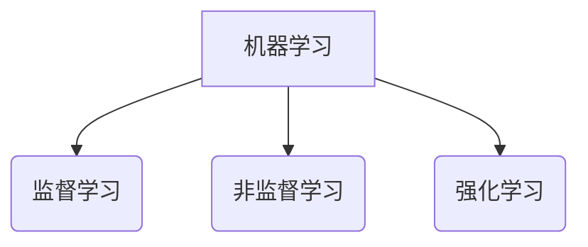

# 机器学习 (Machine Learning, ML) 原理与代码实例讲解

## 1.背景介绍

机器学习是人工智能领域中一个非常重要和前沿的研究方向。它赋予计算机系统自主学习和改进的能力,使其能够从数据中识别模式,并对新数据做出预测或决策,而无需显式编程。随着大数据时代的到来和计算能力的不断提高,机器学习技术得到了前所未有的发展,并被广泛应用于图像识别、自然语言处理、推荐系统、金融预测等诸多领域。

机器学习算法可以分为三大类:监督学习、非监督学习和强化学习。监督学习是基于已标注的训练数据集,学习映射关系以对新数据进行预测或分类。非监督学习则是从未标注的数据中发现内在模式和结构。强化学习则是通过与环境的交互,根据获得的反馈最大化长期累积奖励。



## 2.核心概念与联系

### 2.1 监督学习

监督学习算法通过学习已标注的训练数据集,建立输入特征与目标输出之间的映射关系模型。常见的监督学习任务包括回归和分类。

#### 2.1.1 回归

回归任务的目标是预测一个连续的数值输出。例如,预测房价、销量等。常用的回归算法有线性回归、决策树回归等。

#### 2.1.2 分类

分类任务的目标是将输入实例划分到有限的类别中。例如,垃圾邮件分类、图像识别等。常用的分类算法有逻辑回归、支持向量机、决策树、随机森林等。

### 2.2 非监督学习

非监督学习算法直接从未标注的原始数据中发现内在模式和结构,常用于数据可视化、聚类、降维等任务。

#### 2.2.1 聚类

聚类算法将相似的数据实例划分到同一个簇,使簇内相似度高,簇间相似度低。常用的聚类算法有K-Means、层次聚类、DBSCAN等。

#### 2.2.2 降维

高维数据可视化和处理困难,降维算法能将高维数据映射到低维空间,保留主要的特征信息。常用的降维算法有主成分分析(PCA)、t-SNE等。

### 2.3 强化学习

强化学习算法通过与环境交互,根据获得的反馈最大化长期累积奖励。常用于无人驾驶、游戏AI等领域。

#### 2.3.1 马尔可夫决策过程

强化学习问题通常建模为马尔可夫决策过程(MDP),由状态、动作、奖励函数、状态转移概率和折扣因子组成。

#### 2.3.2 价值函数和策略

价值函数估计在给定策略下,从某状态出发获得的长期累积奖励。策略则是映射状态到动作的函数。强化学习的目标是找到最优策略。

## 3.核心算法原理具体操作步骤  

### 3.1 线性回归

线性回归是最基本和常用的监督学习算法之一,用于预测连续的数值输出。其基本思想是找到一条最佳拟合直线,使所有样本到直线的残差平方和最小。

具体操作步骤如下:

1. 数据预处理:填充缺失值、去除异常值、特征缩放等
2. 定义线性模型:$y = \theta_0 + \theta_1x_1 + ... + \theta_nx_n$
3. 定义损失函数(代价函数):$J(\theta) = \frac{1}{2m}\sum_{i=1}^m(h_\theta(x^{(i)}) - y^{(i)})^2$
4. 使用梯度下降法最小化损失函数,迭代更新参数$\theta$
5. 在测试集上评估模型性能,调整超参数
6. 将模型应用于新数据进行预测

```python
# 线性回归伪代码
import numpy as np
from sklearn.linear_model import LinearRegression

# 加载数据
X_train, y_train = ...
X_test, y_test = ...  

# 创建线性回归模型
model = LinearRegression()

# 训练模型
model.fit(X_train, y_train)  

# 评估模型
score = model.score(X_test, y_test)
print(f'R-squared: {score}')

# 进行预测
y_pred = model.predict(X_new)
```

### 3.2 逻辑回归

逻辑回归是一种用于分类任务的监督学习算法。它通过对数几率(logit)函数将输入映射到0到1之间,从而得到每个类别的概率估计。

具体操作步骤如下:

1. 数据预处理:编码分类特征、填充缺失值、特征缩放等
2. 定义逻辑回归模型:$h_\theta(x) = \frac{1}{1 + e^{-\theta^Tx}}$  
3. 定义损失函数(代价函数):$J(\theta) = -\frac{1}{m}\sum_{i=1}^m[y^{(i)}\log(h_\theta(x^{(i)})) + (1-y^{(i)})\log(1-h_\theta(x^{(i)}))]$
4. 使用梯度下降法或牛顿法等优化算法最小化损失函数
5. 在测试集上评估模型性能,调整超参数和正则化
6. 将模型应用于新数据进行分类预测

```python
# 逻辑回归伪代码 
import numpy as np
from sklearn.linear_model import LogisticRegression

# 加载数据
X_train, y_train = ...
X_test, y_test = ...

# 创建逻辑回归模型  
model = LogisticRegression()

# 训练模型
model.fit(X_train, y_train)

# 评估模型 
score = model.score(X_test, y_test)
print(f'Accuracy: {score}')  

# 进行预测
y_pred = model.predict(X_new)
y_pred_proba = model.predict_proba(X_new)
```

### 3.3 决策树

决策树是一种监督学习算法,可用于回归和分类任务。它通过递归地对特征空间进行分割,构建一个树状决策结构,将实例数据划分到不同的叶节点。

具体操作步骤如下:

1. 选择最优特征,计算各特征对数据集的信息增益/信息增益比/基尼指数,选择增益最大的特征作为根节点
2. 根据选定特征的值,将数据集分割成子集
3. 对子集递归调用步骤1和2,构建决策树
4. 设置停止条件,如达到最大深度、节点数据个数小于设定值等
5. 在测试集上评估模型性能,调整超参数如最大深度等
6. 将模型应用于新数据进行预测

```python
# 决策树伪代码
from sklearn import tree

# 加载数据
X_train, y_train = ...
X_test, y_test = ...  

# 创建决策树模型
model = tree.DecisionTreeClassifier() # 分类
# model = tree.DecisionTreeRegressor() # 回归

# 训练模型 
model.fit(X_train, y_train)

# 评估模型
score = model.score(X_test, y_test)
print(f'Accuracy: {score}')

# 进行预测
y_pred = model.predict(X_new)
```

## 4.数学模型和公式详细讲解举例说明

### 4.1 线性回归

线性回归的目标是找到一条最佳拟合直线,使所有样本到直线的残差平方和最小。其数学模型如下:

$$y = \theta_0 + \theta_1x_1 + ... + \theta_nx_n$$

其中$y$是目标输出,$x_i$是第$i$个特征,$\theta_i$是对应的权重系数。

为了找到最优参数$\theta$,我们定义损失函数(代价函数)为:

$$J(\theta) = \frac{1}{2m}\sum_{i=1}^m(h_\theta(x^{(i)}) - y^{(i)})^2$$

其中$m$是样本数量,$h_\theta(x)$是模型的预测输出。我们使用梯度下降法最小化损失函数:

$$\theta_j := \theta_j - \alpha\frac{\partial}{\partial\theta_j}J(\theta)$$

其中$\alpha$是学习率,反复迭代更新参数直到收敛。

### 4.2 逻辑回归

逻辑回归用于分类任务,它通过对数几率(logit)函数将输入映射到0到1之间,得到每个类别的概率估计:

$$h_\theta(x) = \frac{1}{1 + e^{-\theta^Tx}}$$

其中$\theta$是权重参数向量。

为了找到最优参数$\theta$,我们定义损失函数(代价函数)为:

$$J(\theta) = -\frac{1}{m}\sum_{i=1}^m[y^{(i)}\log(h_\theta(x^{(i)})) + (1-y^{(i)})\log(1-h_\theta(x^{(i)}))]$$

同样使用梯度下降法等优化算法最小化损失函数。对于多分类问题,可以使用One-vs-Rest或Softmax回归等方法。

### 4.3 决策树

决策树通过递归地对特征空间进行分割,构建一个树状决策结构。在每个节点,我们需要选择一个最优特征进行分割,使得数据子集的纯度(impurity)最小。

常用的度量纯度的指标有信息增益、信息增益比和基尼指数。

对于分类问题,信息增益定义为:

$$\text{Gain}(D, a) = \text{Entropy}(D) - \sum_{v \in \text{Values}(a)} \frac{|D^v|}{|D|} \text{Entropy}(D^v)$$

其中$D$是当前数据集,$a$是选择的特征,$D^v$是根据特征$a$的值$v$分割得到的子集。$\text{Entropy}(D)$表示数据集$D$的熵,衡量了数据集的纯度。

对于回归问题,我们通常使用均方差(Mean Squared Error, MSE)作为分割指标。

在构建决策树时,我们选择能最大化信息增益或最小化MSE的特征进行分割,递归构建树结构,直到满足停止条件。

## 5.项目实践:代码实例和详细解释说明

让我们通过一个实际的机器学习项目,来加深对上述算法的理解。我们将使用著名的鸢尾花数据集(Iris Dataset),构建一个分类模型预测鸢尾花的品种。

### 5.1 数据探索

首先,我们加载数据集并查看数据的基本信息。

```python
import pandas as pd
from sklearn.datasets import load_iris

# 加载数据集
iris = load_iris()
X = pd.DataFrame(iris.data, columns=iris.feature_names)
y = pd.Series(iris.target, name='species')

print(X.head())
print(y.value_counts())
```

输出显示数据集包含150个样本,每个样本有4个特征:花萼长度、花萼宽度、花瓣长度和花瓣宽度。目标变量是鸢尾花的品种,共有3个类别。

接下来,我们可视化数据,观察特征与目标变量之间的关系。

```python
import matplotlib.pyplot as plt
import seaborn as sns

# 绘制散点图矩阵
sns.pairplot(X, hue=y, markers='+')
plt.show()
```

从散点图矩阵中,我们可以看到不同品种的鸢尾花在花瓣长度和宽度上存在明显的差异,而在花萼特征上差异不太明显。这为我们构建分类模型提供了有价值的线索。

### 5.2 构建模型

现在,我们将数据集分为训练集和测试集,构建逻辑回归和决策树模型进行分类。

```python
from sklearn.model_selection import train_test_split
from sklearn.linear_model import LogisticRegression
from sklearn.tree import DecisionTreeClassifier
from sklearn.metrics import accuracy_score

# 分割数据集
X_train, X_test, y_train, y_test = train_test_split(X, y, test_size=0.2, random_state=42)

# 逻辑回归
lr = LogisticRegression()
lr.fit(X_train, y_train)
y_pred_lr = lr.predict(X_test)
acc_lr = accuracy_score(y_test, y_pred_lr)
print(f'Logistic Regression Accuracy: {acc_lr}')

# 决策树
dt = DecisionTreeClassifier()
dt.fit(X_train, y_train)
y_pred_dt = dt