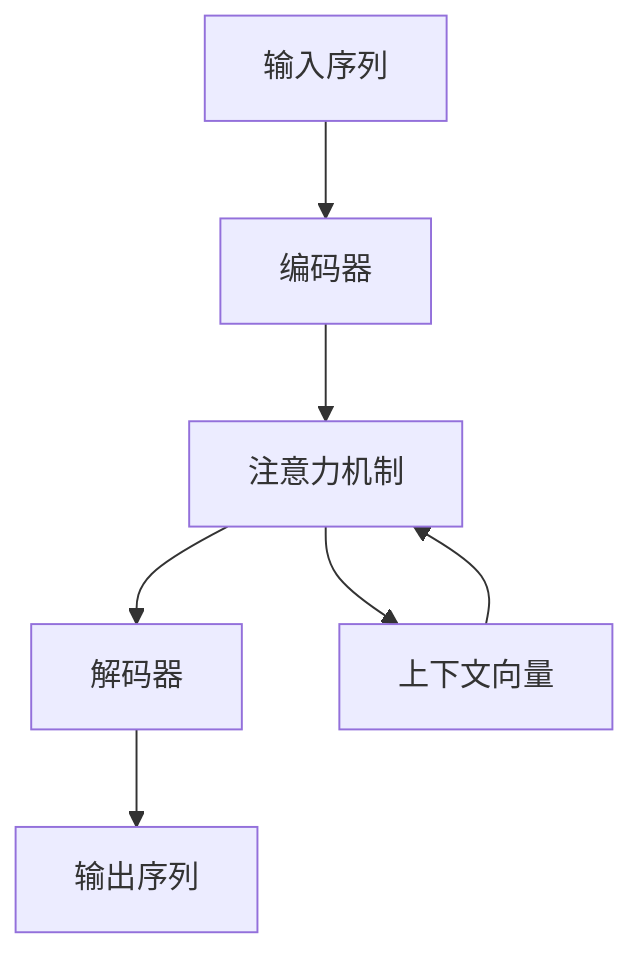

# 注意力机制可视化原理与代码实战案例讲解

## 1. 背景介绍
### 1.1 注意力机制的起源与发展
#### 1.1.1 注意力机制的起源
#### 1.1.2 注意力机制的发展历程
#### 1.1.3 注意力机制在深度学习中的应用

### 1.2 注意力机制的重要性
#### 1.2.1 注意力机制在自然语言处理中的重要性
#### 1.2.2 注意力机制在计算机视觉中的重要性 
#### 1.2.3 注意力机制在其他领域的重要性

## 2. 核心概念与联系
### 2.1 注意力机制的定义
#### 2.1.1 注意力机制的数学定义
#### 2.1.2 注意力机制的直观解释
#### 2.1.3 注意力机制与人类认知的关系

### 2.2 注意力机制的类型
#### 2.2.1 软性注意力机制
#### 2.2.2 硬性注意力机制
#### 2.2.3 全局注意力机制与局部注意力机制

### 2.3 注意力机制与其他概念的联系
#### 2.3.1 注意力机制与循环神经网络的关系
#### 2.3.2 注意力机制与卷积神经网络的关系
#### 2.3.3 注意力机制与自编码器的关系

## 3. 核心算法原理具体操作步骤
### 3.1 Bahdanau Attention
#### 3.1.1 Bahdanau Attention的原理
#### 3.1.2 Bahdanau Attention的具体操作步骤
#### 3.1.3 Bahdanau Attention的优缺点分析

### 3.2 Luong Attention
#### 3.2.1 Luong Attention的原理
#### 3.2.2 Luong Attention的具体操作步骤 
#### 3.2.3 Luong Attention的优缺点分析

### 3.3 Self-Attention
#### 3.3.1 Self-Attention的原理
#### 3.3.2 Self-Attention的具体操作步骤
#### 3.3.3 Self-Attention的优缺点分析

### 3.4 Multi-Head Attention
#### 3.4.1 Multi-Head Attention的原理
#### 3.4.2 Multi-Head Attention的具体操作步骤
#### 3.4.3 Multi-Head Attention的优缺点分析

## 4. 数学模型和公式详细讲解举例说明
### 4.1 注意力机制的数学表示
#### 4.1.1 注意力得分的计算
#### 4.1.2 注意力权重的计算
#### 4.1.3 注意力向量的计算

### 4.2 Bahdanau Attention的数学模型
#### 4.2.1 Bahdanau Attention的注意力得分计算
#### 4.2.2 Bahdanau Attention的注意力权重计算
#### 4.2.3 Bahdanau Attention的注意力向量计算

### 4.3 Luong Attention的数学模型 
#### 4.3.1 Luong Attention的注意力得分计算
#### 4.3.2 Luong Attention的注意力权重计算
#### 4.3.3 Luong Attention的注意力向量计算

### 4.4 Self-Attention的数学模型
#### 4.4.1 Self-Attention的注意力得分计算
#### 4.4.2 Self-Attention的注意力权重计算
#### 4.4.3 Self-Attention的注意力向量计算

### 4.5 Multi-Head Attention的数学模型
#### 4.5.1 Multi-Head Attention的注意力得分计算
#### 4.5.2 Multi-Head Attention的注意力权重计算
#### 4.5.3 Multi-Head Attention的注意力向量计算

## 5. 项目实践：代码实例和详细解释说明
### 5.1 基于Bahdanau Attention的机器翻译模型
#### 5.1.1 数据准备与预处理
#### 5.1.2 模型构建与训练
#### 5.1.3 模型评估与可视化

### 5.2 基于Luong Attention的文本摘要模型
#### 5.2.1 数据准备与预处理
#### 5.2.2 模型构建与训练
#### 5.2.3 模型评估与可视化

### 5.3 基于Self-Attention的情感分析模型
#### 5.3.1 数据准备与预处理
#### 5.3.2 模型构建与训练
#### 5.3.3 模型评估与可视化

### 5.4 基于Multi-Head Attention的图像字幕生成模型
#### 5.4.1 数据准备与预处理
#### 5.4.2 模型构建与训练
#### 5.4.3 模型评估与可视化

## 6. 实际应用场景
### 6.1 自然语言处理领域的应用
#### 6.1.1 机器翻译
#### 6.1.2 文本摘要
#### 6.1.3 情感分析
#### 6.1.4 问答系统

### 6.2 计算机视觉领域的应用
#### 6.2.1 图像字幕生成
#### 6.2.2 视觉问答
#### 6.2.3 目标检测与跟踪
#### 6.2.4 行为识别

### 6.3 其他领域的应用
#### 6.3.1 推荐系统
#### 6.3.2 时间序列预测
#### 6.3.3 语音识别
#### 6.3.4 生物信息学

## 7. 工具和资源推荐
### 7.1 深度学习框架
#### 7.1.1 TensorFlow
#### 7.1.2 PyTorch
#### 7.1.3 Keras

### 7.2 预训练模型
#### 7.2.1 BERT
#### 7.2.2 GPT
#### 7.2.3 Transformer-XL

### 7.3 可视化工具
#### 7.3.1 TensorBoard
#### 7.3.2 Visdom
#### 7.3.3 Matplotlib

### 7.4 数据集资源
#### 7.4.1 WMT
#### 7.4.2 COCO
#### 7.4.3 SQuAD

## 8. 总结：未来发展趋势与挑战
### 8.1 注意力机制的未来发展趋势
#### 8.1.1 注意力机制与知识图谱的结合
#### 8.1.2 注意力机制在多模态学习中的应用
#### 8.1.3 注意力机制与强化学习的结合

### 8.2 注意力机制面临的挑战
#### 8.2.1 注意力机制的可解释性
#### 8.2.2 注意力机制的计算效率
#### 8.2.3 注意力机制的鲁棒性

## 9. 附录：常见问题与解答
### 9.1 如何选择合适的注意力机制？
### 9.2 注意力机制是否会增加模型的复杂度？
### 9.3 注意力机制在小数据集上的表现如何？
### 9.4 注意力机制是否可以应用于非序列数据？
### 9.5 注意力机制与记忆网络有何区别？

注意力机制是深度学习中一种强大而灵活的技术，它允许模型在处理输入数据时有选择地关注某些部分。注意力机制的核心思想是在生成输出时，通过加权平均输入序列的隐藏状态来获得上下文信息。这种机制使模型能够更好地捕捉输入数据中的长距离依赖关系，并根据当前任务的需要动态地调整对不同输入部分的关注程度。

注意力机制最初在自然语言处理领域得到广泛应用，特别是在机器翻译任务中取得了显著的性能提升。Bahdanau等人在2015年提出的注意力机制为神经机器翻译开辟了新的方向。在这种机制下，解码器在生成每个目标词时，都会根据当前的隐藏状态和编码器的所有隐藏状态计算注意力权重，然后用这些权重对编码器的隐藏状态进行加权平均，得到当前时间步的上下文向量。这个上下文向量携带了与当前目标词相关的源语言信息，有助于解码器做出更准确的预测。

Luong等人在2015年提出了另一种注意力机制，它在计算注意力权重时引入了不同的对齐函数，如点积、拼接和双线性函数等。这种注意力机制更加简洁和高效，同时也能够达到与Bahdanau注意力相媲美的翻译质量。

除了在机器翻译中的应用，注意力机制还被广泛用于其他自然语言处理任务，如文本摘要、情感分析、问答系统等。在文本摘要任务中，注意力机制可以帮助模型识别出源文档中的关键信息，生成更加准确和连贯的摘要。在情感分析任务中，注意力机制可以使模型集中于与情感极性相关的词语和句子，提高情感分类的准确性。

随着注意力机制的不断发展，研究者们提出了许多新的变体和改进方法。其中最具代表性的是Self-Attention和Multi-Head Attention。Self-Attention允许输入序列中的每个元素与该序列中的所有其他元素进行交互，捕捉词语之间的依赖关系。Multi-Head Attention则将注意力机制扩展到多个子空间，使模型能够在不同的表示子空间中学习到更丰富的特征。这两种机制都被广泛应用于Transformer等高性能的神经网络架构中。

除了在自然语言处理领域，注意力机制也在计算机视觉任务中得到了广泛应用。在图像字幕生成任务中，注意力机制可以使模型根据图像的不同区域生成相应的文字描述。在视觉问答任务中，注意力机制可以帮助模型在图像中定位与问题相关的区域，生成更加准确的答案。此外，注意力机制还被用于目标检测、行为识别等其他计算机视觉任务。

尽管注意力机制已经取得了显著的成功，但它仍然面临着一些挑战。其中一个主要挑战是注意力机制的可解释性。由于注意力权重是通过复杂的神经网络计算得出的，因此很难直观地解释模型为什么会关注某些特定的输入部分。这对于一些对可解释性要求较高的应用场景（如医疗诊断）来说是一个潜在的障碍。此外，注意力机制在处理较长序列时可能会面临计算效率的问题，因为它需要在每个时间步计算输入序列中所有元素的注意力权重。为了缓解这个问题，研究者们提出了一些高效的注意力机制变体，如稀疏注意力和局部注意力等。

总的来说，注意力机制是深度学习领域的一个重要突破，它极大地提升了各种自然语言处理和计算机视觉任务的性能。随着注意力机制的不断发展和完善，我们有理由相信它将在未来的人工智能研究中扮演越来越重要的角色。同时，我们也需要继续探索注意力机制的可解释性和计算效率等问题，让这一强大的技术在更广泛的应用场景中发挥其潜力。

作者：禅与计算机程序设计艺术 / Zen and the Art of Computer Programming